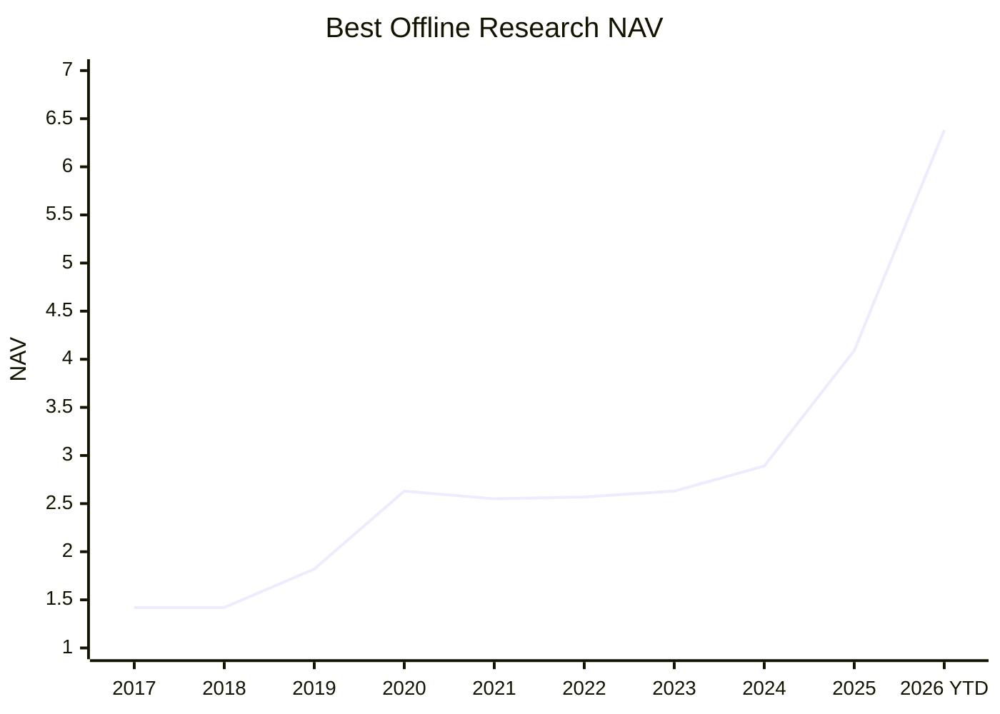

# Margin

Margin is a local-first A-share research assistant. It helps you build a
traceable candidate list, inspect evidence, review risks, and use AI as a
research helper.

Margin does not place trades, manage brokerage accounts, promise returns, or
provide financial advice. AI output is a research aid, not an authority.

## 1. What Is This Project?

Margin turns a daily research question into a stored, explainable research
result.

```text
data sources -> quality checks -> quant screening -> evidence/RAG -> agent review -> dashboard
```

For each candidate, you should be able to inspect:

- why it appeared in the research result;
- which market, financial, news, or filing data was used;
- whether AI flagged risks, changed research priority, or excluded it from the final list;
- the decision time, evidence trail, and stored artifacts behind the result.

## 2. Why Should I Use It?

Margin is useful when you want a research trail, not just a ticker list.

| Need | What Margin Provides |
| --- | --- |
| Daily candidate list | Refreshes the research universe and publishes a dashboard view. |
| Clear reasons | Shows quant scores, risks, evidence, and AI review notes. |
| Less hallucination | Agents read stored, traceable data and evidence. |
| Risk review | AI can flag concerns or require a candidate to be removed from the research list. |
| Historical review | Results, evidence, timestamps, and agent artifacts are stored. |
| Local control | Database, provider keys, and tasks run in your local environment. |

## 3. How Good Is It Right Now?

The current best offline research validation result uses the all-industry
A-share universe:



| Metric | Current Offline Research Result |
| --- | ---: |
| Universe | All-industry A-share |
| Annualized return | 21.34% |
| Monthly max drawdown | -9.45% |
| Daily proxy max drawdown | -12.20% |
| Final NAV | 6.38 |

These are historical offline research metrics. They are not a promise of future
results and should not be treated as investment advice. See
`docs/research/backtest_assumptions.md` for the assumptions required before any
strategy-performance result is considered reproducible evidence.

## 4. How Do I Use It?

Start the local app:

```bash
cp .env.example .env
python scripts/dev.py restart
```

Open:

```text
http://localhost:3000
```

Local workflow:

1. Configure data and model providers in Settings.
2. Start a research refresh from Dashboard.
3. Review candidates, scores, risks, and evidence.
4. Ask follow-up research questions on the home page.
5. Use the output as a research checklist and apply your own judgment.

The dev helper starts Postgres, runs migrations and config bootstrap, then starts
API, worker, and web processes. Logs are written under `.margin/dev/logs/`. Use
`python scripts/dev.py stop` to stop the local processes.

Release checks:

```bash
pip install -e ".[dev,data]"
ruff check src tests
pytest -q
cd web
npm ci
npm run lint
npm test
npm run build
cd ..
docker compose config --quiet
```

Release readiness is tracked in `docs/release/v0.1-checklist.md`.
