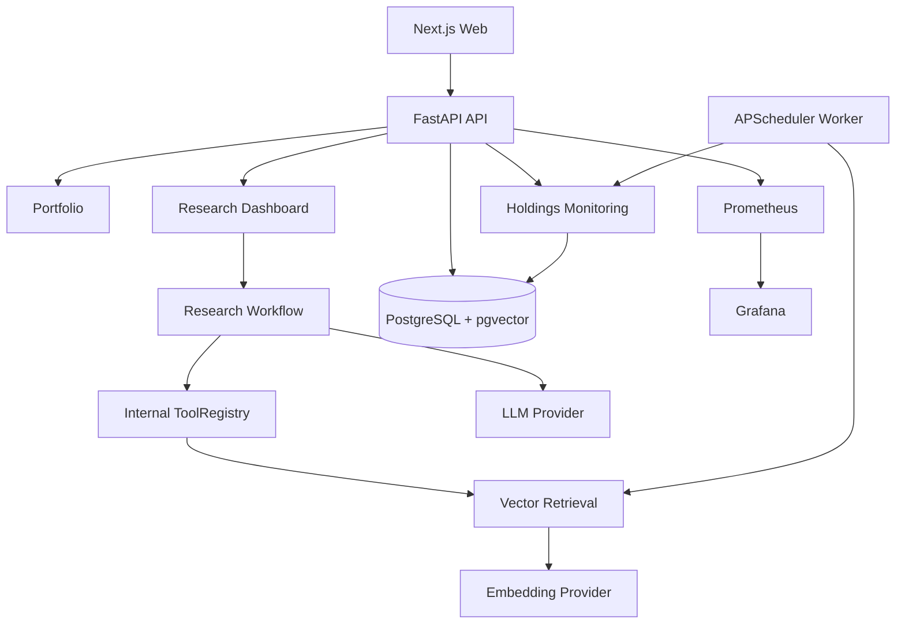

<h1 align="center">Margin</h1>

<p align="center">
  Local-first, evidence-driven investment research with auditable AI output.
</p>

<p align="center">
  <a href="./README.zh-CN.md">简体中文</a>
  ·
  <a href="./docs/PROJECT_v0.1_OPEN_SOURCE.md">Open Source Guide</a>
  ·
  <a href="./docs/README.md">Documentation</a>
  ·
  <a href="./docs/spec/v0.1/README.md">Specs</a>
  ·
  <a href="./docs/plan/v0.1/README.md">Plans</a>
</p>

<p align="center">
  
  
  
  
</p>

Margin is an open-source personal investment research system. Its core rule is simple: every important research conclusion should be backed by evidence, time, source, and an audit trail.

Margin is not a trading bot. It does not place orders, store brokerage passwords, or promise returns.

## What v0.1 Does

Margin v0.1 connects the full local research loop:

- portfolio and trade management;
- filing/WebSearch snapshots and document events;
- parsing, chunking, embeddings, pgvector retrieval;
- RAG evidence and citation validation;
- internal audited AI tools and multi-agent research workflow;
- strategy templates, custom configs, prompt generation, and version lifecycle;
- research candidate dashboard with evidence, valuation, audit, report, and export;
- holdings monitoring with P0-P3 alerts, reviews, and operation history;
- Docker Compose deployment with PostgreSQL, API, worker, web, Prometheus, and Grafana.



## Quick Start

```bash
cp .env.example .env
# Edit .env and add optional provider keys.

docker compose up -d --build
```

Open:

- Web: http://localhost:3000
- API: http://localhost:8000
- Prometheus: http://localhost:9090
- Grafana: http://localhost:3002

Health checks:

```bash
curl -fsS http://localhost:8000/health
curl -fsS http://localhost:8000/health/ready
curl -fsS http://localhost:8000/api/v1/portfolios/demo
```

## Provider Configuration

Common `.env` variables:

```env
MARGIN_LLM_BASE_URL=https://api.deepseek.com
MARGIN_LLM_API_KEY=
MARGIN_LLM_MODEL=deepseek-v4-pro
MARGIN_EMBEDDING_BASE_URL=https://open.bigmodel.cn/api/paas/v4
MARGIN_EMBEDDING_API_KEY=
MARGIN_EMBEDDING_MODEL=embedding-3
MARGIN_EMBEDDING_DIMENSION=2048
MARGIN_WEBSEARCH_API_KEY=
MARGIN_SECRET_TUSHARE_TOKEN=
MARGIN_RERANK_API_KEY=
```

Missing optional providers degrade conservatively. The system should abstain instead of producing a high-confidence research signal when core data or evidence is unavailable.

## Development

Backend:

```bash
pip install -e ".[dev,data]"
ruff check src tests
pytest -q
```

Frontend:

```bash
cd web
npm ci
npm run lint
npm test
npm run build
```

Compose:

```bash
docker compose config --quiet
```

## Documentation

| Document | Path |
| --- | --- |
| Open source guide | [docs/PROJECT_v0.1_OPEN_SOURCE.md](./docs/PROJECT_v0.1_OPEN_SOURCE.md) |
| Documentation index | [docs/README.md](./docs/README.md) |
| Design index | [docs/design/v0.1/README.md](./docs/design/v0.1/README.md) |
| Product design, Chinese | [docs/design/v0.1/product/Margin_产品设计_v0.1_中文.md](./docs/design/v0.1/product/Margin_产品设计_v0.1_中文.md) |
| Product design, English | [docs/design/v0.1/product/Margin_Product_Design_v0.1_EN.md](./docs/design/v0.1/product/Margin_Product_Design_v0.1_EN.md) |
| Architecture design, Chinese | [docs/design/v0.1/architecture/Margin_架构设计_v0.1_中文.md](./docs/design/v0.1/architecture/Margin_架构设计_v0.1_中文.md) |
| Architecture design, English | [docs/design/v0.1/architecture/Margin_Architecture_Design_v0.1_EN.md](./docs/design/v0.1/architecture/Margin_Architecture_Design_v0.1_EN.md) |
| Specs | [docs/spec/v0.1/](./docs/spec/v0.1/) |
| Plans | [docs/plan/v0.1/](./docs/plan/v0.1/) |

## Safety Boundaries

Margin v0.1 intentionally does not include:

- automatic buy/sell orders;
- brokerage credential storage;
- guaranteed-return language;
- MCP Server or MCP Gateway;
- arbitrary custom HTTP tools;
- multi-tenant SaaS account management.

Nothing in this repository is financial advice.

## License

MIT. See [LICENSE](./LICENSE).
