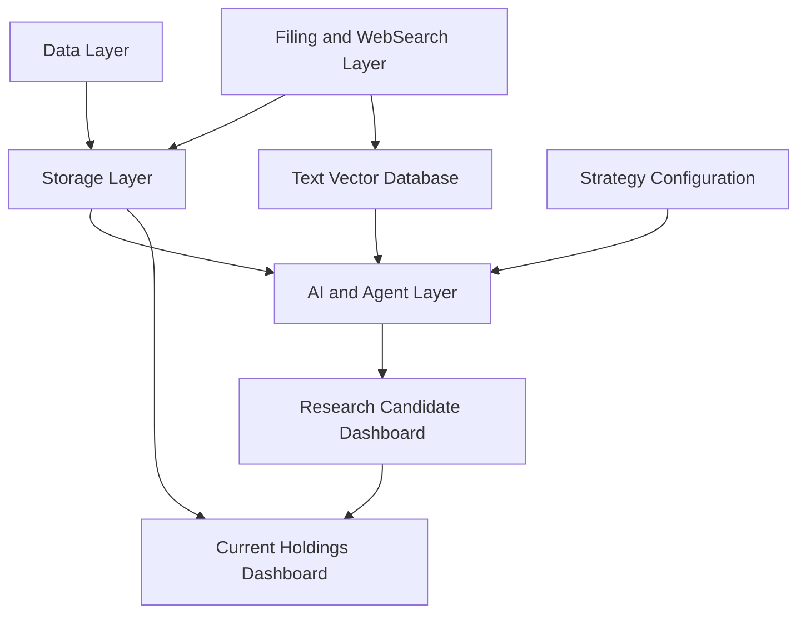
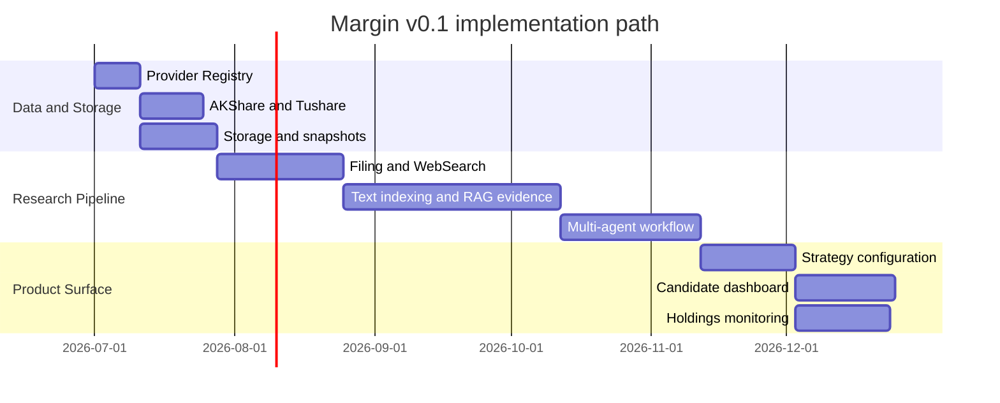

<h1 align="center">Margin</h1>

<p align="center">
  Local-first, evidence-driven investment research for people who want decisions to stay auditable.
</p>

<p align="center">
  <a href="./README.zh-CN.md">简体中文</a>
  ·
  <a href="./docs/README.md">Documentation</a>
  ·
  <a href="./docs/spec/v0.1/README.md">Specs</a>
  ·
  <a href="./docs/plan/v0.1/README.md">Plans</a>
</p>

<p align="center">
  
  
  
  
</p>

Margin is an open-source personal investment research system built around one rule:
every important conclusion must be backed by evidence, time, source, and an audit trail.

It is not a trading bot. It does not place orders. It is designed to help you slow down,
separate facts from inference, review risk, and keep your investment process reproducible.

## Why Margin Exists

Most personal investment workflows eventually become a mix of spreadsheets, screenshots,
chat logs, saved articles, and memory. Margin aims to turn that into a local-first research
loop where data, filings, web evidence, AI reasoning, strategy configuration, and holdings
review are connected through immutable snapshots.

The target user is an individual investor or builder who wants:

- structured A-share data from AKShare and Tushare;
- filing and WebSearch evidence with source snapshots;
- RAG citations that can point back to the original document;
- configurable research strategies and prompts;
- candidate and holdings dashboards;
- clear audit records for every research signal;
- no automatic trading and no hidden brokerage credential storage.

## What v0.1 Is Designed To Deliver

Margin v0.1 is scoped as a minimum viable research loop, not a thin demo.

| Area | v0.1 scope |
| --- | --- |
| Data | AKShare and Tushare providers, field standardization, point-in-time checks, data quality events |
| Storage | PostgreSQL, local file snapshots, Parquet/DuckDB, pgvector or Qdrant |
| Evidence | Filing snapshots, configurable WebSearch provider, source levels, citation locator fields |
| AI workflow | OpenAI-compatible LLM provider, RAG evidence, tool calls, multi-agent research nodes |
| Strategy | Default template, custom prompt, thresholds, versioned strategy profiles |
| Product | Research candidate dashboard, current holdings dashboard, basic intraday alerts |
| Deployment | Docker Compose, logs, immutable audit snapshots, graceful degradation |

## Architecture



The design is split into 10 independently reviewable modules:

1. Data Provider
2. Holdings
3. Filing and WebSearch
4. Text Indexing
5. RAG Evidence
6. Multi-Agent Research Workflow
7. Strategy Configuration
8. Research Candidate Dashboard
9. Holdings Monitoring
10. Deployment and Audit

## Current Implementation Status

The repository currently contains:

- bilingual product and architecture design documents for `v0.1`;
- module specs for all 10 MVP modules;
- 35 implementation plan files with traceable task IDs;
- the first data/provider foundation:
  - provider descriptors and registry;
  - Secret references;
  - retry, rate limit, fallback plumbing;
  - append-only provider audit logs;
  - AKShare and Tushare adapters;
  - field standardization and unit conversion;
  - point-in-time and data quality checks;
  - regression tests for audit, Secret injection, and lookahead prevention.

This is still an early project. The documentation is intentionally ahead of the implementation
so that future work can be built against an auditable plan.

## Quick Start

```bash
python -m venv .venv
source .venv/bin/activate
pip install -e ".[dev]"

pytest
ruff check .
```

Optional data provider SDKs:

```bash
pip install -e ".[data]"
```

Tushare tokens are referenced through local secrets or environment variables:

```bash
export MARGIN_SECRET_TUSHARE_TOKEN="your-token"
```

## Documentation Map

| Document | Path |
| --- | --- |
| Documentation index | [`docs/README.md`](./docs/README.md) |
| Product design, Chinese | [`docs/design/v0.1/product/Margin_产品设计_v0.1_中文.md`](./docs/design/v0.1/product/Margin_产品设计_v0.1_中文.md) |
| Product design, English | [`docs/design/v0.1/product/Margin_Product_Design_v0.1_EN.md`](./docs/design/v0.1/product/Margin_Product_Design_v0.1_EN.md) |
| Architecture design, Chinese | [`docs/design/v0.1/architecture/Margin_架构设计_v0.1_中文.md`](./docs/design/v0.1/architecture/Margin_架构设计_v0.1_中文.md) |
| Architecture design, English | [`docs/design/v0.1/architecture/Margin_Architecture_Design_v0.1_EN.md`](./docs/design/v0.1/architecture/Margin_Architecture_Design_v0.1_EN.md) |
| Specs | [`docs/spec/v0.1/`](./docs/spec/v0.1/) |
| Plans | [`docs/plan/v0.1/`](./docs/plan/v0.1/) |
| Collaboration rules | [`AGENTS.md`](./AGENTS.md) |

## Safety Boundaries

Margin is research software. It is built with conservative constraints:

- no automatic buy or sell orders;
- no guaranteed-return language;
- no hidden brokerage password storage;
- no use of data whose `available_at` is after `decision_at`;
- no high-confidence signal when core data is missing or conflicting;
- every research signal must keep an immutable audit snapshot.

Nothing in this repository is financial advice.

## Roadmap

The v0.1 plan is organized around a staged research loop:



See the full task breakdown in [`docs/plan/v0.1/README.md`](./docs/plan/v0.1/README.md).

## Contributing

Margin is designed to be developed in small, traceable increments. Before changing specs or plans,
read [`AGENTS.md`](./AGENTS.md). New implementation work should reference the relevant spec and plan
task ID, and should include focused tests for the behavior being added.

## License

MIT. See [`LICENSE`](./LICENSE).
