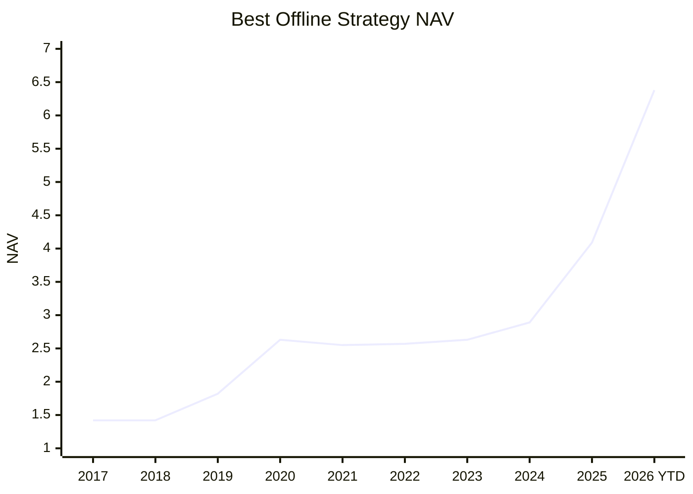

# Margin

Margin is a local A-share research assistant. It connects data ingestion, quant screening, news/filing evidence, AI review, and a recommendation dashboard into one traceable workflow.

It does not place trades, manage brokerage accounts, promise returns, or provide financial advice.

## 1. What Is This Project?

Margin turns “which stocks should I research today?” into a stored, explainable research result.

```text
data sources -> quality checks -> quant screening -> evidence/RAG -> agent review -> dashboard
```

For each recommendation, you should be able to see:

- why the stock was selected;
- which market, financial, news, or filing data was used;
- whether AI reduced weight, removed the candidate, or kept it;
- the decision time and evidence trail behind the result.

## 2. Why Should I Use It?

Margin is useful when you want a research trail, not just a ticker list.

| Need | What Margin Provides |
| --- | --- |
| Daily candidates | Refreshes the candidate pool and publishes it to the dashboard. |
| Clear reasons | Shows quant scores, risks, evidence, and AI review results. |
| Less hallucination | Agents read stored, traceable data and evidence. |
| Risk control | AI review can reduce weights or remove quant candidates. |
| Historical review | Results, evidence, timestamps, and agent artifacts are stored. |
| Local control | Database, provider keys, and tasks run in your local environment. |

## 3. How Good Is It Right Now?

The current best offline strategy result uses the all-industry A-share universe:



| Metric | Current Best Offline Result |
| --- | ---: |
| Universe | All-industry A-share |
| Annualized return | 21.34% |
| Monthly max drawdown | -9.45% |
| Daily proxy max drawdown | -12.20% |
| Final NAV | 6.38 |

This shows the project is useful for research. Strategy results should still be treated as research output; live use requires forward paper validation, execution-constraint testing, and human review.

## 4. How Do I Use It?

Start the local app:

```bash
cp .env.example .env
python scripts/dev.py restart
```

Open:

```text
http://localhost:3000
```

Suggested flow:

1. Configure data and model providers in Settings.
2. Start today’s research from Dashboard.
3. Review recommended stocks, scores, risks, and evidence.
4. Ask follow-up questions on the home page.
5. Treat the output as a research checklist, then make your own decision.

Developer checks:

```bash
pip install -e ".[dev,data]"
ruff check src tests
pytest -q
```
