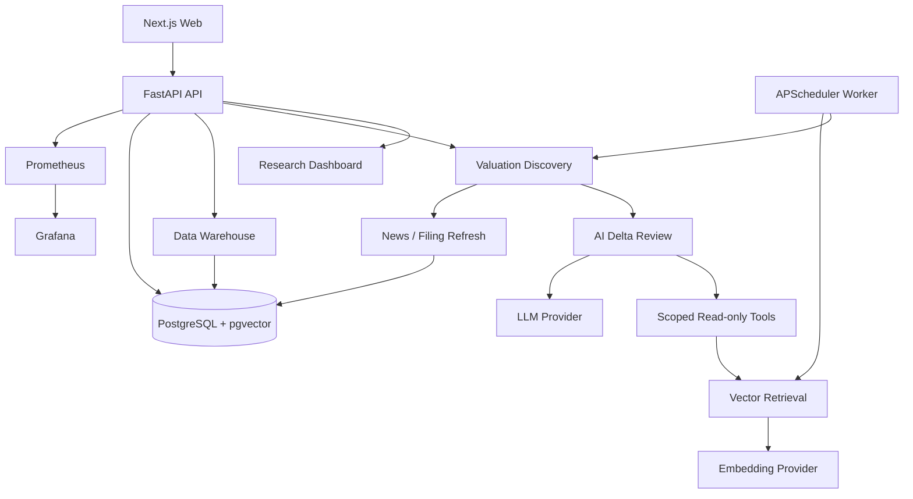

<h1 align="center">Margin</h1>

<p align="center">
  Local-first, evidence-driven investment research with auditable AI output.
</p>

<p align="center">
  <a href="./README.zh-CN.md">简体中文</a>
  ·
  <a href="./docs/README.md">Documentation</a>
  ·
  <a href="./docs/design/v0.2/README.md">Design</a>
  ·
  <a href="./docs/code/README.md">Code Docs</a>
</p>

<p align="center">
  
  
  
  
</p>

Margin is an open-source personal investment research system. Its core rule is simple: every important research conclusion should be backed by evidence, time, source, and an audit trail.

Margin is not a trading bot. It does not place orders, store brokerage passwords, or promise returns.

## What v0.2 Does

Margin v0.2 connects the research-candidate loop:

- Raw/Fact/Canonical market-data warehouse with PIT semantics;
- AKShare/Tushare provider access and provider health gates;
- filing/WebSearch snapshots, news target queues, and document events;
- parsing, chunking, embeddings, hybrid retrieval, and pgvector storage;
- RAG evidence packages, source locators, claim validation, and citation audit;
- valuation discovery with quant gating, news refresh, RAG, AI delta review, and effective-assessment pointers;
- LangGraph-based AI review with scoped read-only tools, prompt factory, reflection, checkpoints, and hash-only audit;
- versioned strategy, provider, scope, indicator, prompt, and tool-policy configuration;
- research candidate dashboard with server-side filters, current-vs-effective assessment display, evidence locators, read-only Copilot, and Provider settings;
- Docker Compose deployment with PostgreSQL, API, worker, web, Prometheus, and Grafana.



## Quick Start

```bash
cp .env.example .env
# Edit .env and add optional provider keys.

docker compose up -d --build
```

Open:

- Web: http://localhost:3000
- API: http://localhost:8000
- Prometheus: http://localhost:9090
- Grafana: http://localhost:3002

Health checks:

```bash
curl -fsS http://localhost:8000/health
curl -fsS http://localhost:8000/health/ready
curl -fsS "http://localhost:8000/api/v1/research?scope_version_id=scope-current&universe=ALL_A"
```

## Provider Configuration

Common `.env` variables:

```env
MARGIN_LLM_BASE_URL=https://api.deepseek.com
MARGIN_LLM_API_KEY=
MARGIN_LLM_MODEL=deepseek-v4-pro
MARGIN_EMBEDDING_BASE_URL=https://open.bigmodel.cn/api/paas/v4
MARGIN_EMBEDDING_API_KEY=
MARGIN_EMBEDDING_MODEL=embedding-3
MARGIN_EMBEDDING_DIMENSION=2048
MARGIN_WEBSEARCH_API_KEY=
MARGIN_TUSHARE_TOKEN=
MARGIN_TUSHARE_HTTP_URL=https://teajoin.com
MARGIN_RERANK_API_KEY=
MARGIN_ADMIN_API_TOKEN=dev-admin-token
MARGIN_CSRF_TOKEN=dev-csrf-token
```

`MARGIN_ADMIN_API_TOKEN` and `MARGIN_CSRF_TOKEN` protect local mutating endpoints such as Provider settings and refresh triggers; replace the defaults outside local development. Missing optional providers degrade conservatively. The system should abstain instead of producing a high-confidence research signal when core data or evidence is unavailable. Tavily quota exhaustion, AKShare upstream network failures, and missing Rerank config are exposed explicitly as degraded/unhealthy or `service_not_configured`, not as fake success.

## Development

Backend:

```bash
pip install -e ".[dev,data]"
ruff check src tests
pytest -q
```

Frontend:

```bash
cd web
npm ci
npm run lint
npm test
npm run build
```

Compose:

```bash
docker compose config --quiet
```

Local smoke:

```bash
python scripts/smoke_dashboard_e2e.py --base-url http://localhost:3000
MARGIN_ADMIN_API_TOKEN=dev-admin-token MARGIN_CSRF_TOKEN=dev-csrf-token \
  python scripts/smoke_valuation_discovery_p1.py \
  --scope-version-id scope-current \
  --decision-at 2026-06-23T00:00:00+00:00 \
  --api-url http://localhost:8000
```

The dashboard and valuation smoke scripts bypass system proxies for local URLs so localhost checks are not routed through external proxies. Real-provider smoke still reports the actual network, quota, and authentication outcome as a structured blocker.

## Documentation

| Document | Path |
| --- | --- |
| Documentation index | [docs/README.md](./docs/README.md) |
| Current design index | [docs/design/v0.2/README.md](./docs/design/v0.2/README.md) |
| Product design, Chinese | [docs/design/v0.2/product/Margin_产品设计_v0.2_中文.md](./docs/design/v0.2/product/Margin_产品设计_v0.2_中文.md) |
| Product design, English | [docs/design/v0.2/product/Margin_Product_Design_v0.2_EN.md](./docs/design/v0.2/product/Margin_Product_Design_v0.2_EN.md) |
| Architecture design, Chinese | [docs/design/v0.2/architecture/Margin_架构设计_v0.2_中文.md](./docs/design/v0.2/architecture/Margin_架构设计_v0.2_中文.md) |
| Architecture design, English | [docs/design/v0.2/architecture/Margin_Architecture_Design_v0.2_EN.md](./docs/design/v0.2/architecture/Margin_Architecture_Design_v0.2_EN.md) |
| Current code documentation | [docs/code/README.md](./docs/code/README.md) |

## Safety Boundaries

Margin v0.2 intentionally does not include:

- automatic buy/sell orders;
- brokerage credential storage;
- holdings or position management;
- guaranteed-return language;
- MCP Server or MCP Gateway;
- arbitrary custom HTTP tools;
- multi-tenant SaaS account management.

Nothing in this repository is financial advice.

## License

MIT. See [LICENSE](./LICENSE).
