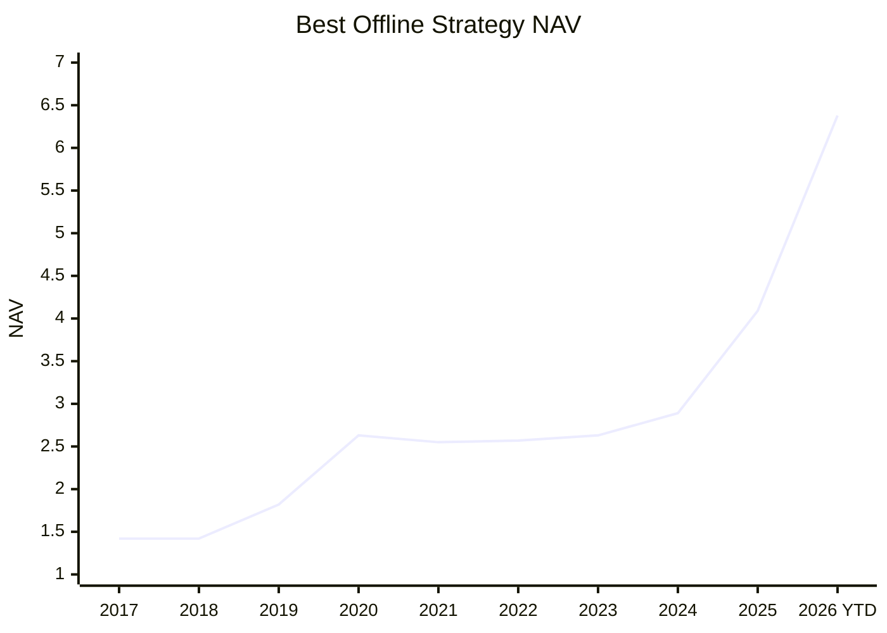

# Margin

Margin is a local stock-research assistant for A-share investing. It helps you find candidates, understand why they were selected, check the evidence, and review risks before making your own decision.

It does not place trades, manage a brokerage account, promise returns, or provide financial advice.

## 1. What Is This Project?

Margin turns a daily research workflow into one place:

```text
market data + financial reports + announcements + news
  -> stock screening
  -> evidence collection
  -> AI review
  -> recommendation dashboard
```

The goal is simple: when the system recommends a stock, you should be able to see:

- why it was selected;
- what data and evidence support it;
- what risks may invalidate it;
- whether the AI changed, reduced, or removed a quant candidate;
- when the result was generated.

The product is built for personal research. It is meant to help you review ideas faster and more consistently, not to replace your judgment.

## 2. Why Should I Use It?

Margin is useful when you want more than a stock list.

| What You Want | What Margin Gives You |
| --- | --- |
| A daily watchlist | Screens stocks and publishes the latest candidates to the dashboard. |
| Clear reasons | Shows scores, explanations, risks, and evidence references. |
| Less AI hallucination | AI analysis is tied to stored data and evidence instead of free-form guessing. |
| Risk control | A specialist agent can reduce weights or remove candidates after reviewing risks. |
| A research history | Results are saved so you can review what the system believed at that time. |
| Local control | Runs locally with your own database and provider keys. |

The biggest benefit is not that Margin always picks the best stock. The benefit is that every recommendation has a visible trail: data, evidence, scoring, AI review, and dashboard output.

## 3. How Good Is It Right Now?

Margin has two kinds of verification: product reliability and investment-strategy research.

### Product Reliability

The current backend pipeline has automated tests for the main research flow, including data requirements, quant scoring, agent artifacts, dashboard projections, and API wiring. Recent focused verification passed:

```text
49 focused backend tests passed
147 related backend tests passed in the wider integration slice
```

The system has also been exercised with real Tushare-backed data. One documented full-A-share quant run processed 5,304 companies and published screened candidates into the research pipeline.

### Strategy Research

The chart below shows the current best offline validation result on the all-industry A-share candidate universe.



| Best Offline Result | Value |
| --- | ---: |
| Candidate universe | All-industry A-share universe |
| Annualized return | 21.34% |
| Monthly max drawdown | -9.45% |
| Daily proxy max drawdown | -12.20% |
| Final NAV | 6.38 |

Current conclusion:

- The app workflow is usable for research and review.
- The current best offline strategy has attractive historical return and drawdown characteristics.
- The strategy result is used to prioritize candidates for evidence review and AI risk review.

## 4. How Do I Use It?

Start the local app:

```bash
cp .env.example .env
python scripts/dev.py restart
```

Open:

```text
http://localhost:3000
```

Then use the app in this order:

1. Open Settings and configure your data/model providers.
2. Go to Dashboard and refresh today’s research.
3. Review the recommended stocks, reasons, risk flags, and evidence.
4. Ask questions on the home page, such as “Why was this stock selected?” or “What are the main risks?”
5. Use the output as a research checklist before making your own decision.

For local verification:

```bash
pip install -e ".[dev,data]"
ruff check src tests
pytest -q
```
