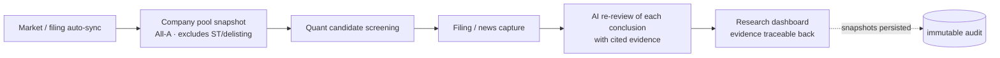
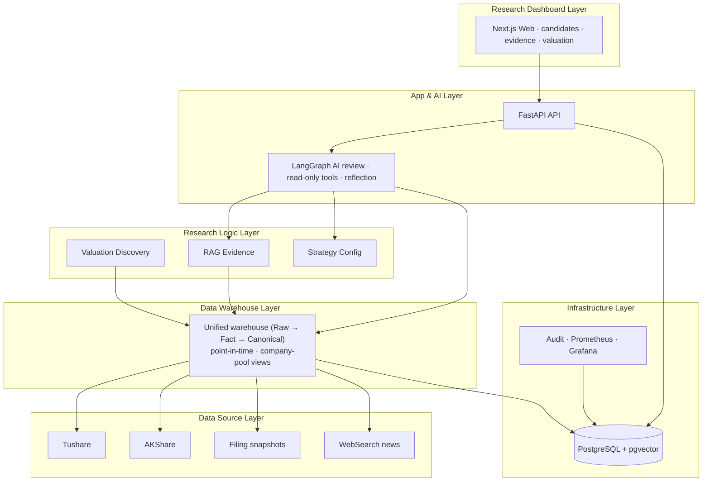

<h1 align="center">Margin</h1>

<p align="center">
  Local-first, evidence-driven investment research with auditable AI output.
</p>

<p align="center">
  <a href="./README.zh-CN.md">简体中文</a>
  ·
  <a href="./docs/README.md">Documentation</a>
  ·
  <a href="./docs/design/v0.3/README.md">Design</a>
  ·
  <a href="./docs/code/README.md">Code Docs</a>
</p>

<p align="center">
  
  
  
  
</p>

---

## What Margin Is

Margin answers one question: **based on the currently available evidence, what should this company actually be worth.**

It automatically syncs A-share market and financial data, screens candidate companies by quant strategy, captures filings and news, then has AI re-review each research conclusion with evidence. The core rule is simple: **every important conclusion must trace back to evidence, time, source, and an audit trail.**

Margin is not a trading bot. It places no orders, stores no brokerage passwords, promises no returns, and manages no positions. The final judgment is always yours.

## What It Can Do For You

- **Automatic A-share data sync**: rolling 24-month window of daily quotes, adjustment factors, financial statements, valuation snapshots, suspension facts and benchmarks — stored as a traceable point-in-time warehouse.
- **Quant candidate screening**: scores and ranks the full A-share pool (excluding ST / delisting / future-listed), keeping filtered names visible so rejected names are never hidden.
- **Filing and news capture**: official filings snapshots + WebSearch news — parsed, chunked and embedded on ingest, ready to cite.
- **AI re-reviews every conclusion**: each research conclusion goes through delta review with evidence citations, reflection and conflict flags. When core data is missing it abstains (ABSTAINED) rather than forcing a high-confidence take.
- **Research dashboard at a glance**: the frontend shows valuation range, evidence locators, review reasons and provider blockers per candidate — every conclusion links back to its source.
- **Local-first, data stays on your machine**: your market data, evidence and audit trail live in local PostgreSQL. Provider keys are write-only, never echoed back. A missing provider degrades gracefully — never silently fakes success.

## User Flow

The full loop from data to conclusion, with every step recorded:



## System Layers

Bottom-up — each layer only reads the one above; data flows in, not out:



## Quick Start

Local development, using your host Python/Node processes and local Postgres:

```bash
cp .env.example .env
# .env only contains runtime basics such as database/logging/web origin.
# Provider URL/token/model settings are configured from the app Settings page.

python scripts/dev.py restart
```

`scripts/dev.py` keeps one API process, one worker, and one Next.js dev server
for this checkout. It binds local services to `127.0.0.1`, forces localhost
proxy bypass in child processes, stores PIDs/logs under `.margin/dev/`, and uses
`lsof` readiness checks so restricted shells or VPN settings do not produce
false localhost HTTP failures.

Containerized full stack:

```bash
docker compose up -d --build
```

Open:

- Research dashboard: http://localhost:3000
- API: http://localhost:8000
- Prometheus: http://localhost:9090
- Grafana: http://localhost:3002

Frontend entrypoints:

- `/`: question-first research entry
- `/dashboard`: today's recommendations and one-click research refresh
- `/settings`: settings hub
- `/settings/data`: rolling data acquisition window config
- `/settings/providers`: provider keys write-in and health checks

## Provider Configuration

See `/settings/providers` in the web app. Local personal-mode mutating endpoints no longer require admin or CSRF tokens; they still require idempotency keys and append audit records. Provider API tokens are managed through Provider Settings, encrypted into the provider database tables, and loaded from safe metadata on startup. Provider env vars are not part of the application runtime path.

When an optional provider is missing, the system degrades conservatively: if core quotes, evidence or citations are unavailable, the research result is `ABSTAINED` rather than a high-confidence conclusion. Tavily quota exhaustion, AKShare upstream failures, and missing rerank config are exposed explicitly as degraded / unhealthy / `service_not_configured` — never as fake success.

## Development

Backend:

```bash
pip install -e ".[dev,data]"
ruff check src tests
pytest -q
```

Frontend:

```bash
cd web
npm ci
npm run lint
npm test
npm run build
```

Compose and local smoke:

```bash
python scripts/dev.py status
docker compose config --quiet

python scripts/smoke_dashboard_e2e.py --base-url http://localhost:3000
python scripts/smoke_valuation_discovery_p1.py \
  --scope-version-id scope-current \
  --decision-at 2026-06-23T00:00:00+00:00 \
  --api-url http://localhost:8000
```

The dashboard and valuation smoke scripts bypass system proxies for local URLs; real-provider smoke still reports the actual network, quota and auth outcome as a structured blocker.

## Documentation

| Document | Path |
| --- | --- |
| Documentation index | [docs/README.md](./docs/README.md) |
| Current design index | [docs/design/v0.3/README.md](./docs/design/v0.3/README.md) |
| Product design, Chinese | [docs/design/v0.3/product/Margin_产品设计_v0.3_中文.md](./docs/design/v0.3/product/Margin_产品设计_v0.3_中文.md) |
| Product design, English | [docs/design/v0.3/product/Margin_Product_Design_v0.3_EN.md](./docs/design/v0.3/product/Margin_Product_Design_v0.3_EN.md) |
| Architecture design, Chinese | [docs/design/v0.3/architecture/Margin_架构设计_v0.3_中文.md](./docs/design/v0.3/architecture/Margin_架构设计_v0.3_中文.md) |
| Architecture design, English | [docs/design/v0.3/architecture/Margin_Architecture_Design_v0.3_EN.md](./docs/design/v0.3/architecture/Margin_Architecture_Design_v0.3_EN.md) |
| Current code documentation | [docs/code/README.md](./docs/code/README.md) |

## Safety Boundaries

Margin intentionally does not include:

- automatic buy/sell orders
- brokerage credential storage
- holdings or position management
- guaranteed-return language
- MCP Server or MCP Gateway
- arbitrary custom HTTP tools
- multi-tenant SaaS account management

Nothing in this repository is financial advice.

## License

MIT. See [LICENSE](./LICENSE).
