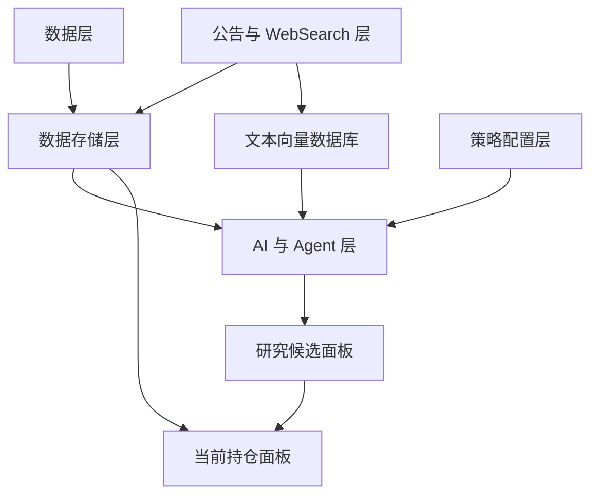
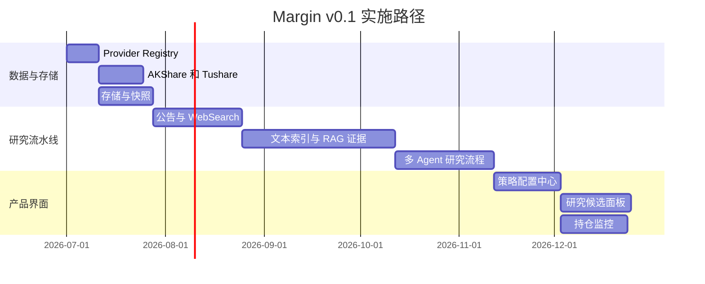

<h1 align="center">Margin</h1>

<p align="center">
  本地优先、证据驱动、策略可配置的个人投资研究系统。
</p>

<p align="center">
  <a href="./README.md">English</a>
  ·
  <a href="./docs/README.md">文档索引</a>
  ·
  <a href="docs/specs/v0.1/README.md">功能规格</a>
  ·
  <a href="docs/plans/v0.1/README.md">实施计划</a>
</p>

<p align="center">
  
  
  
  
</p>

Margin 是一个开源个人投资研究系统，核心原则很简单：
每一个重要研究结论，都必须能回到证据、时间、来源和审计记录。

它不是交易机器人，不自动下单，不保存券商密码。它的目标是帮助你把投资研究从
零散截图、新闻收藏、聊天记录和表格，收束成一个可复盘、可验证、可迭代的本地研究闭环。

## 为什么做 Margin

个人投资研究经常有一个问题：信息很多，过程很散，事后很难解释当时为什么做出某个判断。
Margin 希望把结构化数据、公告与网页证据、RAG 引用、AI 研究流程、策略配置和持仓复核
连成一条可审计链路。

它面向这样的用户：

- 使用 AKShare / Tushare 获取 A 股结构化数据；
- 希望公告、网页和新闻来源能保留快照与哈希；
- 希望 AI 输出的结论必须附带可定位证据；
- 希望策略、Prompt、阈值和版本都能被追踪；
- 希望研究候选和当前持仓在同一个流程内被复核；
- 希望系统默认保守，数据异常时宁可拒绝高置信输出。

## v0.1 要打通什么

Margin v0.1 的目标不是做一个薄 Demo，而是搭出最小可用的投资研究闭环。

| 领域 | v0.1 范围 |
| --- | --- |
| 数据 | AKShare / Tushare Provider、字段标准化、Point-in-Time 校验、数据质量事件 |
| 存储 | PostgreSQL、本地原文快照、Parquet/DuckDB、pgvector 或 Qdrant |
| 证据 | 公告快照、可配置 WebSearch、证据等级、引用定位字段 |
| AI 流程 | OpenAI-compatible LLM Provider、RAG 证据、工具调用、多 Agent 研究节点 |
| 策略 | 默认策略模板、自定义 Prompt、状态阈值、策略版本管理 |
| 产品 | 研究候选面板、当前持仓面板、基础盘中提醒 |
| 部署 | Docker Compose、日志、不可变审计快照、故障降级 |

## 架构



v0.1 按 10 个模块拆分，每个模块都有独立 spec 和 plan：

1. 数据 Provider
2. 持仓
3. 公告与 WebSearch
4. 文本索引
5. RAG 证据
6. 多 Agent 研究流程
7. 策略配置
8. 研究候选面板
9. 持仓监控
10. 部署与审计

## 当前实现状态

仓库目前已经包含：

- v0.1 中英双语产品设计与架构设计；
- 10 个 MVP 模块的功能规格；
- 35 个可追溯实施计划文件；
- 第一阶段数据/Provider 基础：
  - Provider 描述符与注册中心；
  - Secret 引用机制；
  - 重试、限流、Fallback；
  - 追加写 Provider 审计日志；
  - AKShare / Tushare 适配器；
  - 字段标准化与单位转换；
  - Point-in-Time 与数据质量检查；
  - 覆盖审计、Secret 注入、防未来数据泄漏的回归测试。

当前仍是早期项目。文档会领先于实现，目的是让后续开发可以沿着可审计的 spec/plan 推进。

## 快速开始

```bash
python -m venv .venv
source .venv/bin/activate
pip install -e ".[dev]"

pytest
ruff check .
```

如需安装可选数据源 SDK：

```bash
pip install -e ".[data]"
```

Tushare token 通过本地 Secret 或环境变量引用，不写入配置明文：

```bash
export MARGIN_SECRET_TUSHARE_TOKEN="your-token"
```

## 文档入口

| 文档 | 路径 |
| --- | --- |
| 文档总索引 | [`docs/README.md`](./docs/README.md) |
| 中文产品设计 | [`docs/design/v0.1/product/Margin_产品设计_v0.1_中文.md`](./docs/design/v0.1/product/Margin_产品设计_v0.1_中文.md) |
| English Product Design | [`docs/design/v0.1/product/Margin_Product_Design_v0.1_EN.md`](./docs/design/v0.1/product/Margin_Product_Design_v0.1_EN.md) |
| 中文架构设计 | [`docs/design/v0.1/architecture/Margin_架构设计_v0.1_中文.md`](./docs/design/v0.1/architecture/Margin_架构设计_v0.1_中文.md) |
| English Architecture Design | [`docs/design/v0.1/architecture/Margin_Architecture_Design_v0.1_EN.md`](./docs/design/v0.1/architecture/Margin_Architecture_Design_v0.1_EN.md) |
| 功能规格 | [`docs/spec/v0.1/`](docs/specs/v0.1/) |
| 实施计划 | [`docs/plan/v0.1/`](docs/plans/v0.1/) |
| 协作约定 | [`AGENTS.md`](./AGENTS.md) |

## 安全边界

Margin 是研究软件，不是投资顾问或交易执行系统。默认约束包括：

- 不自动下单；
- 不承诺收益；
- 不默认保存券商密码；
- 不允许使用 `available_at > decision_at` 的未来数据；
- 核心数据缺失或冲突时停止高置信研究信号；
- 所有研究信号保留不可变审计快照。

本仓库中的任何内容都不构成投资建议。

## 路线图



完整任务拆解见 [`docs/plan/v0.1/README.md`](docs/plans/v0.1/README.md)。

## 参与贡献

Margin 按可审计、可追溯的小步迭代开发。修改 spec 或 plan 前请先阅读
[`AGENTS.md`](./AGENTS.md)。新增实现应引用对应 spec 和 plan 子任务编号，并补充聚焦测试。

## License

MIT. See [`LICENSE`](./LICENSE).
