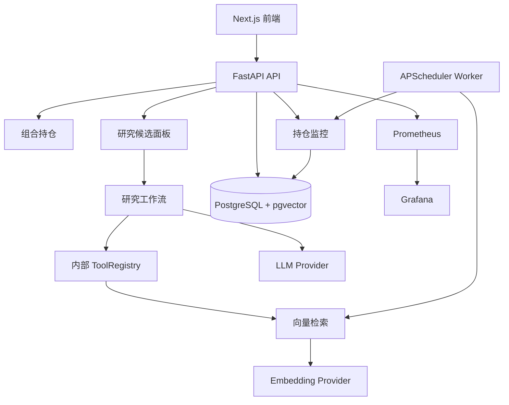

<h1 align="center">Margin</h1>

<p align="center">
  本地优先、证据驱动、AI 输出可审计的个人投资研究系统。
</p>

<p align="center">
  <a href="./README.md">English</a>
  ·
  <a href="./docs/PROJECT_v0.1_OPEN_SOURCE.md">开源项目文档</a>
  ·
  <a href="./docs/README.md">文档索引</a>
  ·
  <a href="./docs/spec/v0.1/README.md">功能规格</a>
  ·
  <a href="./docs/plan/v0.1/README.md">实施计划</a>
</p>

<p align="center">
  
  
  
  
</p>

Margin 是一个开源个人投资研究系统，核心原则很简单：每一个重要研究结论，都必须能回到证据、时间、来源和审计记录。

它不是交易机器人，不自动下单，不保存券商密码，不承诺收益。

## v0.1 当前能力

Margin v0.1 已经打通本地研究闭环：

- 组合、交易、CSV 导入、持仓计算；
- 公告/WebSearch 快照和 DocumentEvent；
- 解析、分块、Embedding、pgvector 检索；
- RAG 证据和引用校验；
- 内部可审计 AI 工具和多 Agent 研究流程；
- 策略模板、自定义配置、Prompt 合成和版本生命周期；
- 研究候选面板：证据、估值、审计、报告、导出；
- 持仓监控：P0-P3 告警、复盘、操作历史；
- Docker Compose 部署：PostgreSQL、API、Worker、Web、Prometheus、Grafana。



## 快速开始

```bash
cp .env.example .env
# 编辑 .env，填入你需要使用的 Provider key。

docker compose up -d --build
```

打开：

- 前端：http://localhost:3000
- API：http://localhost:8000
- Prometheus：http://localhost:9090
- Grafana：http://localhost:3002

健康检查：

```bash
curl -fsS http://localhost:8000/health
curl -fsS http://localhost:8000/health/ready
curl -fsS http://localhost:8000/api/v1/portfolios/demo
```

## Provider 配置

常用 `.env`：

```env
MARGIN_LLM_BASE_URL=https://api.deepseek.com
MARGIN_LLM_API_KEY=
MARGIN_LLM_MODEL=deepseek-v4-flash
MARGIN_EMBEDDING_BASE_URL=https://open.bigmodel.cn/api/paas/v4
MARGIN_EMBEDDING_API_KEY=
MARGIN_EMBEDDING_MODEL=embedding-3
MARGIN_EMBEDDING_DIMENSION=2048
MARGIN_WEBSEARCH_API_KEY=
MARGIN_SECRET_TUSHARE_TOKEN=
MARGIN_RERANK_API_KEY=
```

缺少可选 Provider 时，系统应保守降级。当关键行情、证据或引用不可用时，研究结果应为 `ABSTAINED`，而不是输出高置信结论。

## 开发验证

后端：

```bash
pip install -e ".[dev,data]"
ruff check src tests
pytest -q
```

前端：

```bash
cd web
npm ci
npm run lint
npm test
npm run build
```

Compose：

```bash
docker compose config --quiet
```

## 文档入口

| 文档 | 路径 |
| --- | --- |
| 开源项目文档 | [docs/PROJECT_v0.1_OPEN_SOURCE.md](./docs/PROJECT_v0.1_OPEN_SOURCE.md) |
| 文档总索引 | [docs/README.md](./docs/README.md) |
| 设计文档索引 | [docs/design/v0.1/README.md](./docs/design/v0.1/README.md) |
| 中文产品设计 | [docs/design/v0.1/product/Margin_产品设计_v0.1_中文.md](./docs/design/v0.1/product/Margin_产品设计_v0.1_中文.md) |
| English Product Design | [docs/design/v0.1/product/Margin_Product_Design_v0.1_EN.md](./docs/design/v0.1/product/Margin_Product_Design_v0.1_EN.md) |
| 中文架构设计 | [docs/design/v0.1/architecture/Margin_架构设计_v0.1_中文.md](./docs/design/v0.1/architecture/Margin_架构设计_v0.1_中文.md) |
| English Architecture Design | [docs/design/v0.1/architecture/Margin_Architecture_Design_v0.1_EN.md](./docs/design/v0.1/architecture/Margin_Architecture_Design_v0.1_EN.md) |
| 功能规格 | [docs/spec/v0.1/](./docs/spec/v0.1/) |
| 实施计划 | [docs/plan/v0.1/](./docs/plan/v0.1/) |

## 安全边界

Margin v0.1 明确不包含：

- 自动买卖；
- 券商密码保存；
- 收益承诺；
- MCP Server 或 MCP Gateway；
- 任意自定义 HTTP 工具；
- 多租户 SaaS 账号系统。

本仓库中的任何内容都不构成投资建议。

## License

MIT. See [LICENSE](./LICENSE).
