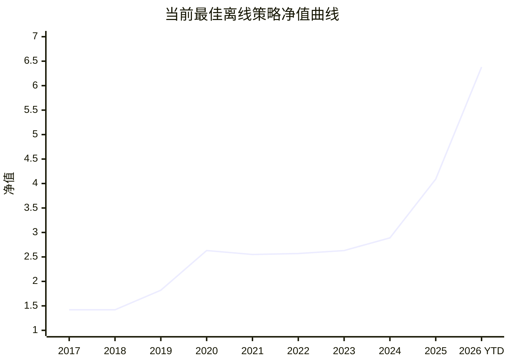

# Margin

Margin 是一个本地运行的 A 股研究助手。它帮你筛选候选股票、解释为什么选中、整理证据、检查风险，并把结果展示在 Dashboard 上，方便你自己做判断。

它不会自动交易，不管理券商账户，不承诺收益，也不构成投资建议。

## 1. 这个项目是干嘛的？

Margin 把每日股票研究流程放到一个系统里：

```text
行情数据 + 财报 + 公告 + 新闻
  -> 股票筛选
  -> 证据整理
  -> AI 复核
  -> 推荐 Dashboard
```

它的目标很简单：当系统推荐一只股票时，你应该能看清楚：

- 为什么它被选中；
- 支撑它的数据和证据是什么；
- 有哪些风险可能推翻这个结论；
- AI 是否降低了仓位、删除了候选，或保留了候选；
- 这次结果是在什么时候生成的。

这个项目是给个人研究使用的。它的作用是让你更快、更稳定地复盘投资想法，不是替你做最终决定。

## 2. 我为什么要使用这个项目，能为我带来什么？

如果你不只是想要一个股票代码列表，而是想知道“为什么推荐、证据在哪里、风险是什么”，Margin 会更有用。

| 你的需求 | Margin 能带来的能力 |
| --- | --- |
| 每天有一个候选股票池 | 自动筛选股票，并把最新候选更新到 Dashboard。 |
| 想知道推荐理由 | 展示分数、解释、风险标记和证据引用。 |
| 不想让 AI 胡说 | AI 只能基于已保存的数据和证据做分析。 |
| 想做风险控制 | 专家 Agent 可以在复核后降低仓位或删除候选。 |
| 想回看历史判断 | 每次推荐结果都会保存，方便之后复盘。 |
| 想本地掌控数据 | 数据库和密钥都在本地，Provider key 只写不回显。 |

Margin 最大的价值不是“永远选到最好的股票”，而是让每一次推荐都有一条能看懂的链路：数据、证据、打分、AI 复核、Dashboard 输出。

## 3. 当前这个项目的效果验证怎么样？

目前要分两部分看：产品链路验证和策略收益验证。

### 产品链路验证

当前后端已经覆盖了主要研究流程，包括数据需求、量化打分、Agent 产物、Dashboard 投影和 API 依赖。本轮聚焦验证结果：

```text
49 个关键后端测试通过
147 个相关后端测试在更大范围切片中通过
```

系统也已经用真实 Tushare 数据跑过链路。一个已记录的全 A 量化运行处理了 5304 家公司，并把筛选结果发布到研究流程中。

### 策略收益验证

下面展示当前最佳离线验证结果。这个结果来自全行业 A 股候选池，不是只交易科技行业的策略。



| 当前最佳离线结果 | 数值 |
| --- | ---: |
| 候选股票池 | 全行业 A 股候选池 |
| 年化收益 | 21.34% |
| 月频最大回撤 | -9.45% |
| 日频 proxy 最大回撤 | -12.20% |
| 最终净值 | 6.38 |

当前结论：

- 这个系统已经可以用于研究和复盘。
- 当前最佳离线策略的历史收益和回撤表现有吸引力。
- 策略结果会进入证据复核和 AI 风险复核流程，用来辅助你筛选和理解候选股票。

## 4. 我要怎么使用这个项目？

启动本地应用：

```bash
cp .env.example .env
python scripts/dev.py restart
```

打开：

```text
http://localhost:3000
```

推荐使用顺序：

1. 进入设置页，配置数据和模型 Provider。
2. 进入 Dashboard，刷新今日研究。
3. 查看推荐股票、推荐理由、风险标记和证据。
4. 回到首页提问，比如“为什么推荐这只股票？”“主要风险是什么？”
5. 把系统输出当成研究清单，再做你自己的判断。

本地验证：

```bash
pip install -e ".[dev,data]"
ruff check src tests
pytest -q
```
