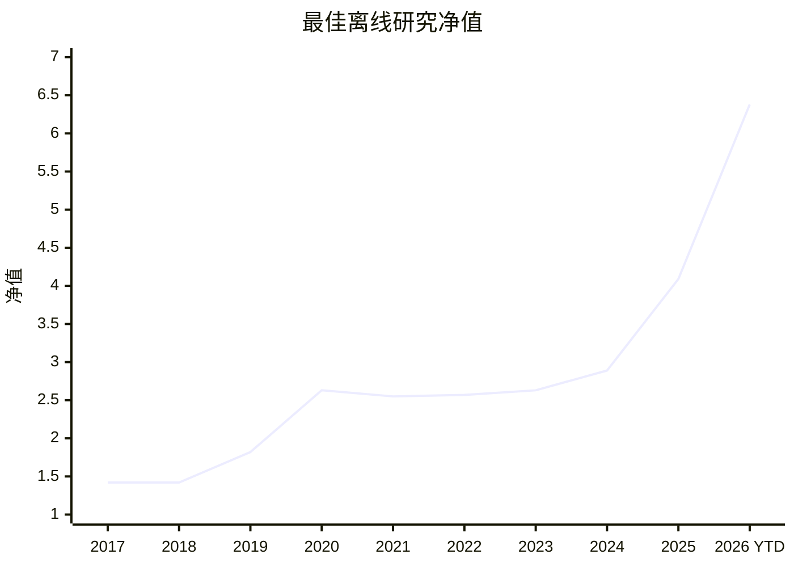

# Margin

Margin 是一个本地优先的 A 股研究助手。它帮助你生成可追溯的候选标的清单，检查证据，复核风险，并把 AI 作为研究辅助工具使用。

Margin 不会自动交易，不管理券商账户，不承诺收益，也不构成投资建议。AI 输出只是研究辅助，不是权威结论。

## 1. 这个项目是干嘛的？

Margin 把一次日常研究问题变成一份可存储、可解释、可回看的研究结果。

```text
数据源 -> 质量检查 -> 量化筛选 -> 证据/RAG -> Agent 复核 -> Dashboard
```

对于每个候选标的，你应该能看到：

- 它为什么出现在研究结果里；
- 使用了哪些行情、财务、新闻或公告数据；
- AI 是否标记风险、调整研究优先级，或将其排除出最终清单；
- 这次结果对应的时间点、证据链和运行产物。

## 2. 我为什么要使用这个项目，能为我带来什么？

Margin 的价值不是只给你一个股票代码，而是给你一条研究链路。

| 需求 | Margin 提供什么 |
| --- | --- |
| 每天有候选清单 | 刷新研究范围并展示在 Dashboard。 |
| 想知道入选原因 | 展示量化评分、风险、证据和 AI 复核记录。 |
| 不想让 AI 胡说 | Agent 只能读已入库、可追溯的数据和证据。 |
| 想做风险复核 | AI 可以标记疑点，或要求候选标的退出研究清单。 |
| 想复盘历史 | 研究结果、证据、时间点和 Agent 产物会保存。 |
| 想本地掌控 | 数据库、密钥和任务都在本地环境里运行。 |

## 3. 当前这个项目的效果验证怎么样？

当前最佳离线研究验证结果来自全行业 A 股候选池：



| 指标 | 当前离线研究结果 |
| --- | ---: |
| 股票池 | 全行业 A 股 |
| 年化收益 | 21.34% |
| 月频最大回撤 | -9.45% |
| 日频 proxy 最大回撤 | -12.20% |
| 最终净值 | 6.38 |

这些是历史离线研究指标，不代表未来结果，也不应被当作投资建议。任何策略效果都必须先满足 `docs/research/backtest_assumptions.md` 中的可复现假设要求，才适合作为研究证据讨论。

## 4. 我要怎么使用这个项目？

启动本地应用：

```bash
cp .env.example .env
python scripts/dev.py restart
```

打开：

```text
http://localhost:3000
```

本地流程：

1. 在设置页配置数据源和模型 Provider。
2. 在 Dashboard 启动一次研究刷新。
3. 查看候选标的、评分、风险和证据。
4. 在首页追问研究问题。
5. 把系统输出当作研究清单，再结合自己的判断。

开发助手会启动 Postgres，执行迁移和配置引导，然后启动 API、worker 和 web 进程。日志写在 `.margin/dev/logs/`。停止本地进程：

```bash
python scripts/dev.py stop
```

发布检查：

```bash
pip install -e ".[dev,data]"
ruff check src tests
pytest -q
cd web
npm ci
npm run lint
npm test
npm run build
cd ..
docker compose config --quiet
```

发布准备清单见 `docs/release/v0.1-checklist.md`。
