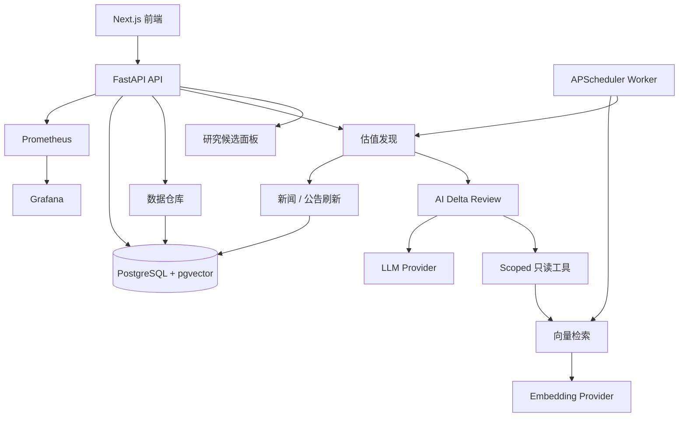

<h1 align="center">Margin</h1>

<p align="center">
  本地优先、证据驱动、AI 输出可审计的个人投资研究系统。
</p>

<p align="center">
  <a href="./README.md">English</a>
  ·
  <a href="./docs/README.md">文档索引</a>
  ·
  <a href="./docs/design/v0.2/README.md">设计文档</a>
  ·
  <a href="./docs/code/README.md">代码文档</a>
</p>

<p align="center">
  
  
  
  
</p>

Margin 是一个开源个人投资研究系统，核心原则很简单：每一个重要研究结论，都必须能回到证据、时间、来源和审计记录。

它不是交易机器人，不自动下单，不保存券商密码，不承诺收益。

## v0.2 当前能力

Margin v0.2 已经打通研究候选闭环：

- Raw/Fact/Canonical 行情数据仓库与 PIT 语义；
- AKShare/Tushare Provider 接入与 Provider health 激活闸门；
- 公告/WebSearch 快照、新闻目标队列和 DocumentEvent；
- 解析、分块、Embedding、混合检索和 pgvector 存储；
- RAG 证据包、source locator、claim validation 和引用审计；
- 估值发现：量化闸门、新闻刷新、RAG、AI delta review、有效结论指针；
- 基于 LangGraph 的 AI 复核：scoped 只读工具、PromptFactory、节点反思、checkpoint、hash-only 审计；
- 版本化策略、Provider、scope、指标、prompt 和工具权限配置；
- 研究候选面板：服务端筛选、current-vs-effective 结论、证据 locator、只读 Copilot、Provider 设置；
- Docker Compose 部署：PostgreSQL、API、Worker、Web、Prometheus、Grafana。



## 快速开始

```bash
cp .env.example .env
# 编辑 .env，填入你需要使用的 Provider key。

docker compose up -d --build
```

打开：

- 前端：http://localhost:3000
- API：http://localhost:8000
- Prometheus：http://localhost:9090
- Grafana：http://localhost:3002

健康检查：

```bash
curl -fsS http://localhost:8000/health
curl -fsS http://localhost:8000/health/ready
curl -fsS "http://localhost:8000/api/v1/research?scope_version_id=scope-current&universe=ALL_A"
```

## Provider 配置

常用 `.env`：

```env
MARGIN_LLM_BASE_URL=https://api.deepseek.com
MARGIN_LLM_API_KEY=
MARGIN_LLM_MODEL=deepseek-v4-pro
MARGIN_EMBEDDING_BASE_URL=https://open.bigmodel.cn/api/paas/v4
MARGIN_EMBEDDING_API_KEY=
MARGIN_EMBEDDING_MODEL=embedding-3
MARGIN_EMBEDDING_DIMENSION=2048
MARGIN_WEBSEARCH_API_KEY=
MARGIN_TUSHARE_TOKEN=
MARGIN_TUSHARE_HTTP_URL=https://teajoin.com
MARGIN_RERANK_API_KEY=
MARGIN_ADMIN_API_TOKEN=dev-admin-token
MARGIN_CSRF_TOKEN=dev-csrf-token
```

`MARGIN_ADMIN_API_TOKEN` 与 `MARGIN_CSRF_TOKEN` 用于本地写操作（Provider 设置、刷新触发等）；生产环境必须替换默认值。缺少可选 Provider 时，系统应保守降级。当关键行情、证据或引用不可用时，研究结果应为 `ABSTAINED`，而不是输出高置信结论。Tavily 配额耗尽、AKShare 上游网络断开、Rerank 未配置等情况会以 degraded/unhealthy 或 `service_not_configured` 显式暴露，不会伪装成通过。

## 开发验证

后端：

```bash
pip install -e ".[dev,data]"
ruff check src tests
pytest -q
```

前端：

```bash
cd web
npm ci
npm run lint
npm test
npm run build
```

Compose：

```bash
docker compose config --quiet
```

本地 smoke：

```bash
python scripts/smoke_dashboard_e2e.py --base-url http://localhost:3000
MARGIN_ADMIN_API_TOKEN=dev-admin-token MARGIN_CSRF_TOKEN=dev-csrf-token \
  python scripts/smoke_valuation_discovery_p1.py \
  --scope-version-id scope-current \
  --decision-at 2026-06-23T00:00:00+00:00 \
  --api-url http://localhost:8000
```

如果你的系统代理会拦截 localhost，dashboard 与 valuation smoke 会对本地 URL 显式绕过代理；真实 Provider smoke 仍按真实网络、配额和认证结果返回结构化 blocker。

## 文档入口

| 文档 | 路径 |
| --- | --- |
| 文档总索引 | [docs/README.md](./docs/README.md) |
| 当前设计文档索引 | [docs/design/v0.2/README.md](./docs/design/v0.2/README.md) |
| 中文产品设计 | [docs/design/v0.2/product/Margin_产品设计_v0.2_中文.md](./docs/design/v0.2/product/Margin_产品设计_v0.2_中文.md) |
| English Product Design | [docs/design/v0.2/product/Margin_Product_Design_v0.2_EN.md](./docs/design/v0.2/product/Margin_Product_Design_v0.2_EN.md) |
| 中文架构设计 | [docs/design/v0.2/architecture/Margin_架构设计_v0.2_中文.md](./docs/design/v0.2/architecture/Margin_架构设计_v0.2_中文.md) |
| English Architecture Design | [docs/design/v0.2/architecture/Margin_Architecture_Design_v0.2_EN.md](./docs/design/v0.2/architecture/Margin_Architecture_Design_v0.2_EN.md) |
| 当前代码文档 | [docs/code/README.md](./docs/code/README.md) |

## 安全边界

Margin v0.2 明确不包含：

- 自动买卖；
- 券商密码保存；
- 持仓或仓位管理；
- 收益承诺；
- MCP Server 或 MCP Gateway；
- 任意自定义 HTTP 工具；
- 多租户 SaaS 账号系统。

本仓库中的任何内容都不构成投资建议。

## License

MIT. See [LICENSE](./LICENSE).
