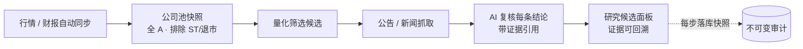
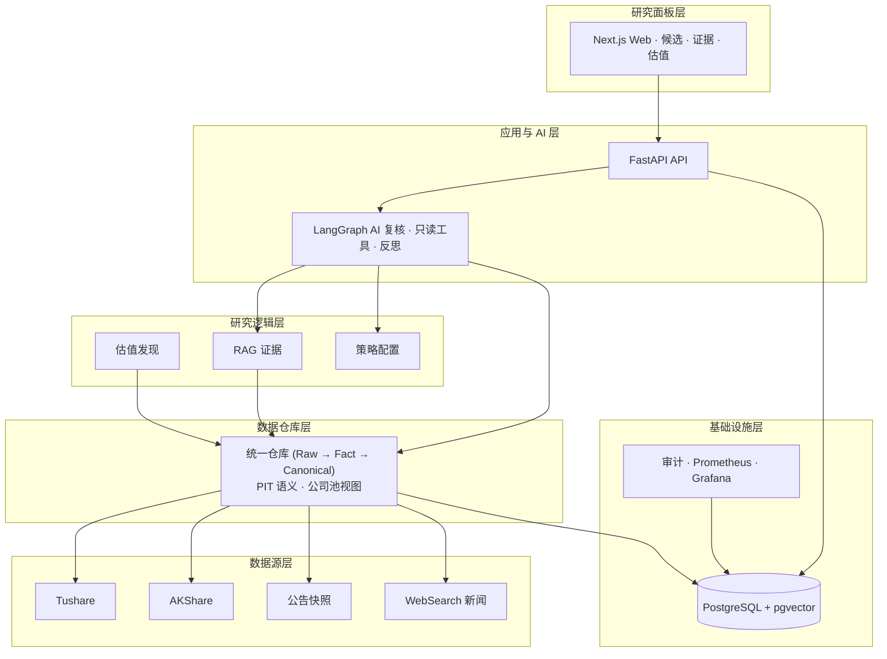

<h1 align="center">Margin</h1>

<p align="center">
  本地优先、证据驱动、AI 输出可审计的个人投资研究系统。
</p>

<p align="center">
  <a href="./README.md">English</a>
  ·
  <a href="./docs/README.md">文档索引</a>
  ·
  <a href="./docs/design/v0.3/README.md">设计文档</a>
  ·
  <a href="./docs/code/README.md">代码文档</a>
</p>

<p align="center">
  
  
  
  
</p>

---

## Margin 是什么

Margin 帮你回答一个问题：**这家公司，基于当前可用证据，本应该值多少。**

它会自动同步 A 股行情与财报、按量化策略筛选候选公司、抓取公告与新闻、再让 AI 带着证据逐条复核研究结论。核心原则只有一个：**每一个重要结论，都必须能回到证据、时间、来源和审计记录。**

它不是交易机器人。不自动下单，不保存券商密码，不承诺收益，不管理持仓。最终判断权始终在你手里。

## 它能帮你做什么

- **自动同步 A 股数据**：近 24 个月滚动窗口的日行情、复权、财报三表、估值快照、停牌事实与 benchmark，存为可回溯的 PIT 数据仓库。
- **量化筛选候选公司**：在全 A（排除 ST / 退市 / 未来上市）公司池里按策略打分排序，淘汰公司也保留可见，不隐藏被过滤的标的。
- **抓取公告与新闻**：官方公告快照 + WebSearch 新闻，自动解析、分块、向量化入库，随时可供引用。
- **AI 逐条复核结论**：对每条研究结论做 delta 复核，带证据引用、反思与冲突标记，缺关键数据时主动弃权（ABSTAINED），不硬编高置信结论。
- **研究面板一目了然**：前端按候选展示估值区间、证据 locator、复核理由与 Provider 阻断状态，每个结论可点回到原文。
- **本地部署，数据不出本机**：你的行情、证据和审计记录全部留在本地 PostgreSQL，Provider key 只写不回显；缺哪个降级哪个，不伪装成功。

## 用户流程

从数据到结论的完整闭环，每一步都留痕：



## 系统分层

自下而上，每一层只读上一层，数据只进不出：



## 快速开始

```bash
cp .env.example .env
# 编辑 .env，填入你要用的 Provider key（缺哪个就降级哪个）。

docker compose up -d --build
```

打开：

- 研究面板：http://localhost:3000
- API：http://localhost:8000
- Prometheus：http://localhost:9090
- Grafana：http://localhost:3002

前端入口：

- `/`：研究工作台总览、候选快照、推荐操作顺序与 Provider 状态
- `/research`：候选列表、筛选、刷新、证据展开与只读 Copilot
- `/settings/data`：滚动数据采集窗口配置
- `/settings/providers`：Provider 密钥写入与健康检查

## Provider 配置

详见 `.env.example`。`MARGIN_ADMIN_API_TOKEN` 与 `MARGIN_CSRF_TOKEN` 保护本地写操作（Provider 设置、刷新触发等），非本地环境必须替换默认值。

缺少可选 Provider 时系统保守降级：关键行情、证据或引用不可用时，研究结果为 `ABSTAINED` 而不是高置信结论。Tavily 配额耗尽、AKShare 上游不可达、Rerank 未配置等会以 degraded / unhealthy / `service_not_configured` 显式暴露，不伪装成功。

## 开发验证

后端：

```bash
pip install -e ".[dev,data]"
ruff check src tests
pytest -q
```

前端：

```bash
cd web
npm ci
npm run lint
npm test
npm run build
```

Compose 与本地 smoke：

```bash
docker compose config --quiet

python scripts/smoke_dashboard_e2e.py --base-url http://localhost:3000
MARGIN_ADMIN_API_TOKEN=dev-admin-token MARGIN_CSRF_TOKEN=dev-csrf-token \
  python scripts/smoke_valuation_discovery_p1.py \
  --scope-version-id scope-current \
  --decision-at 2026-06-23T00:00:00+00:00 \
  --api-url http://localhost:8000
```

dashboard / valuation smoke 对本地 URL 显式绕过系统代理；真实 Provider smoke 按真实网络、配额与认证结果返回结构化 blocker。

## 文档入口

| 文档 | 路径 |
| --- | --- |
| 文档总索引 | [docs/README.md](./docs/README.md) |
| 当前设计索引 | [docs/design/v0.3/README.md](./docs/design/v0.3/README.md) |
| 中文产品设计 | [docs/design/v0.3/product/Margin_产品设计_v0.3_中文.md](./docs/design/v0.3/product/Margin_产品设计_v0.3_中文.md) |
| English Product Design | [docs/design/v0.3/product/Margin_Product_Design_v0.3_EN.md](./docs/design/v0.3/product/Margin_Product_Design_v0.3_EN.md) |
| 中文架构设计 | [docs/design/v0.3/architecture/Margin_架构设计_v0.3_中文.md](./docs/design/v0.3/architecture/Margin_架构设计_v0.3_中文.md) |
| English Architecture Design | [docs/design/v0.3/architecture/Margin_Architecture_Design_v0.3_EN.md](./docs/design/v0.3/architecture/Margin_Architecture_Design_v0.3_EN.md) |
| 当前代码文档 | [docs/code/README.md](./docs/code/README.md) |

## 安全边界

Margin 明确不包含：

- 自动买卖
- 券商密码保存
- 持仓或仓位管理
- 收益承诺
- MCP Server 或 MCP Gateway
- 任意自定义 HTTP 工具
- 多租户 SaaS 账号系统

本仓库中的任何内容都不构成投资建议。

## License

MIT. See [LICENSE](./LICENSE).