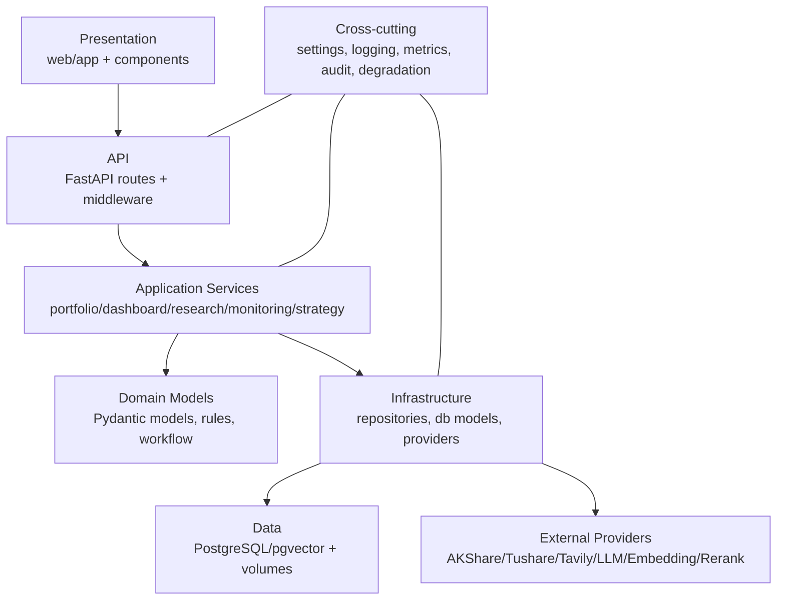
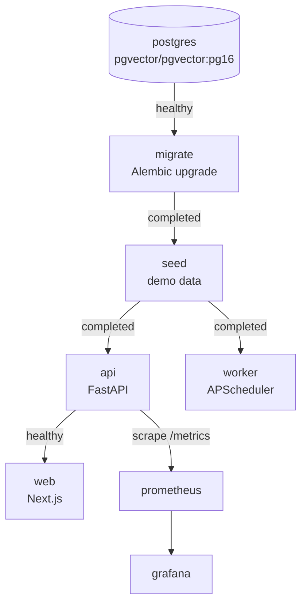
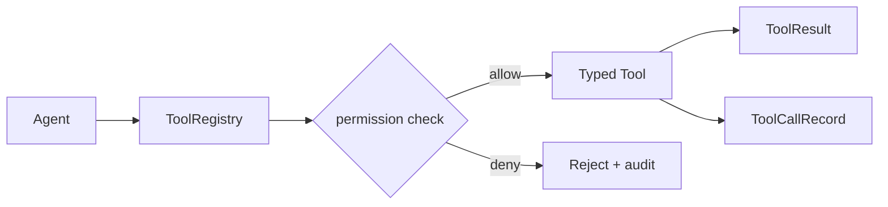
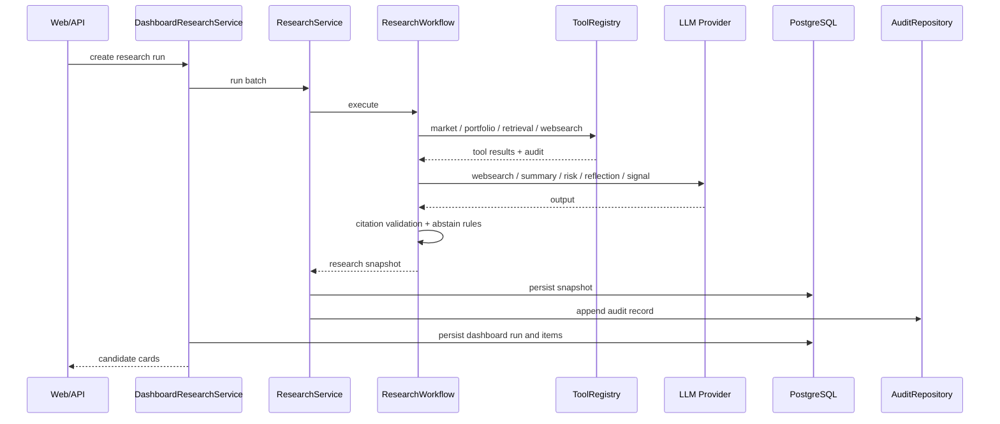
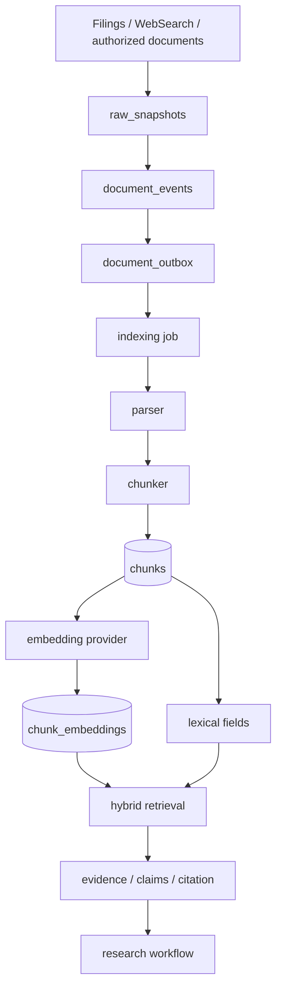
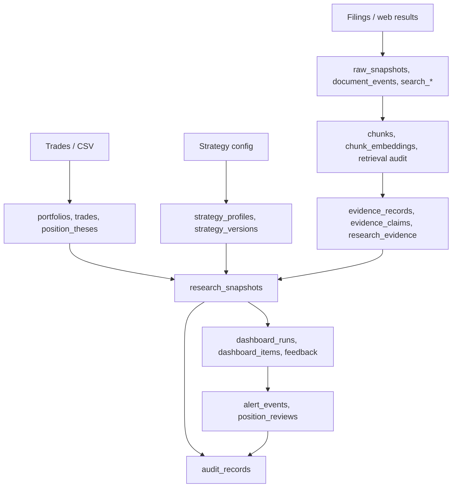

# Margin Open Investment Research System | Architecture Design v0.1

> Document type: System Architecture Design
> Product version: v0.1
> Document version: v0.1
> Status: active
> Architecture style: modular monolith, local Docker Compose, persistent worker, typed provider/tool boundaries
> Current stack: FastAPI, Next.js, PostgreSQL/pgvector, APScheduler, Prometheus, Grafana, OpenAI-compatible LLM/Embedding
> Boundary: v0.1 does not implement MCP Server, MCP Gateway, arbitrary custom HTTP tools, or broker order execution.

---

## 1. Architecture Goals

Margin v0.1 is designed as a working local research system, not a thin demo.

Goals:

- start the full stack locally with Docker Compose;
- keep user secrets outside Git and outside images;
- persist research runs, dashboard items, evidence, alerts, reviews, and audit records;
- expose provider boundaries for market data, WebSearch, LLM, embedding, and optional rerank;
- allow agents to call only audited internal tools;
- degrade conservatively when external providers fail;
- keep code organized by product modules and cross-cutting infrastructure.

## 2. Overall Architecture

```mermaid
flowchart TB
    Browser[Browser] --> Next[Next.js App Router]
    Next --> API[FastAPI API]
    API --> Routes[portfolio / dashboard / monitoring / strategy / health]

    Routes --> Portfolio[Portfolio Service]
    Routes --> Dashboard[Dashboard Services]
    Routes --> Monitoring[Holdings Monitoring]
    Routes --> Strategy[Strategy Service]
    Dashboard --> Research[Research Workflow]
    Research --> Tools[ToolRegistry]
    Tools --> Retrieval[Vector/Retrieval Pipeline]
    Tools --> WebSearch[WebSearch Tool]
    Tools --> Market[Market Data Tool]
    Research --> LLM[OpenAI-compatible LLM]
    Retrieval --> Embedding[OpenAI-compatible Embedding]
    Monitoring --> AKShare[AKShare Latest Price]

    Portfolio --> PG[(PostgreSQL + pgvector)]
    Dashboard --> PG
    Monitoring --> PG
    Strategy --> PG
    Retrieval --> PG
    Research --> PG
    API --> Metrics[/metrics]
    Metrics --> Prometheus[Prometheus]
    Prometheus --> Grafana[Grafana]
    Worker[APScheduler Worker] --> Monitoring
    Worker --> Indexing[Indexing Runner]
    Indexing --> Retrieval
```

## 3. Layered Architecture



| Layer | Responsibility | Code |
| --- | --- | --- |
| Presentation | pages, navigation, UI components | `web/app`, `web/components` |
| API | routes, dependency injection, middleware, health | `src/margin/api` |
| Application | business orchestration | module `service.py` files |
| Domain | rules, workflow, state models | `models.py`, `workflow.py`, validators |
| Infrastructure | SQLAlchemy, repositories, providers, tools | `repository.py`, `db_models.py`, provider adapters |
| Data | PostgreSQL, pgvector, Docker volumes | `docker-compose.yml`, Alembic |
| Cross-cutting | config, metrics, logging, audit, fallback | `src/margin/core`, `src/margin/settings.py` |

## 4. Module Map

| Module | Directory | Responsibility |
| --- | --- | --- |
| core | `src/margin/core` | provider registry, secrets, audit, metrics, degradation |
| api | `src/margin/api` | FastAPI app, routes, middleware, dependencies |
| data | `src/margin/data` | AKShare/Tushare, standardization, data quality |
| portfolio | `src/margin/portfolio` | portfolios, trades, cost, positions, risk, theses |
| news | `src/margin/news` | snapshots, document events, outbox, WebSearch, dedup |
| vector | `src/margin/vector` | parsing, chunking, embeddings, pgvector, retrieval |
| evidence | `src/margin/evidence` | evidence records, claims, locators, validation |
| research | `src/margin/research` | tools, LLM, agents, workflow, snapshots |
| strategy | `src/margin/strategy` | templates, configs, prompt, lifecycle |
| dashboard | `src/margin/dashboard` | runs, cards, evidence views, reports, feedback |
| holdings_monitoring | `src/margin/holdings_monitoring` | alerts, reviews, history, behavior metrics |
| worker | `src/margin/worker.py` | monitoring and indexing scheduler |

## 5. Deployment Topology



Services:

- `postgres`: PostgreSQL with pgvector;
- `migrate`: one-shot migration job;
- `seed`: one-shot demo seed job;
- `api`: FastAPI on port 8000;
- `worker`: persistent indexing and monitoring worker;
- `web`: Next.js on port 3000;
- `prometheus`: metrics on port 9090;
- `grafana`: dashboards on port 3002.

## 6. API Architecture

| Domain | Prefix | Examples |
| --- | --- | --- |
| health/metrics | `/health`, `/metrics` | `/health`, `/health/ready`, `/health/degraded`, `/metrics` |
| portfolio | `/api/v1` | `/portfolios/{id}`, `/positions`, `/trades`, `/imports`, `/risk` |
| dashboard | `/api/v1` | `/research-runs`, `/research-items/{id}`, `/provider-status` |
| monitoring | `/api/v1` | `/positions/{id}/alerts`, `/reviews`, `/history` |
| strategy | `/strategies` | `/templates`, `/custom`, `/activate` |
| research tools | `/research` | `/run`, `/tools` |

`TraceIdMiddleware` propagates a trace header. `MetricsMiddleware` records request counters and durations in Prometheus format.

## 7. Provider and Tool Boundaries

v0.1 uses typed adapters and an internal tool registry instead of MCP.



Provider adapters:

- AKShare market data;
- optional Tushare market data;
- optional Tavily WebSearch;
- OpenAI-compatible chat completions;
- OpenAI-compatible embeddings;
- optional rerank provider.

Dashboard provider status is built from runtime providers and currently reports:

- `openai_llm`: real chat-completions healthcheck when configured; `degraded` when missing configuration; `unhealthy` when the remote check fails;
- `openai_embedding`: real embedding healthcheck when configured; `degraded` when missing configuration; `unhealthy` when the remote check fails;
- `tavily_websearch`: `degraded` when `MARGIN_WEBSEARCH_API_KEY` is missing; real Tavily search healthcheck when configured;
- `http_rerank`: `degraded` when `MARGIN_RERANK_API_KEY` or `MARGIN_RERANK_BASE_URL` is missing; real rerank healthcheck when configured.

## 8. Research Workflow



Normal-path websearch query generation, text summary, risk review, reflection/counter-argument, and signal composition use the configured OpenAI-compatible LLM with JSON-schema guardrails. Conservative rule paths are still used when market data is degraded, portfolio constraints fail, citation validation fails, or the LLM call/guardrail fails.

In v0.1, `risk_review` and `reflect_counter_argument` record real `model_version`, trace metadata, and structured outputs. They do not yet require every risk or counter-argument to carry its own evidence reference. Per-item evidence grounding, locators, stricter language controls, and tighter evidence-grounded prompts are v0.2 scope.

## 9. Document Indexing and RAG Flow



## 10. Data Design



## 11. ER Diagram

The v0.1 database has 29 public tables. Current positions are calculated from trades and are not stored in a separate `positions` table.

```mermaid
erDiagram
    portfolios ||--o{ trades : records
    portfolios ||--o{ position_theses : tracks
    portfolios ||--o{ alert_events : monitors
    portfolios ||--o{ position_reviews : reviews
    raw_snapshots ||--o{ document_events : snapshots
    document_events ||--o{ document_outbox : queues
    document_events ||--o{ dedup_records : deduplicates
    document_events ||--o{ repost_edges : links
    search_queries ||--o{ search_results : returns
    chunks ||--o{ chunk_embeddings : embeds
    evidence_claims ||--o{ evidence_validation_audits : validates
    evidence_claims ||--o{ research_evidence : links
    evidence_records ||--o{ research_evidence : supports
    strategy_profiles ||--o{ strategy_versions : versions
    dashboard_runs ||--o{ dashboard_items : outputs
    dashboard_items ||--o{ dashboard_feedback : receives
    alert_events ||--o{ position_reviews : handled_by

    portfolios {
        string portfolio_id PK
        string user_id
        string name
        numeric cash
    }
    trades {
        string trade_id PK
        string portfolio_id FK
        string symbol
        string side
        numeric quantity
        numeric price
    }
    raw_snapshots {
        string snapshot_id PK
        string source_url
        string content_hash
    }
    document_events {
        string event_id PK
        string snapshot_id FK
        string symbol
        string status
    }
    chunks {
        string chunk_id PK
        string document_id
        text content
    }
    chunk_embeddings {
        string embedding_id PK
        string chunk_id FK
        int dimension
    }
    evidence_records {
        string evidence_id PK
        string source_level
        string locator_json
    }
    evidence_claims {
        string claim_id PK
        string statement
        float confidence
    }
    research_snapshots {
        string snapshot_id PK
        string run_id
        string symbol
        string status
    }
    strategy_profiles {
        string strategy_id PK
        string owner_id
        string active_version_id
    }
    strategy_versions {
        string version_id PK
        string strategy_id FK
        string lifecycle_status
    }
    dashboard_runs {
        string run_id PK
        string strategy_id
        string status
    }
    dashboard_items {
        string item_id PK
        string run_id FK
        string symbol
        string research_status
    }
    alert_events {
        string alert_id PK
        string portfolio_id FK
        string position_id
        string priority
    }
    position_reviews {
        string review_id PK
        string portfolio_id FK
        string alert_id FK
        string decision
    }
    audit_records {
        string record_id PK
        string record_type
        string object_id
        string trace_id
    }
```



## 12. Configuration and Secrets

`MarginSettings` is the single configuration entry point. It reads `.env` and `MARGIN_*` environment variables.

Important variables:

- `MARGIN_DATABASE_URL`;
- `MARGIN_LLM_BASE_URL`, `MARGIN_LLM_API_KEY`, `MARGIN_LLM_MODEL`;
- `MARGIN_EMBEDDING_BASE_URL`, `MARGIN_EMBEDDING_API_KEY`, `MARGIN_EMBEDDING_MODEL`, `MARGIN_EMBEDDING_DIMENSION`;
- `MARGIN_WEBSEARCH_API_KEY`;
- `MARGIN_RERANK_*`;
- `MARGIN_SECRET_TUSHARE_TOKEN`;
- `MARGIN_LOG_FORMAT`;
- `MARGIN_MONITORING_INTERVAL_SECONDS`.

Secrets must live in local `.env` or runtime environment variables and must never be committed.

## 13. Observability

v0.1 exposes:

- `/health`;
- `/health/ready`;
- `/health/degraded`;
- `/metrics`;
- HTTP counters and duration histograms;
- provider call counters and degradation counters;
- structured logs;
- Grafana dashboard provisioning;
- worker job logs.

## 14. Degradation Strategy

| Failure | Behavior |
| --- | --- |
| database unavailable | `/health/ready` returns 503 |
| LLM missing or healthcheck failed | `/provider-status` reports `degraded` / `unhealthy`; research abstains or uses conservative fallback |
| embedding missing or healthcheck failed | `/provider-status` reports `degraded` / `unhealthy`; indexing skips real remote embedding or follows retrieval degradation |
| WebSearch key missing | `/provider-status` reports `tavily_websearch=degraded`; WebSearch is unavailable/degraded |
| AKShare unavailable | monitoring emits `DATA_MISSING` semantics and continues |
| citation validation failed | candidate becomes `abstained` |
| evidence conflict | confidence is reduced or publication is blocked |
| rerank missing | `/provider-status` reports `http_rerank=degraded`; hybrid retrieval falls back to base ranking |

## 15. Verification

Current verification gates:

- `ruff check src tests`;
- `pytest -q`;
- `npm run lint` in `web/`;
- `npm test` in `web/`;
- `npm run build` in `web/`;
- `docker compose config --quiet`;
- live `/health`, `/health/ready`, `/metrics`;
- browser E2E for portfolio, position detail, research dashboard, and research item detail.

## 16. Summary

Margin v0.1 connects portfolio data, evidence retrieval, AI research, dashboard publication, holdings monitoring, audit, and local deployment. Its core architectural property is conservative auditability: when evidence or providers are weak, the system abstains rather than creating false certainty.
