# Margin（安全边际）Open-Source Investment Research System — Architecture Design v0.1

> Type: System Architecture Document  
> Version: v0.1  
> Architecture style: Modular monolith first, asynchronous workers, provider-based integration, plugin-based extension  
> Deployment target: Local single-user first, extensible to hosted multi-user deployments  
> Recommended stack: FastAPI + PostgreSQL + Parquet/DuckDB + pgvector/Qdrant + Provider Registry + LangGraph/custom orchestration + Next.js + Docker Compose

---

## 1. Architecture Goals

- Implement the eight product layers with explicit boundaries;
- Separate structured financial data from unstructured text;
- Enforce point-in-time correctness;
- Require evidence lineage for material AI conclusions;
- Allow users to configure strategies, prompts, models, sources, and thresholds;
- Support Provider, MCP, and tool plugins;
- Use one research signal, state, and evidence model across candidate and holdings dashboards;
- Version models, prompts, tools, strategies, providers, and data snapshots;
- Separate nightly batch research from intraday monitoring;
- Run the MVP on a 4C8G host without a GPU.

---

## 2. Eight-Layer Architecture

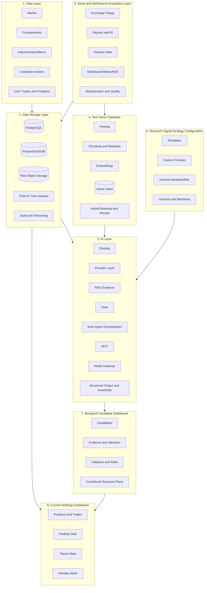

Cross-cutting concerns:

- Authentication and authorization;
- Scheduling;
- Audit and tracing;
- Observability;
- Secret management;
- Provider and plugin registries;
- Data quality and quarantine.

---

# Layer 1 — Data

## 3. Data Domains and Provider Protocols

| Domain | Content |
|---|---|
| Market | OHLCV, turnover, adjustments |
| Fundamental | Statements, ratios, dividends, estimates |
| Metadata | Symbols, industries, listing status, index membership |
| Corporate actions | Suspensions, distributions, splits, delisting |
| Industry and macro | Prices, inventory, rates, PMI, sales |
| User | Portfolio, trades, cash, preferences |
| Derived | Factors, model inputs, regimes |

Provider protocol:

```python
class MarketDataProvider:
    def get_securities(self, as_of): ...
    def get_bars(self, symbols, start, end, frequency="1d"): ...
    def get_adjustment_factors(self, symbols, start, end): ...
    def get_financials(self, symbols, start, end): ...
    def get_index_members(self, index_code, as_of): ...
```

### 3.1 MVP Data Providers and Licensing Boundary

MVP includes only two structured A-share data providers:

- `AKShareProvider` for market, basic financial, index, and some filing metadata;
- `TushareProvider` for supplemental market, financial, and index membership data, with user-provided token.

Each provider records source, local Secret reference, rate limits, field authorization note, `fetched_at`, `available_at`, and raw response hash. The open-source repository provides connector code and sample mappings, not commercial datasets, paid research reports, or copyrighted sample corpora.

### 3.2 Point-in-Time Fields

```text
event_at
published_at
available_at
fetched_at
revised_at
```

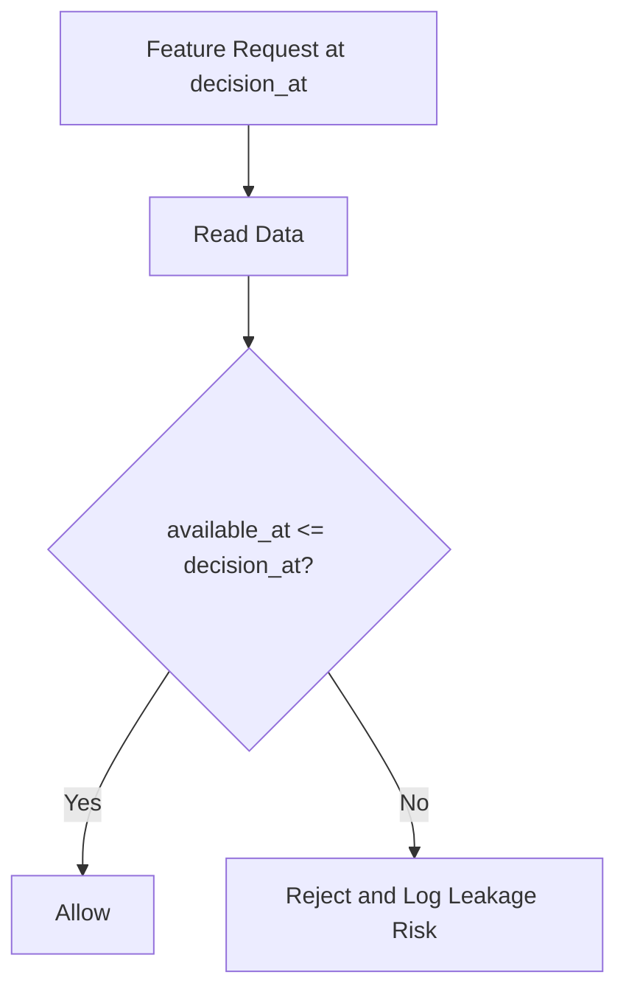

---

# Layer 2 — Data Storage

## 4. Storage Components

| Storage | Purpose |
|---|---|
| PostgreSQL | Business entities, strategies, research signals, portfolios |
| Parquet | Market, features, and backtest datasets |
| DuckDB | Local analytical queries |
| Object storage | Raw PDF, HTML, JSON, CSV snapshots |
| pgvector/Qdrant | Text vectors |
| Redis optional | Cache, locks, task state |

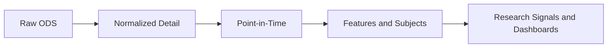

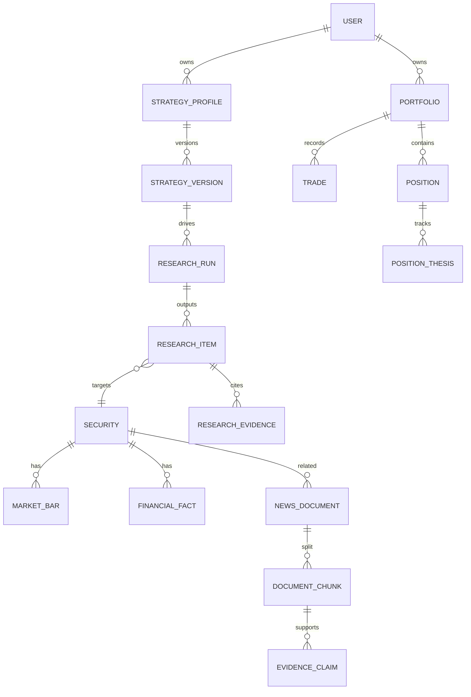

Each research run freezes universe, data snapshot, strategy, prompt, model, tool, provider, retrieval results, evidence, structured output, timestamps, and hashes.

---

# Layer 3 — News and WebSearch Acquisition

## 5. Source Hierarchy and Compliance

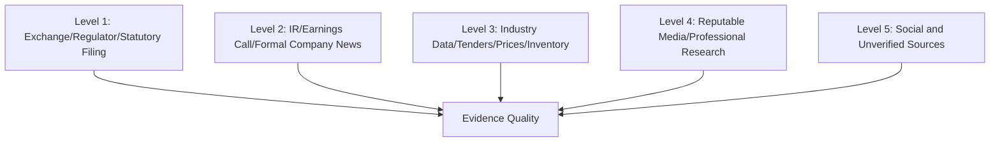

Components:

- Source Registry;
- API/RSS/Web/File Connectors;
- WebSearch Provider;
- Scheduler;
- Downloader;
- Raw Snapshot;
- Deduplicator;
- Document Classifier;
- Quality Scorer;
- Document Event Publisher.

MVP news discovery uses configurable WebSearch Providers, not unrestricted crawling:

- Users provide their own API keys;
- The system stores query, result URL, title, snippet, retrieval time, and content hash;
- A WebSearch result must resolve to an accessible original page or compliant snapshot before entering RAG;
- The system must not bypass robots, login walls, paywalls, or anti-bot controls;
- Copyrighted full text is not redistributed as open-source sample data;
- L4/L5 evidence can trigger investigation but cannot alone change research or position states.

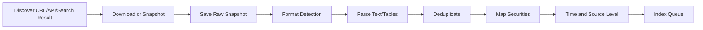

---

# Layer 4 — Text Vector Database

## 6. Vector Pipeline

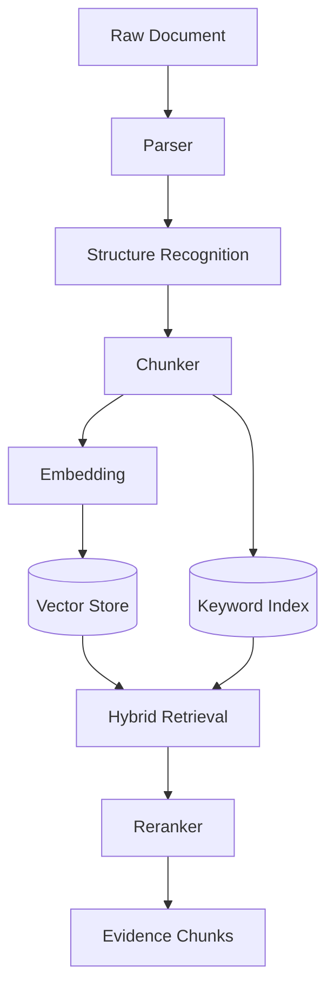

Chunk metadata includes:

```json
{
  "chunk_id": "chunk_xxx",
  "document_id": "doc_xxx",
  "symbol": "000001.SZ",
  "source_url": "https://...",
  "source_level": 1,
  "published_at": "2026-06-17T18:30:00+08:00",
  "available_at": "2026-06-18T09:30:00+08:00",
  "page": 86,
  "section": "Cash Flow",
  "paragraph_index": 12,
  "table_id": "cash_flow_table",
  "row_id": "net_operating_cash_flow",
  "quote_span": [120, 188],
  "content_hash": "sha256:..."
}
```

Retrieval score:

\[
Score =
w_v Vector +
w_k BM25 +
w_t TimeDecay +
w_s SourceQuality +
w_e EntityMatch
\]

Hard filters:

- Security;
- `available_at <= decision_at`;
- Document type;
- Evidence level;
- Duplicate claims;
- Original page, paragraph, table, or URL location.

---

# Layer 5 — AI

## 7. AI Architecture

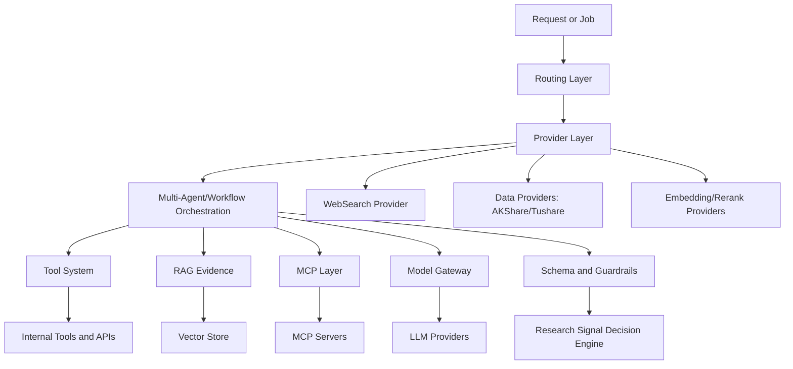

### 7.1 Provider Layer

| Provider Type | MVP Implementation | Purpose |
|---|---|---|
| MarketDataProvider | AKShare / Tushare | A-share market, fundamentals, index, actions |
| WebSearchProvider | User-configured API key | News and public web discovery |
| LLMProvider | OpenAI-compatible | Research, extraction, summary, reflection |
| EmbeddingProvider | OpenAI-compatible / local | Text embedding |
| RerankProvider | Optional | Hybrid retrieval reranking |
| VectorStoreProvider | pgvector / Qdrant | Pluggable vector storage |
| NotificationProvider | Local/email/webhook | Alert delivery |

Providers must support health checks, rate limits, retries, cost tracking, Secret references, versioning, and audit logs.

### 7.2 Routing Layer

The router selects model, workflow, tool set, retrieval scope, budget, timeout, and output schema.

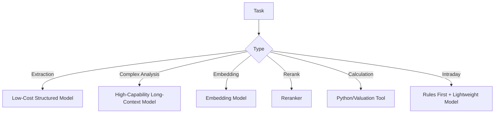

### 7.3 RAG Evidence System

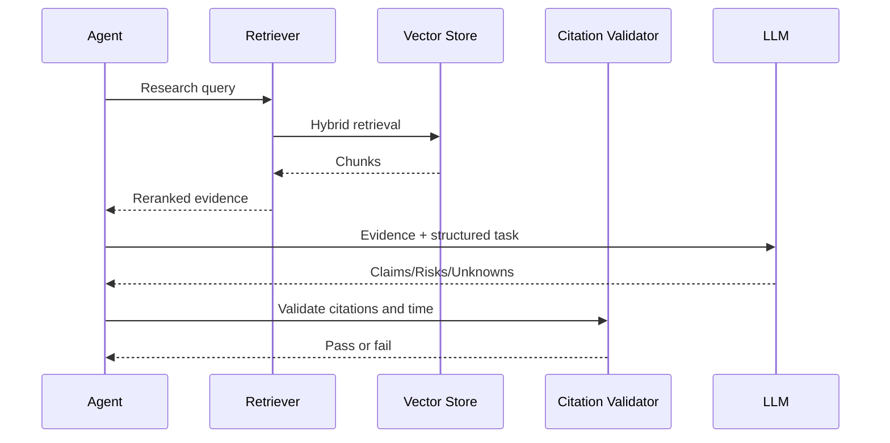

Evidence claim shape:

```json
{
  "claim_id": "claim_001",
  "claim_type": "cash_flow_improvement",
  "statement": "Operating cash flow quality improved",
  "fact_or_inference": "FACT",
  "evidence_ids": ["ev_101", "ev_102"],
  "confidence": 0.87,
  "conflicts": [],
  "effective_at": "2026-06-18",
  "locator": {
    "source_url": "https://...",
    "page": 86,
    "section": "Cash Flow",
    "paragraph_index": 12,
    "table_id": "cash_flow_table",
    "row_id": "net_operating_cash_flow",
    "content_hash": "sha256:..."
  }
}
```

### 7.4 Tool System

- MarketDataTool;
- FinancialTool;
- FilingTool;
- WebSearchTool;
- RetrievalTool;
- ValuationTool;
- FactorTool;
- PortfolioTool;
- BacktestTool;
- CalendarTool;
- AlertTool;
- Controlled PythonTool.

LLMs may not fabricate tool output. Numerical results must come from deterministic tools. External writes require user confirmation.

### 7.5 Multi-Agent Orchestration

“Multi-agent” means role-based tool orchestration, not debate that creates false certainty. Each agent has explicit input, permissions, output schema, and failure policy.

```mermaid
flowchart LR
    A[Universe Filter] --> B[Quant Research]
    B --> C[WebSearch Agent]
    C --> D[Document Collector]
    D --> E[Text Summary]
    E --> F[Evidence Research]
    F --> G[Valuation Tool]
    G --> H[Risk/Value-Trap Review]
    H --> I[Reflect/Counterargument]
    I --> J[Portfolio Constraint]
    J --> K[Research Signal Composer]
    K --> L[Citation Validator]
```

### 7.6 MCP

Suggested servers:

```text
margin-market-mcp
margin-filings-mcp
margin-portfolio-mcp
margin-backtest-mcp
margin-evidence-mcp
margin-macro-mcp
```

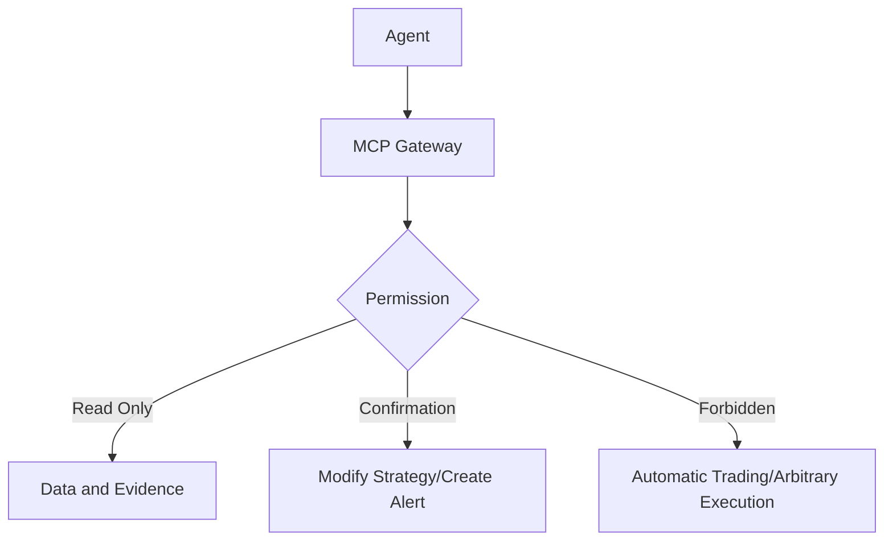

---

# Layer 6 — Research Signal Strategy Configuration

## 8. Strategy Lifecycle

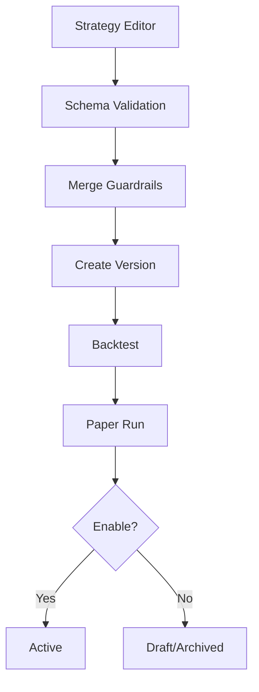

Strategy fields:

- Universe;
- Factors;
- Valuation;
- Quality;
- Catalysts;
- News and WebSearch sources;
- AI prompts;
- Evidence requirements;
- Horizon;
- Risk limits;
- Portfolio constraints;
- Decision thresholds;
- Output templates.

Prompt stack:

```text
System Guardrails
+ Platform Research Prompt
+ Strategy Template Prompt
+ User Custom Prompt
+ Task Context
+ Retrieved Evidence
```

---

# Layer 7 — Research Candidate Dashboard

## 9. Dashboard Services and API

Services:

- Research Run Query Service;
- Dashboard BFF;
- Evidence View Service;
- Valuation View Service;
- Strategy Status Service;
- Report Renderer;
- Export Service.

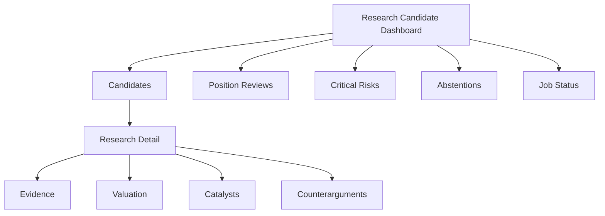

API:

```text
GET  /api/v1/research-runs?date=&strategy_id=&portfolio_id=&universe_id=&status=
POST /api/v1/research-runs
GET  /api/v1/research-runs/{run_id}
GET  /api/v1/research-runs/{run_id}/items
GET  /api/v1/research-items/{item_id}
GET  /api/v1/research-items/{item_id}/evidence
GET  /api/v1/research-items/{item_id}/valuation
GET  /api/v1/research-items/{item_id}/audit
POST /api/v1/research-items/{item_id}/feedback
GET  /api/v1/provider-status
POST /api/v1/jobs/nightly-runs
GET  /api/v1/jobs/{job_run_id}
```

Key query dimensions: `date`, `strategy_id`, `strategy_version_id`, `portfolio_id`, `universe_id`, `run_id`, and `decision_at`.

---

# Layer 8 — Holdings Dashboard

## 10. Portfolio Architecture

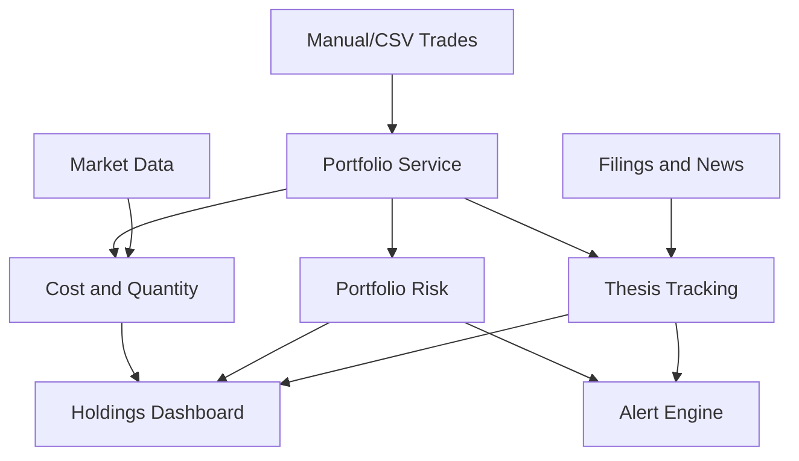

Portfolio risk:

- Single-name concentration;
- Industry and factor exposure;
- Correlation;
- Liquidity;
- Volatility;
- Drawdown;
- Event concentration.

Position APIs:

```text
GET  /api/v1/portfolios/{id}
GET  /api/v1/portfolios/{id}/positions
POST /api/v1/portfolios/{id}/trades
POST /api/v1/portfolios/{id}/imports
GET  /api/v1/portfolios/{id}/risk
GET  /api/v1/positions/{id}/thesis
PUT  /api/v1/positions/{id}/thesis
GET  /api/v1/positions/{id}/alerts
```

---

## 11. End-to-End Nightly Sequence

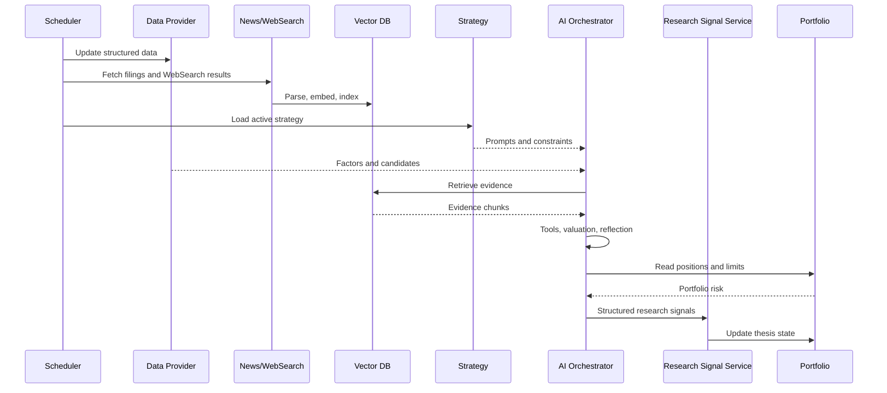

---

## 12. Intraday Monitoring

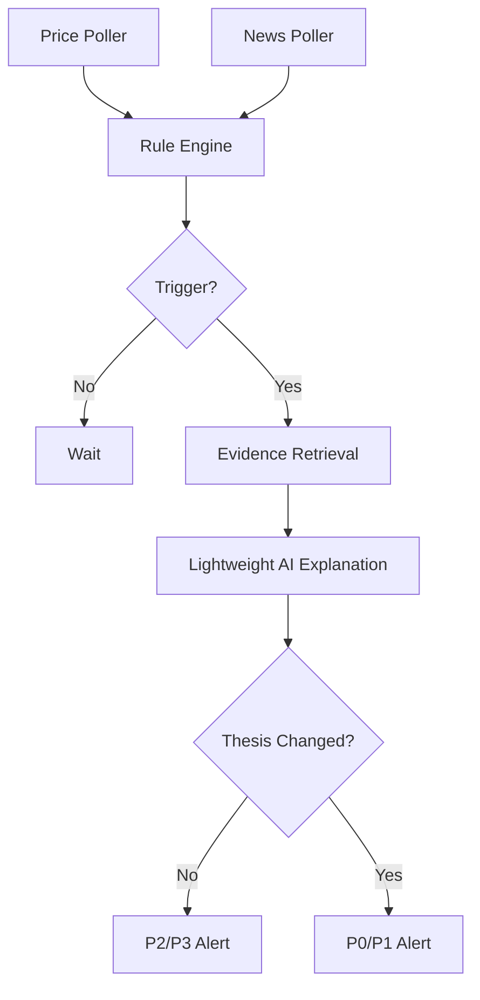

Intraday does not run retraining, full-universe research, unrestricted agent chains, automatic execution, or unconstrained advice.

---

## 13. Plugin Architecture

Plugin types:

- DataProvider;
- NewsProvider;
- WebSearchProvider;
- VectorStore;
- EmbeddingProvider;
- LLMProvider;
- MCPServer;
- ToolPlugin;
- StrategyPlugin;
- ValuationPlugin;
- NotificationPlugin;
- BrokerImportPlugin.

Repository:

```text
margin/
├── apps/api
├── apps/web
├── packages/core
├── packages/data
├── packages/storage
├── packages/news
├── packages/vector
├── packages/ai
├── packages/strategy
├── packages/research
├── packages/portfolio
├── connectors
├── mcp_servers
├── plugins
├── workflows
├── configs
├── examples
├── docs
└── tests
```

---

## 14. Deployment

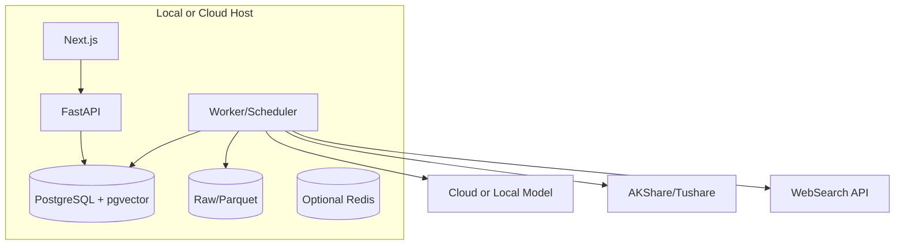

Docker Compose:

```text
web
api
worker
postgres
optional-redis
optional-qdrant
prometheus
grafana
```

---

## 15. Security and Observability

Security:

- Secret management;
- Least privilege;
- Provider and MCP permission policies;
- Prompt-injection defenses;
- User prompts cannot override guardrails;
- File validation;
- No arbitrary code execution by default;
- Sandboxed research agents;
- Local portfolio storage;
- Immutable audit logs;
- Data-source licensing, WebSearch API key, news copyright, and user-upload responsibility boundaries shown in settings.

Metrics:

- Provider availability;
- Missing-data rate;
- News delay;
- Parse success;
- Vector-index delay;
- Citation-validation failure;
- Agent-node latency;
- Model cost;
- Research signal abstention rate;
- Alert latency;
- Strategy success rate.

Trace fields:

```text
trace_id
job_run_id
strategy_version_id
research_run_id
symbol
agent_node
model_version
provider_version
```

---

## 16. Testing and Failure Modes

Tests:

- Connector and schema;
- Provider limits and licensing metadata;
- Point-in-time;
- Valuation formulas;
- Retrieval filters;
- Prompt merge;
- Decision rules;
- Portfolio cost and risk;
- End-to-end data-to-dashboard;
- Look-ahead and survivorship bias;
- Adjustment factors and trading costs;
- Risk score and event-window calibration;
- Model drift.

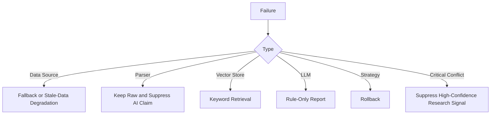

Principle: prefer `ABSTAINED` to a false high-confidence conclusion.

---

## 17. Implementation Order

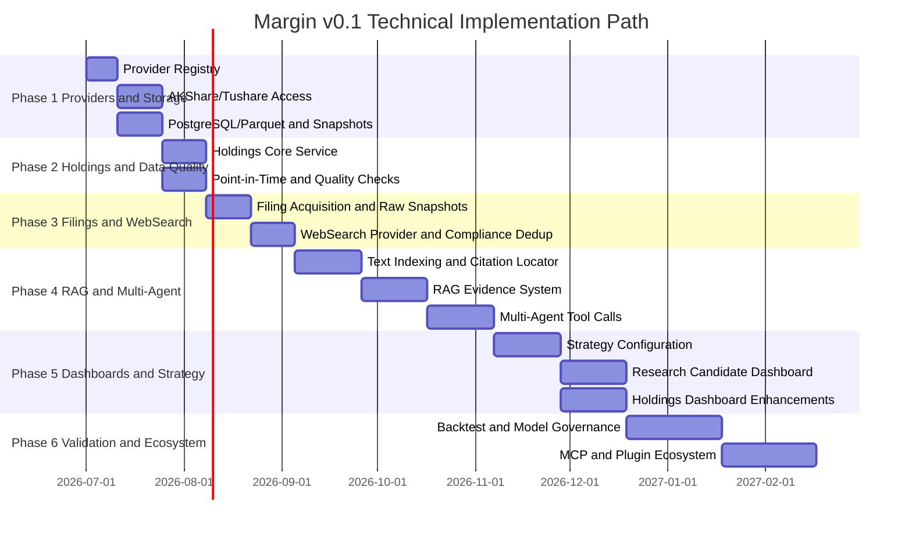

---

## 18. Recommended MVP Stack

```text
Backend: FastAPI
Frontend: Next.js
Primary DB: PostgreSQL
Vector: pgvector first, Qdrant optional
Analytics: Parquet + DuckDB
Provider Registry: lightweight custom registry
Market Data Providers: AKShare + Tushare
WebSearch Provider: user-configured API key
Scheduler: APScheduler
Queue: local worker first; Celery/RQ later
Quant: rule/factor engine first; Qlib + LightGBM as later pluggable modules
Agent: LangGraph or explicit state machine
MCP: Python MCP SDK in later MVP phases
Deployment: Docker Compose
```

---

## 19. Summary

Margin v0.1 prioritizes:

> Point-in-time correctness > evidence lineage > strategy configurability > agent complexity.

The minimum complete loop is:

> Data Providers → News/WebSearch → Vector retrieval → Controlled multi-agent research → User strategy constraints → Research Candidate Dashboard → Holdings Dashboard → Review and attribution.
