# Margin（安全边际）开源投资研究系统｜架构设计文档 v0.1

> 文档类型：系统架构设计文档  
> 版本：v0.1  
> 架构模式：模块化单体优先，异步任务分离，插件化扩展  
> 部署目标：单用户本地部署优先，可扩展至多用户服务  
> 推荐技术栈：FastAPI + PostgreSQL + Parquet/DuckDB + pgvector/Qdrant + Provider Registry + LangGraph/自研编排 + Next.js App Router + TypeScript + Tailwind CSS + shadcn/ui + TanStack Table/Query + Apache ECharts + lucide-react + Docker Compose

---

## 1. 架构目标

Margin v0.1 需要满足以下目标：

- 按八个核心层明确划分职责；
- 结构化数据与非结构化文本分开处理；
- 所有金融数据满足 Point-in-Time 时点要求；
- AI 只能基于可追溯证据生成关键结论；
- 用户可以自定义策略、提示词、模型、数据源和风险门槛；
- MCP 和工具协议允许第三方扩展；
- 研究候选面板和持仓面板共享同一研究信号、状态与证据模型；
- 模型、Prompt、策略、工具和数据均可版本化；
- 晚间批处理和盘中监控相互隔离；
- MVP 可在 4C8G 主机运行，不依赖 GPU。

---

## 2. 八层总体架构

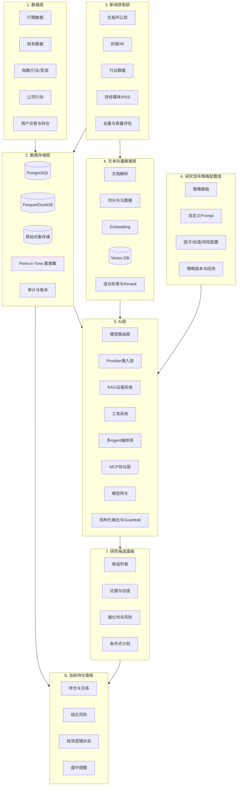

---

## 3. 横切能力

八层之外，系统还需要以下横切能力：

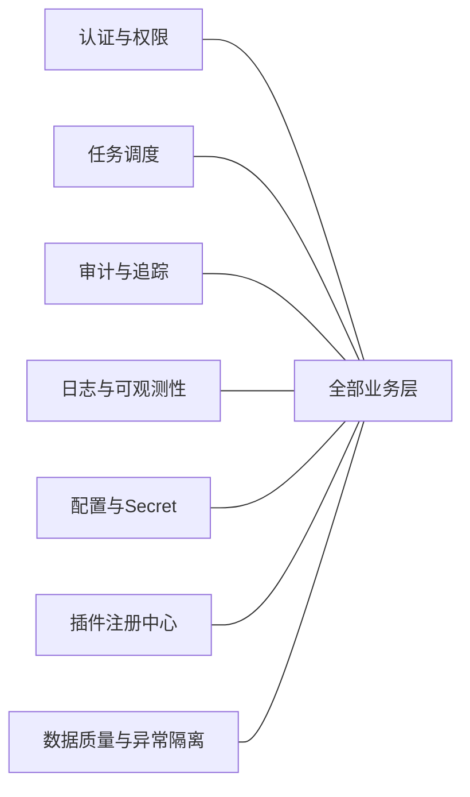

---

# 第一层：数据层

## 4. 数据层职责

数据层负责定义数据源接入、字段标准、数据时点和连接器协议，不直接承担长期存储。

### 4.1 数据类型

| 数据域 | 内容 |
|---|---|
| 行情 | 日线、分钟线可选、成交量、成交额、复权因子 |
| 财务 | 三大报表、财务指标、分红、预测数据 |
| 股票元数据 | 股票代码、行业、上市状态、指数成分 |
| 公司行动 | 分红、送转、拆并股、停复牌、退市 |
| 行业与宏观 | 商品价格、库存、利率、PMI、行业销量 |
| 用户数据 | 持仓、成交、现金、策略偏好 |
| 衍生特征 | 因子、模型输入、市场状态 |

### 4.2 数据连接器接口

```python
from typing import Protocol, Iterable
from datetime import datetime

class MarketDataProvider(Protocol):
    def get_securities(self, as_of: datetime): ...
    def get_bars(self, symbols, start, end, frequency="1d"): ...
    def get_adjustment_factors(self, symbols, start, end): ...
    def get_financials(self, symbols, start, end): ...
    def get_index_members(self, index_code, as_of): ...
```

### 4.2.1 MVP 数据 Provider 与授权边界

MVP 阶段只内置两个 A 股结构化数据 Provider：

- `AKShareProvider`：用于行情、基础财务、指数和部分公告元数据；
- `TushareProvider`：用于行情、财务、指数成分等补充数据，用户自行配置 token。

Provider 层必须记录：

- 数据来源；
- API Key / token 的本地 Secret 引用；
- 调用频率限制；
- 数据字段授权说明；
- `fetched_at`、`available_at` 和原始响应哈希。

开源仓库只提供连接器代码和示例字段映射，不内置商业数据库、付费研报全文或受版权限制的样例数据；研报类资料仅允许用户导入其自有或已授权文件。

### 4.3 数据标准化流程

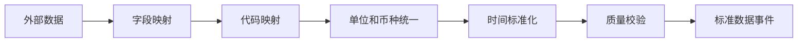

### 4.4 时点字段

每条关键记录至少包含：

```text
event_at       事件发生时间
published_at   对外公开时间
available_at   系统允许用于决策的时间
fetched_at     系统获取时间
revised_at     后续修订时间
```

### 4.5 防未来数据泄漏

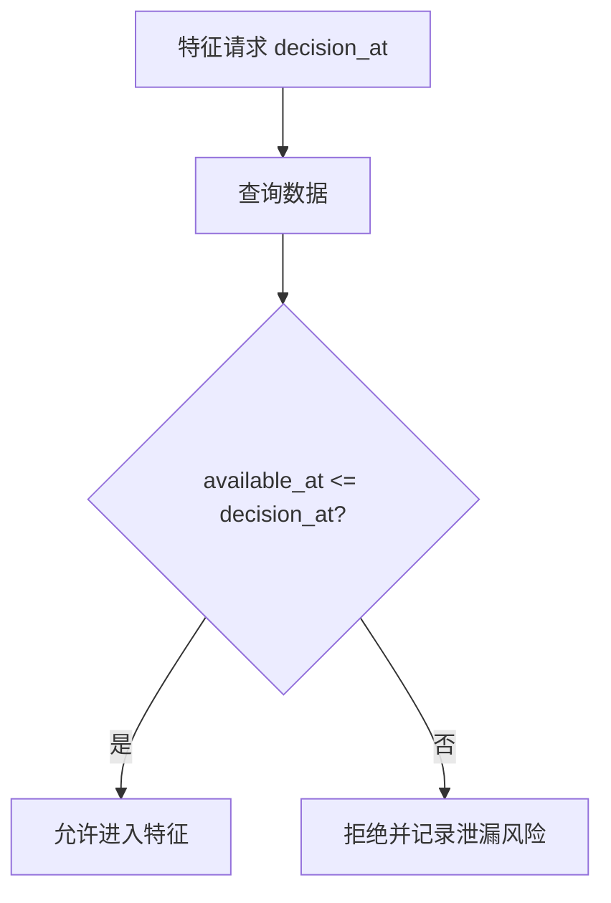

---

# 第二层：数据存储层

## 5. 存储架构

### 5.1 建议存储组合

| 存储 | 用途 |
|---|---|
| PostgreSQL | 主业务数据、策略、持仓、研究信号、证据元数据 |
| Parquet | 大规模行情、特征、回测数据 |
| DuckDB | 本地分析和批处理查询 |
| 本地文件/S3兼容对象存储 | 原始 PDF、HTML、JSON、CSV 快照 |
| pgvector/Qdrant | 文本向量 |
| Redis（可选） | 缓存、分布式锁、短任务状态 |

### 5.2 数据分层

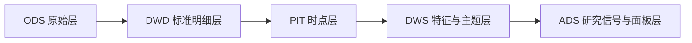

### 5.3 核心数据库实体

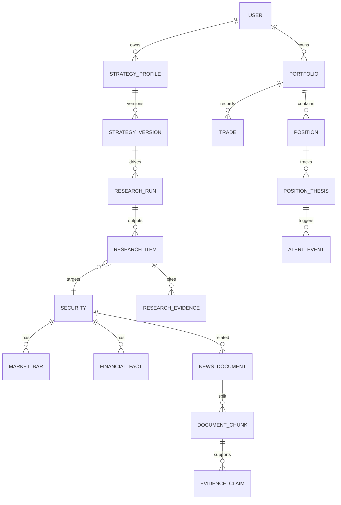

### 5.4 不可变研究信号快照

每次研究运行冻结：

- 股票池版本；
- 数据快照；
- 策略版本；
- Prompt 版本；
- 工具版本；
- 模型版本；
- 检索结果；
- 证据 ID；
- 结构化输出；
- 生成时间；
- 输入哈希和输出哈希。

---

# 第三层：新闻获取层

## 6. 新闻获取层定义

该层不仅抓取媒体新闻，还统一获取所有非结构化投资信息。

### 6.1 来源优先级

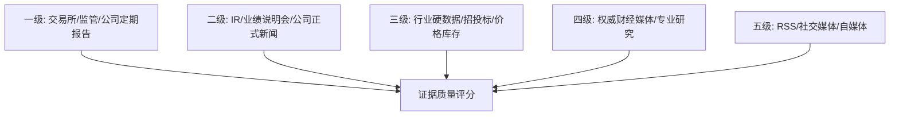

### 6.2 获取组件

- Source Registry：来源注册；
- Connector：API、RSS、网页、文件；
- Scheduler：频率和交易日调度；
- Downloader：增量获取；
- Snapshot：原始内容保存；
- Deduplicator：URL、标题、正文哈希和语义去重；
- Classifier：公告、财报、新闻、行业数据分类；
- Quality Scorer：来源、完整性、时间、重复度评分；
- Event Publisher：发布标准化文档事件。

### 6.2.1 WebSearch Provider 与新闻合规

新闻和网页信息的 MVP 方案不是无边界爬虫，而是可配置 WebSearch Provider：

- 用户自行填写 WebSearch API Key；
- 系统保存搜索 query、返回 URL、标题、摘要、抓取时间、原文快照哈希；
- 只有当 WebSearch 结果能落到可访问原文或合规快照时，才能进入 RAG 证据库；
- 不绕过 robots、登录墙、付费墙或反爬机制；
- 不把版权受限全文提交到开源样例数据；
- 对来源进行 L1-L5 分级，L4/L5 只能触发调查或辅助解释，不能单独改变研究/持仓状态。

### 6.3 文档处理流程

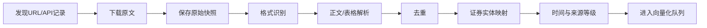

### 6.4 去重规则

1. URL 唯一性；
2. 内容哈希；
3. 标题和发布时间；
4. 正文 SimHash；
5. 向量相似度；
6. 转载链识别；
7. 保留最早可靠来源。

---

# 第四层：文本向量数据库

## 7. 文本向量化架构

### 7.1 数据流

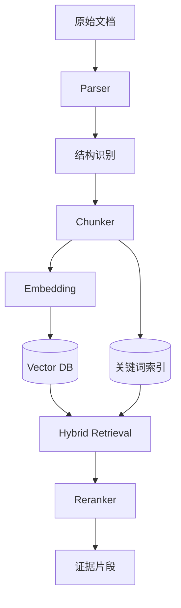

### 7.2 Chunk 策略

不同文档使用不同切分策略：

| 文档 | 切分方式 |
|---|---|
| 年报/季报 | 按章节、表格、页码 |
| 公告 | 按事项和条款 |
| 新闻 | 标题、导语、正文段落 |
| IR 记录 | 按问答对 |
| 行业报告 | 按主题和图表说明 |
| 用户笔记 | 按标题与段落 |

每个 Chunk 元数据：

```json
{
  "chunk_id": "chunk_xxx",
  "document_id": "doc_xxx",
  "symbol": "000001.SZ",
  "source_level": 1,
  "published_at": "2026-06-17T18:30:00+08:00",
  "available_at": "2026-06-18T09:30:00+08:00",
  "source_url": "https://...",
  "page": 86,
  "section": "经营现金流",
  "paragraph_index": 12,
  "table_id": "cash_flow_table",
  "row_id": "net_operating_cash_flow",
  "quote_span": [120, 188],
  "content_hash": "..."
}
```

### 7.3 混合检索

最终检索分数：

\[
Score =
w_v \cdot VectorScore +
w_k \cdot BM25 +
w_t \cdot TimeDecay +
w_s \cdot SourceQuality +
w_e \cdot EntityMatch
\]

### 7.4 检索约束

- 必须按股票代码过滤；
- 必须满足 `available_at <= decision_at`；
- 可按文档类型过滤；
- 优先官方证据；
- 相同事实去重；
- 输出必须包含页码或原文定位。

---

# 第五层：AI 层

## 8. AI 层总体结构

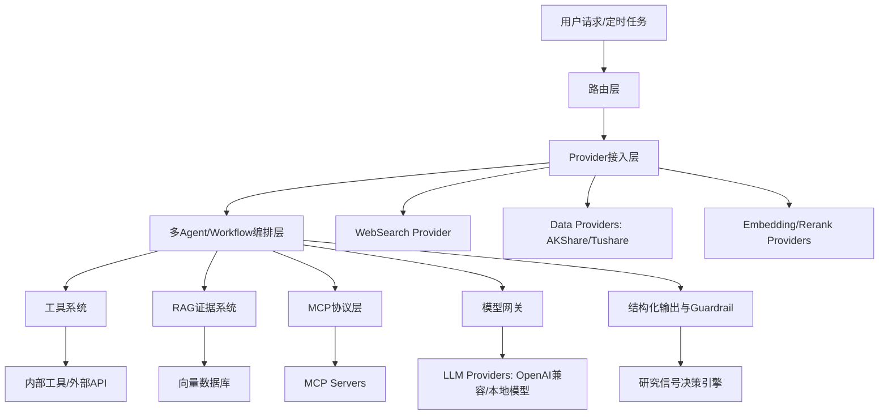

### 8.1 Provider 接入层

Provider 接入层统一管理外部能力和模型能力，避免业务流程直接耦合某个供应商：

| Provider 类型 | MVP 实现 | 说明 |
|---|---|---|
| MarketDataProvider | AKShare / Tushare | A 股行情、财务、指数和公司行动 |
| WebSearchProvider | 用户配置 API Key | 新闻、网页和公开信息发现 |
| LLMProvider | OpenAI-compatible | 研究、抽取、总结、反方审查 |
| EmbeddingProvider | OpenAI-compatible / 本地 | 文本向量化 |
| RerankProvider | 可选 | 混合检索结果重排 |
| VectorStoreProvider | pgvector / Qdrant | 向量存储可插拔 |
| NotificationProvider | 本地通知/邮件/Webhook | 提醒输出 |

Provider 必须具备健康检查、限流、重试、成本统计、Secret 引用、版本号和审计日志。

---

## 9. 模型路由层

### 9.1 路由职责

根据任务选择：

- 模型；
- Agent 工作流；
- 工具集合；
- 检索范围；
- 成本预算；
- 超时和重试；
- 输出 Schema。

### 9.2 路由示例

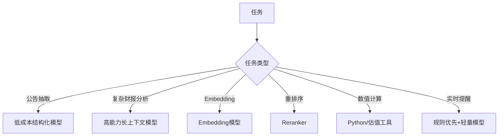

---

## 10. RAG 证据系统

### 10.1 目标

让关键结论满足：

- 有来源；
- 有时间；
- 有原文定位；
- 能区分事实与推断；
- 能发现冲突；
- 能拒绝回答。

### 10.2 RAG 工作流

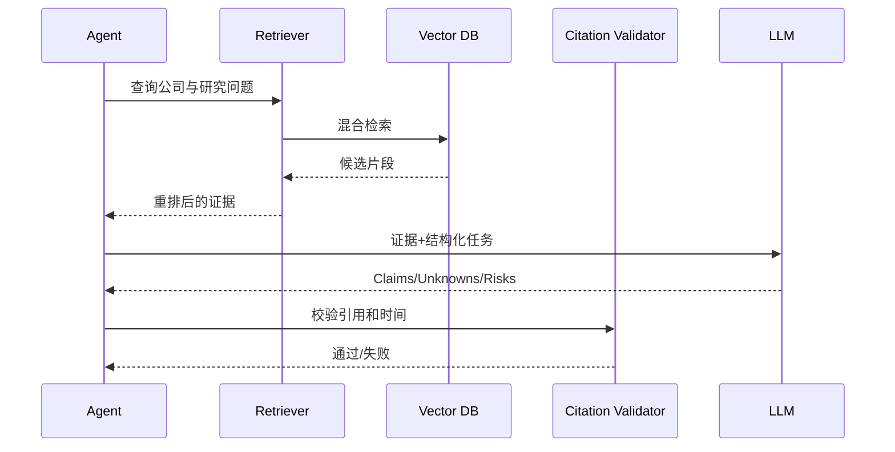

### 10.3 证据 Claim 结构

```json
{
  "claim_id": "claim_001",
  "claim_type": "cash_flow_improvement",
  "statement": "经营现金流质量改善",
  "fact_or_inference": "FACT",
  "evidence_ids": ["ev_101", "ev_102"],
  "confidence": 0.87,
  "conflicts": [],
  "effective_at": "2026-06-18",
  "locator": {
    "source_url": "https://...",
    "page": 86,
    "section": "经营现金流",
    "paragraph_index": 12,
    "table_id": "cash_flow_table",
    "row_id": "net_operating_cash_flow",
    "content_hash": "sha256:..."
  }
}
```

---

## 11. 工具系统

### 11.1 内置工具

| 工具 | 用途 |
|---|---|
| MarketDataTool | 获取行情和指标 |
| FinancialTool | 查询财务报表 |
| FilingTool | 获取公告原文 |
| RetrievalTool | 向量/关键词检索 |
| ValuationTool | DCF、相对估值、敏感性分析 |
| FactorTool | 因子和模型分数 |
| PortfolioTool | 持仓、权重、风险 |
| BacktestTool | 策略回测 |
| CalendarTool | 交易日与催化剂 |
| AlertTool | 创建提醒 |
| PythonTool | 可控数值计算 |

### 11.2 工具调用原则

- LLM 不直接伪造工具结果；
- 数值必须由工具计算；
- 每次调用记录参数与结果；
- 工具有权限范围；
- 生产环境禁止任意 Shell；
- 外部写操作必须用户确认。

---

## 12. Agent 编排层

### 12.1 多 Agent 职能分工

这里的“多 Agent”指职责隔离和工具调用分工，不是通过多个 Agent 辩论来制造确定性。每个 Agent 都必须有明确输入、工具权限、输出 Schema 和失败降级策略。

第一版建议使用以下职能节点：

1. Universe Filter Agent：根据股票池和基础规则缩小范围；
2. Quant Research Agent：计算因子、估值输入和基础排名；
3. WebSearch Agent：通过 WebSearch Provider 发现相关新闻、公告入口和网页来源；
4. Document Collector Agent：下载或快照合规原文，并记录来源、时间和哈希；
5. Text Summary Agent：对公告、网页和财报片段做结构化摘要；
6. Evidence Research Agent：检索和组织证据 Claim；
7. Valuation Tool Agent：调用估值工具完成数值计算；
8. Risk and Value-Trap Review Agent：输出风险评分而非未经校准的概率；
9. Reflect / Counter-Argument Agent：审查反方证据、冲突和未知项；
10. Portfolio Constraint Agent：检查组合暴露与持仓逻辑；
11. Research Signal Composer：生成研究信号和面板卡片；
12. Citation Validator：校验证据引用、来源等级和时点。

```mermaid
flowchart LR
    A[Universe Filter] --> B[Quant Research]
    B --> C[WebSearch Agent]
    C --> D[Document Collector]
    D --> E[Text Summary]
    E --> F[Evidence Research]
    F --> G[Valuation Tool]
    G --> H[Risk/Value-Trap Review]
    H --> I[Reflect/Counter Argument]
    I --> J[Portfolio Constraint]
    J --> K[Research Signal Composer]
    K --> L[Citation Validator]
```

### 12.2 工作流状态

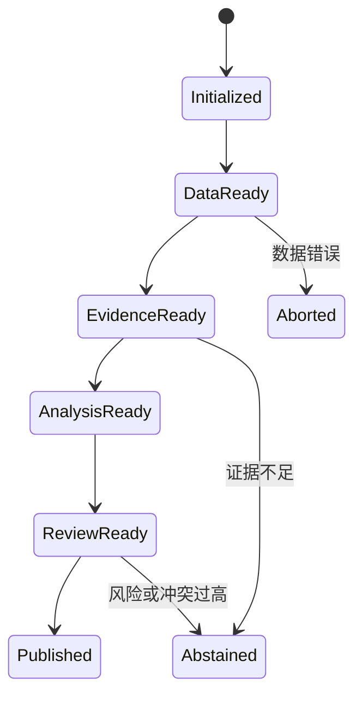

---

## 13. MCP 协议层

### 13.1 MCP 作用

MCP 用于标准化连接：

- 数据工具；
- 文件系统；
- 公告检索；
- 组合查询；
- 回测服务；
- 用户自定义研究工具；
- 第三方插件。

### 13.2 建议 MCP Server

```text
margin-market-mcp
margin-filings-mcp
margin-portfolio-mcp
margin-backtest-mcp
margin-evidence-mcp
margin-macro-mcp
```

### 13.3 MCP 安全边界

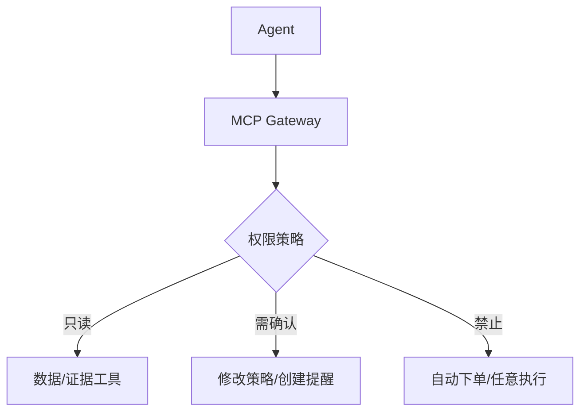

---

## 14. 模型网关与 Guardrail

模型网关统一处理：

- Provider 适配；
- Key 管理；
- 模型能力注册；
- 成本统计；
- 限流；
- 重试；
- Fallback；
- Prompt 版本；
- 内容安全；
- 结构化输出验证。

所有关键输出必须通过 JSON Schema，不接受仅自然语言结果。

---

# 第六层：研究信号策略配置层

## 15. 策略配置架构

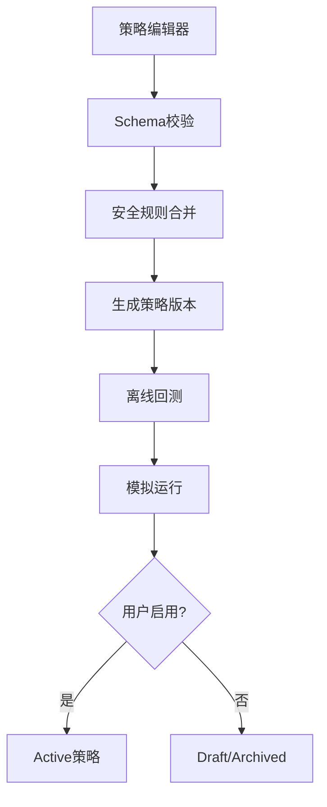

### 15.1 策略组成

- Universe；
- Quant factors；
- Valuation；
- Quality；
- Catalyst；
- News source；
- AI Prompt；
- Evidence requirements；
- Horizon；
- Risk limits；
- Portfolio constraints；
- Decision thresholds；
- Output template。

### 15.2 Prompt 分层

```text
System Guardrail Prompt
    + Platform Research Prompt
    + Strategy Template Prompt
    + User Custom Prompt
    + Current Task Context
    + Retrieved Evidence
```

### 15.3 策略沙箱

用户自定义策略必须先经过：

- 配置校验；
- 样例运行；
- 历史回测；
- 数据泄漏检查；
- 交易成本测试；
- 报告预览；
- 用户手工启用。

---

# 第七层：研究候选面板

## 16. 研究候选面板架构

### 16.1 后端组件

- Research Run Query Service；
- Dashboard BFF；
- Evidence View Service；
- Valuation View Service；
- Strategy Status Service；
- Report Renderer；
- Export Service。

### 16.2 前端页面

前端统一使用 Next.js App Router + TypeScript。样式层采用 Tailwind CSS；
通用 UI 组件采用 shadcn/ui；表格采用 TanStack Table + shadcn Table；
图表采用 Apache ECharts；图标采用 lucide-react；服务端状态与 API 请求采用
TanStack Query。所有研究候选、持仓、证据展开和运行状态页面必须基于同一套
组件与请求规范，避免每个页面各自维护表格、图表和加载/错误状态。

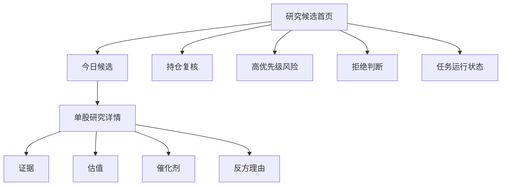

### 16.3 API

API 以可审计的 run/item 模型组织，避免只按“今日候选”查询导致无法回放。

```text
GET  /api/v1/research-runs?date=&strategy_id=&portfolio_id=&universe_id=&status=
POST /api/v1/research-runs
GET  /api/v1/research-runs/{run_id}
GET  /api/v1/research-runs/{run_id}/items
GET  /api/v1/research-items/{item_id}
GET  /api/v1/research-items/{item_id}/evidence
GET  /api/v1/research-items/{item_id}/valuation
GET  /api/v1/research-items/{item_id}/audit
POST /api/v1/research-items/{item_id}/feedback
GET  /api/v1/provider-status
POST /api/v1/jobs/nightly-runs
GET  /api/v1/jobs/{job_run_id}
```

关键查询参数：

- `date`：研究运行日期；
- `strategy_id` / `strategy_version_id`：策略过滤；
- `portfolio_id`：持仓上下文；
- `universe_id`：股票池版本；
- `run_id`：不可变研究运行快照；
- `decision_at`：时点一致性校验。

---

# 第八层：当前持仓面板

## 17. 持仓服务架构

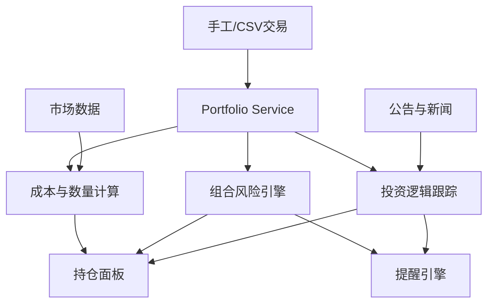

### 17.1 投资逻辑对象

每个持仓维护：

```json
{
  "position_id": "pos_001",
  "entry_recommendation_id": "rec_001",
  "thesis": "现金流改善与估值修复",
  "entry_conditions": [],
  "hold_conditions": [],
  "invalidation_conditions": [],
  "target_horizon": [60, 120],
  "next_review_at": "2026-08-25"
}
```

### 17.2 组合风险

- 单票仓位；
- 行业集中度；
- 风格暴露；
- 相关性；
- 流动性；
- 波动率；
- 回撤；
- 事件集中风险。

### 17.3 持仓 API

```text
GET  /api/v1/portfolios/{id}
GET  /api/v1/portfolios/{id}/positions
POST /api/v1/portfolios/{id}/trades
POST /api/v1/portfolios/{id}/imports
GET  /api/v1/portfolios/{id}/risk
GET  /api/v1/positions/{id}/thesis
PUT  /api/v1/positions/{id}/thesis
GET  /api/v1/positions/{id}/alerts
```

---

## 18. 完整晚间时序

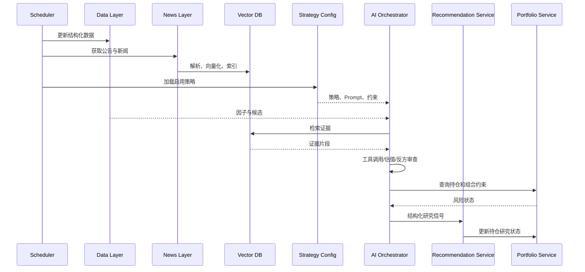

---

## 19. 盘中监控架构

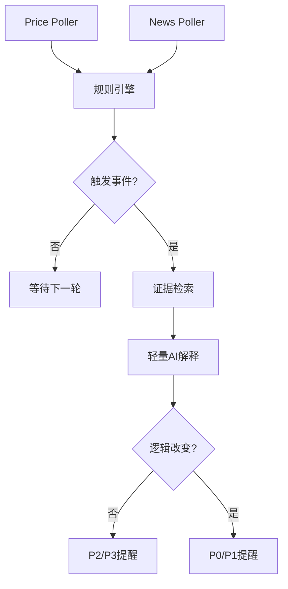

盘中不执行：

- 重新训练模型；
- 全市场重新研究；
- 任意 Agent 长链；
- 自动下单；
- 无规则限制的自由研究结论。

---

## 20. 开源插件架构

### 20.1 插件协议

```python
class MarginPlugin:
    name: str
    version: str
    capabilities: list[str]

    def healthcheck(self) -> dict: ...
    def register(self, registry) -> None: ...
```

### 20.2 插件类型

- DataProvider；
- NewsProvider；
- VectorStore；
- EmbeddingProvider；
- LLMProvider；
- MCPServer；
- ToolPlugin；
- StrategyPlugin；
- ValuationPlugin；
- NotificationPlugin；
- BrokerImportPlugin。

### 20.3 仓库结构

```text
margin/
├── apps/
│   ├── api/
│   └── web/
├── packages/
│   ├── core/
│   ├── data/
│   ├── storage/
│   ├── news/
│   ├── vector/
│   ├── ai/
│   ├── strategy/
│   ├── recommendation/
│   └── portfolio/
├── connectors/
├── mcp_servers/
├── plugins/
├── workflows/
├── configs/
├── examples/
├── docs/
├── tests/
├── docker-compose.yml
├── pyproject.toml
└── LICENSE
```

---

## 21. 部署架构

### 21.1 MVP 单机部署

```mermaid
flowchart TB
    subgraph Host[本地主机/云主机]
        WEB[Next.js App Router + TypeScript]
        API[FastAPI]
        WORKER[Worker/Scheduler]
        PG[(PostgreSQL + pgvector)]
        FILES[(Raw/Parquet)]
        REDIS[(Redis 可选)]
    end

    API --> PG
    WORKER --> PG
    WORKER --> FILES
    WORKER --> LLM[LLM API/本地模型]
    WORKER --> DATA[外部数据源]
    WEB --> API
```

### 21.2 Docker Compose 服务

```text
web
api
worker
postgres
optional-redis
optional-qdrant
prometheus
grafana
```

---

## 22. 安全设计

- API Key 使用 Secret；
- 数据库最小权限；
- MCP 工具权限分级；
- Prompt Injection 防护；
- 外部文本只能作为数据；
- 用户 Prompt 不能覆盖系统 Guardrail；
- 原始文件类型和大小限制；
- 任意代码执行默认关闭；
- RD-Agent 在隔离沙箱；
- 持仓数据默认不上传；
- 审计日志不可修改；
- 数据源授权、WebSearch API Key、新闻版权和用户上传材料责任边界在设置页明确展示。

---

## 23. 可观测性

### 指标

- 数据源可用率；
- 数据缺失率；
- 新闻获取延迟；
- 文档解析成功率；
- 向量索引延迟；
- RAG 命中率；
- 引用校验失败率；
- Agent 节点耗时；
- 模型成本；
- 研究信号拒绝率；
- 提醒延迟；
- 策略运行成功率。

### Trace 字段

```text
trace_id
job_run_id
strategy_version_id
research_run_id
symbol
agent_node
model_version
```

---

## 24. 测试策略

### 24.1 单元测试

- 连接器；
- 时间字段；
- 因子；
- 估值公式；
- 检索过滤；
- Prompt 合并；
- 决策规则；
- 持仓成本；
- 风险计算。

### 24.2 集成测试

```mermaid
flowchart LR
    A[数据源] --> B[标准化]
    B --> C[存储]
    C --> D[文本索引]
    D --> E[RAG]
    E --> F[Agent]
    F --> G[研究信号]
    G --> H[面板]
```

### 24.3 金融特有测试

- Point-in-Time；
- 幸存者偏差；
- 复权；
- 停牌和涨跌停；
- 交易成本；
- 数据修订；
- 风险评分和事件窗口校准；
- 因子暴露；
- 模型漂移。

---

## 25. 故障降级

```mermaid
flowchart TD
    A[异常] --> B{类型}
    B -->|数据源失败| C[备用源/使用旧数据并降级]
    B -->|文本解析失败| D[保留原文并停止相关AI结论]
    B -->|向量库失败| E[关键词检索降级]
    B -->|LLM失败| F[规则型报告]
    B -->|策略错误| G[回滚上一版本]
    B -->|核心数据冲突| H[停止发布高置信研究信号]
```

原则：宁可 `ABSTAINED`，也不输出虚假的高置信结论。

---

## 26. 实施顺序

```mermaid
gantt
    title Margin v0.1 技术实施路径
    dateFormat YYYY-MM-DD
    section Phase 1 Provider与存储
    Provider Registry          :a1, 2026-07-01, 10d
    AKShare/Tushare接入        :a2, after a1, 14d
    PostgreSQL/Parquet与快照    :a3, after a1, 14d
    section Phase 2 持仓与数据质量
    持仓基础服务               :b1, after a2, 14d
    时点与数据质量校验          :b2, after a3, 14d
    section Phase 3 公告与WebSearch
    公告获取与原文快照          :c1, after b2, 14d
    WebSearch Provider与合规去重 :c2, after c1, 14d
    section Phase 4 RAG与多Agent
    文本索引与引用定位          :d1, after c2, 21d
    RAG证据系统                :d2, after d1, 21d
    多Agent工具调用             :d3, after d2, 21d
    section Phase 5 面板与策略
    策略配置中心               :e1, after d3, 21d
    研究候选面板               :e2, after e1, 21d
    持仓面板增强               :e3, after e1, 21d
    section Phase 6 验证与生态
    回测与模型治理             :f1, after e2, 30d
    MCP与插件生态              :f2, after f1, 30d
```

---

## 27. MVP 推荐技术选型

```text
Backend: FastAPI
Frontend: Next.js App Router + TypeScript
Styling: Tailwind CSS
Components: shadcn/ui
Tables: TanStack Table + shadcn Table
Charts: Apache ECharts
Icons: lucide-react
Client Requests/Server State: TanStack Query
Primary DB: PostgreSQL
Vector: pgvector（MVP）/ Qdrant（可插拔）
Analytics: Parquet + DuckDB
Provider Registry: 自研轻量注册表
Market Data Providers: AKShare + Tushare
WebSearch Provider: 用户配置 API Key
Scheduler: APScheduler
Queue: 初期本地任务；后续 Celery/RQ
Quant: 规则/因子引擎优先；Qlib + LightGBM 作为后续可插拔模块
Agent: LangGraph 或自研状态机
MCP: Python MCP SDK（MVP 后半段接入）
Deployment: Docker Compose
```

---

## 28. 总结

Margin v0.1 的架构核心是：

- 数据层提供标准、时点正确的金融数据；
- 数据存储层保存原始数据、业务数据和不可变研究信号快照；
- 新闻获取层持续获取高价值公开信息；
- 文本向量数据库为 RAG 提供可过滤、可引用的检索；
- AI 层通过 Provider、路由、工具、多 Agent、RAG 和 MCP 形成可控研究工作流；
- 策略配置层让用户定义自己的投资逻辑，而不是接受统一算法；
- 研究候选面板负责呈现候选、证据、估值、风险和条件；
- 当前持仓面板负责持续验证投资逻辑和组合风险。

架构优先级应始终保持：

> **时点正确 > 证据可追溯 > 策略可配置 > Agent 复杂度。**

第一版可以按模块逐步交付，但每个阶段都应服务于最终八层闭环：

> 数据进入 → 新闻进入 → 文本检索 → AI 研究 → 用户策略约束 → 研究候选展示 → 持仓跟踪 → 结果复盘。
