# Margin（安全边际）Open-Source Investment Research System — Product Design v0.1

> Type: Product Design Document  
> Version: v0.1  
> Positioning: A local-first, evidence-driven, strategy-configurable open-source investment research and portfolio decision system.  
> Default market: China A-shares; initial universe: CSI 300 and user watchlists.  
> Execution model: The system generates research signals, evidence summaries, and risk alerts. Users execute manually through their own broker.  
> Disclaimer: Margin is a research and decision-support tool. It does not constitute investment advice, guarantee returns, replace licensed investment advisers, or execute trades by default.

---

## 1. Product Summary

Margin converts personal investment research into a traceable, configurable, and reviewable workflow:

1. Collect market, fundamental, filing, news, and industry data;
2. Store structured data and index unstructured text separately;
3. Use quantitative screening to reduce the candidate universe;
4. Use RAG evidence to generate facts, inferences, risks, and counterarguments from source documents;
5. Apply user-defined strategies, prompts, risk limits, and investment horizons;
6. Display valuation ranges, evidence, catalysts, invalidation conditions, and observation windows in the Research Candidate Dashboard;
7. Monitor positions, P&L, exposure, new evidence, and thesis state in the Holdings Dashboard;
8. Record each research signal, user action, and outcome for attribution and validation.

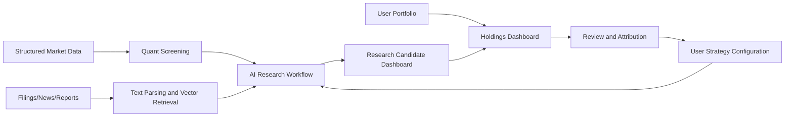

---

## 2. Vision and Principles

### 2.1 Vision

> Give individual investors a self-hosted investment research operating system with configurable strategies, auditable evidence, repeatable analysis, and portfolio feedback.

### 2.2 Core Values

| Value | Description |
|---|---|
| Local-first | Portfolio, prompts, and research data can remain local |
| Evidence-driven | Material conclusions link to sources, timestamps, and evidence levels |
| Strategy-configurable | Users control universe, valuation, prompts, horizons, and risk thresholds |
| Human-in-the-loop | AI researches; users retain final execution authority |
| Verifiable | Backtests, paper trading, shadow portfolios, and attribution |
| Extensible | Data providers, tools, MCP servers, and plugins |

### 2.3 Non-Goals

Margin v0.1 does not target:

- High-frequency trading;
- Exact target-price date prediction;
- Centralized “daily stock picks”;
- Default automatic execution;
- Multi-agent debate that creates false certainty;
- One valuation model for every industry;
- LLM-only numerical calculations.

### 2.4 Compliance and Wording Boundaries

“Margin” means **Margin of Safety / 安全边际**. It does not refer to margin trading, leverage, or broker financing.

The product outputs research candidates, evidence summaries, risk alerts, and conditional observation items. It does not output unconditional buy/sell instructions. User-facing language must:

- Prefer “research signal”, “research candidate”, “risk review”, and “observation window”;
- Avoid promises such as “guaranteed”, “must rise”, or “daily winner”;
- Describe position thesis state and risk exposure without making trading decisions for the user;
- Include evidence, timestamp, source level, unknowns, and counterarguments;
- Default to `ABSTAINED` when evidence is insufficient, conflicting, or stale.

---

## 3. Target Users

### 3.1 Core Users

- Individual investors who research and trade manually;
- Users focused on value, quality, catalysts, and medium-term holding periods;
- Users who want AI to reduce filing and report reading time;
- Users who prefer configurable strategies over centralized conclusions;
- Privacy-conscious users willing to self-host;
- Technical users or users comfortable with one-click deployment.

### 3.2 User Roles

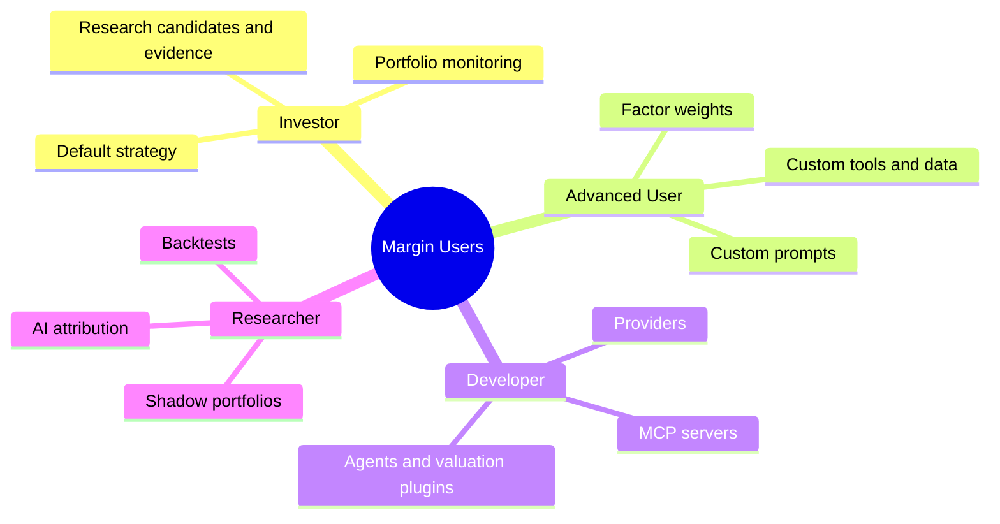

---

## 4. Eight Product Layers

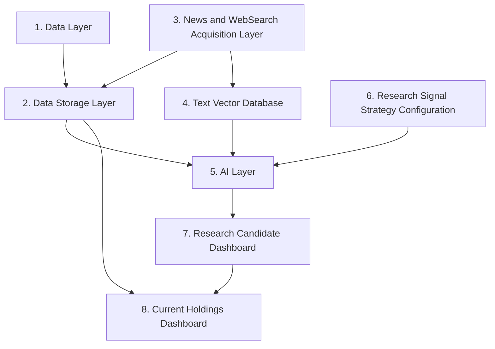

### 4.1 Data Layer

Market data, financial statements, index membership, corporate actions, macro/industry data, user trades, and factor inputs.

### 4.2 Data Storage Layer

Raw snapshots, normalized records, point-in-time data, features, model outputs, strategy versions, research signal snapshots, portfolio data, and audit logs.

### 4.3 News and WebSearch Acquisition Layer

Exchange filings, reports, investor-relations materials, industry datasets, financial media, RSS/API sources, WebSearch results, and user-defined sources.

MVP structured A-share data supports only:

- AKShare;
- Tushare, with user-provided token and user compliance with its terms and rate limits.

News discovery starts with configurable WebSearch Providers. Users provide API keys. The system stores source URL, query, title, snapshot hash, retrieval time, and source level. It must not bypass paywalls, login walls, robots restrictions, or redistribute copyrighted full text as open-source sample data.

### 4.4 Text Vector Database

Parsing, chunking, embeddings, metadata filtering, vector retrieval, keyword retrieval, hybrid search, reranking, and citation-level source locations.

### 4.5 AI Layer

- Routing layer;
- Provider layer;
- RAG evidence system;
- Tool system;
- Multi-agent orchestration;
- MCP protocol layer;
- Model gateway;
- Prompt templates;
- Structured output;
- Automated agent acquisition and role-based workflow;
- Reflection and counterargument review;
- Guardrails and abstention.

### 4.6 Research Signal Strategy Configuration

Users configure universe, industry preferences, horizon, risk tolerance, valuation methods, factor weights, news sources, model providers, custom prompts, signal thresholds, invalidation rules, portfolio limits, and report style.

### 4.7 Research Candidate Dashboard

Candidates, valuation ranges, valuation margin of safety, value-trap risk score, catalysts, evidence, counterarguments, observation windows, conditional research plans, and abstention reasons.

### 4.8 Current Holdings Dashboard

Positions, cost basis, P&L, portfolio exposure, single-name risk, thesis state, next events, invalidation conditions, alerts, trades, and reviews.

---

## 5. Main User Workflows

### 5.1 First Run

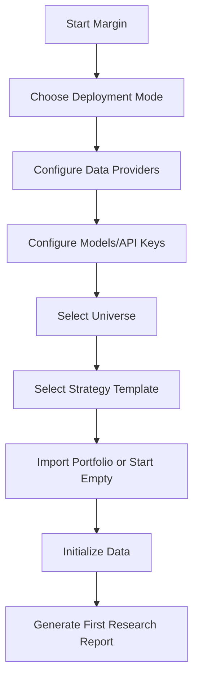

### 5.2 Nightly Workflow

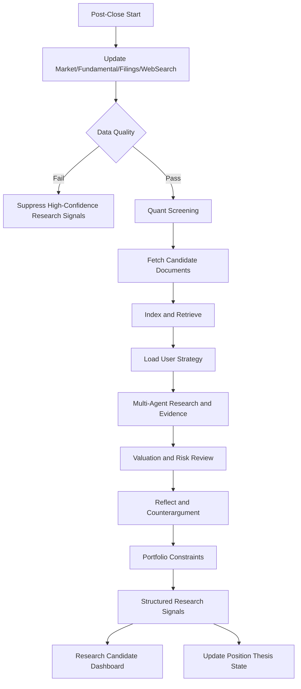

### 5.3 Intraday Monitoring

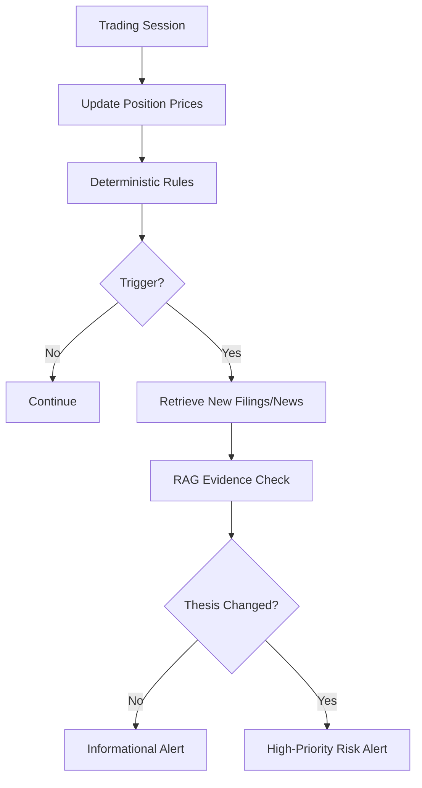

---

## 6. Research Signal Strategy Configuration Center

### 6.1 Strategy Templates

1. Value quality;
2. Undervaluation repair;
3. High dividend;
4. Growth at reasonable valuation;
5. Cycle reversal;
6. Fully custom strategy.

### 6.2 Strategy Definition

```yaml
strategy:
  id: value_quality_v1
  name: Value Quality
  universe:
    type: index
    value: CSI300
    data_providers:
      - akshare
      - tushare
  horizon:
    min_trading_days: 20
    max_trading_days: 120
  valuation:
    min_valuation_margin_of_safety: 0.20
    preferred_methods:
      - relative_valuation
      - dcf
  risk:
    max_value_trap_risk_score: 0.30
    max_single_position: 0.05
    max_industry_exposure: 0.20
  ai:
    provider: openai_compatible
    model: user_defined
    websearch_provider: user_configured
    custom_instructions: |
      Prefer improving cash flow and valuation below industry median.
      Exclude high pledge ratios, large goodwill, and repeated insider selling.
  evidence:
    required_levels: [1, 2, 3]
    min_evidence_count: 3
  decision:
    research_states:
      - RESEARCH_CANDIDATE
      - WATCH
      - ABSTAINED
    position_review_states:
      - THESIS_VALID
      - REVIEW_REQUIRED
      - RISK_ALERT
      - THESIS_INVALIDATED
    prohibited_outputs:
      - GUARANTEED_RETURN
      - DIRECT_BUY_SELL_ORDER
```

### 6.3 Prompt Composition

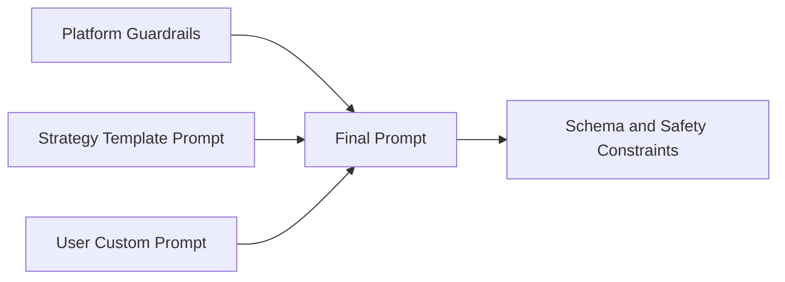

User prompts may not override evidence requirements, point-in-time rules, risk disclosure, schemas, no-return-promise rules, no-auto-trade rules, or system safety policies.

### 6.4 Strategy Lifecycle

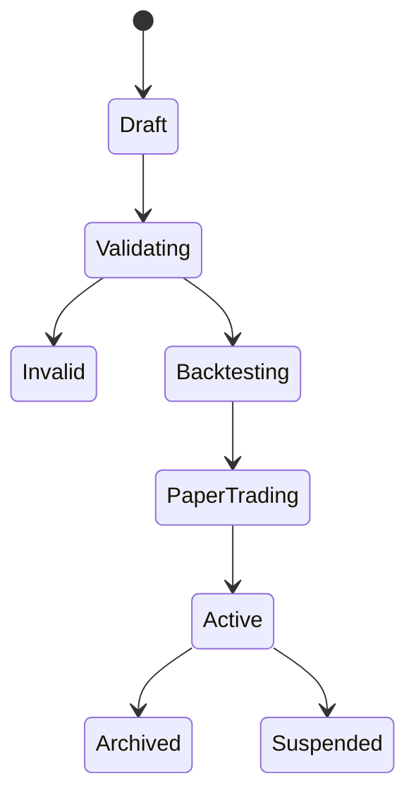

---

## 7. Research Candidate Dashboard Design

### 7.1 Homepage Hierarchy

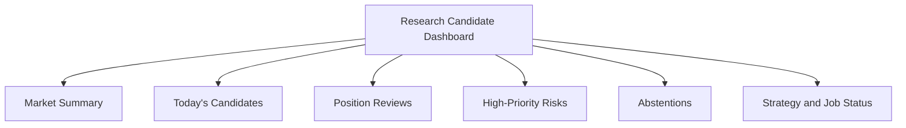

### 7.2 Candidate Cards

Each card includes:

- Symbol and price;
- Quant rank;
- Research/position state;
- Base and bear valuation ranges;
- Valuation margin of safety;
- Value-trap risk score;
- 20/60/120-day event observation windows;
- Catalysts;
- Strongest counterargument;
- Evidence count and levels;
- Research entry conditions;
- Thesis invalidation conditions;
- Observation window;
- Strategy version;
- Explicit note that the card is not a buy/sell instruction.

### 7.3 Research and Position States

| Research Signal State | Meaning |
|---|---|
| RESEARCH_CANDIDATE | Meets research gates and deserves evidence review |
| WATCH | Potential exists, but conditions are not met |
| ABSTAINED | Evidence is insufficient, conflicting, or too uncertain |

| Position Review State | Meaning |
|---|---|
| THESIS_VALID | Current thesis remains valid |
| REVIEW_REQUIRED | Valuation, evidence, or exposure changed and needs review |
| RISK_ALERT | Risk threshold is close or triggered |
| THESIS_INVALIDATED | Investment thesis failed and requires manual decision |

### 7.4 Research Detail Page

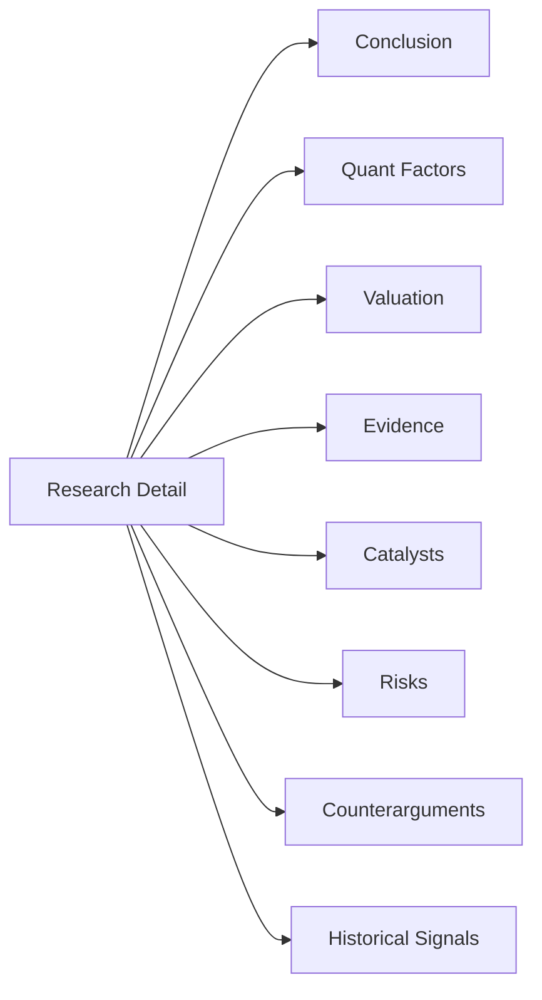

---

## 8. Current Holdings Dashboard Design

### 8.1 Portfolio Summary

- Total assets;
- Cash;
- Market value;
- Daily and cumulative P&L;
- Portfolio volatility;
- Maximum drawdown;
- Industry and style exposure;
- High-risk positions;
- Upcoming events.

### 8.2 Position Detail

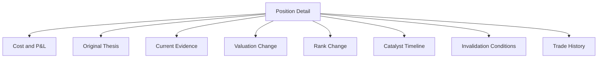

### 8.3 Position Health States

| State | Meaning |
|---|---|
| HEALTHY | Thesis and risk are normal |
| WATCH | One or more indicators deteriorated but thesis is not invalidated |
| RISK | Near invalidation or risk threshold |
| INVALIDATED | Thesis has failed |
| DATA_MISSING | Key data is missing |
| EVENT_PENDING | Waiting for filing, report, or event |

### 8.4 Position Input Methods

- Manual entry;
- CSV/Excel import;
- Broker export parser plugins;
- Future read-only broker connector;
- Broker passwords are not stored by default.

---

## 9. RAG Evidence Experience

### 9.1 Expandable Conclusions

Every material conclusion must expand into fact evidence, original location, system inference, conflicts, unknowns, and confidence.

### 9.2 Evidence Levels

| Level | Source |
|---|---|
| L1 | Exchange, regulator, statutory filing |
| L2 | IR, earnings call, formal guidance |
| L3 | Industry prices, volume, inventory, tenders |
| L4 | Reputable media and professional research |
| L5 | Social and unverified sources |

L5 evidence cannot directly change research or position states. It can only trigger investigation.

### 9.3 Citation Locator Fields

```json
{
  "evidence_id": "ev_001",
  "document_id": "doc_001",
  "source_type": "filing_pdf | web_page | table | api_record | user_file",
  "source_url": "https://...",
  "source_level": "L1",
  "content_hash": "sha256:...",
  "published_at": "2026-06-17T18:30:00+08:00",
  "available_at": "2026-06-18T09:30:00+08:00",
  "retrieved_at": "2026-06-18T20:10:00+08:00",
  "page": 86,
  "section": "Cash Flow",
  "paragraph_index": 12,
  "table_id": "cash_flow_table",
  "row_id": "net_operating_cash_flow",
  "quote_span": [120, 188]
}
```

WebSearch results must resolve to an accessible original page or compliant snapshot. Search summaries alone are not sufficient citations.

---

## 10. Alerts and Notifications

Alert types:

- Data anomalies;
- New filings;
- Major negative events;
- Price threshold events;
- Significant rank changes;
- Industry exposure limits;
- Valuation range events;
- Strategy run failures;
- Upcoming key events.

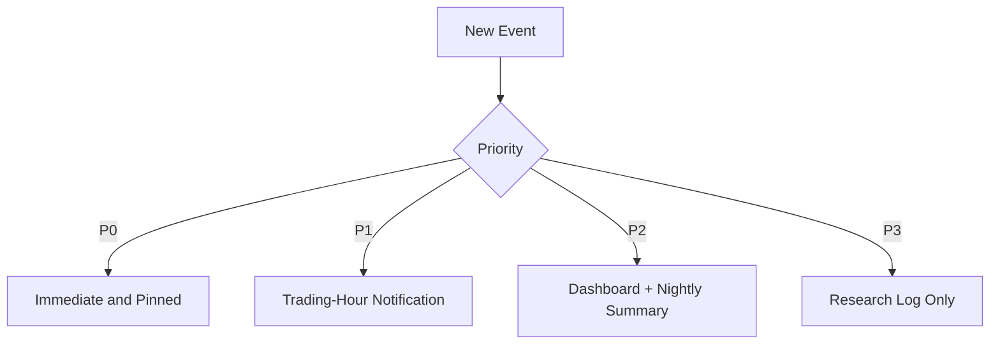

---

## 11. Open-Source Ecosystem

Users and contributors can extend:

- Data providers;
- News and WebSearch providers;
- Embedding providers;
- Vector stores;
- LLM providers;
- MCP servers;
- Agent workflows;
- Quant models;
- Valuation templates;
- Strategies;
- Notification channels;
- Broker-import parsers.

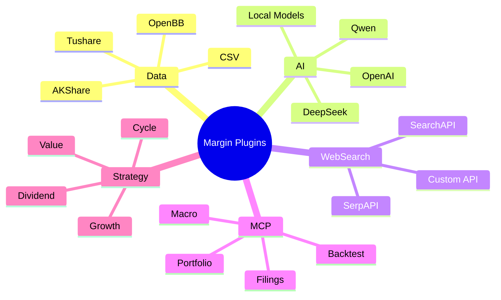

---

## 12. Product Metrics

### 12.1 System Metrics

- Nightly job success rate;
- Data completeness;
- News deduplication rate;
- Document parse success;
- RAG citation correctness;
- Unsupported claim rate;
- Research signal generation time;
- Alert latency.

### 12.2 Research Quality Metrics

- 20/60/120-day post-signal performance;
- Relative benchmark performance;
- Maximum drawdown;
- Post-cost performance;
- Value-trap risk score effectiveness;
- Event-window hit calibration;
- AI filtering quality difference;
- Strategy-version performance.

### 12.3 User Behavior Metrics

- Unplanned trade ratio;
- Evidence expansion rate;
- Custom strategy usage;
- Difference between research signals and user actions;
- Time to respond after invalidation triggers.

---

## 13. MVP Scope and Modular Implementation Path

### 13.1 Required MVP Loop

The MVP is the smallest complete investment research loop, not a shallow demo. It must include:

- CSI 300 and user watchlists;
- AKShare and Tushare data providers;
- Market data, basic fundamentals, index membership, and corporate actions;
- Filing acquisition and local snapshots;
- Configurable WebSearch Provider;
- PostgreSQL and local file storage;
- pgvector or Qdrant;
- One OpenAI-compatible LLM Provider;
- Citation-backed RAG and locator fields;
- One default strategy;
- Custom prompts;
- Research Candidate Dashboard;
- Holdings Dashboard;
- Manual/CSV trade import;
- Nightly automated agent acquisition and research workflow;
- Basic intraday alerts;
- Docker Compose.

### 13.2 Module-by-Module Delivery

1. Data Provider module;
2. Holdings module;
3. Filing and WebSearch module;
4. Text indexing module;
5. RAG evidence module;
6. Multi-agent research workflow module;
7. Strategy configuration module;
8. Research Candidate Dashboard module;
9. Holdings monitoring module;
10. Deployment and audit module.

### 13.3 Deferred Features

- RD-Agent challenger;
- Multi-model optimization;
- Full A-share universe;
- Automatic broker sync;
- Survival models or strict calibrated probability models;
- Multi-user SaaS;
- Complex knowledge graphs;
- Automatic execution;
- HK/US expansion.

---

## 14. Product Roadmap

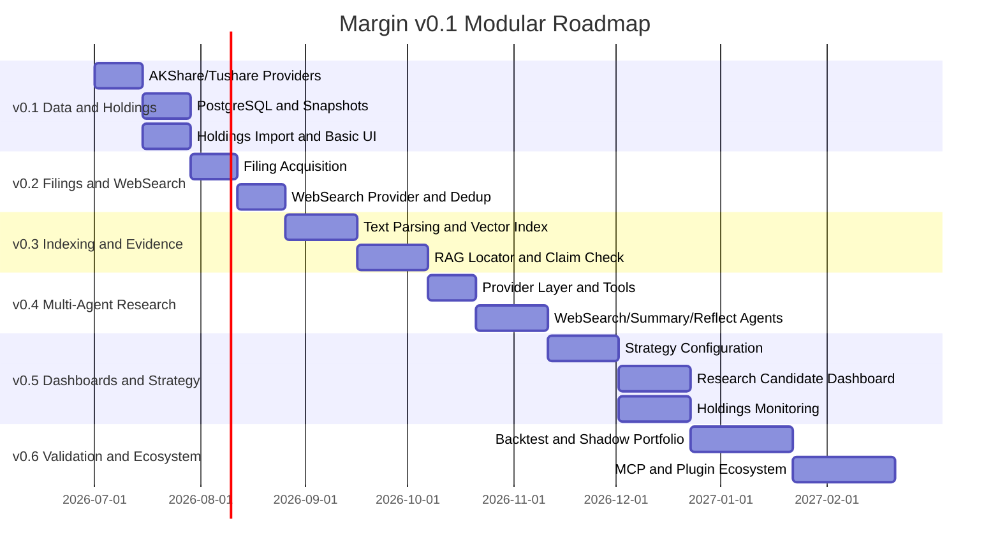

---

## 15. Product Acceptance Criteria

The MVP passes when:

1. Users can deploy locally with documented commands;
2. At least one AKShare/Tushare source, one WebSearch/news source, and one LLM can be configured;
3. The full nightly workflow runs;
4. Material conclusions include evidence citations and locator fields;
5. Users can create and version custom strategies;
6. The Research Candidate Dashboard shows candidates and abstentions;
7. The Holdings Dashboard shows P&L, risk, and thesis state;
8. Data errors suppress high-confidence research signals;
9. Research signals are immutable and auditable;
10. Real trades are not executed automatically.

---

## 16. Summary

Margin v0.1 is not “an LLM that trades for the user.” It is:

> A local-first, evidence-driven, strategy-configurable investment research OS built on structured data, compliant WebSearch, RAG evidence, controlled multi-agent workflows, and human final decision-making.

The eight layers create a loop from data acquisition to research, personalized constraints, candidate presentation, holdings monitoring, and post-action review.
