# Margin（安全边际）开源投资研究系统｜产品设计文档 v0.1

> 文档类型：产品设计文档（Product Design Document）  
> 版本：v0.1  
> 产品定位：本地优先、证据驱动、策略可配置的开源个人投资研究与持仓决策系统  
> 默认市场：A 股；首期股票池：沪深 300 / 用户自选池  
> 默认执行方式：系统生成研究信号、证据摘要与风险提示，用户自行在券商完成交易  
> 重要说明：本系统用于研究和决策辅助，不构成投资建议，不承诺收益，不替代持牌投资顾问，不默认提供自动下单能力。

---

## 1. 产品摘要

Margin 的核心目标不是“预测明天哪只股票上涨”，而是将个人投资研究拆解成一套可追溯、可配置、可复盘的工作流：

1. 采集行情、财务、公告、新闻和行业数据；
2. 将结构化数据与非结构化文本分别清洗、存储和索引；
3. 使用量化筛选缩小候选范围；
4. 使用 RAG 证据系统让 AI 基于原文生成事实、推断、风险与反方意见；
5. 根据用户自定义策略、持有周期、风险偏好和提示词生成个性化候选；
6. 在研究候选面板展示估值区间、证据、催化剂、失效条件和观察窗口；
7. 在当前持仓面板持续监控仓位、盈亏、组合暴露、公告和投资逻辑状态；
8. 记录每次研究信号、用户操作和后续结果，验证策略与 AI 是否真正产生增量价值。

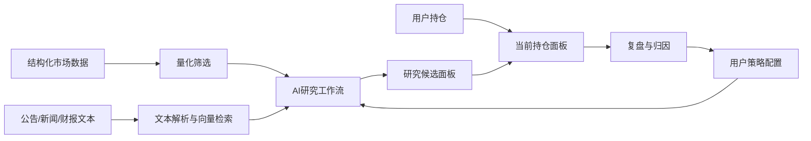

---

## 2. 产品愿景

### 2.1 愿景

> 让个人投资者拥有一套可本地部署、可自定义策略、可检查证据、可回测和可复盘的投资研究操作系统。

### 2.2 核心价值

| 价值    | 说明                         |
| ----- | -------------------------- |
| 本地优先  | 用户持仓、策略提示词和研究数据可保存在本地      |
| 证据驱动  | 每个关键结论都绑定原始证据、时间和来源等级      |
| 策略可配置 | 用户可以配置股票池、估值偏好、风险阈值、提示词和模型 |
| 人机协同  | AI 负责信息处理与研究，用户保留最终交易决策    |
| 可验证   | 通过回测、模拟盘、影子组合和归因验证模块贡献     |
| 可扩展   | 通过数据连接器、工具插件和 MCP 服务扩展能力   |

### 2.3 非目标

Margin 首期不追求：

- 高频交易；
- 精确预测某一天达到目标价；
- 官方集中发布“每日金股”；
- 自动替用户操作券商账户；
- 通过堆叠多个 Agent 制造虚假的确定性；
- 对所有公司使用同一套估值模型；
- 让大模型直接完成不可复现的数值计算。

### 2.4 合规与表达边界

Margin（安全边际）中的 “Margin” 指 **Margin of Safety / 安全边际**，不表示保证金交易、融资融券或杠杆交易。

产品默认只输出研究候选、证据摘要、风险提示和条件式观察项，不输出无条件的买入/卖出指令。所有用户可见表达必须遵守：

- 使用“研究信号”“研究候选”“风险复核”“观察窗口”等表述，避免直接使用“金股”“稳赚”“必涨”等承诺性语言；
- 持仓相关输出只描述投资逻辑是否仍成立、风险暴露是否需要复核，不替用户作出交易决定；
- AI 输出必须附带证据、时间、来源等级、未知项和反方理由；
- 当证据不足、来源冲突或数据异常时，默认输出 `ABSTAINED`；
- 自动下单、券商账户控制和收益承诺均不属于默认能力。

---

## 3. 目标用户

### 3.1 核心用户

- 自主研究和手工交易的个人投资者；
- 关注价值、质量、催化剂和中期持有周期；
- 希望通过 AI 减少阅读公告和财报的时间；
- 希望自定义策略，而不是接受统一研究结论；
- 关注隐私，愿意本地部署；
- 有一定技术能力，或愿意使用一键部署版本。

### 3.2 用户角色

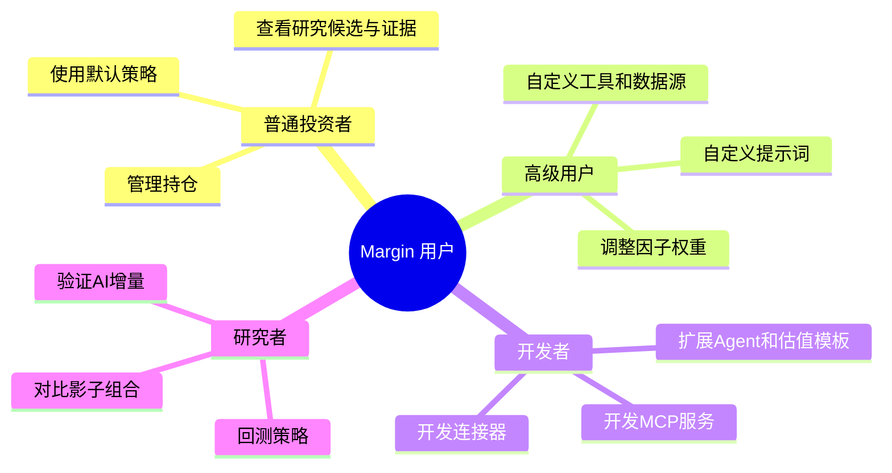

---

## 4. 核心产品架构与功能边界

产品按八个核心层组织：

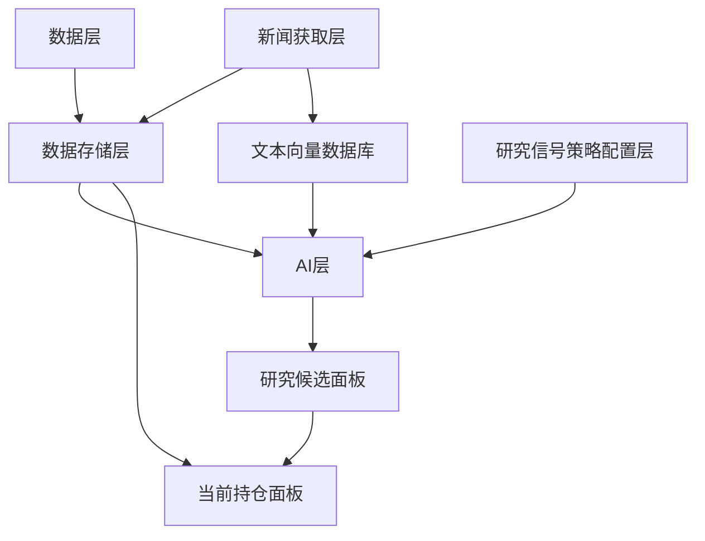

### 4.1 数据层

负责获取和标准化：

- 行情；
- 财务指标；
- 财务报表；
- 指数成分；
- 公司行动；
- 行业与宏观数据；
- 用户导入的交易和持仓数据；
- 量化因子输入。

### 4.2 数据存储层

负责：

- 原始快照；
- 标准化结构化数据；
- Point-in-Time 时点数据；
- 特征数据；
- 模型输出；
- 策略版本；
- 研究信号记录；
- 持仓和交易记录；
- 审计日志。

### 4.3 新闻获取层

“新闻”是广义概念，包括：

- 交易所公告；
- 财报和业绩说明会；
- 公司官网与投资者关系材料；
- 行业硬数据；
- 权威财经媒体；
- 用户自行配置的 RSS、API 或网页来源。

### 4.3.1 数据源与新闻合规边界

MVP 阶段结构化 A 股数据只支持：

- AKShare；
- Tushare（用户自行配置 token，并遵守其授权和频率限制）。

新闻和网页信息的初始方案是可配置 WebSearch Provider：用户填写相关 API Key，系统保存搜索结果快照、原文 URL、抓取时间和内容哈希。系统不得绕过网站访问控制，不抓取付费墙内容，不将版权受限全文作为开源样例数据分发。

### 4.4 文本向量数据库

负责对公告、财报、新闻和用户自有或授权研报进行：

- 文档解析；
- 分块；
- Embedding；
- 元数据过滤；
- 向量检索；
- 关键词检索；
- 混合召回；
- 重排序；
- 引用定位。

### 4.5 AI 层

包括：

- 模型路由层；
- Provider 接入层；
- RAG 证据系统；
- 工具系统；
- Agent 编排层；
- MCP 协议层；
- 模型网关；
- Prompt 模板；
- 结构化输出；
- 自动 Agent 抓取与多职能编排；
- 反方审查；
- 安全约束与拒绝机制。

### 4.6 研究信号策略配置层

用户可配置：

- 股票池；
- 行业偏好；
- 持有周期；
- 风险容忍度；
- 估值方法；
- 因子权重；
- 新闻来源；
- 模型供应商；
- 自定义 Prompt；
- 研究信号门槛；
- 失效规则；
- 组合限制；
- 报告风格。

### 4.7 研究候选面板

用于展示：

- 今日候选；
- 估值区间；
- 安全边际；
- 价值陷阱风险评分；
- 催化剂；
- 证据；
- 反方理由；
- 预期观察周期；
- 条件式研究计划；
- 拒绝判断原因。

### 4.8 当前持仓面板

用于展示和监控：

- 当前仓位；
- 成本；
- 盈亏；
- 组合行业暴露；
- 单票风险；
- 当前投资逻辑；
- 下一关键事件；
- 逻辑失效条件；
- 盘中提醒；
- 历史操作与复盘。

---

## 5. 用户主流程

### 5.1 首次使用

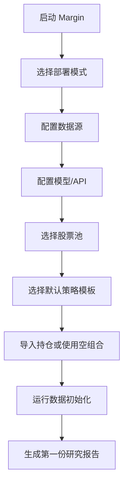

### 5.2 每日晚间流程

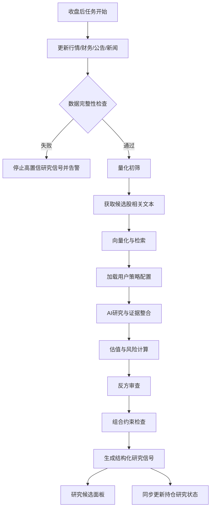

### 5.3 盘中持仓流程

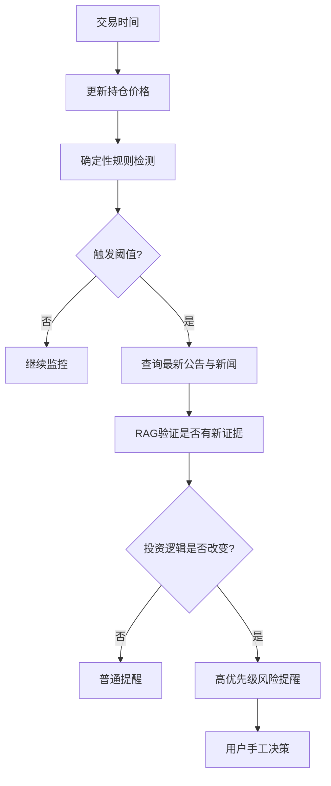

---

## 6. 研究信号策略配置中心

这是产品差异化最强的模块之一。

### 6.1 策略模板

系统预置：

1. 价值质量策略；
2. 低估修复策略；
3. 高股息策略；
4. 成长合理估值策略；
5. 周期反转策略；
6. 用户完全自定义策略。

### 6.2 策略配置结构

```yaml
strategy:
  id: value_quality_v1
  name: 价值质量策略
  universe:
    type: index
    value: CSI300
    data_providers:
      - akshare
      - tushare
  horizon:
    min_trading_days: 20
    max_trading_days: 120
  valuation:
    min_valuation_margin_of_safety: 0.20
    preferred_methods:
      - relative_valuation
      - dcf
  quality:
    min_roe: 0.10
    min_cash_conversion: 0.80
  risk:
    max_value_trap_risk_score: 0.30
    max_single_position: 0.05
    max_industry_exposure: 0.20
  ai:
    provider: openai_compatible
    model: user_defined
    websearch_provider: user_configured
    system_prompt_template: value_research_v1
    custom_instructions: |
      优先寻找现金流改善且估值低于行业中位数的公司。
      排除高质押、高商誉和持续减持公司。
  evidence:
    required_levels: [1, 2, 3]
    min_evidence_count: 3
  decision:
    research_states:
      - RESEARCH_CANDIDATE
      - WATCH
      - ABSTAINED
    position_review_states:
      - THESIS_VALID
      - REVIEW_REQUIRED
      - RISK_ALERT
      - THESIS_INVALIDATED
    prohibited_outputs:
      - GUARANTEED_RETURN
      - DIRECT_BUY_SELL_ORDER
```

### 6.3 自定义 Prompt

用户可编辑：

- 研究目标；
- 风格偏好；
- 重点关注指标；
- 必须排除的公司类型；
- 允许使用的信息源；
- 输出风格；
- 风险偏好；
- 反方审查强度。

系统必须区分：

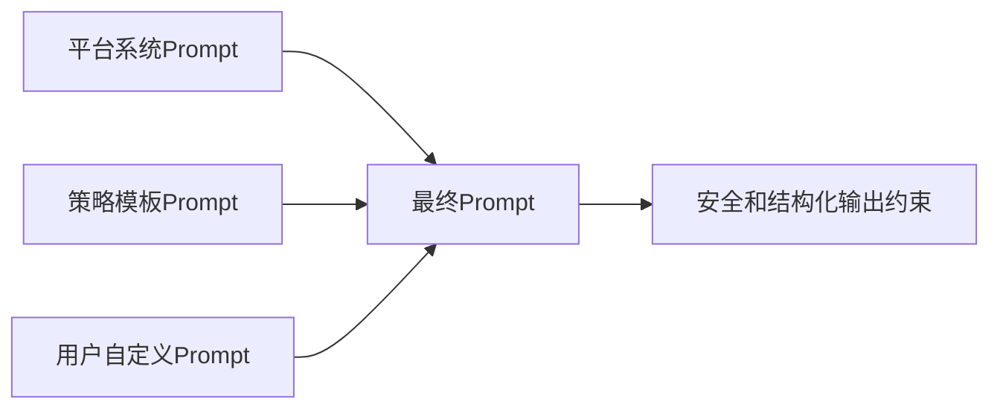

用户 Prompt 不得覆盖：

- 证据引用要求；
- 数据时点限制；
- 风险披露；
- 结构化输出 Schema；
- 禁止收益承诺；
- 禁止自动下单；
- 系统安全策略。

### 6.4 策略版本管理

每次修改生成新版本：

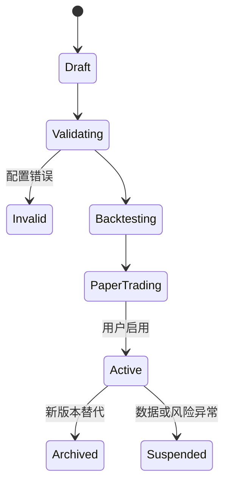

---

## 7. 研究候选面板设计

### 7.1 首页信息层级

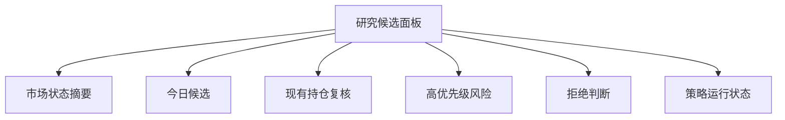

### 7.2 候选卡片

每张卡片必须包含：

- 股票名称与代码；
- 当前价格；
- 量化排名；
- 研究/持仓状态；
- 基准估值区间；
- 悲观估值区间；
- 估值安全边际；
- 价值陷阱风险评分；
- 20/60/120 日事件关注窗口；
- 主要催化剂；
- 最强反方理由；
- 证据数量和等级；
- 进入研究观察条件；
- 逻辑失效条件；
- 观察窗口；
- 使用的策略版本；
- 明确提示：该卡片不是买卖指令。

### 7.3 研究/持仓状态

状态分为“研究信号状态”和“持仓复核状态”，避免把研究结论误表达成交易指令。

| 研究信号状态 | 含义 |
|---|---|
| RESEARCH_CANDIDATE | 满足研究候选门槛，值得进一步阅读证据 |
| WATCH | 有潜力但条件未满足，仅进入观察列表 |
| ABSTAINED | 信息不足、冲突或不确定性过高，系统拒绝输出高置信结论 |

| 持仓复核状态 | 含义 |
|---|---|
| THESIS_VALID | 当前持仓逻辑仍成立 |
| REVIEW_REQUIRED | 估值、证据或组合暴露变化，需要人工复核 |
| RISK_ALERT | 接近或触发风险阈值，需要优先查看 |
| THESIS_INVALIDATED | 投资逻辑失效，应进入人工决策流程 |

### 7.4 研究详情页

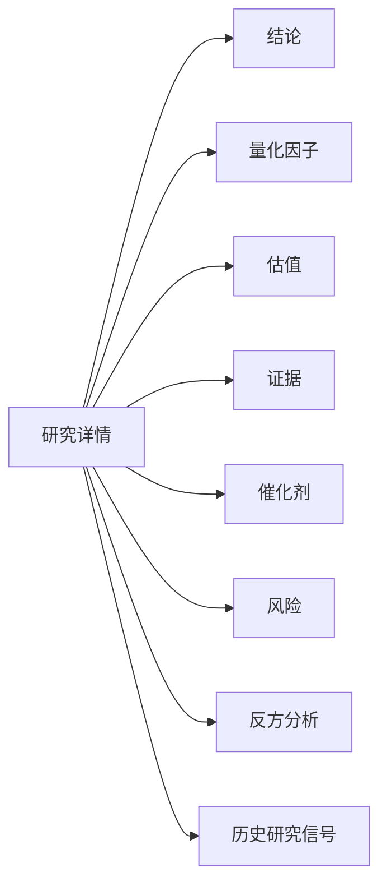

---

## 8. 当前持仓面板设计

### 8.1 持仓总览

- 总资产；
- 可用现金；
- 持仓市值；
- 今日盈亏；
- 累计盈亏；
- 组合波动率；
- 最大回撤；
- 行业暴露；
- 风格暴露；
- 高风险持仓数；
- 即将发生的重要事件。

### 8.2 单个持仓详情

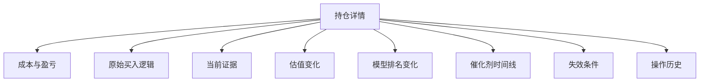

### 8.3 持仓健康状态

| 状态 | 说明 |
|---|---|
| HEALTHY | 逻辑与风险均正常 |
| WATCH | 某项指标恶化，尚未失效 |
| RISK | 接近失效条件 |
| INVALIDATED | 投资逻辑已失效 |
| DATA_MISSING | 关键数据缺失 |
| EVENT_PENDING | 等待关键公告或财报 |

### 8.4 持仓录入方式

- 手工录入；
- CSV/Excel 导入；
- 券商导出文件适配插件；
- 后续可选只读券商连接器；
- 不默认保存券商密码。

---

## 9. RAG 证据产品体验

### 9.1 每个结论必须可展开

```text
结论：公司经营现金流质量改善。

事实证据：
1. 2025 年年度报告第 86 页：经营现金流同比增长 32%。
2. 2026 年一季度报告第 18 页：现金流/净利润由 0.71 提升至 0.93。

系统推断：
现金转换能力正在恢复，但仍需验证应收账款是否同步下降。

置信度：0.82
```

### 9.2 证据等级

| 等级 | 来源 |
|---|---|
| L1 | 交易所公告、监管文件、定期报告 |
| L2 | 公司 IR、业绩说明会、管理层正式指引 |
| L3 | 行业价格、销量、库存、招投标等硬数据 |
| L4 | 权威媒体、专业研究 |
| L5 | 社交媒体和未经验证信息 |

L5 不能直接改变研究/持仓状态，只能触发调查。

### 9.3 引用定位字段

RAG 引用不能只依赖页码，因为数据来源可能是 PDF、HTML、表格、WebSearch 结果或用户上传文件。每条证据至少记录：

```json
{
  "evidence_id": "ev_001",
  "document_id": "doc_001",
  "source_type": "filing_pdf | web_page | table | api_record | user_file",
  "source_url": "https://...",
  "source_level": "L1",
  "content_hash": "sha256:...",
  "published_at": "2026-06-17T18:30:00+08:00",
  "available_at": "2026-06-18T09:30:00+08:00",
  "retrieved_at": "2026-06-18T20:10:00+08:00",
  "page": 86,
  "section": "经营现金流",
  "paragraph_index": 12,
  "table_id": "cash_flow_table",
  "row_id": "net_operating_cash_flow",
  "quote_span": [120, 188]
}
```

要求：

- PDF 优先记录页码、章节和字符范围；
- HTML 优先记录 URL、标题、段落序号和正文哈希；
- 表格优先记录表格 ID、行列定位和原始文件哈希；
- WebSearch 结果必须落到可访问原文或快照，不能只引用搜索摘要；
- 所有引用必须满足 `available_at <= decision_at`。

---

## 10. 提醒与通知

### 10.1 提醒类型

- 数据异常；
- 新公告；
- 重大负面事件；
- 价格触及失效阈值；
- 模型排名明显变化；
- 行业暴露超限；
- 估值达到目标区间；
- 策略运行失败；
- 关键事件即将发生。

### 10.2 提醒优先级

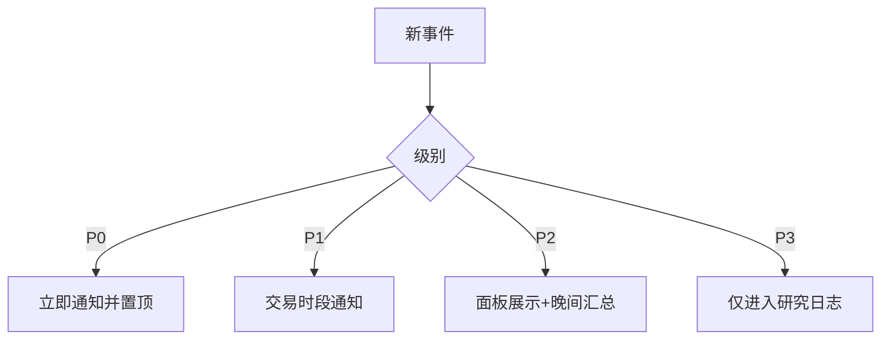

---

## 11. 开源与插件生态

### 11.1 用户可扩展内容

- 数据连接器；
- 新闻连接器；
- Embedding 模型；
- 向量数据库；
- LLM Provider；
- MCP Server；
- Agent 工作流；
- 量化模型；
- 估值模板；
- 研究信号策略；
- 通知渠道；
- 券商文件解析器。

### 11.2 插件市场的长期方向

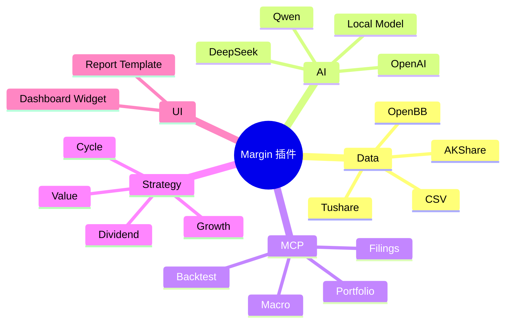

---

## 12. 产品指标

### 12.1 系统指标

- 每日晚间任务成功率；
- 数据完整度；
- 新闻去重率；
- 文档解析成功率；
- RAG 引用正确率；
- 无证据关键结论率；
- 研究信号生成时长；
- 提醒延迟。

### 12.2 研究质量指标

- 研究信号生成后 20/60/120 日表现；
- 相对基准收益；
- 最大回撤；
- 交易成本后收益；
- 价值陷阱风险评分有效性；
- 事件窗口命中校准误差；
- AI 过滤前后样本质量差异；
- 不同策略版本表现。

### 12.3 用户行为指标

- 无计划交易占比；
- 用户查看证据比例；
- 自定义策略使用率；
- 研究信号与实际执行差异；
- 触发失效条件后处理时长。

---

## 13. MVP 范围与模块化实施路径

### 13.1 MVP 必须打通的完整闭环

Margin v0.1 的 MVP 不是功能很少的 Demo，而是最小可用投资研究闭环。必须包含：

- 沪深 300 / 用户自选股；
- AKShare 与 Tushare 两个 A 股数据 Provider；
- 行情、基础财务、指数成分与公司行动；
- 公告获取与本地快照；
- 可配置 WebSearch Provider，用于新闻和网页信息发现；
- PostgreSQL + 本地文件存储；
- pgvector 或 Qdrant；
- 一个 OpenAI-compatible LLM Provider；
- RAG 证据引用与引用定位；
- 一个默认策略模板；
- 自定义 Prompt；
- 研究候选面板；
- 当前持仓面板；
- 手工/CSV 交易导入；
- 晚间自动 Agent 抓取与研究流程；
- 基础盘中提醒；
- Docker Compose 一键启动。

### 13.2 按功能模块打通

MVP 可以按模块逐步交付，每个模块独立验收：

1. **数据 Provider 模块**：AKShare/Tushare 接入、字段标准化、时点字段、数据质量检查；
2. **持仓模块**：手工/CSV 导入、成本计算、仓位与组合暴露；
3. **公告与 WebSearch 模块**：公告快照、网页发现、来源合规、去重和原文定位；
4. **文本索引模块**：解析、分块、Embedding、关键词索引、混合召回；
5. **RAG 证据模块**：证据等级、引用定位、Claim 校验、冲突识别；
6. **多 Agent 研究流程模块**：WebSearch Agent、文本汇总 Agent、估值工具 Agent、Reflect/反方审查 Agent、Citation Validator；
7. **策略配置模块**：策略模板、自定义 Prompt、状态阈值、版本管理；
8. **研究候选面板模块**：候选卡片、证据展开、风险复核、拒绝原因；
9. **持仓监控模块**：投资逻辑状态、提醒、复盘记录；
10. **部署与审计模块**：Docker Compose、日志、审计快照、错误降级。

### 13.3 后置功能

- RD-Agent 挑战者；
- 多模型协同优化；
- 全 A 股；
- 自动券商同步；
- 生存分析或严格概率模型；
- 多用户 SaaS；
- 复杂知识图谱；
- 自动下单；
- 港美股。

---

## 14. 版本路线图

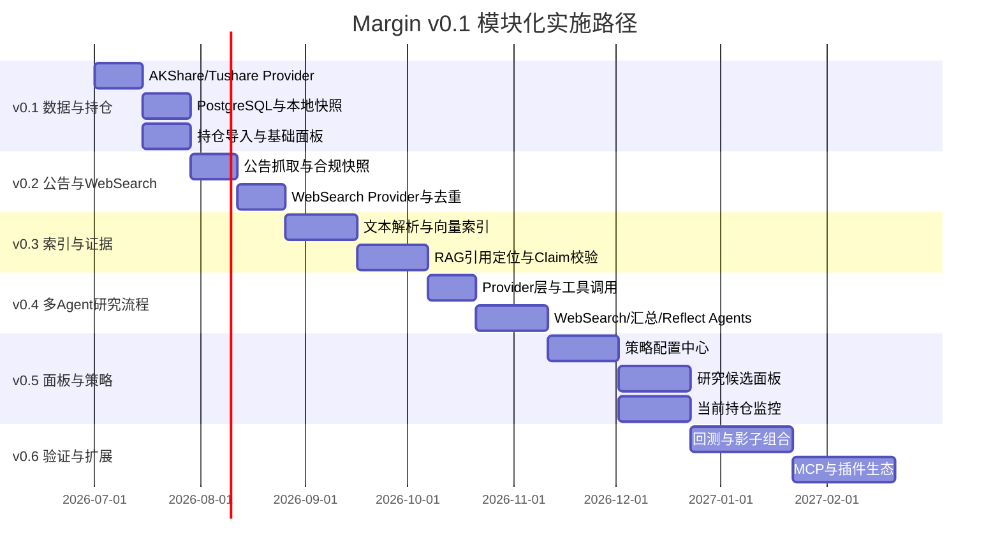

---

## 15. 产品验收标准

系统通过 MVP 验收，必须满足：

1. 用户可在本地完成一键部署；
2. 可配置至少一个 AKShare/Tushare 数据源、一个 WebSearch/新闻源和一个 LLM；
3. 可运行完整晚间工作流；
4. 研究结论包含证据引用；
5. 用户可创建和版本化自定义策略；
6. 用户可在研究候选面板查看候选与拒绝判断；
7. 用户可在持仓面板查看盈亏、风险和投资逻辑状态；
8. 数据异常时停止高置信研究信号输出；
9. 所有研究信号保留不可变审计记录；
10. 系统默认不执行真实交易。

---

## 16. 总结

Margin v0.1 的产品核心不是“大模型替用户炒股”，而是：

> **以结构化数据为基础，以新闻和文档为证据，以 AI 编排为研究工具，以用户策略为决策约束，以研究候选面板和持仓面板承载完整投资工作流。**

八层结构分别解决：

1. 数据层：获得可计算事实；
2. 数据存储层：保证时点正确与可追溯；
3. 新闻获取层：持续获取非结构化信息；
4. 文本向量数据库：支持高质量检索；
5. AI 层：完成证据研究、工具调用和 Agent 编排；
6. 策略配置层：让用户决定“什么是适合自己的投资逻辑”；
7. 研究候选面板：输出候选、证据、风险和条件；
8. 当前持仓面板：持续验证投资逻辑并管理风险。

最终产品定位：

> **Local-first, evidence-driven, strategy-configurable open-source investment research OS.**
