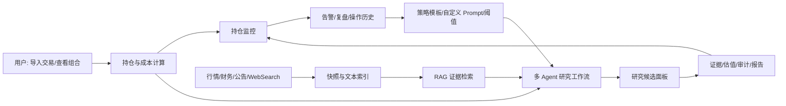
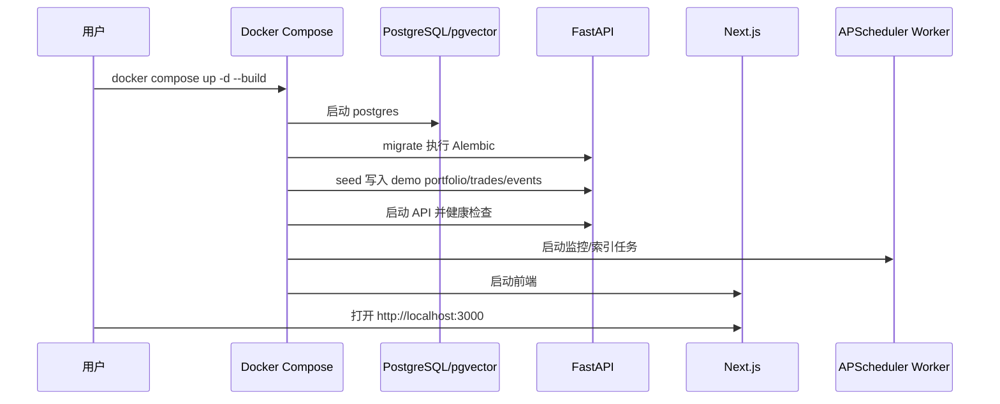
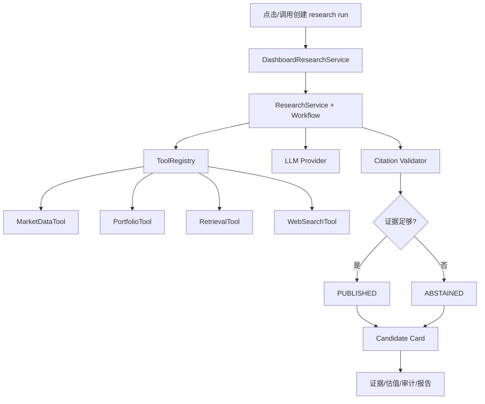

# Margin（安全边际）开源投资研究系统｜产品设计文档 v0.1

> 文档类型：产品设计文档
> 产品版本：v0.1
> 文档版本：v0.1
> 状态：active
> 当前实现：10 个 v0.1 模块已打通，支持本地 Docker Compose 全栈运行
> 产品定位：本地优先、证据驱动、策略可配置、用户保留最终决策权的个人投资研究系统
> 合规声明：本系统只提供研究辅助，不构成投资建议，不承诺收益，不自动下单。

---

## 1. 产品摘要

Margin 的目标不是替用户“预测明天涨跌”，而是把个人投资研究中最容易失控的部分结构化：

- 数据来源分散；
- 公告、新闻、财报难以长期追溯；
- AI 结论容易脱离原文；
- 策略和 Prompt 难以版本化；
- 持仓后的投资逻辑缺少持续复核；
- 事后很难知道一次判断到底基于什么证据。

v0.1 已经形成一条可运行的研究闭环：

1. 用户通过 demo seed、手工交易或 CSV 导入形成组合与持仓；
2. 系统接入 AKShare/Tushare、公告事件、WebSearch、Embedding、LLM 等 Provider；
3. 公告与网页材料以快照、事件、outbox 和索引任务进入文本管线；
4. 文本被解析、分块、向量化，并通过混合检索供 RAG 使用；
5. 研究工作流通过内部工具注册、工具权限和多 Agent 节点生成结构化研究结果；
6. 候选面板展示研究 run、candidate card、证据、估值、审计、报告和导出；
7. 持仓监控根据价格、证据、事件和策略失效条件生成 P0-P3 告警；
8. 所有关键产物进入 PostgreSQL 和 append-only audit，便于复盘。



## 2. 产品原则

| 原则 | v0.1 设计要求 | 当前实现 |
| --- | --- | --- |
| 本地优先 | 用户数据、策略、审计、快照默认保存在本地 | Docker Compose + PostgreSQL volume + 本地 audit/snapshot volume |
| 证据优先 | 研究结论必须绑定来源、时间、证据等级或降级原因 | EvidenceView、ResearchSnapshot、AuditView、ABSTAINED |
| 用户决策 | 系统不替用户下单，只提供研究、告警和复盘 | 无券商接口、无自动交易能力 |
| 策略可配置 | 策略模板、Prompt、阈值、版本可追踪 | `strategy_profiles` / `strategy_versions` |
| 降级保守 | 数据缺失或 Provider 失败时不输出高置信信号 | DATA_MISSING alert、ABSTAINED candidate |
| 可审计 | 运行、工具、研究、反馈、告警均有审计链路 | audit_records、research_snapshots、dashboard_*、alert_events |

## 3. 目标用户

### 3.1 核心用户

- 自主研究、手动交易的个人投资者；
- 关注 A 股、价值/质量/催化剂/风险复核；
- 愿意本地部署或使用 Docker Compose；
- 希望 AI 研究输出能回到证据，而不是只看聊天式总结；
- 希望持仓后持续监控“买入逻辑是否仍成立”。

### 3.2 开发者用户

- 希望扩展数据 Provider、Embedding、Rerank 或 WebSearch；
- 希望新增策略模板、估值视图或监控规则；
- 希望所有新增能力能通过 spec/plan、测试和审计追溯。

### 3.3 非目标用户

v0.1 不面向高频交易、自动下单、融资融券、券商账户托管、投顾业务或多租户 SaaS。

## 4. 产品边界

### 4.1 v0.1 包含

- 组合与持仓：demo seed、交易记录、CSV 导入、成本/仓位/组合概览；
- 数据 Provider：AKShare、Tushare 协议、WebSearch、LLM、Embedding、Rerank 可选；
- 文档处理：公告事件、原始快照、outbox、解析、分块、Embedding、检索；
- RAG 证据：claim/evidence、来源等级、locator、冲突校验、引用失败原因；
- 多 Agent 研究：Universe、WebSearch、Summary、Reflect、Citation Validator；
- 策略配置：模板、自定义策略、Prompt 合成、版本生命周期；
- 候选面板：research run、candidate card、证据展开、估值、反方理由、审计、报告、导出；
- 持仓监控：P0-P3 alert、复盘记录、操作历史、行为指标；
- 部署审计：Docker Compose、migrate、seed、worker、Prometheus、Grafana、健康检查。

### 4.2 v0.1 不包含

- MCP Server / MCP Gateway；
- 用户自定义 HTTP 工具或任意第三方工具运行时；
- 自动买卖、券商 API 下单、券商密码保存；
- 多租户权限、团队协作、云端账号体系；
- 大规模历史行情 Parquet/DuckDB 分析层的完整生产化；
- 付费研报全文分发或绕过网站访问控制。

工具扩展统一采用内部 `ToolRegistry`、固定权限等级、类型化 Provider Adapter 和审计记录。

## 5. 用户主流程

### 5.1 本地启动流程



### 5.2 研究候选流程

1. 用户进入研究面板；
2. 发起 research run，传入策略版本、组合和候选股票；
3. 系统收集市场数据、持仓约束、检索证据和 WebSearch 结果；
4. 多 Agent 工作流生成结构化结论；
5. Citation Validator 判断证据是否足够；
6. 结果进入 `dashboard_runs`、`dashboard_items` 和 `research_snapshots`；
7. 前端展示候选卡、估值区间、反方理由、证据、报告和导出。



### 5.3 持仓监控流程

1. Worker 周期性读取当前持仓；
2. 从 AKShare 获取最新价格，失败时写入数据缺失告警而不是中断；
3. 按确定性规则检查价格、证据、排名变化、行业暴露、事件窗口和策略失败；
4. 生成 P0-P3 alert；
5. 用户在持仓详情页查看告警、操作历史和复盘记录；
6. 用户记录处理结果，系统计算行为指标。

## 6. 页面与信息架构

当前前端使用 Next.js App Router，页面已覆盖研究和持仓核心路径。

```mermaid
flowchart TB
    Home[/ / 首页摘要] --> Portfolio[/portfolios/demo 组合工作台]
    Portfolio --> Position[/positions/:positionId 持仓详情]
    Home --> Research[/research 研究候选面板]
    Research --> ResearchItem[/research/items/:itemId 研究项详情]
    Research --> ResearchRun[/research/runs/:runId 研究运行详情]

    Position --> Alerts[告警/复盘/操作历史]
    ResearchItem --> Evidence[证据展开]
    ResearchItem --> Valuation[估值视图]
    ResearchItem --> Audit[审计视图]
    ResearchItem --> Report[报告与导出]
```

### 6.1 首页

首页承担入口职责：

- 展示系统定位；
- 引导用户进入 demo 组合；
- 引导用户进入研究候选面板；
- 对开源用户解释 v0.1 能力边界。

### 6.2 组合工作台

组合页展示：

- 组合名称、现金、总资产、市值、累计盈亏；
- 当前持仓表；
- 持仓代码可点击进入持仓详情；
- 行业/风格暴露；
- 即将发生事件；
- 风险摘要。

### 6.3 持仓详情页

持仓详情展示：

- 代码、数量、成本、市值、盈亏；
- 买入逻辑/投资 thesis；
- 监控告警；
- 操作历史；
- 行为指标。

### 6.4 研究候选面板

研究面板展示：

- 最新 research run；
- candidate card；
- 研究状态：`published`、`abstained`、`invalidated` 等；
- 置信度、估值区间、价值陷阱风险；
- 证据数量和来源分布；
- 最强反方理由；
- 策略版本和免责声明。

### 6.5 研究项详情页

研究项详情展示：

- 研究结论；
- 估值视图；
- 证据展开；
- claim 与 evidence；
- 来源定位；
- 审计元数据；
- 研究报告；
- JSON/Markdown 导出。

## 7. 策略配置产品设计

策略配置不只是 Prompt 文本，而是一个版本化对象。

| 能力 | 产品含义 | 当前实现 |
| --- | --- | --- |
| 策略模板 | 给新用户提供默认策略起点 | `GET /strategies/templates` |
| 自定义策略 | 高级用户配置策略 JSON | `POST /strategies/custom` |
| 版本管理 | 每次修改生成新版本 | `strategy_versions` |
| 生命周期 | validate → backtest → paper-trade → activate | strategy route + service |
| Prompt 合成 | 把策略和任务生成实际 LLM prompt | `GET /strategies/{id}/versions/{vid}/prompt` |

v0.1 的策略页面尚未完全产品化为前端配置中心，但后端能力已可供后续 UI 接入。

## 8. 证据与研究输出设计

### 8.1 Candidate Card 字段

| 字段 | 用户意义 |
| --- | --- |
| `symbol` | 研究对象 |
| `research_status` | 是否发布、拒绝、失效或降级 |
| `statement` | 简明研究结论 |
| `confidence` | 结论置信度，不等于收益概率 |
| `valuation_range` | 估值区间 |
| `value_trap_score` | 价值陷阱风险 |
| `counter_arguments` | 最强反方理由 |
| `evidence_summary` | 证据数量与来源等级 |
| `disclaimer` | 合规提示 |

### 8.2 证据不足时的产品表达

当行情 Provider、WebSearch、Embedding、LLM 或 Citation Validator 不满足要求：

- 不隐藏失败；
- 不补造结论；
- 在候选卡中显示 `ABSTAINED`；
- 在持仓监控中显示 `DATA_MISSING` 或相应 alert；
- 在审计记录中保留失败原因和 trace。

## 9. 通知与告警设计

v0.1 的通知是本地结构化 alert，不接短信、邮件或 IM。

| 优先级 | 语义 | 示例 |
| --- | --- | --- |
| P0 | 必须立即复核 | 核心投资逻辑失效、重大负面事件 |
| P1 | 高优先级 | 价格/证据/风险多条件触发 |
| P2 | 中优先级 | 事件窗口接近、风险暴露上升 |
| P3 | 低优先级 | 信息更新、观察条件变化 |

告警进入 `alert_events`，复盘进入 `position_reviews`，页面统一展示为操作历史。

## 10. 开源版本体验

开源用户应该能在没有商业数据授权的情况下体验主流程：

1. clone 仓库；
2. 配置 `.env`；
3. `docker compose up -d --build`；
4. 打开前端；
5. 查看 demo 组合；
6. 发起或查看研究 run；
7. 查看持仓监控和研究详情；
8. 通过测试确认本地环境没有破坏核心逻辑。

如果没有 Tavily/Tushare/Rerank，系统应保守降级，不影响 demo 主流程。

## 11. 产品验收标准

| 编号 | 验收项 | 当前验证方式 |
| --- | --- | --- |
| P-01 | 前端可打开组合页、持仓详情、研究页、研究详情 | Browser E2E |
| P-02 | 组合页能展示 demo 组合和 4 个持仓 | `/api/v1/portfolios/demo` + 前端 |
| P-03 | 持仓行可进入详情页 | 前端测试 + Browser click |
| P-04 | 能创建 research run 并返回 candidate card | `POST /api/v1/research-runs` |
| P-05 | 数据不足时 research status 为 `abstained` | 真实 run 降级路径 |
| P-06 | DeepSeek LLM 可接入 | Provider smoke + research run |
| P-07 | 智谱 Embedding 可接入 | Provider smoke 2048 dims |
| P-08 | Worker 可周期执行监控和索引任务 | Docker logs |
| P-09 | 健康检查、指标、Grafana 可用 | `/health`, `/metrics`, Grafana |
| P-10 | 文档、spec、plan 与实现状态一致 | `status: active` + 本设计文档 |

## 12. 当前限制与后续版本

### 12.1 当前限制

- WebSearch 需要用户自行提供 Tavily key；
- Tushare 需要用户自行提供 token；
- 真实行情源可能因网络、上游接口或频控不可达；
- 策略配置已有 API，但前端配置中心仍属于后续增强；
- Rerank 是可选 Provider；
- 大规模历史回测和 Parquet/DuckDB 分析层仍未作为 v0.1 生产主链路。

### 12.2 v0.2 候选方向

- 多 LLM Provider 配置 UI；
- 模型路由和自动模型选择；
- 策略配置前端；
- 更完整的 WebSearch/source 管理；
- 更强的文档导入和重索引控制；
- 更细的 Provider 成本、延迟、质量观测。

v0.2 应新建 `docs/design/v0.2`、`docs/spec/v0.2` 和 `docs/plan/v0.2`，不得回写 v0.1 的已审计边界。

## 13. 总结

Margin v0.1 已经从“研究系统蓝图”进入“可运行的本地研究闭环”。当前产品核心价值不是给出强预测，而是在数据、证据、AI、策略、持仓和复盘之间建立可追溯关系。

产品默认保守：宁可拒绝高置信输出，也不在证据不足时编造确定性。这是 Margin 与普通聊天式投研工具的核心差异。
