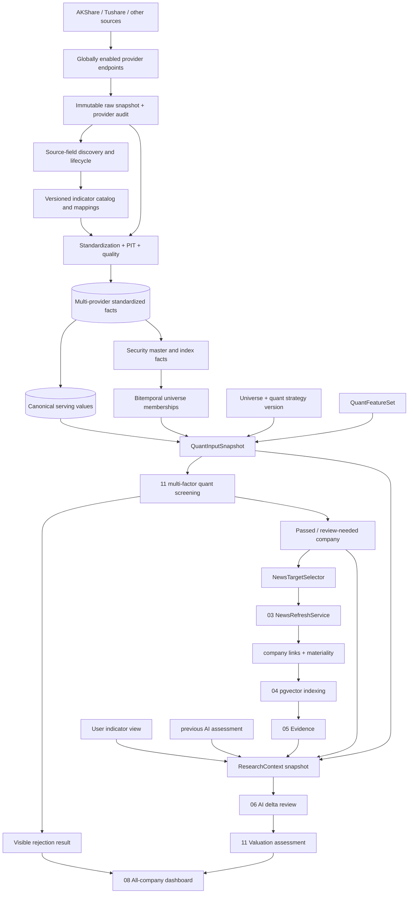
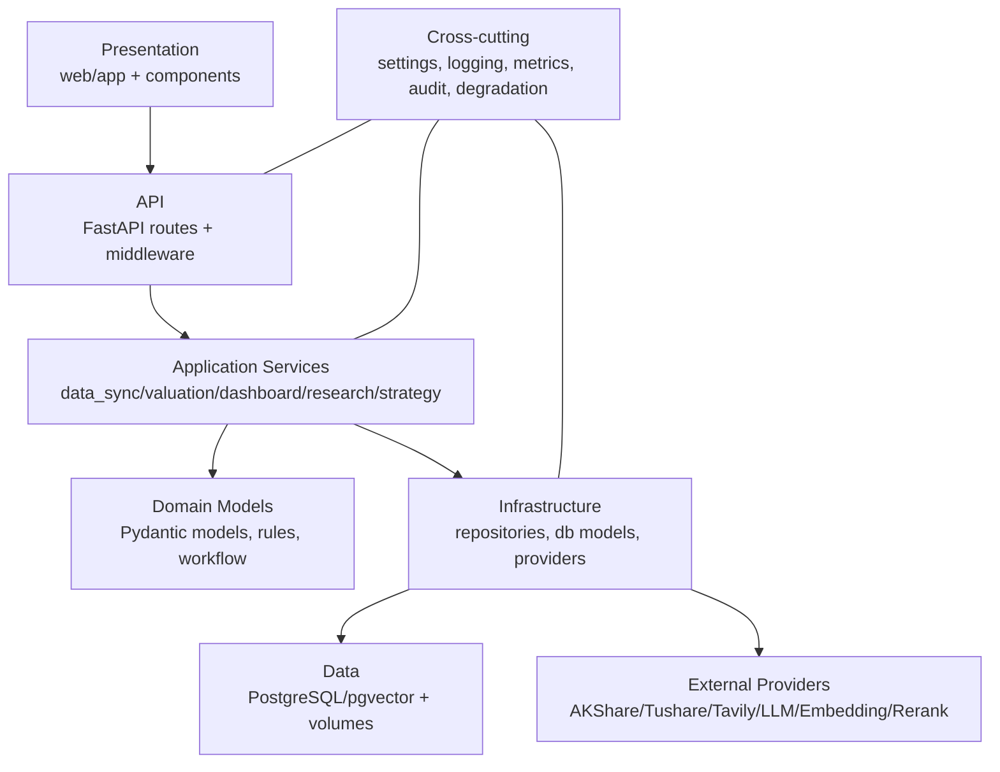
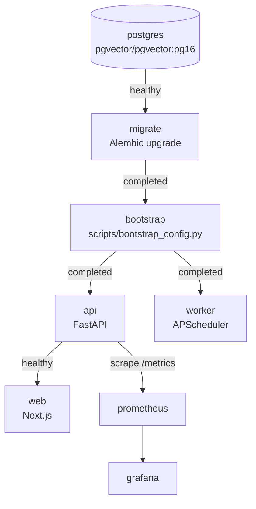
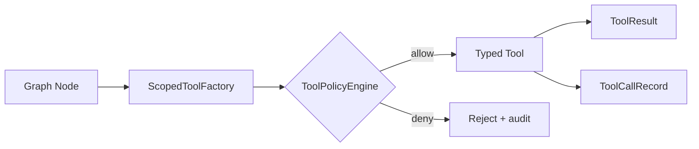
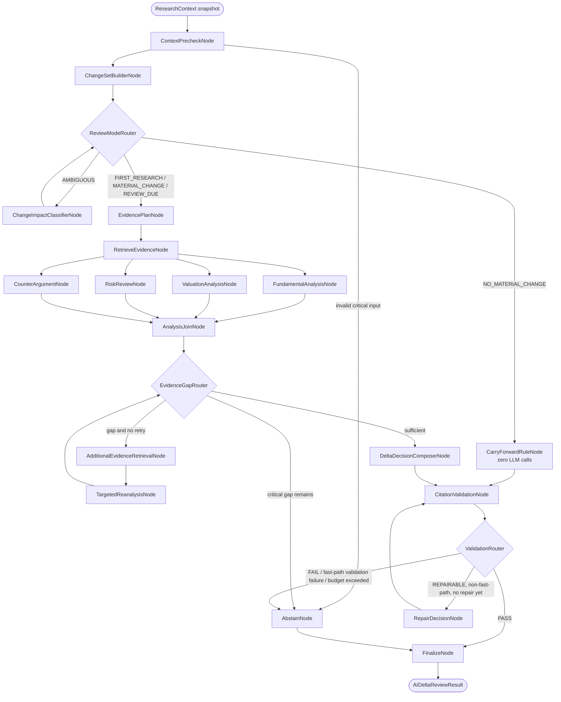
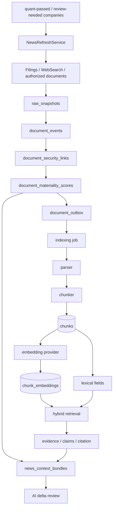
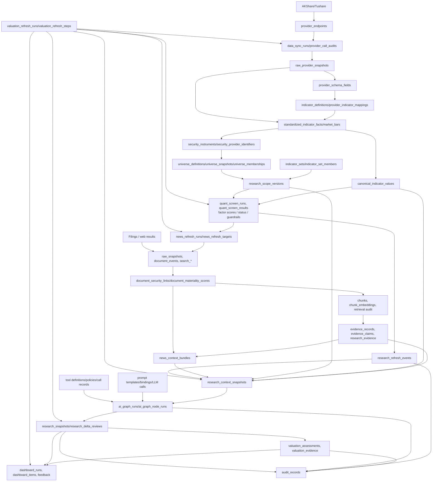

# Margin Open Investment Research System | Architecture Design v0.2

> Document type: System Architecture Design
> Product version: v0.2
> Document version: v0.2
> Status: active
> Architecture style: modular monolith, local Docker Compose, persistent worker, typed provider/tool boundaries
> Current stack: FastAPI, Next.js, PostgreSQL/pgvector, APScheduler, Prometheus, Grafana, OpenAI-compatible LLM/Embedding
> Boundary: the current codebase implements the v0.2 valuation-discovery path. It does not implement MCP Server, MCP Gateway, arbitrary custom HTTP tools, broker order execution, holdings analysis, or holdings monitoring.

---

## 0. v0.2 Architecture Increment

v0.2 adds module `11-valuation_discovery` to the existing modular monolith. It owns universe snapshots, multi-factor quant screening, industry-aware valuation models, intrinsic-value assessments, confidence calibration, and research-refresh events. Existing modules remain responsible for providers, filings, vector indexing, evidence, AI workflows, strategy versions, dashboards, and runtime scheduling. Portfolio, holdings, and holdings-monitoring implementations are removed; module IDs remain only for historical audit.



Key components:

- `ProviderEndpointRegistry` for global endpoint capabilities, backfill, revision lookback, and rate limits;
- `DataSyncRunService` for full-coverage, time-incremental acquisition across every enabled endpoint;
- `RawSnapshotStore` for compressed immutable JSON/Parquet payloads with PostgreSQL metadata;
- `ProviderSchemaDiscoveryService` for new, missing, deprecated, and type-changed source fields;
- `IndicatorCatalogService` and `ProviderIndicatorMappingService`;
- `CanonicalDataResolver`, which retains all provider facts and selects a traceable serving value;
- `DataFreshnessService`;
- `StartupSyncCoordinator`;
- `ManualDataSyncService`;
- `ValuationDiscoveryOrchestrator` as the DB-backed backend business workflow state machine for data sync, quant, NewsRefresh, indexing, AI delta review, publishing, and dashboard refresh;
- `WorkflowRunRepository` for `valuation_refresh_runs`, `valuation_refresh_steps`, idempotency keys, state transitions, retry scheduling, and `FOR UPDATE SKIP LOCKED` task claiming;
- `SecurityMasterService`;
- `UniverseMembershipService` for CSI 300, CSI 500, All-A, and future rule-based universes;
- `IndustryMembershipService` for bitemporal taxonomy membership and benchmark mapping;
- `CorporateActionService` for PIT-safe dividends, splits, rights, and as-of adjusted prices;
- `IndicatorSetService` for `ALL`, `INCLUDE`, and `EXCLUDE` user views;
- `QuantFeatureSetService` for strategy-required and optional indicators that user views cannot remove;
- `ResearchScopeResolver`;
- `QuantInputSnapshotBuilder`;
- `StandardDataWarehouseRepository`;
- `IndustryValuationModelRegistry`;
- `QuantGateEngine`, implemented as the `src/margin/valuation_discovery/quant/` facade for data adaptation, hard filters, factor calculation, normalization, scoring, status classification, and candidate selection;
- `QuantDataAdapter`, which reads only `StandardDataWarehouseRepository`, scope-resolved universes, market bars, and canonical PIT records; it never calls AKShare/Tushare providers or raw snapshots directly;
- `UniverseResolver`, `HardFilterEngine`, `FactorNormalizer`, `FactorScorer`, `QuantStatusClassifier`, `MultiFactorSelector`, and `QuantResultRepository`;
- factor calculators: `QualityFactorCalculator`, `ValueFactorCalculator`, `GrowthFactorCalculator`, `MomentumFactorCalculator`, and `RiskFactorCalculator`;
- `ResearchRefreshPolicy`;
- `NewsTargetSelector`;
- `NewsRefreshQueue` for complete target persistence, priority batches, backpressure, and retries;
- `OfficialFilingSyncService` for global cursor-based filing acquisition independent of quant targets;
- `NewsRefreshService`;
- `DocumentMaterialityService`;
- `NewsIndexingPipeline`;
- `NewsContextBundleBuilder`;
- `ResearchContextBuilder`;
- `EffectiveAssessmentResolver` separating current review outcome from the last valid assessment;
- `AIDeltaReviewGraph` as a controlled LangGraph internal graph with a zero-LLM carry-forward fast path, bounded evidence retrieval, parallel analyses, one evidence retry, one citation repair, and a delta decision;
- `ChangeSetBuilder` for deterministic comparison of the previous assessment with current quant, news, valuation inputs, and assumption state;
- `NodeExecutionRunner` for prompt construction, node-scoped tool binding, bounded tool loops, structured validation, reflection, and at most one revision;
- `ScopedToolFactory` for building a permission-scoped tool session and model-visible tool manifest from node, frozen context, policy version, and budget;
- `PromptFactory` for versioned system guardrails, node tasks, user style, context digest, tool manifest, output schema, reflection, and revision prompts;
- `NodeReflectionPolicy` for evidence, logic, PIT, calculation, contradiction, completeness, and overclaim review;
- `LLMExecutionService` between LangGraph and concrete providers for routing, structured output, tool-call protocol, idempotency, budget, retry, and audit;
- `AIGraphCheckpointRepository` for PostgreSQL checkpoints plus `ai_graph_runs` and `ai_graph_node_runs` audit records;
- `DeltaReviewService`;
- `IntrinsicValueService`;
- `ConfidenceCalibrationService`;
- append-only valuation and refresh-event repositories.
- `ProviderSecretService` for write-only frontend secret configuration, local encryption, rotation, masking, health checks, and audit.

Core persistence additionally includes bitemporal `industry_taxonomies` / `security_industry_memberships`, PIT `corporate_actions` / `adjusted_price_series`, `quant_feature_sets` and versions/members, immutable `quant_input_snapshots` with normalized links, `chunk_security_links`, `news_context_evidence`, encrypted/versioned provider-secret metadata, and transactional outbox records. These sit alongside provider, warehouse, universe, quant, news, evidence, graph, prompt/tool audit, delta-review, and valuation entities.

Acquisition is independent of user scopes. Every enabled endpoint synchronizes its full supported security coverage and returned fields. User indicator views affect dashboard/AI presentation only. Quant uses a strategy-bound feature set and immutable `QuantInputSnapshot`.

Capacity design uses date/month partitioning for market/fact/audit tables, zstd content-addressed raw snapshots, reference-aware permanent/standard/temporary retention classes, resumable endpoint/domain backfill shards, autovacuum/index-bloat monitoring, orphan-object reconciliation, and server-side pagination/streaming export for All-A views.

Startup sync is always non-blocking for API/Web. If providers fail, the system starts with the latest valid snapshot, marks the relevant domain stale/degraded, and exposes a manual sync/retry path in the frontend. Expected as-of is domain-specific: market data follows the trading calendar and provider availability time, filings/news follow cursors or natural-day freshness, and fundamentals follow disclosure `available_at`.

Data consumption constraints:

- provider adapters collect external data but do not produce quant scores, valuation conclusions, or prompts;
- user universe and indicator-set selections never reduce warehouse acquisition coverage;
- quant gates read only immutable `QuantInputSnapshot` references, including historical industry membership and as-of corporate-action adjustments;
- News/WebSearch is not an unbounded web crawl; after quant completes, `NewsRefreshService` receives target companies, searches and fetches related news, stores snapshots, links securities, scores materiality, and indexes eligible documents;
- AI research receives `ResearchContext`, previous AI assessment, RAG evidence, and audited tool results; it does not directly fetch external market/fundamental data and does not run live WebSearch during reasoning;
- `QuantInputSnapshot` binds scope, sync run, universe, quant feature set, industry/corporate-action versions, canonical fact IDs, PIT/quality state, and input hash;
- post-quant `ResearchContext` binds quant input/result, news bundle, previous effective assessment, user view, evidence IDs, and input hash;
- missing or low-quality required data results in `DATA_INSUFFICIENT` or `ABSTAINED`, not an AI-filled guess.

Multi-factor quant screening lives under `src/margin/valuation_discovery/quant/`. Phase 1 implements a single-day cross-sectional run with `config.py`, `models.py`, `data_adapter.py`, `universe.py`, `filters.py`, `normalization.py`, `factors/`, `scoring.py`, `selector.py`, `repository.py`, and `service.py`. Backtesting, performance attribution, and report export are Phase 2 and do not block the v0.2 main path.

The quant layer reads data only through `QuantDataAdapter`:

| Adapter method | Source | Constraint |
| --- | --- | --- |
| `load_universe(scope_version_id, trade_date)` | research scope, universe snapshots, memberships | returns every scoped security, not only candidates |
| `load_security_master(security_ids, trade_date)` | security versions | symbol, name, exchange, industry, listing date, ST/suspension flags |
| `load_market_window(security_ids, start_date, end_date)` | `market_bars` | available timestamp, quality state, and adjustment data required |
| `load_financial_snapshots(security_ids, as_of)` | canonical indicator values | must enforce `available_at <= trade_date`; if only announcement date exists, mark `PIT_DEGRADED` |
| `load_valuation_snapshot(security_ids, trade_date)` | canonical valuation indicators | PE/PB/PS/PCF, dividend yield, FCF yield, historical/industry percentiles |
| `load_industry_benchmarks(industries, trade_date)` | industry/index facts | used for industry ranking and relative valuation/momentum |

Hard filters run before factor scoring. They cover ST/suspension, listing age, liquidity, missing critical fundamentals, two-year losses, leverage, goodwill, cash-flow quality, and abnormal audit opinions when available. Thresholds are versioned configuration, and every rejection preserves structured `filter_reasons`, risk flags, missing fields, and degradation reasons. Rejected and insufficient companies are still written to `quant_screen_results` for dashboard visibility.

Default factor groups are Quality 35%, Value 25%, Growth 15%, Momentum 15%, and Risk 10%. Quality uses ROE/ROIC, margins, cash-flow quality, leverage, interest coverage, and FCF stability. Value uses PE/PB/PS/PCF, dividend yield, FCF yield, historical percentiles, and industry percentiles; negative PE is invalid rather than cheap. Growth uses revenue/profit growth, three-year CAGR, margin/ROE trends, and cash-flow growth. Momentum uses 6M ex-1M, 12M ex-1M, relative industry/index returns, moving-average trend, and short-term overheat penalties. `risk_score` is directionally positive: higher means lower risk.

Normalization is fixed as raw factors → 1%/99% winsorization → same-date same-industry percentile rank → direction-aligned 0-100 score → missing-value handling and confidence penalty → group weights → final score. Missing critical fields produce `DATA_INSUFFICIENT`; non-critical gaps may use industry median fills but must be recorded in `missing_fields` and reduce `confidence`.

Thresholds such as 80/70/60 and factor weights are `initial_default`, not product truth. Activation requires a versioned calibration/backtest/stability report; unvalidated strategy versions remain draft.

Quant output is orthogonal: `screening_status=PASS/NEAR_THRESHOLD/WATCHLIST/REJECT`, `data_status=OK/INSUFFICIENT/PIT_DEGRADED`, `risk_flags[]`, `review_required`, and `research_guardrail=RESEARCH_ALLOWED/LIMITED_RESEARCH/RESEARCH_BLOCKED/OVERHEAT_CAUTION/CONFIDENCE_REDUCED/THESIS_RECHECK_REQUIRED`.

`quant_screen_runs` stores `quant_run_id`, optional `refresh_run_id`, `scope_version_id`, `trade_date`, `strategy_version`, `config_hash`, `universe_id`, `universe_snapshot_id`, `status`, `input_hash`, result counters, `pit_status`, and lifecycle timestamps. `quant_screen_results` stores `quant_result_id`, run/security FKs, display fields, final and group scores, status, guardrail, ranks, structured reasons/flags/missing fields, raw and normalized factor JSON, top positive/negative factors, confidence, human-readable reason summary, data version, strategy version, and creation time. `quant_screen_runs(scope_version_id, trade_date, strategy_version, config_hash)` and `quant_screen_results(quant_run_id, security_id)` are unique.

Quant-driven news refresh has a single service boundary:

```text
NewsRefreshService.refresh_for_targets(
  scope_version_id,
  quant_run_id,
  decision_at,
  targets: list[NewsTarget]
) -> NewsRefreshBundle
```

`NewsTargetSelector` persists every company in the daily research target set. There is no fixed top-N. Provider limits use priority batches, persisted remaining work, backoff, and retry. Official filings use a separate global cursor-based pipeline; target-driven NewsRefresh covers general news/WebSearch.

News text enters vector storage only through snapshot → event → parser → content-hash chunks → embeddings. Multi-company chunks use link tables rather than a single security field. The AI decision enum is `CARRY_FORWARD_VERIFIED`, `UPDATE_ASSESSMENT`, `DOWNGRADE_CONFIDENCE`, `INVALIDATE`, `ABSTAIN`, or `REVIEW_DEFERRED`. Verified carry-forward requires complete current news checks; deferred/abstained reviews preserve the previous effective assessment but mark it stale.

Backend orchestration uses three layers:

- APScheduler only triggers runs; it does not own the end-to-end business state machine.
- `ValuationDiscoveryOrchestrator` advances a DB-backed workflow through deterministic backend steps, retry, idempotency, degradation, and dashboard-visible state.
- LangGraph is used only inside `AIDeltaReviewGraph`; it does not orchestrate data sync, NewsRefresh, or dashboard publication.

```mermaid
flowchart TD
    A1[APScheduler scheduled trigger] --> B[create valuation_refresh_run]
    A2[user manual refresh] --> B
    A3[startup freshness stale] --> B

    B --> C[ValuationDiscoveryOrchestrator<br/>claim PENDING run + DB lock]
    C --> D[DATA_FRESHNESS_CHECK]
    D -->|fresh| E1[skip DATA_SYNC]
    D -->|stale| E2[DATA_SYNC<br/>full-coverage incremental sync]
    D -->|no usable data| FAIL_DATA[FAILED_FINAL<br/>DATA_INSUFFICIENT]

    E2 --> F[raw snapshot + provider audit]
    F --> G[schema discovery]
    G --> H[standardized facts<br/>PIT + quality]
    H --> I[canonical values]
    E1 --> I

    I --> J[SCOPE_RESOLVE]
    J --> K[QUANT_RUN]
    K --> K2[quant_screen_results]
    K2 -->|rejected / insufficient| DASH_REJECT[dashboard reason<br/>no AI]
    K2 -->|passed / near threshold / changed / due / watch| L[NEWS_TARGET_SELECTION]

    L --> M[news_refresh_targets]
    M --> N[NEWS_REFRESH<br/>NewsRefreshService]
    N --> O[raw_snapshots]
    O --> P[document_events]
    P --> Q[document_security_links]
    Q --> R[document_materiality_scores]
    N -->|news failure| NEWS_DEGRADED[NEWS_DEGRADED / NEWS_SYNC_FAILED]

    R --> S[NEWS_INDEXING]
    S --> T[parse + chunk<br/>content-hash idempotent]
    T --> U[chunks]
    U --> V[chunk_embeddings]
    V --> W[news_context_bundles]
    R -->|low materiality| LOW[index only<br/>not primary context]

    W --> X[RESEARCH_CONTEXT_BUILD]
    I --> X
    K2 --> X
    Y[previous AI assessment] --> X
    X --> Z[research_context_snapshots]

    Z --> AI0[AI_DELTA_REVIEW<br/>LangGraph Research Graph]
    subgraph AI_GRAPH[AI internal graph]
        AI1[ContextPrecheckNode<br/>validate frozen context]
        AI2[ChangeSetBuilderNode<br/>deterministic diff]
        AI3{ReviewModeRouter}
        AI4[ChangeImpactClassifierNode<br/>LLM only for ambiguity]
        AI5[CarryForwardRuleNode<br/>no LLM]
        AI6[EvidencePlanNode]
        AI7[RetrieveEvidenceNode<br/>stored RAG/snapshots only]
        AI8A[FundamentalAnalysisNode]
        AI8B[ValuationAnalysisNode]
        AI8C[RiskReviewNode]
        AI8D[CounterArgumentNode]
        AI9[AnalysisJoinNode]
        AI10{EvidenceGapRouter}
        AI11[AdditionalEvidenceRetrievalNode<br/>maximum once]
        AI12[TargetedReanalysisNode]
        AI13[DeltaDecisionComposerNode]
        AI14[CitationValidationNode<br/>deterministic]
        AI15{ValidationRouter}
        AI16[RepairDecisionNode<br/>maximum once]
        AI17[FinalizeNode]
        AI18[AbstainNode]
        AI1 --> AI2
        AI2 --> AI3
        AI3 -->|NO_MATERIAL_CHANGE| AI5
        AI3 -->|AMBIGUOUS| AI4
        AI4 --> AI3
        AI3 -->|FIRST_RESEARCH / MATERIAL_CHANGE / REVIEW_DUE| AI6
        AI3 -->|CONTEXT_INVALID| AI18
        AI6 --> AI7
        AI7 --> AI8A
        AI7 --> AI8B
        AI7 --> AI8C
        AI7 --> AI8D
        AI8A --> AI9
        AI8B --> AI9
        AI8C --> AI9
        AI8D --> AI9
        AI9 --> AI10
        AI10 -->|gap and retrieval_attempt=0| AI11
        AI11 --> AI12
        AI12 --> AI10
        AI10 -->|sufficient| AI13
        AI10 -->|critical gap remains| AI18
        AI5 --> AI14
        AI13 --> AI14
        AI14 --> AI15
        AI15 -->|PASS| AI17
        AI15 -->|REPAIRABLE, non-fast-path, repair_attempt=0| AI16
        AI16 --> AI14
        AI15 -->|FAIL / fast-path validation failure / budget exceeded| AI18
        AI18 --> AI17
    end

    AI0 --> AI1
    AI17 --> AA[research_delta_reviews]
    AA --> AB{delta decision}
    AB -->|CARRY_FORWARD_VERIFIED| AC[current checks completed; keep previous assessment]
    AB -->|UPDATE_ASSESSMENT| AD[update thesis / valuation]
    AB -->|DOWNGRADE_CONFIDENCE| AE[lower confidence]
    AB -->|INVALIDATE| AF[invalidate thesis]
    AB -->|ABSTAIN| AG[refuse high confidence]

    AC --> AI_PUB[VALUATION_PUBLISH]
    AD --> AI_PUB
    AE --> AI_PUB
    AF --> AI_PUB
    AG --> AI_ABSTAIN[publish abstained / degraded result]
    AI_PUB --> AJ[valuation_assessments]
    AI_ABSTAIN --> AJ
    AJ --> AK[DASHBOARD_REFRESH]
    DASH_REJECT --> AK
    NEWS_DEGRADED --> AK
    AK --> AL[dashboard_runs / dashboard_items]
    AL --> AM[research dashboard]
    AM --> AN[Research Board Copilot<br/>read-only explanation / filtering / evidence expansion]
```



`valuation_refresh_runs` records one end-to-end valuation discovery refresh. Required fields: `refresh_run_id`, `scope_version_id`, `trigger_type`, `decision_at`, `status`, `current_step`, unique `idempotency_key`, `input_hash`, `started_at`, `finished_at`, `degradation_reason`, and `created_by`.

`valuation_refresh_steps` records each backend step. Required fields: `step_id`, `refresh_run_id`, `step_name`, `status`, `attempt`, `input_hash`, `output_ref_type`, `output_ref_id`, `started_at`, `finished_at`, `error_code`, `error_message`, and `retry_after`. Step names are `DATA_FRESHNESS_CHECK`, `DATA_SYNC`, `SCOPE_RESOLVE`, `QUANT_RUN`, `NEWS_TARGET_SELECTION`, `NEWS_REFRESH`, `NEWS_INDEXING`, `RESEARCH_CONTEXT_BUILD`, `AI_DELTA_REVIEW`, `VALUATION_PUBLISH`, and `DASHBOARD_REFRESH`. Citation validation is a required internal graph node, not a duplicated outer workflow step.

The orchestrator must claim work with database locking such as `FOR UPDATE SKIP LOCKED`. Every step is idempotent. `QUANT_RUN` failure blocks NewsRefresh and AI. `NEWS_REFRESH` failure keeps quant visible but forces `REVIEW_DEFERRED` or `ABSTAIN`; it cannot create verified carry-forward. The previous effective assessment remains visible with stale freshness.

Module interfaces should remain explicit:

| Boundary | Producer | Consumer | Contract |
| --- | --- | --- | --- |
| provider endpoint | data provider | sync, deployment audit | provider, endpoint, domain, enabled, backfill, revision lookback, rate limit |
| raw provider snapshot | data provider | schema discovery, standardization, audit | endpoint, params hash, storage URI, payload hash, schema fingerprint, fetched time |
| source-field lifecycle | data provider | mapping, settings | endpoint, field, type, first/last seen, missing runs, lifecycle |
| indicator catalog/mapping | data provider | standardization, settings | semantics, unit, lifecycle, replacement, source mapping version |
| data freshness status | data provider | dashboard, deployment audit, startup sync | domain, latest as-of, expected as-of, status, last successful run, last error |
| valuation refresh run | valuation_discovery | dashboard, audit, worker | scope, trigger, decision time, status, current step, idempotency key, degradation reason |
| valuation refresh step | valuation_discovery | dashboard, audit, worker | step name, status, attempt, input hash, output reference, error, retry-after |
| multi-source standardized fact | data provider | canonical resolver | security, indicator, provider, period, PIT fields, raw snapshot, quality, revision |
| canonical value | data provider | quant gate, context builder | selected fact, candidates, resolution status/reason, resolver version |
| universe membership/snapshot | data provider / valuation discovery | quant gate, dashboard | universe, security, valid/system ranges, weight, source snapshot |
| user indicator view / quant feature set / research scope | strategy config | research, dashboard, valuation | universe, view selection, required/optional quant indicators, quant/prompt versions, scope hash |
| QuantInputSnapshot | valuation discovery | quant, context builder, audit | frozen securities, industry/corporate-action versions, PIT facts, feature set, quality, input hash |
| QuantDataAdapter | valuation_discovery | quant calculators and selector | scope-resolved securities, PIT market/fundamental/valuation facts, industry benchmarks, PIT status |
| QuantRunResult | valuation_discovery | filing_websearch, research, dashboard, audit | run, security, factor scores, status, guardrail, filter reasons, risk flags, missing fields, confidence, reason summary |
| news target | valuation_discovery | filing_websearch | scope version, quant run/result, security, trigger reason, decision time, priority |
| news refresh bundle | filing_websearch | context builder, dashboard, audit | run, targets, queries, fetched documents, failed sources, degradation state |
| filing/news event | filing_websearch | indexing, refresh policy | source, event type, importance/materiality, affected securities, snapshot reference |
| evidence | indexing / rag_evidence | AI research, valuation | evidence ID, claim ID, locator, source level, availability timestamp |
| refresh event | valuation_discovery | AI research | symbol, trigger type, reason, priority, dedupe key, strategy version |
| ResearchContext | multi_agent_research / valuation_discovery | research workflow, audit | quant-input reference, scope/view, quant result, previous effective assessment, news bundle, evidence IDs, input hash |
| AI internal graph | multi_agent_research | valuation_discovery, audit | frozen context ref, change set, review mode, bounded tool calls, parallel node outputs, checkpoint, citation validation, delta decision |
| ToolManifest/session | multi_agent_research | LangGraph LLM node | node grants, capabilities, scoped schemas, PIT/budget, tool/policy versions, manifest hash |
| PromptArtifact | multi_agent_research / strategy_config | LLM execution, audit | system/task/style/context/tool/schema layers, draft/reflection/revision type, version, hash |
| node reflection | multi_agent_research | evidence-gap routing, node revision, audit | accept/revise/needs-evidence/abstain, issues, revision instructions, confidence adjustment |
| AI delta review | multi_agent_research | valuation_discovery, dashboard | previous assessment, current quant result, news bundle, decision enum, changed fields, evidence IDs, model version, context snapshot ID |
| valuation snapshot | valuation_discovery | dashboard | intrinsic value range, confidence, watch price, horizon, invalidation conditions |
| strategy version | strategy_config | providers, research, valuation, dashboard | provider refs, universe, gates, style prompt, version |

Company state is append-only, but pipeline state, current review outcome, effective assessment, and assessment freshness are separate fields. The dashboard must not present an abstained/deferred current review as either a new assessment or a verified unchanged conclusion.

Industry valuation models must be selected by company type. Banks, insurers, cyclicals, consumer/manufacturing companies, growth/technology companies, and utilities/high-dividend businesses cannot share a single PE rule. Every model returns a range, key assumptions, sensitivity variables, `model_version`, and a clear unavailable/degraded reason.

Undervaluation confidence is calibrated from deterministic discount metrics, business quality, data completeness, evidence consistency, AI risk review, value-trap risk, and model stability. The LLM may explain risks but may not directly assign the final probability.

## 1. Architecture Goals

The v0.1 baseline is a working local research system; v0.2 adds continuous universe-level valuation discovery.

Goals:

- start the full stack locally with Docker Compose;
- keep user secrets outside Git and outside images;
- make standardized PostgreSQL point-in-time data and `ResearchContext` the only sources consumed by quant and AI;
- persist workflow runs/steps, research runs, news refresh runs, dashboard items, evidence, delta reviews, valuation assessments, and audit records;
- expose provider boundaries for market data, WebSearch, LLM, embedding, and optional rerank;
- allow agents to call only audited internal tools;
- degrade conservatively when external providers fail;
- keep code organized by product modules and cross-cutting infrastructure.

## 2. Overall Architecture

```mermaid
flowchart TB
    Browser[Browser] --> Next[Next.js App Router]
    Next --> API[FastAPI API]
    API --> Routes[dashboard / valuation / strategy / research / provider / health]

    Routes --> DataSync[Data Sync + Warehouse Service]
    Routes --> ManualSync[Manual Data Sync Service]
    Routes --> Valuation[Valuation Discovery Service]
    Valuation --> Orchestrator[ValuationDiscoveryOrchestrator]
    Routes --> Dashboard[Dashboard Services]
    Routes --> Strategy[Strategy Service]
    DataSync --> Valuation
    ManualSync --> DataSync
    Orchestrator --> DataSync
    Orchestrator --> NewsRefresh[NewsRefreshService]
    Orchestrator --> AIGraph[AIDeltaReviewGraph<br/>LangGraph internal]
    Valuation --> Dashboard
    Valuation --> Research[AI Delta Review]
    AIGraph --> Research
    Dashboard --> Research[AI Delta Review]
    Research --> Tools[Scoped Read-only Tools]
    Tools --> Retrieval[Vector/Retrieval Pipeline]
    Tools --> Context[Context Reader Tool]
    Tools --> WebSearch[Stored News Snapshot Tool]
    Research --> LLM[OpenAI-compatible LLM]
    Retrieval --> Embedding[OpenAI-compatible Embedding]
    NewsRefresh --> News[News + WebSearch Service]
    News --> Tavily[Tavily WebSearch]
    DataSync --> AKShare[AKShare Data]
    DataSync --> Tushare[Tushare Data]

    DataSync --> PG[(PostgreSQL + pgvector)]
    Valuation --> PG
    Dashboard --> PG
    News --> PG
    Strategy --> PG
    Retrieval --> PG
    Research --> PG
    API --> Metrics[/metrics]
    Metrics --> Prometheus[Prometheus]
    Prometheus --> Grafana[Grafana]
    Worker[APScheduler Worker] --> DataSync
    Worker --> StartupSync[Startup Freshness Check]
    StartupSync --> DataSync
    Worker --> News
    Worker --> Valuation
    Worker --> Indexing[Indexing Runner]
    Indexing --> Retrieval
```

## 3. Layered Architecture



| Layer | Responsibility | Code |
| --- | --- | --- |
| Presentation | pages, navigation, UI components | `web/app`, `web/components` |
| API | routes, dependency injection, middleware, health | `src/margin/api` |
| Application | business orchestration | module `service.py` files |
| Domain | rules, workflow, state models | `models.py`, `workflow.py`, validators |
| Infrastructure | SQLAlchemy, repositories, providers, tools | `repository.py`, `db_models.py`, provider adapters |
| Data | PostgreSQL, pgvector, Docker volumes | `docker-compose.yml`, Alembic |
| Cross-cutting | config, metrics, logging, audit, fallback | `src/margin/core`, `src/margin/settings.py` |

## 4. Module Map

| Module | Directory | Responsibility |
| --- | --- | --- |
| core | `src/margin/core` | provider registry, secrets, audit, metrics, degradation |
| api | `src/margin/api` | FastAPI app, routes, middleware, dependencies |
| data | `src/margin/data` | AKShare/Tushare, data sync, raw snapshots, standardization, PIT validation, data quality, point-in-time warehouse |
| portfolio | removed | historical module ID 02 |
| news | `src/margin/news` | quant-targeted NewsRefreshService, snapshots, document events, security links, materiality, WebSearch, dedup |
| vector | `src/margin/vector` | content-hash parsing, chunking, embeddings, pgvector, PIT-safe retrieval |
| evidence | `src/margin/evidence` | evidence records, claims, locators, validation |
| research | `src/margin/research` | ScopedToolFactory, ToolPolicyEngine, PromptFactory, LLMExecutionService, node reflection, LangGraph internal graph, delta review, checkpoints, snapshots |
| strategy | `src/margin/strategy` | templates, configs, prompt, lifecycle |
| dashboard | `src/margin/dashboard` | server-paginated candidate list, item detail aggregate, current/effective assessment split, evidence locators, read-only Copilot, feedback |
| holdings_monitoring | removed | historical module ID 09 |
| valuation_discovery | `src/margin/valuation_discovery`; quant subpackage `src/margin/valuation_discovery/quant` | universe snapshots, DB-backed orchestrator, multi-factor quant screening, industry valuation, refresh events, valuation snapshots, effective assessment pointers |
| worker | `src/margin/worker.py` | APScheduler triggers, pending-run claiming, data sync, indexing, and valuation refresh |

## 5. Deployment Topology



Services:

- `postgres`: PostgreSQL with pgvector;
- `migrate`: one-shot migration job;
- `bootstrap`: one-shot versioned config and Secret Store import job;
- `api`: FastAPI on port 8000;
- `worker`: persistent indexing and valuation-refresh worker;
- `web`: Next.js on port 3000;
- `prometheus`: metrics on port 9090;
- `grafana`: dashboards on port 3002.

## 6. API Architecture

| Domain | Prefix | Examples |
| --- | --- | --- |
| health/metrics | `/health`, `/metrics` | `/health`, `/health/ready`, `/health/degraded`, `/metrics` |
| data sync / warehouse | `/api/v1` | `/data-sync/status`, `/data-sync/runs`, `/data-sync/runs/{id}`, `/data-sync/trigger`, `/data-quality/{symbol}`, `/data-snapshots/{symbol}` |
| dashboard | `/api/v1` | `/research`, `/research/items/{id}`, `/research/copilot`, `/research-items/{id}/feedback`, `/provider-status` |
| valuation discovery | `/api/v1` | `/valuation-discovery/refreshes`, `/valuation-discovery/runs/{run_id}` |
| strategy | `/strategies` | `/templates`, `/custom`, `/activate` |
| provider configuration | `/api/v1/provider-configs` | masked list, write-only secret create/replace/delete, connection test, version, audit |

Long-running data/quant/news/AI requests return `202 Accepted + run_id`; request threads never execute the whole workflow. Lists use server pagination/filtering/sorting and stable cursors. Create endpoints accept `Idempotency-Key`. Errors expose stable code, safe message, trace ID, and retryable flag.

## 7. Provider and Tool Boundaries

v0.2 uses typed adapters and a scoped internal tool system instead of MCP.



Provider adapters:

- AKShare market data;
- optional Tushare market data;
- optional Tavily WebSearch;
- OpenAI-compatible chat completions;
- OpenAI-compatible embeddings;
- optional rerank provider.

Provider adapters are used by data sync, NewsRefreshService, embedding, LLM, and rerank services. They are not exposed directly to AI agents. AI agents can only access frozen `ResearchContext`, retrieval results, stored news/WebSearch snapshots, and valuation tool outputs through scoped tools; they cannot issue live WebSearch queries during reasoning.

Frontend secret writes go through `ProviderSecretService`, not process-environment mutation. List responses expose only configured/last-four/version/health metadata. Runtime resolution uses the active encrypted Secret Store version; environment values are migration/bootstrap inputs.

Dashboard provider status is built from runtime providers and currently reports:

- `openai_llm`: real chat-completions healthcheck when configured; `degraded` when missing configuration; `unhealthy` when the remote check fails;
- `openai_embedding`: real embedding healthcheck when configured; `degraded` when missing configuration; `unhealthy` when the remote check fails;
- `tavily_websearch`: `degraded` when `MARGIN_WEBSEARCH_API_KEY` is missing; real Tavily search healthcheck when configured;
- `http_rerank`: `degraded` when `MARGIN_RERANK_API_KEY` or `MARGIN_RERANK_BASE_URL` is missing; real rerank healthcheck when configured.

### 7.1 Tool permission system and ScopedToolFactory

The internal tool definition registry is a catalog, not the set of tools visible to every node. `ScopedToolFactory.create(node_name, execution_context, policy_version)` produces:

- `ScopedToolSession`, which can call only node-authorized capabilities;
- `ToolManifest`, shown to the LLM with purpose, when-to-use, when-not-to-use, input/output schemas, PIT rules, quality semantics, and call budget;
- `tool_manifest_hash`, which is immutable for the node attempt and reused after checkpoint recovery.

Authorization is default-deny and evaluates node grant, capability, frozen research scope, `security_id`, `decision_at`, call/result budget, and tool/policy version. Protected scope values are injected by the server and cannot be supplied or changed by the LLM. Decisions are `ALLOW`, `DENY`, or `REQUIRE_APPROVAL`; graph tools are read-only, so approval is never valid inside `AIDeltaReviewGraph`.

Stable capabilities include:

```text
research.context.read
quant.result.read
financial.snapshot.read
news.snapshot.read
filing.snapshot.read
evidence.retrieve
valuation.compute
compute.restricted
citation.validate
```

Live web search, provider access, document fetch, alerts, orders, and other writes remain unavailable. Tool implementations are dependency-injected at application startup; the factory scopes and wraps them rather than constructing providers per request.

Node-scoped defaults:

| Node | Model-visible tools | Max rounds/calls |
| --- | --- | ---: |
| Materiality classifier / evidence plan | none | 0/0 |
| Retrieve evidence | financial/quant/filing/news/retrieval/valuation | graph-level retrieval budget |
| Fundamental analysis | none; frozen evidence package only | 0/0 |
| Valuation analysis | deterministic valuation calculator only | 1/1 |
| Risk review | none; frozen evidence package only | 0/0 |
| Counter-argument | none; frozen evidence package only | 0/0 |
| Targeted reanalysis | none; one supplemental package only | 0/0 |
| Decision composer / repair | none | 0/0 |

Tool contracts use Pydantic input/output models and declare code/version, capability, side effect, network access, PIT requirement, timeout, result size, cache, and retry policy. External news, filings, snapshots, and tool text are explicitly untrusted data; their content cannot modify system prompts, tool grants, protected scope, PIT, schema, or stop conditions.

### 7.2 PromptFactory and LLM execution

Nodes do not concatenate ad hoc prompt strings. `PromptFactory` composes, in precedence order:

1. immutable safety, no-fabrication, PIT, citation, and no-trading-instruction guardrails;
2. versioned node role/task;
3. strategy parameters and user investment style, which cannot override system rules;
4. minimum required context digest;
5. node-scoped ToolManifest and usage constraints;
6. output Pydantic schema;
7. budgets, stop conditions, and insufficient-evidence behavior.

It returns an immutable `PromptArtifact` with template/version/hash, rendered messages, tool-manifest hash, output-schema version, strategy version, and user-style version. Draft, reflection, and revision prompts are distinct template types.

LangGraph owns state and routing. `LLMExecutionService` owns actual calls:

```text
LangGraph Node
  -> NodeExecutionRunner
  -> PromptFactory + ScopedToolFactory
  -> LLMExecutionService
  -> ModelRouter
  -> concrete LLM provider
```

LangChain `bind_tools()` may be used inside `LLMExecutionService`, but only with the scoped manifest. The global registry is never bound, and no prebuilt general ReAct agent replaces the deterministic graph.

The LLM-call idempotency key includes graph/node attempt, input hash, prompt version, tool-manifest hash, model-route version, and output-schema version. Successful calls are reused after recovery; retries append attempts and consume budget.

### 7.3 Tool/prompt persistence

Target entities are `tool_definitions`, `tool_versions`, `tool_policy_versions`, `tool_node_grants`, `tool_call_records`, `prompt_templates`, `prompt_template_versions`, `node_prompt_bindings`, and `llm_call_records`. They retain immutable tool/prompt semantics, node grants, permission decisions including denials, scope/parameter/result hashes, model/route/schema versions, tokens, latency, cost, errors, and timestamps. Large prompts/results use object storage plus hash and redacted summaries.

## 8. AIDeltaReviewGraph Internal Orchestration

v0.2 does not port the current 12-agent sequence directly into LangGraph. The outer `ValuationDiscoveryOrchestrator` has already resolved the universe, run quant, refreshed/indexed news, and frozen `ResearchContext`. `AIDeltaReviewGraph` reviews one company from that immutable context. Universe resolution, quant, live WebSearch, document acquisition, portfolio constraints, and dashboard publication stay outside the graph.

The default policy is deterministic verified carry-forward only when current data and target-news checks are complete. Incomplete news produces `REVIEW_DEFERRED` or `ABSTAIN`, preserving but not revalidating the previous effective assessment.



### 8.1 Graph state

The state contains structured values and immutable references only:

- graph run/version, context snapshot ID/input hash, scope, security, and decision time;
- previous assessment, current quant result, and news context bundle IDs;
- context quality and degradation flags;
- deterministic `change_set` and `review_mode`;
- evidence plan, retrieved evidence IDs, and evidence gaps;
- separate fundamental, valuation, risk, and counter-argument outputs;
- bounded retrieval, per-node reflection/revision, and final-repair counters;
- per-node reflection decisions and issue lists;
- draft decision, citation report, final decision, traces, tool-call IDs, and errors.

Parallel reducers union evidence IDs and append traces/errors. Each analysis node writes only its own named field. Input references, scope, and decision time are immutable after graph entry.

### 8.2 Review-mode routing

`ChangeSetBuilderNode` compares the previous assessment with the current frozen context:

| Condition | Mode |
| --- | --- |
| no previous valid assessment | `FULL_REVIEW` |
| critical context missing, PIT invalid, or quant is `DATA_INSUFFICIENT` | `ABSTAIN` |
| scheduled review expired | `FULL_REVIEW` |
| quant status/guardrail changed, score delta crossed a versioned threshold, material news arrived, valuation inputs changed, or an assumption may be invalidated | `DELTA_REVIEW` |
| input hash is unchanged, current target-news checks completed, and there are no new material events | `CARRY_FORWARD_FAST_PATH` |
| target news is incomplete or providers/indexing/budget are unavailable | `REVIEW_DEFERRED` |
| change exists but deterministic materiality is unclear | `AMBIGUOUS` |

Only `AMBIGUOUS` invokes `ChangeImpactClassifierNode`. That node may choose delta review, carry-forward, or abstain; it cannot produce the final research decision.

### 8.3 Node contracts

`ContextPrecheckNode`, `ChangeSetBuilderNode`, `AnalysisJoinNode`, `EvidenceGapRouter`, `CitationValidationNode`, `FinalizeNode`, and `AbstainNode` are deterministic. `CarryForwardRuleNode` reuses the previous thesis, valuation, and evidence while recording the current quant/news check and makes zero LLM calls.

`EvidencePlanNode` generates bounded research questions. `RetrieveEvidenceNode` reads only stored RAG evidence and snapshots. Fundamental, valuation, risk, and counter-argument nodes fan out in parallel and must bind each conclusion to evidence IDs. Valuation runs deterministic calculation before LLM interpretation. One targeted evidence-retrieval/reanalysis loop is allowed. `DeltaDecisionComposerNode` may only synthesize facts already present in validated node outputs. `RepairDecisionNode` is available only to full/delta review, may run once, and can only remove, weaken, or relink statements to existing evidence; it cannot invent evidence.

The final decision enum is `CARRY_FORWARD_VERIFIED`, `UPDATE_ASSESSMENT`, `DOWNGRADE_CONFIDENCE`, `INVALIDATE`, `ABSTAIN`, or `REVIEW_DEFERRED`.

### 8.4 Node reflection

`NodeExecutionRunner` wraps critical LLM nodes with one consistent execution contract:

```text
build DRAFT prompt + scoped tools
→ bounded LLM/tool loop
→ structured draft
→ deterministic validation
→ reflection critic
→ ACCEPT | REVISE | NEEDS_EVIDENCE | ABSTAIN
→ at most one REVISION call
→ deterministic validation
→ final node output or evidence gap/abstain
```

Deterministic checks cover schema/ranges, evidence binding, PIT/scope, valuation arithmetic/units, unexplained conflicts with quant/previous/parallel outputs, trading instructions, fabricated facts, and overconfident language.

The critic returns a fixed schema:

```text
decision: ACCEPT | REVISE | NEEDS_EVIDENCE | ABSTAIN
issues[]: issue_code / severity / field_path / explanation / evidence_ids
revision_instructions[]
confidence_adjustment
```

The critic receives only the node-input digest, visible tool-result summaries, draft, and deterministic report. It has no tools by default and cannot introduce facts, replace evidence IDs, expand retrieval, or mutate graph state.

Fundamental, valuation, risk, counter-argument, targeted reanalysis, and decision composition use at most one critic call and one revision. Valuation and final decision reflection are mandatory. Materiality classification and repair use deterministic validation only. `NEEDS_EVIDENCE` is routed to the graph-level evidence-gap router rather than starting a private node loop.

Prefer an independent critic model route. If the same model is required, use a separate low-temperature reflection prompt and distinct call record. Reflection calls count toward the graph LLM budget.

### 8.5 Tool allowlist

Retrieval is centralized in graph retrieval nodes. Analysis nodes consume a frozen evidence package; only valuation may call a deterministic calculator. General Python is not exposed: `RestrictedExpressionCalculator` supports allowlisted arithmetic/statistics with AST, size, CPU, and memory limits and no imports, attributes, files, network, or process access.

Live `WebSearchTool`, AKShare/Tushare adapters, data sync, document fetch, alert/order/write tools, and `PortfolioConstraintTool` are forbidden. Missing external news causes abstention or a future outer NewsRefresh run; the graph cannot fetch it itself.

### 8.6 Bounded execution and degradation

Defaults are `max_graph_steps=24`, `target_llm_calls=8`, `max_llm_calls=16`, `max_retrieval_attempts=2`, one conditional reflection/revision per eligible node, one citation repair, and bounded node/graph timeouts. Deterministic validation always runs; critic LLM calls are mandatory for valuation and final composition and conditional elsewhere. Global concurrency, provider RPM/TPM, daily token/cost, queue high-water marks, and backpressure are versioned and observable.

The carry-forward fast path still performs context precheck, deterministic change detection, citation validity checks, and immutable persistence. Citation failure on the fast path immediately abstains and may not invoke LLM repair.

### 8.7 Checkpoint and audit

Production uses a PostgreSQL LangGraph checkpointer. Worker restart resumes from the last successful node instead of repeating all LLM calls.

| Entity | Required fields |
| --- | --- |
| `ai_graph_runs` | graph run, refresh run, context snapshot, security, graph version, review mode, status, input hash, checkpoint ID, step/LLM/retrieval/repair counts, lifecycle timestamps, error/degradation |
| `ai_graph_node_runs` | node run, graph run, node name, attempt, status, input/output hashes, model/prompt version, prompt/tool-manifest hashes, reflection decision/issues, draft/revised hashes, tool-call IDs, latency, token usage, error, lifecycle timestamps |

`ai_graph_runs(context_snapshot_id, graph_version, input_hash)` and `ai_graph_node_runs(graph_run_id, node_name, attempt)` are unique. Checkpoints are recovery state; append-only `research_delta_reviews`, `research_snapshots`, and valuation snapshots remain the business facts.

### 8.8 Current-code boundary

The current runtime uses `AIDeltaReviewGraph` with `context_snapshot_id` as its business input. The v0.1 sequential `ResearchWorkflow`, live `WebSearchAgent`, and portfolio-constraint agent implementation have been removed. The graph keeps these boundaries:

- `AIDeltaReviewGraph` never resolves universes, runs quant, performs live WebSearch, collects documents, applies portfolio constraints, or publishes dashboard rows;
- every critical LLM node runs through `NodeExecutionRunner` with deterministic validation and at most one bounded revision;
- tools are supplied only by `ScopedToolFactory`, `ToolPolicyEngine`, and `ToolExecutor`;
- prompt strings are generated by versioned draft/reflection/revision `PromptFactory` templates;
- old `research_candidate/watch` signals are not mapped directly to v0.2 delta-decision outcomes.

## 9. Document Indexing and RAG Flow



## 10. Data Design



### 10.1 Temporal model

`event_at/as_of` identifies the business event, `published_at` the official publication time, `available_at` the earliest no-lookahead consumption time, and `fetched_at` the actual acquisition time. Bitemporal tables additionally use `[valid_from, valid_to)` for business validity and `[system_from, system_to)` for the period in which Margin believed that version.

Historical corrections close the previous `system_to` and append a new version. They never overwrite the prior record.

### 10.2 Acquisition and raw storage

| Entity | Required fields |
| --- | --- |
| `provider_endpoints` | `endpoint_id`, `provider_code`, `endpoint_code`, `provider_method`, `data_domain`, `enabled`, `sync_mode`, `initial_backfill_policy`, `revision_lookback_policy`, `rate_limit_policy`, `schema_version`, timestamps |
| `data_sync_runs` | `sync_run_id`, `trigger_type`, `scope_type`, lifecycle timestamps, `status`, endpoint/success/failure counts, cursors, `error_summary`, `config_hash` |
| `data_freshness_states` | endpoint/domain, latest event/availability, expected as-of, freshness status, cursor, last attempt/success/run, failures, last error |
| `provider_call_audits` | `call_id`, `sync_run_id`, `endpoint_id`, sanitized parameters, `params_hash`, attempt/status, latency, rows, degradation reason, `trace_id` |
| `raw_provider_snapshots` | `raw_snapshot_id`, call/run/endpoint FKs, provider, parameters, `params_hash`, `storage_uri`, format/compression, `payload_hash`, `schema_fingerprint`, row/byte counts, `fetched_at`, retention/status |
| `provider_schema_fields` | `schema_field_id`, `endpoint_id`, source field/type, first/last seen, missing-run count, lifecycle, sample, system range |

Large payloads are stored as compressed JSON or Parquet in the local snapshot volume. PostgreSQL stores immutable metadata, hashes, and addresses. Business services may not query raw payloads as serving facts.

### 10.3 Indicator catalog, facts, and canonical values

| Entity | Required fields |
| --- | --- |
| `indicator_definitions` | immutable indicator identity and stable unique `indicator_code` |
| `indicator_definition_versions` | bilingual names, domain/category, value type, unit/currency, frequency, aggregation, lifecycle, replacement indicator, valid/system ranges |
| `provider_indicator_mappings` | indicator/endpoint/source-field FKs, source/target units, transform, priority, quality rules, lifecycle, valid/system ranges, mapping version/hash |
| `security_instruments` | immutable `security_id`, security type, and creation time |
| `security_instrument_versions` | canonical symbol, exchange, name, listing status/dates, and valid/system ranges |
| `security_provider_identifiers` | security/provider symbols and valid/system ranges |
| `standardized_indicator_facts` | security/indicator/provider lineage, period, typed value columns, all PIT timestamps, revision, quality, record hash, system range |
| `market_bars` | security/provider/raw lineage, trade date/frequency, OHLCV/amount/adjustment factor, availability, revision, quality, system range |
| `canonical_indicator_values` | security/indicator/period, selected fact, resolution status/reason, resolver version, system range |
| `canonical_value_candidates` | canonical value, candidate fact, rank, selected flag, and comparison details |
| `data_quality_reports/issues` | run/endpoint/domain summary, record counts, status, ruleset version, and fact/security/indicator-level issues with severity/details |

Financial, valuation, industry, and evolving derived metrics use the long fact table so new indicators do not require table changes. Stable high-volume OHLCV data uses the dedicated `market_bars` wide table. AKShare and Tushare facts coexist; canonical resolution does not delete candidates.

### 10.4 Bitemporal universes and logical research scopes

`universe_definitions` stores stable data-driven identities rather than a database enum. `universe_definition_versions` stores names, rule code/configuration, lifecycle, and valid/system ranges. v0.2 seeds `CSI300`, `CSI500`, and `ALL_A`. `universe_snapshots` records each complete materialization run, while `universe_memberships` stores `universe_id`, `security_id`, valid/system ranges, weight/rank, inclusion reason, the materialized universe snapshot, optional raw source snapshot/run, hash, and quality.

`indicator_sets` stores stable user-view identities. `indicator_set_versions` supports `ALL`, `INCLUDE`, and `EXCLUDE`; members store explicit indicators and ordering only. Separate `quant_feature_set_versions` and members declare required/optional quant indicators, minimum history, fallback policy, and feature role.

`research_scope_versions` binds a universe, user indicator view, quant feature set, quant strategy, AI prompt, and canonical resolver version. Quant consumes immutable `quant_input_snapshots`; AI consumes later `research_context_snapshots` that explicitly reference quant input/result, news bundle, and previous effective assessment. Normalized link tables replace UUID arrays.

### 10.5 Quant screening storage

| Entity | Required fields |
| --- | --- |
| `quant_screen_runs` | run ID, optional refresh run, scope version, trade date, strategy version, config hash, universe and universe snapshot, status, input hash, result counters, `pit_status`, lifecycle timestamps |
| `quant_screen_results` | result ID, run/security, symbol/name/industry/trade date, final and group scores, status, research guardrail, ranks, structured filter reasons, risk flags, missing fields, raw factor values, normalized factor scores, top positive/negative factors, confidence, reason summary, data/strategy versions |

`quant_screen_runs(scope_version_id, trade_date, strategy_version, config_hash)` is unique for idempotency. `quant_screen_results(quant_run_id, security_id)` is unique. Scores are constrained to 0-100. Status and guardrail fields use controlled enums. Results must preserve enough factor JSON and reason text for the dashboard to explain why a company passed, was rejected, or requires review.

### 10.6 Quant-driven news and delta review storage

| Entity | Required fields |
| --- | --- |
| `news_refresh_runs` | run ID, scope version, quant run, decision time, trigger, status, target/query/result/document counts, degradation reason, timestamps |
| `news_refresh_targets` | run, security, quant result, trigger reason, priority, target status, dedupe key |
| `search_queries` | refresh run/target, provider, query text, normalized query hash, requested time, status, provider metadata |
| `search_results` | query, optional raw snapshot, URL/canonical URL, title/snippet, provider score, published/available/fetched times, content hash, compliance status |
| `document_security_links` | document event, security, link type, confidence, extraction method, version, current flag |
| `document_materiality_scores` | document event, security, strategy/materiality version, relevance, novelty, impact, risk polarity, reason, current flag |
| `news_context_bundles` | bundle ID, scope version, quant run, security, decision time, selected document/chunk/evidence references, filter version, input hash |
| `research_delta_reviews` | security, scope, graph run, quant result, previous assessment, context snapshot, review mode, change set, decision enum, changed fields, evidence IDs, LLM call count, model version, immutable audit fields |

`news_refresh_targets(news_refresh_run_id, security_id, trigger_reason)` is idempotent. `document_security_links(event_id, security_id, link_type)` is unique per link version. `document_materiality_scores` keeps historical versions but exposes one current score per document/security/materiality strategy. `news_context_bundles` and retrieval results must not include documents whose `available_at` is after `decision_at`.

### 10.7 Backend orchestration storage

| Entity | Required fields |
| --- | --- |
| `valuation_refresh_runs` | refresh run ID, scope version, trigger type, decision time, status, current step, idempotency key, input hash, lifecycle timestamps, degradation reason, creator |
| `valuation_refresh_steps` | step ID, refresh run, step name, status, attempt, input hash, output reference type/ID, lifecycle timestamps, error code/message, retry-after |

Allowed run and step statuses are `PENDING`, `RUNNING`, `SUCCEEDED`, `SUCCEEDED_WITH_DEGRADATION`, `FAILED_RETRYABLE`, `FAILED_FINAL`, `SKIPPED`, and `CANCELLED` where applicable. `valuation_refresh_runs(scope_version_id, decision_at, trigger_type, idempotency_key)` is unique. `valuation_refresh_steps(refresh_run_id, step_name, attempt)` is unique. Retried steps append a new attempt instead of mutating prior attempts.

### 10.8 AI graph checkpoint and audit storage

| Entity | Required fields |
| --- | --- |
| `ai_graph_runs` | graph run, refresh run, context snapshot, security, graph version, review mode, status, input hash, checkpoint ID, step/LLM/retrieval/repair counts, lifecycle timestamps, error code, degradation reason |
| `ai_graph_node_runs` | node run, graph run, node name, attempt, status, input/output hashes, model/prompt version, prompt/tool-manifest hashes, reflection decision/issues, draft/revised hashes, tool-call IDs, latency, input/output tokens, error fields, lifecycle timestamps |
| tool catalog/policy | tool definitions/versions, policy versions, node grants, capability, limits, PIT/network/side-effect metadata, immutable hashes |
| prompt catalog/bindings | prompt templates/versions and graph-node bindings for draft/reflection/revision |
| `tool_call_records` | graph/node/tool/policy, permission decision/denial, scope/parameter/result hashes, status, cache/retry, quality, max availability, latency, timestamps |
| `llm_call_records` | graph/node/task, provider/model/route, prompt/schema/tool-manifest versions, hashes, status/attempt, tokens, latency/cost, error, timestamps |

`ai_graph_runs(context_snapshot_id, graph_version, input_hash)` is unique so duplicate scheduling resumes the same graph execution. `ai_graph_node_runs(graph_run_id, node_name, attempt)` is unique and retries append attempts. Checkpoint payloads are operational recovery state; final business facts remain append-only delta reviews and research/valuation snapshots.

## 11. ER Diagram

### 11.1 v0.2 warehouse relationships

```mermaid
erDiagram
    provider_endpoints ||--o{ provider_call_audits : executes
    provider_endpoints ||--o{ data_freshness_states : tracks
    data_sync_runs ||--o{ provider_call_audits : contains
    data_sync_runs ||--o{ data_quality_reports : checks
    research_scope_versions ||--o{ valuation_refresh_runs : orchestrates
    valuation_refresh_runs ||--o{ valuation_refresh_steps : contains
    valuation_refresh_steps ||--o{ data_sync_runs : outputs
    valuation_refresh_steps ||--o{ quant_screen_runs : outputs
    valuation_refresh_steps ||--o{ news_refresh_runs : outputs
    valuation_refresh_steps ||--o{ research_context_snapshots : outputs
    valuation_refresh_steps ||--o{ ai_graph_runs : outputs
    valuation_refresh_steps ||--o{ research_delta_reviews : outputs
    valuation_refresh_steps ||--o{ dashboard_runs : outputs
    provider_call_audits ||--o{ raw_provider_snapshots : returns
    provider_endpoints ||--o{ provider_schema_fields : exposes
    provider_schema_fields ||--o{ provider_indicator_mappings : maps
    indicator_definitions ||--o{ provider_indicator_mappings : standardizes
    indicator_definitions ||--o{ indicator_definition_versions : versions
    security_instruments ||--o{ security_provider_identifiers : identifies
    security_instruments ||--o{ security_instrument_versions : versions
    security_instruments ||--o{ standardized_indicator_facts : owns
    indicator_definitions ||--o{ standardized_indicator_facts : classifies
    raw_provider_snapshots ||--o{ standardized_indicator_facts : derives
    standardized_indicator_facts ||--o{ canonical_indicator_values : candidates
    canonical_indicator_values ||--o{ canonical_value_candidates : compares
    standardized_indicator_facts ||--o{ canonical_value_candidates : participates
    data_quality_reports ||--o{ data_quality_issues : contains
    universe_definitions ||--o{ universe_snapshots : materializes
    universe_definitions ||--o{ universe_definition_versions : versions
    universe_definition_versions ||--o{ universe_snapshots : configures
    universe_definitions ||--o{ universe_memberships : contains
    universe_snapshots ||--o{ universe_memberships : records
    security_instruments ||--o{ universe_memberships : belongs
    research_scope_versions ||--o{ quant_screen_runs : scores
    universe_snapshots ||--o{ quant_screen_runs : scopes
    quant_screen_runs ||--o{ quant_screen_results : contains
    security_instruments ||--o{ quant_screen_results : scores
    indicator_sets ||--o{ indicator_set_versions : versions
    indicator_set_versions ||--o{ indicator_set_members : contains
    indicator_definitions ||--o{ indicator_set_members : selects
    universe_definition_versions ||--o{ research_scope_versions : scopes
    indicator_set_versions ||--o{ research_scope_versions : scopes
    research_scope_versions ||--o{ research_context_snapshots : resolves
    universe_snapshots ||--o{ research_context_snapshots : binds
    research_context_snapshots ||--o{ research_context_securities : contains
    research_context_snapshots ||--o{ research_context_indicators : contains
    research_context_snapshots ||--o{ research_context_values : contains
    research_context_snapshots ||--o{ research_context_evidence : contains
    research_context_snapshots ||--o{ ai_graph_runs : reviews
    security_instruments ||--o{ ai_graph_runs : targets
    ai_graph_runs ||--o{ ai_graph_node_runs : contains
    ai_graph_runs ||--o{ research_delta_reviews : finalizes
    tool_definitions ||--o{ tool_versions : versions
    tool_policy_versions ||--o{ tool_node_grants : grants
    tool_versions ||--o{ tool_node_grants : authorizes
    ai_graph_node_runs ||--o{ tool_call_records : invokes
    tool_versions ||--o{ tool_call_records : executes
    tool_policy_versions ||--o{ tool_call_records : decides
    prompt_templates ||--o{ prompt_template_versions : versions
    prompt_template_versions ||--o{ node_prompt_bindings : binds
    ai_graph_node_runs ||--o{ llm_call_records : calls
    prompt_template_versions ||--o{ llm_call_records : renders
    research_scope_versions ||--o{ news_refresh_runs : refreshes
    quant_screen_runs ||--o{ news_refresh_runs : triggers
    news_refresh_runs ||--o{ news_refresh_targets : targets
    security_instruments ||--o{ news_refresh_targets : selected
    news_refresh_runs ||--o{ search_queries : issues
    news_refresh_targets ||--o{ search_queries : scopes
    search_queries ||--o{ search_results : returns
    raw_snapshots ||--o{ search_results : captures
    raw_snapshots ||--o{ document_events : snapshots
    document_events ||--o{ document_security_links : links
    security_instruments ||--o{ document_security_links : mentions
    document_events ||--o{ document_materiality_scores : scores
    news_refresh_targets ||--o{ document_materiality_scores : evaluates
    document_events ||--o{ chunks : chunks
    chunks ||--o{ chunk_embeddings : embeds
    research_scope_versions ||--o{ news_context_bundles : bundles
    news_refresh_runs ||--o{ news_context_bundles : produces
    security_instruments ||--o{ news_context_bundles : summarizes
    news_context_bundles ||--o{ news_context_documents : selects
    news_context_bundles ||--o{ news_context_chunks : selects
    news_context_bundles ||--o{ research_context_snapshots : feeds
    research_context_snapshots ||--o{ research_delta_reviews : reviews
    valuation_assessments ||--o{ research_delta_reviews : previous
    quant_screen_results ||--o{ research_delta_reviews : uses
```



Production constraints:

- unique provider endpoint codes and immutable indicator codes;
- unique refresh runs by scope, decision time, trigger, and idempotency key;
- unique refresh step attempts by refresh run, step name, and attempt number;
- unique AI graph runs by context snapshot, graph version, and input hash;
- unique AI node attempts by graph run, node name, and attempt, with model/prompt/tool/token audit retained;
- unique tool versions, node grants per policy/node/tool/capability, and prompt versions; denied tool calls are audited and produce no side effect;
- LLM-call idempotency includes graph/node attempt, input, prompt, tool manifest, model route, and output-schema versions;
- reflected revisions retain draft/revised output hashes and allow at most one successful revision per node attempt;
- current security versions must not expose conflicting canonical symbols;
- idempotent raw snapshots by endpoint, parameter hash, and payload hash;
- partition standardized facts by period and market bars by trade date;
- prevent overlapping current-system universe membership ranges with a GiST exclusion constraint;
- partial indexes for `system_to IS NULL` and composite PIT indexes on security, indicator, availability, and system time;
- canonical selections must reference candidate facts for the same security, indicator, and period;
- quant runs are idempotent by scope, trade date, strategy version, and config hash;
- quant results are unique by run and security; score fields are 0-100 and status/guardrail values are controlled enums;
- news refresh targets are idempotent by run, security, and trigger reason;
- materiality scores retain history and expose one current version per document/security/scoring version;
- news context bundles and chunk links must enforce `available_at <= decision_at`;
- research delta reviews keep one current result per scope/security/quant result while preserving history.

### 11.2 Current v0.1 code-baseline relationships

The ER graph below is retained as a v0.1 migration-audit artifact. Migration `20260623_0031_remove_holdings` removes `portfolios`, `trades`, `position_theses`, `alert_events`, and `position_reviews`; those entities are not part of the current v0.2 runtime schema.

```mermaid
erDiagram
    portfolios ||--o{ trades : records
    portfolios ||--o{ position_theses : tracks
    portfolios ||--o{ alert_events : monitors
    portfolios ||--o{ position_reviews : reviews
    raw_snapshots ||--o{ document_events : snapshots
    document_events ||--o{ document_outbox : queues
    document_events ||--o{ dedup_records : deduplicates
    document_events ||--o{ repost_edges : links
    search_queries ||--o{ search_results : returns
    chunks ||--o{ chunk_embeddings : embeds
    evidence_claims ||--o{ evidence_validation_audits : validates
    evidence_claims ||--o{ research_evidence : links
    evidence_records ||--o{ research_evidence : supports
    strategy_profiles ||--o{ strategy_versions : versions
    dashboard_runs ||--o{ dashboard_items : outputs
    dashboard_items ||--o{ dashboard_feedback : receives
    alert_events ||--o{ position_reviews : handled_by

    portfolios {
        string portfolio_id PK
        string user_id
        string name
        numeric cash
    }
    trades {
        string trade_id PK
        string portfolio_id FK
        string symbol
        string side
        numeric quantity
        numeric price
    }
    raw_snapshots {
        string snapshot_id PK
        string source_url
        string content_hash
    }
    document_events {
        string event_id PK
        string snapshot_id FK
        string symbol
        string status
    }
    chunks {
        string chunk_id PK
        string document_id
        text content
    }
    chunk_embeddings {
        string embedding_id PK
        string chunk_id FK
        int dimension
    }
    evidence_records {
        string evidence_id PK
        string source_level
        string locator_json
    }
    evidence_claims {
        string claim_id PK
        string statement
        float confidence
    }
    research_snapshots {
        string snapshot_id PK
        string run_id
        string symbol
        string status
    }
    strategy_profiles {
        string strategy_id PK
        string owner_id
        string active_version_id
    }
    strategy_versions {
        string version_id PK
        string strategy_id FK
        string lifecycle_status
    }
    dashboard_runs {
        string run_id PK
        string strategy_id
        string status
    }
    dashboard_items {
        string item_id PK
        string run_id FK
        string symbol
        string research_status
    }
    alert_events {
        string alert_id PK
        string portfolio_id FK
        string position_id
        string priority
    }
    position_reviews {
        string review_id PK
        string portfolio_id FK
        string alert_id FK
        string decision
    }
    audit_records {
        string record_id PK
        string record_type
        string object_id
        string trace_id
    }
```



## 12. Configuration and Secrets

`MarginSettings` owns non-secret runtime configuration and injects the Secret Store master key. `ProviderSecretService` resolves provider business credentials.

Important variables:

- `MARGIN_DATABASE_URL`;
- `MARGIN_LLM_BASE_URL`, `MARGIN_LLM_API_KEY`, `MARGIN_LLM_MODEL`;
- `MARGIN_EMBEDDING_BASE_URL`, `MARGIN_EMBEDDING_API_KEY`, `MARGIN_EMBEDDING_MODEL`, `MARGIN_EMBEDDING_DIMENSION`;
- `MARGIN_WEBSEARCH_API_KEY`;
- `MARGIN_RERANK_*`;
- `MARGIN_TUSHARE_TOKEN` (`MARGIN_SECRET_TUSHARE_TOKEN` is accepted only as a legacy smoke fallback);
- `MARGIN_LOG_FORMAT`;
- `MARGIN_DATA_SYNC_ON_STARTUP`;
- `MARGIN_DATA_FRESHNESS_TIMEZONE`, default `Asia/Shanghai`;
- `MARGIN_DATA_SYNC_STARTUP_MODE`, fixed to `background_non_blocking` in v0.2;
- `MARGIN_MONITORING_INTERVAL_SECONDS` for retained v0.1 worker behavior; v0.2 valuation refresh should use a separate refresh interval setting.

Provider secrets are stored locally with AEAD encryption, per-record nonce/key version, lifecycle status, and append-only audit. The master key is runtime-only and never stored in the database. Frontend/API operations are write-only and return only configured/last-four/version/health metadata. Local-admin authentication, CSRF protection, rotation, deletion, and complete log/trace/error/test redaction are required.

Graph, prompt, tool policy, quant strategy, canonical rule, and provider-secret versions are frozen when a run is created. Resumed runs keep the original versions; newly activated versions affect new runs only.

## 13. Observability

v0.2 exposes:

- `/health`;
- `/health/ready`;
- `/health/degraded`;
- `/metrics`;
- HTTP counters and duration histograms;
- provider call counters and degradation counters;
- data sync run status, quality issue counters, and stale snapshot metrics;
- structured logs;
- Grafana dashboard provisioning;
- worker job logs.

## 14. Degradation Strategy

| Failure | Behavior |
| --- | --- |
| database unavailable | `/health/ready` returns 503 |
| LLM missing or healthcheck failed | `/provider-status` reports `degraded` / `unhealthy`; research abstains or uses conservative fallback |
| embedding missing or healthcheck failed | `/provider-status` reports `degraded` / `unhealthy`; indexing skips real remote embedding or follows retrieval degradation |
| WebSearch key missing | `/provider-status` reports `tavily_websearch=degraded`; WebSearch is unavailable/degraded |
| startup data is already fresh | skip sync and use existing standardized snapshots |
| startup data is stale | create a background incremental `data_sync_run`; API/Web do not wait for sync completion |
| AKShare/Tushare unavailable | `data_sync_runs` records failure, the latest valid standardized snapshot is reused and marked stale; first-time missing data yields `DATA_INSUFFICIENT` |
| manual sync failed | frontend shows failure reason and latest successful sync time; user may retry; page remains usable |
| citation validation failed | candidate becomes `abstained` |
| evidence conflict | confidence is reduced or publication is blocked |
| rerank missing | `/provider-status` reports `http_rerank=degraded`; hybrid retrieval falls back to base ranking |
| universe provider unavailable | reuse the latest valid universe snapshot and mark it stale; fail first-time initialization |
| required fundamentals missing | mark the company `DATA_INSUFFICIENT` and prevent high-confidence undervaluation |
| industry model unavailable | abstain or widen the valuation interval with explicit model degradation |
| NewsRefreshService failed | keep quant results visible, retain latest valid news bundle, mark `NEWS_SYNC_FAILED` or `NEWS_DEGRADED`, and prevent high-confidence AI updates |
| filing/news sync failed | retain latest valid evidence; mark refresh events degraded; do not publish high-confidence updates |
| AI quota/call failed | keep the latest valid AI assessment; mark state `UPDATE_PENDING` or `ABSTAINED` |
| ResearchContext build failed | do not call the LLM; mark research `ABSTAINED` and audit missing fields / quality issues |

## 15. Verification

Current verification gates:

- `ruff check src tests`;
- `pytest -q`;
- `npm run lint` in `web/`;
- `npm test` in `web/`;
- `npm run build` in `web/`;
- `docker compose config --quiet`;
- live `/health`, `/health/ready`, `/metrics`;
- browser E2E for universe dashboard, company detail, research dashboard, and research item detail;
- data sync run, raw snapshot, standardized warehouse, quality report, and ResearchContext contract tests;
- startup freshness tests for fresh skip, stale enqueue, provider failure non-blocking startup, and manual retry API.

v0.2-specific verification adds universe snapshot tests, data warehouse tests, quant-gate tests, refresh-policy tests, valuation-calibration tests, evidence-grounded AI output tests, and all-company dashboard E2E coverage.

## 16. Summary

Margin v0.2 connects provider sync, a point-in-time data warehouse, quant gates, ResearchContext, evidence retrieval, AI research, valuation snapshots, dashboard publication, audit, and local deployment. Its core architectural property is conservative auditability: when data, evidence, or providers are weak, the system abstains rather than creating false certainty.
