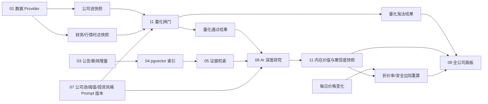
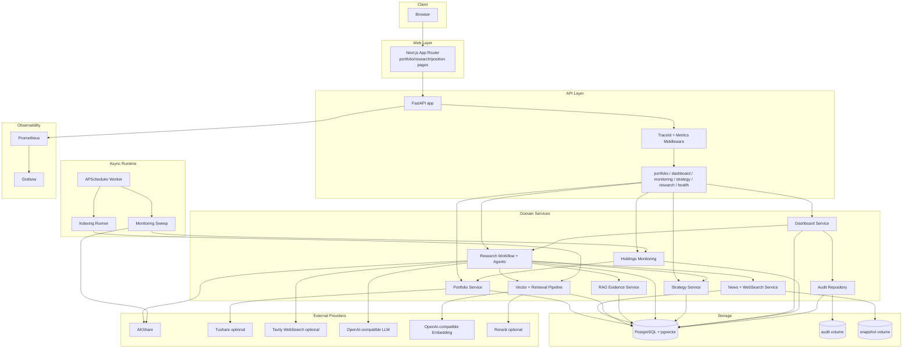
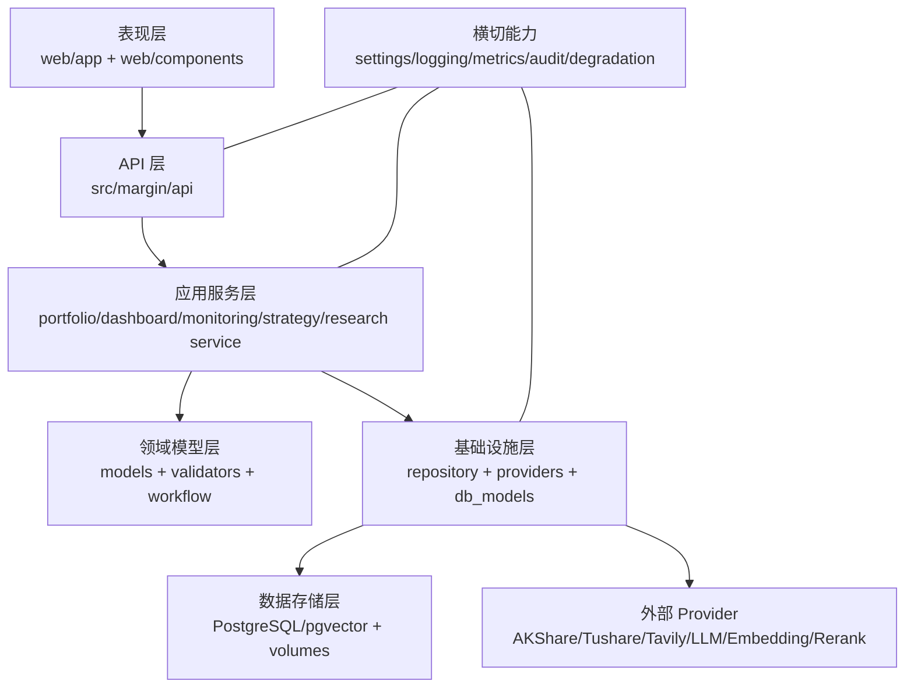
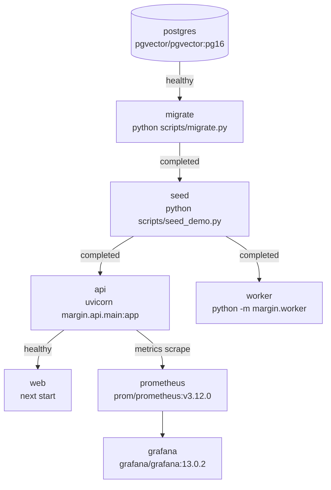
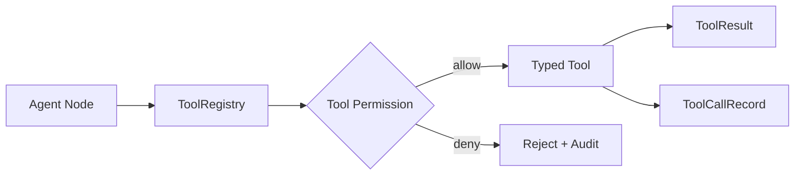
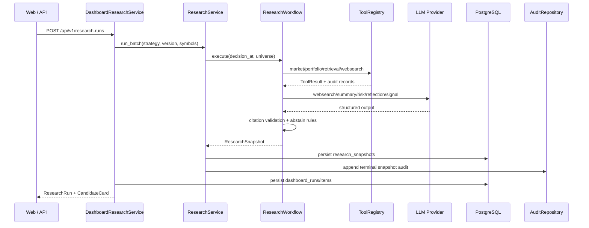
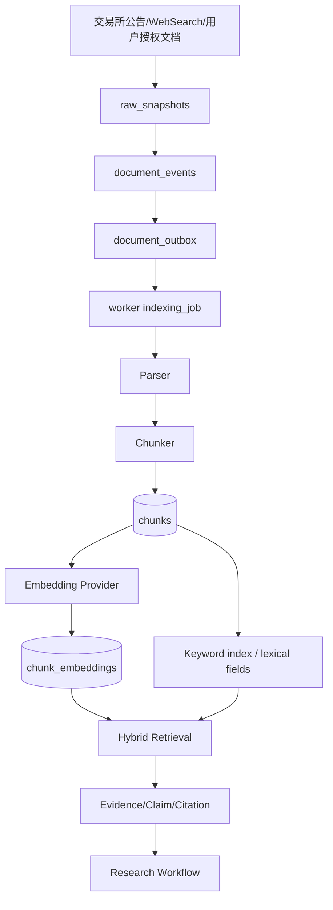
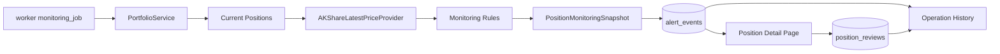
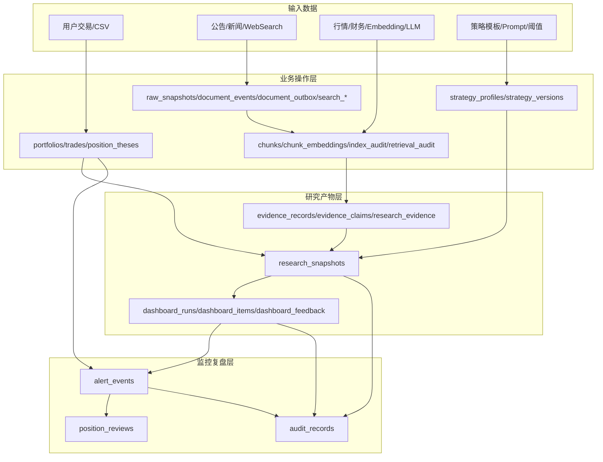

# Margin（安全边际）开源投资研究系统｜架构设计文档 v0.2

> 文档类型：系统架构设计文档
> 产品版本：v0.2
> 文档版本：v0.2
> 状态：draft
> 架构模式：模块化单体 + 本地 Docker Compose + 持久化 Worker + Provider/Tool 插拔边界
> 当前实现：FastAPI、Next.js、PostgreSQL/pgvector、APScheduler、Prometheus、Grafana、OpenAI-compatible LLM/Embedding
> 重要边界：当前代码仍为 v0.1 基线；v0.2 不实现 MCP Server、MCP Gateway、自定义 HTTP 工具运行时或自动下单。

---

## 0. v0.2 增量架构

v0.2 在 v0.1 模块化单体上新增 `11-valuation_discovery` 业务边界。该模块负责公司池时点快照、全量量化闸门、行业估值模型、内在价值快照、低估置信度和事件驱动刷新；它不替代现有数据、公告、向量、证据、Agent、策略和 Dashboard 模块。

### 0.1 增量数据流



### 0.2 模块职责

| 模块 | v0.2 增量职责 |
| --- | --- |
| 01 data_provider | 动态获取沪深 300 成分股、行情、财务、行业和估值原始字段，保留时点 |
| 03 filing_websearch | 每日增量获取公告与新闻，判定事件重要度并生成更新事件 |
| 04 text_indexing | 公告和新闻原文解析、分块、Embedding、pgvector 持久化 |
| 05 rag_evidence | 为财务结论、风险、反方理由和估值假设提供可定位证据 |
| 06 multi_agent_research | 对量化通过或待更新公司执行 evidence-grounded AI 研究 |
| 07 strategy_config | 版本化 Provider 引用、公司池、量化阈值和用户投资风格 Prompt |
| 08 dashboard | 展示公司池全部公司、量化淘汰原因、AI 状态和估值结果 |
| 10 deployment_audit | 调度每日增量同步、事件队列、失败重试和运行审计 |
| 11 valuation_discovery | 公司池快照、行业模型注册表、量化闸门、估值快照、置信度与刷新决策 |

### 0.3 核心组件

- `UniverseProvider`：按 `universe_id` 和 `as_of` 返回指数成分股；第一期实现 `CSI300`；
- `UniverseSnapshotService`：将成分股及权重保存为不可变时点快照；
- `FundamentalSnapshotService`：维护最近 5 年财务、3 年行情及估值历史；
- `IndustryValuationModelRegistry`：按行业映射银行、保险、周期、普通制造/消费和成长模型；
- `QuantGateEngine`：计算估值、质量、风险、数据完整度和淘汰原因；
- `ResearchRefreshPolicy`：根据新财报、重大公告、实质新闻、行业变化、假设失效和复核到期决定是否调用 AI；
- `IntrinsicValueService`：组合行业模型结果、证据质量和 AI 审查，生成内在价值区间；
- `ConfidenceCalibrationService`：计算低估置信度，不允许 LLM 直接提供最终概率；
- `ValuationSnapshotRepository`：append-only 保存量化和 AI 估值快照。

### 0.4 建议数据实体

| 实体 | 作用 |
| --- | --- |
| `universe_definitions` | 公司池定义，例如 `CSI300` |
| `universe_snapshots` | 某一时点的公司池快照 |
| `universe_members` | 快照中的证券、权重、行业 |
| `fundamental_snapshots` | 财务与估值输入的时点快照 |
| `quant_screen_runs` | 一次公司池全量量化运行 |
| `quant_screen_results` | 每家公司得分、状态和淘汰原因 |
| `research_refresh_events` | 触发 AI 更新的事件及去重状态 |
| `valuation_assessments` | 内在价值区间、置信区间、低估置信度和失效条件 |
| `valuation_evidence` | 估值结论到 Evidence/Claim 的关联 |

所有实体必须携带 `as_of`、`available_at`、数据/模型/策略版本和输入哈希。历史估值结果不可原地覆盖。

### 0.5 调度与缓存

- 每日收盘后同步价格和公司池变化；
- 公告、新闻和财务披露按增量游标同步；
- 全部公司每日重算轻量折价率和安全边际；
- 量化层可按数据变化增量计算，并保留周期性全量校验；
- AI 仅消费 `research_refresh_events`，没有实质变化时复用最近有效评估；
- 公告和新闻原文只存一份内容快照，向量按内容哈希幂等更新。

## 1. 架构目标

Margin v0.1 已把个人投资研究链路做成可运行、可审计、可降级的本地系统；v0.2 在此基础上增加持续估值发现能力。

核心目标：

- 本地一键启动：`docker compose up -d --build` 后启动数据库、迁移、seed、API、Worker、Web、Prometheus、Grafana；
- 数据安全：`.env` 本地注入密钥，Git 不提交真实 token；
- 研究可追溯：每个 run、item、snapshot、evidence、alert、audit 都能回到表记录；
- Provider 可替换：LLM、Embedding、Rerank、WebSearch、AKShare/Tushare 都通过适配器边界接入；
- 工具受控：AI 只能调用内部注册工具，工具有权限等级和审计记录；
- 降级保守：外部数据或模型异常时返回 `ABSTAINED`、`DATA_MISSING` 或 Provider degraded，不输出高置信结论；
- 代码可维护：按数据、公告、向量、证据、研究、策略、面板、监控、部署审计拆模块。

## 2. 整体架构图



## 3. 分层架构

v0.2 采用“产品模块 + 横切能力”的分层方式。每层都有明确代码目录和数据边界。



| 层 | 主要职责 | 当前代码 |
| --- | --- | --- |
| 表现层 | 页面、组件、用户导航、可视化 | `web/app`, `web/components`, `web/lib/api.ts` |
| API 层 | REST 路由、依赖注入、中间件、健康检查 | `src/margin/api` |
| 应用服务层 | 组合、研究、策略、Dashboard、监控业务编排 | `service.py` in each module |
| 领域模型层 | Pydantic 模型、状态枚举、规则、workflow | `models.py`, `workflow.py`, validators |
| 基础设施层 | SQLAlchemy repository、Provider adapter、工具注册 | `repository.py`, `db_models.py`, providers |
| 数据存储层 | 业务表、向量表、审计表、Docker volumes | PostgreSQL + pgvector |
| 外部 Provider | 行情、WebSearch、LLM、Embedding、Rerank | adapter + settings |
| 横切能力 | Secret、日志、trace、metrics、degradation、audit | `src/margin/core`, `src/margin/settings.py` |

## 4. 代码模块地图

| 模块 | 目录 | 关键职责 |
| --- | --- | --- |
| core | `src/margin/core` | ProviderRegistry、Secret、Audit、Metrics、Degradation、Logging |
| settings | `src/margin/settings.py` | `MARGIN_*` 配置集中入口 |
| api | `src/margin/api` | FastAPI app、路由、中间件、依赖工厂 |
| data | `src/margin/data` | AKShare/Tushare、字段标准化、质量检查 |
| portfolio | `src/margin/portfolio` | portfolio/trade/thesis、成本与持仓、风险报告 |
| news | `src/margin/news` | source cursor、raw snapshot、document event、outbox、WebSearch、dedup |
| vector | `src/margin/vector` | chunk、embedding、pgvector repository、persistent pipeline、retrieval、indexing runner |
| evidence | `src/margin/evidence` | evidence record、claim、locator、citation validation |
| research | `src/margin/research` | ToolRegistry、LLM provider、agents、workflow、snapshot、production tools |
| strategy | `src/margin/strategy` | strategy profile、version、template、prompt、lifecycle |
| dashboard | `src/margin/dashboard` | research run/item/card、evidence/valuation/audit/report/export、feedback、provider status |
| holdings_monitoring | `src/margin/holdings_monitoring` | alert、review、operation history、behavior metrics、AKShare price polling |
| worker | `src/margin/worker.py` | APScheduler，周期执行 monitoring 和 indexing |

## 5. Docker Compose 部署拓扑



| 服务 | 端口 | 状态要求 | 持久化 |
| --- | --- | --- | --- |
| postgres | 5432 | `pg_isready` healthy | `margin-postgres` |
| migrate | 无 | Alembic upgrade 成功后退出 0 | 无 |
| seed | 无 | demo 数据写入后退出 0 | PostgreSQL |
| api | 8000 | `/health/ready` healthy | audit/snapshot volume |
| worker | 无 | 常驻执行监控和索引任务 | audit/snapshot volume |
| web | 3000 | Next.js start | 无 |
| prometheus | 9090 | scrape API `/metrics` | 配置文件 |
| grafana | 3002 | dashboard provisioning | `margin-grafana` |

## 6. API 设计

### 6.1 路由总览

| API 域 | Prefix | 代表端点 |
| --- | --- | --- |
| 健康/指标 | `/health`, `/metrics` | `/health`, `/health/ready`, `/health/degraded`, `/metrics` |
| 组合持仓 | `/api/v1` | `/portfolios/{id}`, `/positions`, `/trades`, `/imports`, `/risk`, `/thesis` |
| Dashboard | `/api/v1` | `/research-runs`, `/research-items/{id}`, `/provider-status`, `/jobs/nightly-runs` |
| 持仓监控 | `/api/v1` | `/positions/{id}/monitoring/evaluate`, `/alerts`, `/reviews`, `/history` |
| 策略 | `/strategies` | `/templates`, `/custom`, `/{strategy_id}/versions/{version_id}/activate` |
| 研究工具 | `/research` | `/run`, `/tools` |

### 6.2 API 设计原则

- v0.2 REST API 优先，不引入 GraphQL；
- Dashboard 端点直接为前端 BFF 服务，减少前端拼装复杂度；
- 研究 run 在 v0.2 以同步 MVP 方式触发，但保留 job run 表达；
- 失败用 404/400/422/503 表达，不把内部异常暴露给前端；
- `TraceIdMiddleware` 为请求写入 trace header，`MetricsMiddleware` 记录 Prometheus 指标。

## 7. Provider 与工具系统

### 7.1 ProviderRegistry

ProviderRegistry 负责：

- 注册 Provider 描述符；
- Secret 注入；
- 健康检查；
- fallback 调用；
- 记录调用审计；
- Prometheus provider metrics。

当前 Provider 类型：

| Provider | 代码 | 配置 |
| --- | --- | --- |
| AKShare | `data/providers/akshare_provider.py` | 无 key |
| Tushare | `data/providers/tushare_provider.py` | `MARGIN_SECRET_TUSHARE_TOKEN` |
| Tavily | `news/providers/tavily.py` | `MARGIN_WEBSEARCH_API_KEY` |
| LLM | `research/llm.py` | `MARGIN_LLM_BASE_URL`, `MARGIN_LLM_API_KEY`, `MARGIN_LLM_MODEL` |
| Embedding | `vector/providers/openai_embedding.py` | `MARGIN_EMBEDDING_*` |
| Rerank | `vector/providers/rerank.py` | `MARGIN_RERANK_*` |

Dashboard Provider 状态由 `build_provider_status_providers()` 注入，当前固定展示四类运行时状态：

- `openai_llm`：配置完整时执行真实 chat completion healthcheck；缺配置为 `degraded`，请求失败为 `unhealthy`；
- `openai_embedding`：配置完整时执行真实 embedding healthcheck；缺配置为 `degraded`，请求失败为 `unhealthy`；
- `tavily_websearch`：缺 `MARGIN_WEBSEARCH_API_KEY` 时为 `degraded`；配置后执行真实 Tavily search healthcheck；
- `http_rerank`：缺 `MARGIN_RERANK_API_KEY` 或 `MARGIN_RERANK_BASE_URL` 时为 `degraded`；配置后执行真实 rerank healthcheck。

### 7.2 ToolRegistry

ToolRegistry 是 v0.2 的 AI 工具边界。它替代 MCP Server/Gateway，避免把单产品场景过度设计成多产品工具平台。



工具类型：

- MarketDataTool；
- FactorTool；
- FinancialTool；
- PortfolioTool；
- RetrievalTool；
- WebSearchTool；
- PythonTool（受限表达式）；
- CitationValidator 相关工具。

## 8. 研究工作流架构



### 8.1 状态设计

| 状态 | 触发条件 |
| --- | --- |
| `published` | 证据、数据、引用和策略约束通过 |
| `abstained` | 数据缺失、证据不足、引用失败、冲突或 Provider 降级 |
| `invalidated` | 后续监控或用户复盘标记研究逻辑失效 |
| `data_missing` | 行情或关键输入不可用 |

### 8.2 LLM 与规则边界

v0.2 的 Agent 输出全部经过 JSON Schema guardrail。正常路径中，WebSearch query、Text Summary、Risk Review、Reflect / Counter-Argument、Research Signal Composer 使用 OpenAI-compatible LLM。以下场景强制保守处理：

- 行情或核心市场数据退化：Signal Composer 直接输出 `abstained`，不继续生成高置信信号；
- 组合约束违规：Signal Composer 直接输出 `abstained`；
- LLM 调用失败或结构化输出不合规：Signal Composer 使用规则型 fallback；
- Citation Validator 失败：最终 signal 覆盖为 `abstained`。

当前 `risk_review` 与 `reflect_counter_argument` 记录真实 `model_version`、trace 与结构化输出，但 v0.2 不要求每条风险/反方理由绑定独立 `evidence_id`。逐条证据约束、locator 绑定、中文输出约束和更严格 evidence-grounded prompt 进入 v0.2。

## 9. 文本索引与 RAG 数据流



v0.2 支持：

- HTML/PDF/CSV/JSON/Text parser；
- chunk metadata；
- OpenAI-compatible Embedding；
- pgvector 存储；
- 检索审计；
- 可选 Rerank；
- 引用 locator。

## 10. 持仓监控架构



降级要求：

- AKShare 失败时不抛出未处理异常；
- 写入 `DATA_MISSING` 语义告警；
- 保留 `latest_price_provider_degraded` 日志；
- 不阻塞 indexing job；
- 不误触发高置信交易建议。

## 11. 数据设计总图



## 12. PostgreSQL / pgvector ER 图

当前 v0.2 迁移生成 29 张 public tables。持仓是由 `trades` 聚合计算出的当前视图，不单独落 `positions` 表。

```mermaid
erDiagram
    portfolios {
        string portfolio_id PK
        string user_id
        string name
        numeric cash
        datetime created_at
    }

    trades {
        string trade_id PK
        string portfolio_id FK
        string symbol
        string side
        numeric quantity
        numeric price
        datetime traded_at
    }

    position_theses {
        string thesis_id PK
        string portfolio_id FK
        string symbol
        string thesis
        string status
        datetime updated_at
    }

    source_cursors {
        string source_id PK
        datetime last_seen_at
    }

    raw_snapshots {
        string snapshot_id PK
        string source_url
        string content_hash
        datetime fetched_at
    }

    document_events {
        string event_id PK
        string snapshot_id FK
        string symbol
        string title
        datetime published_at
        string status
    }

    document_outbox {
        string outbox_id PK
        string event_id FK
        string status
        int attempts
    }

    search_queries {
        string query_id PK
        string query
        datetime searched_at
    }

    search_results {
        string result_id PK
        string query_id FK
        string url
        string content_hash
    }

    dedup_records {
        string dedup_id PK
        string event_id FK
        string canonical_event_id FK
    }

    repost_edges {
        string edge_id PK
        string source_event_id FK
        string target_event_id FK
    }

    chunks {
        string chunk_id PK
        string document_id
        string source_type
        text content
    }

    chunk_embeddings {
        string embedding_id PK
        string chunk_id FK
        int dimension
        vector embedding
    }

    index_audit_records {
        string record_id PK
        string document_id
        string status
    }

    retrieval_audit_records {
        string record_id PK
        string query
        string trace_id
    }

    evidence_records {
        string evidence_id PK
        string source_level
        string source_url
        string locator_json
    }

    evidence_claims {
        string claim_id PK
        string statement
        string fact_or_inference
        float confidence
    }

    evidence_validation_audits {
        string audit_id PK
        string claim_id FK
        string status
        string reason
    }

    research_evidence {
        string link_id PK
        string claim_id FK
        string evidence_id FK
    }

    research_snapshots {
        string snapshot_id PK
        string run_id
        string symbol
        string status
        string trace_id
    }

    strategy_profiles {
        string strategy_id PK
        string owner_id
        string name
        string active_version_id
    }

    strategy_versions {
        string version_id PK
        string strategy_id FK
        string lifecycle_status
        string config_json
    }

    dashboard_runs {
        string run_id PK
        string strategy_id
        string version_id
        string portfolio_id
        string status
    }

    dashboard_items {
        string item_id PK
        string run_id FK
        string symbol
        string research_status
        float confidence
    }

    dashboard_feedback {
        string feedback_id PK
        string item_id FK
        string feedback_type
        string comment
    }

    alert_events {
        string alert_id PK
        string portfolio_id FK
        string position_id
        string priority
        string alert_type
    }

    position_reviews {
        string review_id PK
        string portfolio_id FK
        string position_id
        string alert_id FK
        string decision
    }

    audit_records {
        string record_id PK
        string record_type
        string object_id
        string trace_id
        datetime recorded_at
    }

    portfolios ||--o{ trades : records
    portfolios ||--o{ position_theses : tracks
    portfolios ||--o{ alert_events : monitors
    portfolios ||--o{ position_reviews : reviews
    raw_snapshots ||--o{ document_events : snapshots
    document_events ||--o{ document_outbox : queues
    search_queries ||--o{ search_results : returns
    document_events ||--o{ dedup_records : deduplicates
    document_events ||--o{ repost_edges : source
    chunks ||--o{ chunk_embeddings : embeds
    evidence_claims ||--o{ evidence_validation_audits : validates
    evidence_claims ||--o{ research_evidence : links
    evidence_records ||--o{ research_evidence : supports
    strategy_profiles ||--o{ strategy_versions : versions
    dashboard_runs ||--o{ dashboard_items : outputs
    dashboard_items ||--o{ dashboard_feedback : receives
    alert_events ||--o{ position_reviews : handled_by
```



## 13. 数据不可变与审计策略

v0.2 使用“业务可追加 + 研究快照不可变”的设计：

- `trades` 记录成交事实；
- `research_snapshots` 保存一次研究运行的终态；
- `dashboard_items` 保存面板可见候选；
- `audit_records` 保存通用审计；
- `alert_events` 保存告警；
- `position_reviews` 保存人工复盘。

不可变要求：

| 数据 | 策略 |
| --- | --- |
| 研究快照 | 创建后不覆盖，使用新 run 产生新记录 |
| 审计记录 | append-only，重复 `record_id` 拒绝 |
| Provider 调用 | 记录 trace、provider、method、status、cost/latency 可扩展字段 |
| 证据定位 | 保留 source_url、hash、locator、page/section/span |
| 告警复盘 | alert 与 review 分开，review 不修改 alert 原文 |

## 14. 配置与 Secret

`MarginSettings` 是唯一配置入口，读取 `.env` 和环境变量，前缀为 `MARGIN_`。

| 配置 | 用途 |
| --- | --- |
| `MARGIN_DATABASE_URL` | PostgreSQL 连接 |
| `MARGIN_LLM_BASE_URL` / `MARGIN_LLM_API_KEY` / `MARGIN_LLM_MODEL` | OpenAI-compatible LLM |
| `MARGIN_EMBEDDING_BASE_URL` / `MARGIN_EMBEDDING_API_KEY` / `MARGIN_EMBEDDING_MODEL` / `MARGIN_EMBEDDING_DIMENSION` | Embedding |
| `MARGIN_WEBSEARCH_API_KEY` | Tavily WebSearch |
| `MARGIN_RERANK_*` | 可选 Rerank |
| `MARGIN_SECRET_TUSHARE_TOKEN` | 可选 Tushare |
| `MARGIN_LOG_FORMAT` | `json` 或 `console` |
| `MARGIN_METRICS_ENABLED` | 是否暴露指标 |
| `MARGIN_MONITORING_INTERVAL_SECONDS` | Worker 监控周期 |

安全要求：

- `.env` 必须被 Git 忽略；
- `.env.example` 只保留空 token；
- 日志不得打印 token；
- Docker image 不 bake 真实密钥；
- Provider smoke 只输出状态和维度，不输出 key。

## 15. 可观测性

v0.2 可观测能力：

- `/health`：进程存活；
- `/health/ready`：数据库可用；
- `/health/degraded`：Provider/数据库降级状态；
- `/metrics`：Prometheus 格式；
- TraceIdMiddleware：请求 trace header；
- MetricsMiddleware：HTTP request counter / duration；
- Provider metrics：provider call success/degraded；
- Grafana dashboard provisioning；
- Worker 日志记录 monitoring/indexing job。

## 16. 降级策略

| 场景 | 行为 |
| --- | --- |
| 数据库不可达 | `/health/ready` 返回 503 |
| LLM 缺失或 healthcheck 失败 | `/provider-status` 显示 `degraded` / `unhealthy`；研究服务使用保守 fallback 或拒绝高置信输出 |
| Embedding 缺失或 healthcheck 失败 | `/provider-status` 显示 `degraded` / `unhealthy`；索引跳过真实远端 embedding 或按检索降级策略处理 |
| WebSearch key 缺失 | `/provider-status` 显示 `tavily_websearch=degraded`；WebSearch 工具返回降级 |
| AKShare 不可达 | 持仓监控记录 `DATA_MISSING`，worker 不崩溃 |
| 引用校验失败 | research item `abstained` |
| Evidence 冲突 | 降低置信度或拒绝发布 |
| Rerank 缺失 | `/provider-status` 显示 `http_rerank=degraded`；使用基础混合召回排序 |

## 17. 测试与验证

当前验证层级：

| 层级 | 命令/证据 |
| --- | --- |
| Python lint | `ruff check src tests` |
| 后端测试 | `pytest -q` |
| 前端 lint | `npm run lint` in `web/` |
| 前端测试 | `npm test` in `web/` |
| 前端 build | `npm run build` in `web/` |
| Compose 配置 | `docker compose config --quiet` |
| 运行态 | `/health`, `/health/ready`, `/metrics`, browser E2E |
| 数据库 | Alembic `20260619_0009_audit`，29 张 public tables |
| Provider | DeepSeek chat HTTP 200；智谱 embedding 2048 dims |

测试数据库隔离要求：

- pytest 强制使用 `margin_test`；
- 不允许误删开发库；
- 测试会创建/升级测试库并清理隔离数据；
- Provider key 在测试中默认清空，避免真实调用混入单元测试。

## 18. 前端架构

```mermaid
flowchart TB
    App[Next.js App Router]
    Home[/ /]
    Portfolio[/portfolios/:portfolioId]
    Position[/positions/:positionId]
    Research[/research]
    Item[/research/items/:itemId]
    Run[/research/runs/:runId]
    ApiClient[web/lib/api.ts]
    Components[portfolio/candidate/evidence/report components]

    App --> Home
    App --> Portfolio
    App --> Position
    App --> Research
    App --> Item
    App --> Run
    Portfolio --> Components
    Position --> Components
    Research --> Components
    Item --> Components
    Components --> ApiClient
    ApiClient --> FastAPI[FastAPI API]
```

前端当前重点是可用性和可追溯：

- 组合持仓表中的 symbol 可点击进入持仓详情；
- 候选卡 symbol 可点击进入研究项详情；
- 研究项详情展示证据、估值、审计、报告；
- CSS 采用全局样式，后续可逐步提取设计 token 和组件库。

## 19. v0.2 与后续版本边界

v0.2 是单用户本地研究产品。v0.2 可扩展：

- 多 AI Provider UI；
- 模型路由和自动模型选择；
- `risk_review` / `reflect_counter_argument` 逐条绑定 evidence_ids、locator 和中文输出约束；
- 策略配置前端；
- 更完整的文档导入；
- 更强的 WebSearch/source 管理；
- 成本与质量观测；
- 更细粒度的 Provider 权限。

v0.2 设计评审后，使用 Superpowers 在被 Git 忽略的 `docs/superpowers/` 中按功能模块拆分临时 spec 与详细 plan。未来 v0.3 从 `docs/design/v0.2` 复制后增量迭代，不回写 v0.2 的审计边界。

## 20. 总结

Margin v0.1 已提供本地优先的研究操作系统基线；v0.2 设计在此基础上增加公司池与持续估值发现：

- 数据进入系统后有快照和时点；
- 文档进入系统后有 outbox、chunk、embedding 和检索审计；
- AI 输出必须经过工具审计和证据校验；
- 候选面板与持仓监控共享同一审计链；
- 外部 Provider 失败时系统保守降级；
- v0.1 核心能力能通过 Docker Compose、测试和浏览器 E2E 验证；
- v0.2 新增能力必须按模块完成实现、迁移、测试和验收，并同步更新对应的 `docs/code/` 文档。
