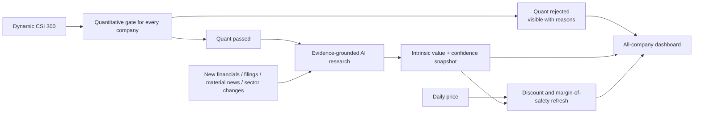
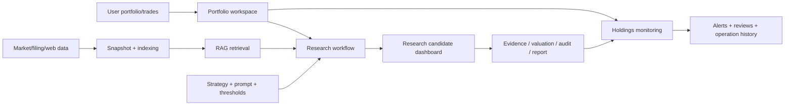
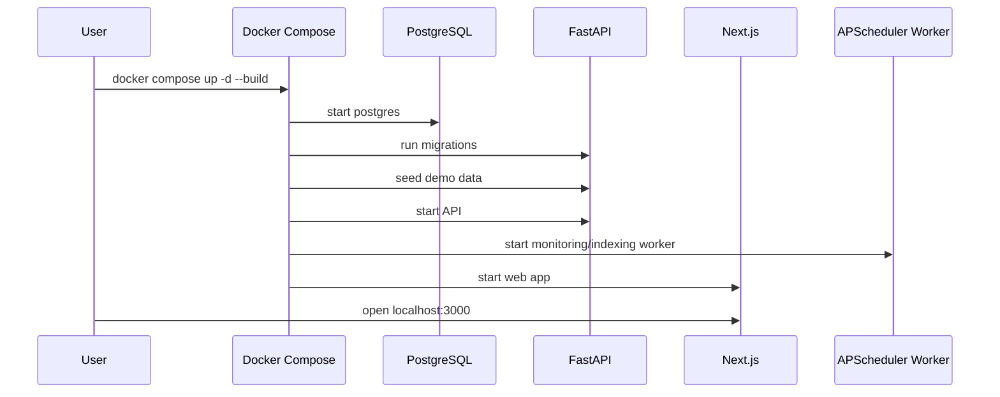
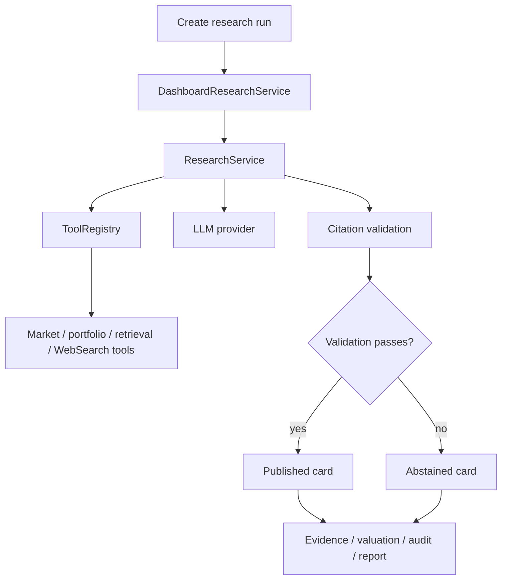

# Margin Open Investment Research System | Product Design v0.2

> Document type: Product Design
> Product version: v0.2
> Document version: v0.2
> Status: draft
> Current implementation: the repository still implements the v0.1 baseline; this document defines the v0.2 increment
> Positioning: local-first, evidence-driven, configurable personal investment research software
> Disclaimer: Margin is research assistance software. It is not financial advice and does not place trades.

---

## 0. v0.2 Increment

v0.2 changes the primary entry point from “enter a symbol and run research” to “select a company universe and continuously maintain intrinsic-value assessments.” The first supported universe is the current CSI 300 membership snapshot. Future universes may include CSI 500, combined indices, sector pools, and all A-shares.

### 0.1 Research model



- Every company remains visible, including quant-rejected and data-insufficient companies.
- Price-only changes refresh discount and margin of safety without rerunning AI.
- AI is rerun only for material information changes, invalidated assumptions, or scheduled review expiry.
- Filings and news are stored as immutable source snapshots, chunked, embedded, and indexed in pgvector.
- The system estimates what a company should be worth; it does not predict tomorrow’s price.

### 0.2 Company output

Each company exposes:

- intrinsic value range and valuation confidence interval;
- undervaluation confidence;
- quant, quality, evidence, and value-trap scores;
- watch price range;
- expected holding horizon;
- key assumptions and invalidation conditions;
- status: quant rejected, awaiting AI, AI assessed, update pending, or data insufficient.

The final undervaluation confidence is calibrated from deterministic metrics, data completeness, model stability, evidence consistency, AI risk review, and value-trap risk. The LLM may not invent or directly assign the final probability.

### 0.3 User-configurable surface

The frontend exposes only:

1. providers for data, WebSearch, LLM, embedding, and optional rerank;
2. company universe;
3. quantitative gate thresholds;
4. user investment-style prompt.

System guardrails, citation requirements, point-in-time constraints, output schemas, industry valuation formulas, agent orchestration, and tool permissions remain system-managed. Any prompt or gate change creates a new strategy version.

## 1. Product Summary

The v0.1 baseline turns a scattered personal investment workflow into an auditable loop; v0.2 adds continuous universe-level valuation discovery:

1. import or seed portfolios and trades;
2. ingest market data, filings, WebSearch results, LLM output, and embeddings through typed providers;
3. snapshot and index source documents;
4. retrieve evidence through hybrid search;
5. run a multi-agent research workflow through audited internal tools;
6. publish candidate cards only when evidence and validation pass;
7. abstain when market data, evidence, citation, or provider quality is insufficient;
8. monitor existing holdings through deterministic alert rules;
9. keep research snapshots, dashboard items, alerts, reviews, and audit records in PostgreSQL.



## 2. Product Principles

| Principle | v0.2 behavior |
| --- | --- |
| Local-first | data, snapshots, audit, and provider keys stay in the local runtime |
| Evidence-first | every important conclusion must expose source, time, evidence, or abstain reason |
| Human decision | no broker integration, no automatic orders, no hidden brokerage credentials |
| Configurable strategy | strategy templates, custom JSON config, prompt generation, version lifecycle |
| Conservative degradation | missing data or failed providers produce `ABSTAINED` / `DATA_MISSING` |
| Auditable | runs, items, alerts, reviews, tool calls, and snapshots are persisted |

## 3. Target Users

Margin v0.2 is built for:

- individual investors who manually execute their own trades;
- builders who want a reproducible research loop around A-share data;
- users who want AI output to cite source material instead of returning unsupported opinions;
- developers who want to extend providers, tools, strategies, and monitoring rules.

It is not built for high-frequency trading, broker automation, guaranteed-return recommendations, multi-tenant SaaS, or regulated advisory workflows.

## 4. v0.2 Scope

Included:

- portfolio, trade, CSV import, cost and position calculation;
- AKShare/Tushare data provider boundaries;
- filing snapshots, document events, outbox, WebSearch adapter, deduplication;
- parser, chunker, OpenAI-compatible embedding provider, pgvector persistence, hybrid retrieval;
- evidence records, claims, locators, validation audits;
- audited internal `ToolRegistry`, LLM provider, research workflow and agents;
- strategy templates, custom strategy config, prompt generation, lifecycle states;
- research dashboard: runs, candidate cards, evidence, valuation, audit, report, export, feedback;
- holdings monitoring: P0-P3 alerts, reviews, operation history, behavior metrics;
- Docker Compose deployment, health checks, metrics, Grafana, append-only audit records.

Explicitly excluded from v0.2:

- MCP Server or MCP Gateway;
- user-defined HTTP tools or arbitrary third-party tool runtime;
- broker order placement;
- multi-tenant permissions;
- cloud account system;
- redistribution of paid research reports or paywalled content.

## 5. User Workflows

### 5.1 Local startup



### 5.2 Research candidate workflow



### 5.3 Holdings monitoring workflow

The worker periodically reads current positions, fetches latest prices when available, evaluates deterministic rules, writes alert events, and lets the user record reviews from the position detail page.

## 6. Product Surface

```mermaid
flowchart TB
    Home[/ / Home] --> Portfolio[/portfolios/:portfolioId]
    Portfolio --> Position[/positions/:positionId]
    Home --> Research[/research]
    Research --> Item[/research/items/:itemId]
    Research --> Run[/research/runs/:runId]
    Position --> Alerts[Alerts / reviews / history]
    Item --> Evidence[Evidence]
    Item --> Valuation[Valuation]
    Item --> Audit[Audit]
    Item --> Report[Report / export]
```

Current pages:

- home summary;
- portfolio workspace with clickable position rows;
- position detail with thesis, monitoring alerts, history, and metrics;
- research dashboard with latest run and candidate cards;
- research item detail with evidence, valuation, audit, report, and export;
- research run detail.

## 7. Candidate Card Semantics

| Field | Meaning |
| --- | --- |
| `symbol` | target security |
| `research_status` | `published`, `abstained`, `invalidated`, etc. |
| `statement` | concise conclusion |
| `confidence` | confidence in the research conclusion, not a return probability |
| `valuation_range` | valuation band |
| `value_trap_score` | value-trap risk indicator |
| `counter_arguments` | strongest opposing reasons |
| `evidence_summary` | evidence count and source distribution |
| `disclaimer` | compliance notice |

When data or evidence is insufficient, the product must show the abstain state instead of hiding or inventing a conclusion.

## 8. Alerts and Reviews

v0.2 alerts are local structured records, not email/SMS/IM notifications.

| Priority | Meaning |
| --- | --- |
| P0 | immediate review required |
| P1 | high-priority review |
| P2 | medium-priority observation |
| P3 | low-priority information update |

Alerts are appended to `alert_events`; human decisions are appended to `position_reviews`; both appear in operation history.

## 9. Acceptance Criteria

| ID | Criterion |
| --- | --- |
| P-01 | Docker Compose can start postgres, migrate, seed, api, worker, web, prometheus, and grafana |
| P-02 | demo portfolio is visible with holdings |
| P-03 | portfolio rows link to position detail |
| P-04 | research run can create dashboard cards |
| P-05 | insufficient data produces `abstained` rather than a high-confidence signal |
| P-06 | DeepSeek-compatible LLM and Zhipu-compatible embedding providers can be configured through `.env` |
| P-07 | position detail shows alerts, reviews, and history |
| P-08 | `/metrics`, `/health`, `/health/ready`, and `/health/degraded` are available |
| P-09 | the v0.2 design increment is auditable; temporary specs and plans are split by functional module after design approval |

## 10. Known Limitations

- Tavily WebSearch requires `MARGIN_WEBSEARCH_API_KEY`;
- Tushare requires `MARGIN_SECRET_TUSHARE_TOKEN`;
- Rerank is optional;
- real market data availability depends on upstream accessibility and rate limits;
- strategy configuration has backend APIs but not a full v0.2 frontend editor;
- provider secrets are configured through `.env` or environment variables; a frontend provider settings page is v0.2 scope;
- `risk_review` and `reflect_counter_argument` produce structured LLM outputs in v0.2, but do not require each risk or counter-argument to carry its own evidence reference;
- large-scale Parquet/DuckDB analytics are future work.

`GET /api/v1/provider-status` currently reports `openai_llm`, `openai_embedding`, `tavily_websearch`, and `http_rerank`. Configured LLM and embedding providers perform real remote health checks. Missing Tavily or rerank configuration is shown as `degraded` instead of being hidden.

The research signal composer uses the LLM on the normal path, then falls back to conservative rule output when market data is degraded, portfolio constraints fail, citation validation fails, or the LLM call fails.

v0.2 should add evidence-grounded risk/counter-argument generation, including per-item `evidence_ids`, locators, stricter language/output controls, and provider configuration UI.

## 11. Summary

The v0.1 baseline delivers a working local research loop. v0.2 is a draft design that extends it into continuous intrinsic-value discovery; the new universe, quant-gate, industry-valuation, and event-driven capabilities are not implemented yet.
