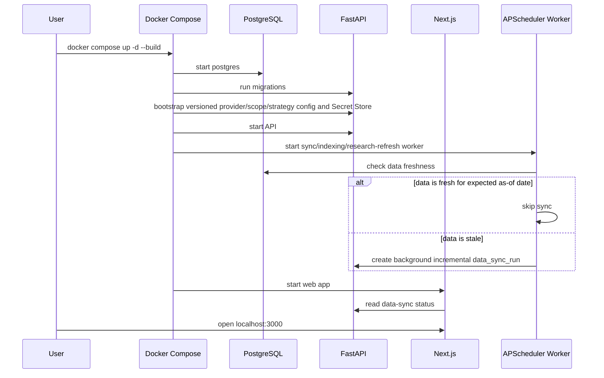
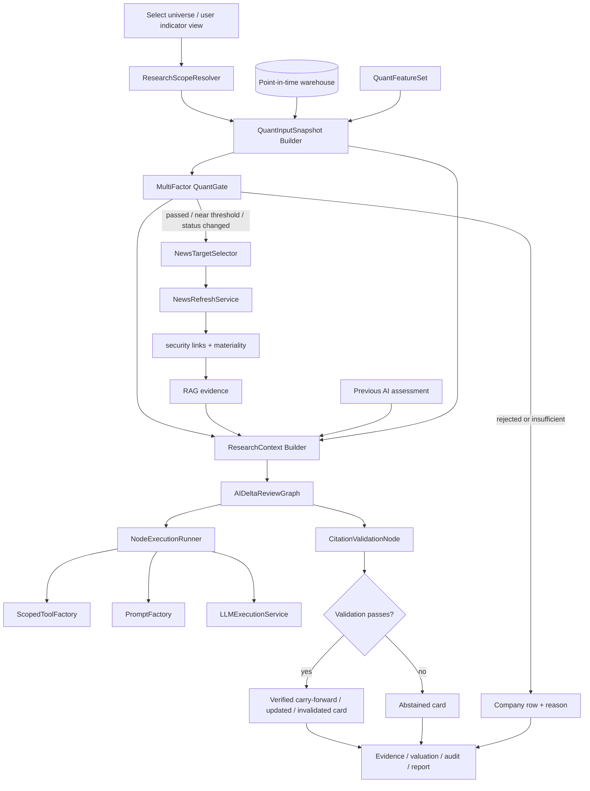

# Margin Open Investment Research System | Product Design v0.2

> Document type: Product Design
> Product version: v0.2
> Document version: v0.2
> Status: active
> Current implementation: the repository still implements the v0.1 baseline; this document defines the v0.2 increment
> Positioning: local-first, evidence-driven, configurable personal investment research software
> Disclaimer: Margin is research assistance software. It is not financial advice and does not place trades.

---

## 0. v0.2 Increment

v0.2 changes the primary entry point from “enter a symbol and run research” to “select a company universe and continuously maintain intrinsic-value assessments.” The warehouse acquires as much All-A data as every enabled AKShare/Tushare endpoint can provide. Initial user universes are CSI 300, CSI 500, and All-A; future universes are added through rule strategies.

### 0.1 Warehouse-first research model

```mermaid
flowchart LR
    Data[AKShare / Tushare enabled endpoints] --> Raw[Complete raw snapshots + provider audit]
    Raw --> Schema[Source-field discovery and lifecycle]
    Raw --> Standardize[Multi-provider facts + PIT + quality]
    Schema --> Catalog[Versioned indicator catalog and mappings]
    Catalog --> Standardize
    Standardize --> Canonical[(Canonical serving values)]
    Scope[Universe + quant strategy] --> QuantInput[QuantInputSnapshot]
    Canonical --> QuantInput
    Features[Strategy-required QuantFeatureSet] --> QuantInput
    QuantInput --> Quant[Quantitative gate for every scoped company]
    Quant --> Rejected[Quant rejected<br/>visible with reasons]
    Quant --> Passed[Quant passed / review needed]
    Passed --> NewsRefresh[NewsRefreshService]
    NewsRefresh --> NewsIndex[news snapshots + materiality + vector index]
    Passed --> Context[ResearchContext]
    QuantInput --> Context
    View[User indicator view] --> Context
    NewsIndex --> Context
    Previous[Previous AI assessment] --> Context
    Context --> AI[AI delta review]
    AI --> Value[Intrinsic value + confidence snapshot]
    Rejected --> Dashboard[All-company dashboard]
    Value --> Dashboard
    Price[Daily price] --> Reprice[Discount and margin-of-safety refresh]
    Value --> Reprice
    Reprice --> Dashboard
```



- Every company in the selected universe remains visible, including quant-rejected and data-insufficient companies.
- Provider acquisition synchronizes every enabled endpoint across its full supported security coverage and returned fields; user scopes never reduce warehouse acquisition.
- Complete raw responses, source-field lifecycle, and all standardized AKShare/Tushare facts are retained. Canonical resolution selects a serving value without deleting candidates.
- PostgreSQL point-in-time data is the single source of truth for quant gates and AI research.
- The universe controls securities in scope. User indicator views affect dashboard/AI presentation only and cannot remove strategy-required quant inputs.
- On startup, the system checks data freshness automatically; fresh data is reused, stale data creates a background incremental sync run.
- Provider failures never block API/Web startup. The product uses the latest valid snapshot, marks data stale/degraded, and exposes a manual sync/retry button.
- Price-only changes refresh discount and margin of safety without rerunning AI.
- When the current data and target-news checks are complete and nothing material changed, the graph writes `CARRY_FORWARD_VERIFIED` with zero LLM calls.
- News/WebSearch is not an unbounded web crawl. After quant completes, `NewsRefreshService` searches and fetches related news only for selected target companies.
- Every company in the daily research target set is persisted and searched; no fixed top-N silently drops targets. Provider limits affect batching and completion time only.
- AI receives a structured `ResearchContext` with the previous AI assessment, current quant result, material news bundle, and RAG evidence; it does not directly fetch external market/fundamental data or run live WebSearch.
- Filings and news are stored as immutable source snapshots, linked to securities, materiality-scored, chunked, embedded, and indexed in pgvector.
- The system estimates what a company should be worth; it does not predict tomorrow’s price and does not analyze the user’s current holdings in v0.2.

The first quant implementation is a single-day cross-sectional multi-factor screen. It uses Quality 35%, Value 25%, Growth 15%, Momentum 15%, and Risk 10%. Output fields are orthogonal: `screening_status`, `data_status`, `risk_flags`, `review_required`, and `research_guardrail`. Research guardrails avoid BUY/SELL/CHASE wording. Backtesting, performance attribution, and report export are Phase 2.

### 0.2 Company output

Each company exposes:

- intrinsic value range and valuation confidence interval;
- undervaluation confidence;
- quant, quality, evidence, and value-trap scores;
- value, growth, momentum, and risk scores;
- screening status: `PASS`, `NEAR_THRESHOLD`, `WATCHLIST`, or `REJECT`;
- data status: `OK`, `INSUFFICIENT`, or `PIT_DEGRADED`, plus independent risk flags and review requirements;
- research guardrail: `RESEARCH_ALLOWED`, `LIMITED_RESEARCH`, `RESEARCH_BLOCKED`, `OVERHEAT_CAUTION`, `CONFIDENCE_REDUCED`, or `THESIS_RECHECK_REQUIRED`;
- watch price range;
- expected investment horizon, meaning the research verification or valuation-realization window, not a holding instruction;
- key assumptions and invalidation conditions;
- news refresh status;
- AI delta decision: carried forward, updated, confidence downgraded, invalidated, or abstained;
- current review outcome, effective assessment ID, and assessment freshness; abstained/deferred reviews never overwrite the last valid assessment;
- status: quant rejected, awaiting news, awaiting AI, carried forward, updated, update pending, or data insufficient.

The final undervaluation confidence is calibrated from deterministic metrics, data completeness, model stability, evidence consistency, AI risk review, and value-trap risk. The LLM may not invent or directly assign the final probability.

### 0.3 User-configurable surface

The frontend exposes:

1. globally enabled data providers/endpoints, WebSearch, LLM, embedding, optional rerank, and write-only secret configuration backed by a local encrypted Secret Store;
2. company universe: CSI 300, CSI 500, or All-A;
3. user indicator views using `ALL`, `INCLUDE`, or `EXCLUDE`; quant-required features remain strategy-managed;
4. quantitative gate thresholds;
5. user investment-style prompt.

System guardrails, citation requirements, point-in-time constraints, output schemas, industry valuation formulas, canonical resolution, agent orchestration, and tool permissions remain system-managed. Universe, indicator-set, prompt, or gate changes create a new research-scope/strategy version.

### 0.4 Default user journey

v0.2 should feel like a valuation-discovery workspace, not a symbol lookup form:

1. the user opens `/research`, selects CSI 300, CSI 500, or All-A, and chooses all indicators or a saved indicator set;
2. the dashboard shows every company, grouped by undervalued candidate, near watch price, update pending, AI assessed, quant rejected, or data insufficient;
3. the user inspects quant metrics and rejection reasons before spending AI work;
4. company detail shows intrinsic value range, discount, undervaluation confidence, value-trap risk, investment horizon, and invalidation conditions;
5. the user can inspect data freshness, last sync time, stale data domains, and sync failure reasons;
6. evidence drill-down exposes financial filings, announcements, news, web snapshots, locators, and source levels;
7. if data is stale or a provider recovered, the user may click “sync data / retry sync” to create a background sync job;
8. provider settings, universe, indicator set, quantitative gates, and investment-style prompt changes create versioned scope/strategy updates;
9. the product never places orders and never displays unconditional buy/sell commands.

The v0.2 Research Board Copilot is read-only information integration. It may interpret questions, apply current-page/scope filters, summarize existing quant/assessment state, and navigate evidence. It does not run a second research engine, create new valuations, issue live WebSearch, or mutate strategy, secrets, or workflow state.

### 0.5 Module split for implementation

After design approval, temporary Superpowers specs/plans must be split by functional module:

| Module | v0.2 boundary |
| --- | --- |
| 01 data_provider | provider endpoints, full-coverage incremental sync, complete raw snapshots, schema discovery, indicator catalog/mappings, multi-source facts, canonical resolution, PIT/quality |
| 03 filing_websearch | quant-targeted NewsRefreshService, filing/news snapshots, security links, materiality scoring, compliance, deduplication |
| 04 text_indexing | content-hash parsing, chunking, embedding, and PIT-safe pgvector indexing for new source content |
| 05 rag_evidence | citation and validation for valuation assumptions, risks, and counter-arguments |
| 06 multi_agent_research | AI delta review from previous assessment, current quant result, material news, and RAG evidence |
| 07 strategy_config | versioned providers, universes, indicator sets, quant gates, style prompt, and research scopes |
| 08 research_candidate_dashboard | all-company discovery dashboard, company detail, filters, rejection reasons, valuation views |
| 10 deployment_audit | scheduled jobs, retries, audit, metrics, and degradation visibility |
| 11 valuation_discovery | universe snapshots, `valuation_discovery/quant` multi-factor quant screening, industry valuation models, confidence calibration, refresh events, valuation snapshots |

Cross-module work must be connected by typed interfaces and events instead of being collapsed into one large module.
Module IDs 02 and 09 are retained only for historical audit. Their implementations are removed in v0.2.

## 1. Product Summary

The v0.1 baseline turns a scattered personal investment workflow into an auditable loop; v0.2 shifts the product line to continuous universe-level valuation discovery:

1. acquire all supported All-A data and returned fields from every globally enabled AKShare/Tushare endpoint;
2. persist immutable raw responses and track new, missing, deprecated, and type-changed source fields;
3. retain all multi-provider standardized facts and select traceable canonical values without overwriting candidates;
4. maintain bitemporal memberships for CSI 300, CSI 500, All-A, and future rule-based universes;
5. version research scopes that combine universe, user indicator view, strategy-required quant feature set, quant strategy, and prompt;
6. freeze a `QuantInputSnapshot`, then run quant through `QuantDataAdapter`; preserve orthogonal screening/data/risk/review/guardrail results and rejection reasons;
7. persist every company in the daily research target set as a news target; do not impose a fixed top-N;
8. search, fetch, snapshot, deduplicate, security-link, materiality-score, chunk, and embed relevant news and filings;
9. build a post-quant `ResearchContext` that references the `QuantInputSnapshot`, previous effective assessment, current quant result, material news bundle, RAG evidence, and audited tools;
10. run the controlled `AIDeltaReviewGraph`: deterministic carry-forward for no material change, bounded LLM review for first research/material change/review expiry, then publish carry-forward, updated, downgraded, invalidated, or abstained results.

```mermaid
flowchart LR
    Data[AKShare/Tushare full-coverage acquisition] --> Raw[Complete raw snapshots + schema discovery]
    Raw --> Warehouse[(Multi-source facts + canonical values)]
    Universe[CSI 300/CSI 500/All-A bitemporal universes] --> Scope[Research scope]
    Indicators[ALL/INCLUDE/EXCLUDE user view] --> Scope
    Features[QuantFeatureSet] --> QuantInput[QuantInputSnapshot]
    Scope --> QuantInput
    Warehouse --> QuantInput
    Previous[Previous AI assessment] --> Context
    QuantInput --> Quant[Quant gate]
    Quant --> Rejected[Rejected / insufficient<br/>visible with reasons]
    Quant --> Passed[Passed / near threshold / status changed]
    Passed --> NewsRefresh[NewsRefreshService]
    NewsRefresh --> Index[news snapshots + materiality]
    Index --> Retrieval[RAG retrieval]
    Strategy[Strategy + prompt + thresholds] --> Context[ResearchContext]
    Passed --> Context
    QuantInput --> Context
    Retrieval --> Context
    Context --> Workflow[AI delta review]
    Workflow --> Decision{Decision changed?}
    Decision -->|no and checks complete| Carry[CARRY_FORWARD_VERIFIED]
    Decision -->|yes| Update[UPDATE / DOWNGRADE / INVALIDATE]
    Carry --> Cards[All-company valuation dashboard]
    Update --> Cards
    Rejected --> Cards
    Cards --> Evidence[Evidence / valuation / audit / report]
```



## 2. Product Principles

| Principle | v0.2 behavior |
| --- | --- |
| Local-first | data, snapshots, audit, and provider keys stay in the local runtime |
| Full acquisition | user scopes never trim provider jobs; enabled endpoints cover their full supported securities and fields |
| Warehouse-first | provider output must be persisted as raw snapshots, multi-source facts, quality results, and canonical selections before quant or AI consumes it |
| Logical scopes | universes control securities; user indicator views control dashboard/AI presentation; strategy feature sets control quant inputs |
| Targeted news | news search is driven by quant/review targets and stored before AI consumes it |
| Bitemporal history | universe membership, indicator semantics, and source mappings preserve business and system time |
| Evidence-first | every important conclusion must expose source, time, evidence, or abstain reason |
| Human decision | no broker integration, no automatic orders, no hidden brokerage credentials |
| Configurable strategy | strategy templates, custom JSON config, prompt generation, version lifecycle |
| Conservative degradation | missing data or failed providers produce `ABSTAINED`, `DATA_INSUFFICIENT`, or `PROVIDER_DEGRADED` |
| Auditable | runs, items, news refreshes, delta reviews, tool calls, valuation snapshots, and source snapshots are persisted |

## 3. Target Users

Margin v0.2 is built for:

- individual investors who manually execute their own trades;
- builders who want a reproducible research loop around A-share data;
- users who want AI output to cite source material instead of returning unsupported opinions;
- developers who want to extend providers, tools, strategies, quant gates, and valuation models.

It is not built for high-frequency trading, broker automation, holdings analysis, holdings monitoring, guaranteed-return recommendations, multi-tenant SaaS, or regulated advisory workflows.

## 4. v0.2 Scope

Included:

- CSI 300, CSI 500, and All-A bitemporal universe memberships and audit snapshots;
- provider endpoint registry, full-coverage incremental sync, complete raw snapshots, provider audits, and source-schema lifecycle;
- indicator catalog/mappings, multi-provider PIT facts, canonical values, and quality reports;
- `ALL`, `INCLUDE`, and `EXCLUDE` indicator sets with versioned research scopes;
- quant gates with explainable rejection and data-insufficient states;
- industry-specific valuation model families;
- AKShare/Tushare data provider boundaries;
- filing snapshots, document events, outbox, WebSearch adapter, deduplication;
- parser, chunker, OpenAI-compatible embedding provider, pgvector persistence, hybrid retrieval;
- evidence records, claims, locators, validation audits;
- audited LangGraph AI delta review, scoped tool factory, prompt factory, LLM provider, risk review, counter-argument review, and citation validator;
- strategy templates, custom strategy config, prompt generation, lifecycle states;
- research dashboard: all-company state table, current-vs-effective assessment, evidence locators, quant/valuation summary, counter-arguments, feedback, and Provider status;
- Docker Compose deployment, health checks, metrics, Grafana, append-only audit records.

Explicitly excluded from v0.2:

- MCP Server or MCP Gateway;
- user-defined HTTP tools or arbitrary third-party tool runtime;
- broker order placement;
- holdings analysis, holdings monitoring, buy-after alerts, or position reviews;
- multi-tenant permissions;
- cloud account system;
- redistribution of paid research reports or paywalled content.

## 5. User Workflows

### 5.1 Local startup



Startup freshness checks must not block API or Web startup. If providers are unavailable, the system starts with the latest valid snapshot and surfaces stale/degraded status in the frontend.

### 5.2 Universe valuation discovery workflow

1. The user selects a universe and user indicator view.
2. The system resolves bitemporal universe members, the strategy-required quant feature set, the user view, and the research scope.
3. PIT market, financial, valuation, historical industry-membership, and corporate-action data become an immutable `QuantInputSnapshot`.
4. `QuantDataAdapter` loads every scoped company from that snapshot.
5. Hard filters preserve ST/suspension, listing-age, liquidity, loss, leverage, goodwill, cash-flow, and missing-data reasons.
6. Factor calculators produce scores plus independent screening/data/risk/review/guardrail fields, ranks, confidence, and readable reasons.
7. Every company in the daily research target set is persisted as a `news_refresh_target`; no fixed top-N truncates coverage.
8. `NewsRefreshService` uses priority batches, backpressure, and retries to search every target.
9. Post-quant `ResearchContext` references the quant input snapshot and combines the previous effective assessment, current quant result, material news bundle, and RAG evidence.
10. `AIDeltaReviewGraph` routes through full, delta, verified carry-forward, abstain, or deferred review and applies bounded tools/reflection.
11. The dashboard separately shows current review outcome, effective assessment, freshness, pipeline state, evidence, and audit lineage.



### 5.3 Valuation refresh workflow

APScheduler, startup freshness checks, and manual refresh actions only create or wake a `valuation_refresh_run`; they do not own the full business workflow. `ValuationDiscoveryOrchestrator` claims pending runs and advances `valuation_refresh_steps` through data sync, quant, NewsRefresh, indexing, AI delta review, and dashboard refresh. The worker runs every enabled provider endpoint across its full supported security coverage. Initial runs use endpoint-specific backfill policies; later runs use incremental cursors plus a revision lookback window. User universe and indicator-set choices never trim these jobs. Responses become complete raw snapshots, provider audits, and source-schema observations before producing multi-provider standardized facts and canonical selections. Provider failure is recorded in `data_sync_runs`, does not block startup, and leaves the latest valid data available as stale.

Ordinary price changes update discount and margin of safety only. A price-watch crossing may trigger NewsRefresh, but AI runs only when material evidence is found or review is due. Every daily research target is persisted; provider limits change batching and completion time, not target completeness. Quant consumes `QuantInputSnapshot`; AI consumes the later `ResearchContext`. A zero-LLM `CARRY_FORWARD_VERIFIED` is valid only when current target-news checks completed. Failed or incomplete news produces `REVIEW_DEFERRED`/`ABSTAIN`, preserves the previous effective assessment, and marks it stale.

The expected as-of date is domain-specific: market data follows the trading calendar and provider availability time; filings and news follow cursors or natural-day freshness; fundamentals follow disclosure `available_at`.

## 6. Product Surface

```mermaid
flowchart TB
    Home[/ / Home] --> Research[/research valuation discovery]
    Home --> Settings[/settings]
    Research --> Item[/research/items/:itemId]
    Research --> Run[/research/runs/:runId]
    Research --> Universe[/research/universe]
    Universe --> Quant[Quant gate / rejection reasons]
    Item --> Evidence[Evidence locators]
    Item --> Valuation[Quant / valuation summary]
    Item --> Audit[Current vs effective]
    Item --> Feedback[Feedback]
    Settings --> Providers[Provider config]
    Settings --> Scope[Universe / indicator set]
    Settings --> Strategy[Quant gates / investment-style prompt]
```

Current pages:

- home summary;
- universe valuation dashboard with all company states;
- company detail with quant metrics, valuation range, confidence, evidence, refresh reason, data snapshot version, freshness, and provider degradation state;
- data-sync status with last successful sync, stale domains, failure reason, and a manual sync/retry button;
- research dashboard with server-side filters and candidate table;
- research item detail with current/effective assessment, evidence locators, quant/valuation summary, and feedback;
- valuation discovery run progress;
- provider, universe, indicator-set, and strategy settings.

## 7. Candidate Card Semantics

| Field | Meaning |
| --- | --- |
| `symbol` | target security |
| `research_status` | `published`, `abstained`, `invalidated`, etc. |
| `statement` | concise conclusion |
| `confidence` | confidence in the research conclusion, not a return probability |
| `valuation_range` | valuation band |
| `value_trap_score` | value-trap risk indicator |
| `counter_arguments` | strongest opposing reasons |
| `evidence_summary` | evidence count and source distribution |
| `disclaimer` | compliance notice |

When data or evidence is insufficient, the product must show the abstain state instead of hiding or inventing a conclusion.

## 8. Refresh Status and Review Prompts

v0.2 does not implement holdings alerts, email/SMS/IM notifications, or position reviews. It only exposes research refresh status inside the universe dashboard and company detail pages.

| Status | Meaning |
| --- | --- |
| `UNCHANGED` | no material information change |
| `PRICE_REPRICED` | price-only discount and margin-of-safety refresh |
| `MATERIAL_UPDATE` | new financials, material filing, or material news require AI research |
| `REVIEW_DUE` | strategy review interval has expired |
| `DATA_INSUFFICIENT` | data is insufficient for high-confidence output |
| `DATA_SYNCING` | background data sync is running |
| `DATA_STALE` | latest valid snapshot is being reused |
| `DATA_SYNC_FAILED` | last sync failed; user can retry from the frontend |
| `NEWS_REFRESHING` | NewsRefreshService is searching, fetching, or indexing target-company news |
| `NEWS_DEGRADED` | news source, WebSearch, robots, or fetch provider degraded |
| `NEWS_SYNC_FAILED` | current news refresh failed; the system cannot claim that no material change occurred |
| `AI_CARRY_FORWARD_VERIFIED` | current data/news checks completed and the zero-LLM path kept the previous assessment |
| `AI_UPDATED` | AI changed valuation, thesis, or risk assessment |
| `AI_DOWNGRADED` | AI lowered confidence due to evidence conflict, lower quality, or new risk |
| `AI_INVALIDATED` | AI marked the previous thesis invalid |
| `AI_ABSTAINED` | AI refused high-confidence output due to insufficient evidence |
| `REVIEW_DEFERRED` | current review could not complete; the previous effective assessment remains visible but stale |

Refresh status is persisted through `research_refresh_events`, `news_refresh_runs`, `research_delta_reviews`, and valuation snapshot audit records. Human feedback remains dashboard feedback; it is not stored as a position review.
Data-sync status is persisted through `data_sync_runs` and freshness records. The manual sync button creates a background job and does not block the page.
News/WebSearch degradation must not hide quant results, but it must cap AI confidence and show the latest usable news snapshot time plus failure reason.

## 9. Acceptance Criteria

The criteria are delivered through three sequential gates rather than one simultaneous 60-item milestone:

| Gate | Goal | Main modules | Exit condition |
| --- | --- | --- | --- |
| P0 | auditable warehouse, bitemporal scopes, QuantInputSnapshot, orthogonal quant output, DB-backed orchestration | 01, 07, 10, 11 | all P0 criteria plus real AKShare/Tushare, PIT, and migration tests pass |
| P1 | complete target-driven news, indexing/evidence, ResearchContext, controlled LangGraph, tool/prompt factories | 03, 04, 05, 06, 11 | all P1 criteria plus real Tavily/LLM/Embedding/Rerank and delta-review smoke pass |
| P2 | dashboard, encrypted provider settings, security/capacity/recovery hardening, full E2E and docs | 07, 08, 10, cross-module | complete lint/test/build/migration/Compose/smoke and design-code-doc consistency pass |

| ID | Criterion |
| --- | --- |
| P-01 | CSI 300, CSI 500, and All-A support bitemporal membership queries |
| P-02 | enabled provider endpoints perform full-coverage backfill, incremental sync, and revision lookback independently of user scope |
| P-03 | sync writes complete raw snapshots, provider audit, schema fingerprint, multi-source facts, and quality reports |
| P-04 | source-field and indicator-mapping lifecycle retains bitemporal history |
| P-05 | AKShare/Tushare facts coexist and canonical selection remains fully traceable |
| P-06 | startup freshness checks skip fresh domains and enqueue stale domains without blocking API/Web |
| P-07 | provider failure preserves latest valid data and surfaces stale/degraded state |
| P-08 | manual sync creates a global background run rather than a page-scoped sync |
| P-09 | user indicator views are versioned separately from strategy-required quant feature sets |
| P-10 | quant consumes immutable `QuantInputSnapshot`, never providers, raw snapshots, or post-quant ResearchContext |
| P-11 | every scoped company receives a visible quant result |
| P-12 | rejection output includes structured reasons, indicators, versions, and quality state |
| P-13 | ordinary price changes only reprice; a watch crossing triggers AI only after material evidence or review expiry |
| P-14 | financials, filings, material news, industry changes, or review expiry create AI refresh events |
| P-15 | post-quant ResearchContext references quant input/result, news bundle, previous effective assessment, evidence, and scoped tools |
| P-16 | AI claims bind evidence IDs, locators, source levels, and availability |
| P-17 | company detail exposes valuation, confidence, value-trap risk, horizon, invalidation, and lineage |
| P-18 | missing/conflicting data or evidence degrades conservatively |
| P-19 | every daily research target is persisted and eventually processed without fixed top-N truncation |
| P-20 | NewsRefresh accepts only persisted targets; AI cannot issue live WebSearch |
| P-21 | search/news results persist runs, queries, results, raw snapshots, links, and materiality |
| P-22 | news/filing text is content-hash idempotent and retrieval enforces PIT |
| P-23 | low-materiality content may be indexed but is excluded from primary context by default |
| P-24 | delta review returns verified carry-forward, update, downgrade, invalidate, abstain, or deferred |
| P-25 | verified carry-forward requires complete data/news checks; deferred/abstained reviews preserve the effective assessment separately |
| P-26 | schedulers and manual triggers only create/wake valuation refresh runs |
| P-27 | orchestrator persists run/step state, outputs, and failure reasons |
| P-28 | every orchestration step is idempotent |
| P-29 | LangGraph is restricted to the internal AI graph |
| P-30 | specs/plans are split by functional module and completed code updates `docs/code` |
| P-31 | Phase-1 quant lives under `valuation_discovery/quant` and uses `QuantDataAdapter` |
| P-32 | hard filters are configurable and filtered companies remain visible |
| P-33 | five factor groups and final score use versioned weights |
| P-34 | normalization applies winsorization, historical industry rank, direction alignment, and explicit missing penalties |
| P-35 | quant output separates screening, data, risk, review, and research-guardrail fields |
| P-36 | invalid PE cannot score as cheap and overheat uses non-trading `OVERHEAT_CAUTION` |
| P-37 | historical runs enforce `available_at <= trade_date` and mark PIT degradation explicitly |
| P-38 | quant runs/results persist strategy/data versions, factors, flags, ranks, and readable reasons |
| P-39 | the graph accepts only a frozen context snapshot and excludes outer workflow duties |
| P-40 | deterministic routing separates carry-forward, delta, full, deferred, and abstain paths |
| P-41 | fundamental, valuation, risk, and counter-argument analyses fan out and remain evidence-bound |
| P-42 | only one supplemental retrieval and one citation repair are permitted |
| P-43 | graph tools are read-only, scoped, PIT-safe, and never expose live providers/WebSearch |
| P-44 | graph/node runs and PostgreSQL checkpoints support audited recovery |
| P-45 | ScopedToolFactory builds node-specific manifests; the model never sees the global registry |
| P-46 | every tool request passes capability, grant, scope, PIT, budget, and schema checks |
| P-47 | PromptFactory builds immutable layered PromptArtifacts |
| P-48 | draft/reflection/revision prompts are separately versioned and user style cannot override guardrails |
| P-49 | deterministic validation always runs; eligible nodes perform at most one bounded critic/revision |
| P-50 | critics cannot call tools, invent facts, replace evidence IDs, or mutate graph state |
| P-51 | node and LLM audit retains manifest/prompt/reflection/draft/revised hashes with full idempotency |
| P-52 | frontend Provider secrets are write-only, encrypted, rotated, masked, CSRF-protected, and audited |
| P-53 | untrusted external/tool text cannot alter system prompts, tool grants, scope, PIT, or citation rules |
| P-54 | official filings use global cursor sync while WebSearch remains quant-targeted |
| P-55 | historical industry membership is bitemporal and same-date ranking has a versioned small-sample fallback |
| P-56 | raw prices, corporate actions, and as-of adjusted series prevent future-action leakage |
| P-57 | concurrency, RPM/TPM, token/cost, target batching, queue limits, and backpressure are configurable and observable |
| P-58 | long tasks return `202 + run_id`; APIs support pagination, idempotency, progress, and structured errors |
| P-59 | graph/tool/prompt/strategy/secret versions are frozen per run and preserved on recovery |
| P-60 | checkpoint, audit, and final publication use transactional/outbox consistency and do not duplicate after crashes |

## 10. Known Limitations

- Tavily WebSearch requires `MARGIN_WEBSEARCH_API_KEY`;
- Tushare requires `MARGIN_TUSHARE_TOKEN` (`MARGIN_SECRET_TUSHARE_TOKEN` remains a legacy smoke fallback only);
- Rerank is optional;
- real market data availability depends on upstream accessibility and rate limits;
- News/WebSearch is target-company coverage, not guaranteed full-web acquisition;
- strategy configuration has backend APIs in v0.1; the v0.2 frontend must expose provider, universe, indicator-set, gate, and style-prompt settings;
- provider secrets are configured through a write-only frontend backed by a local encrypted Secret Store; environment variables are limited to master-key/bootstrap use;
- `risk_review` and `reflect_counter_argument` are structured in v0.1; v0.2 requires per-item evidence references;
- quant backtesting, performance attribution, and report export are Phase 2; they do not block the v0.2 single-day cross-sectional screen;
- large-scale Parquet/DuckDB analytics are future work.

`GET /api/v1/provider-status` currently reports `openai_llm`, `openai_embedding`, `tavily_websearch`, and `http_rerank`. Configured LLM and embedding providers perform real remote health checks. Missing Tavily or rerank configuration is shown as `degraded` instead of being hidden.

The research signal composer uses the LLM on the normal path, then falls back to conservative rule output when market data is degraded, citation validation fails, or the LLM call fails. Historical portfolio-constraint logic has been removed.

v0.2 should add evidence-grounded risk/counter-argument generation, including per-item `evidence_ids`, locators, stricter language/output controls, provider configuration UI, universe and indicator-set configuration, Phase 1 multi-factor quantitative screening under `valuation_discovery/quant`, and investment-style prompts.

## 11. Summary

The v0.1 baseline delivers a working local research loop. v0.2 is a draft design that extends it into continuous intrinsic-value discovery; the new universe, quant-gate, targeted news refresh, industry-valuation, and AI delta-review capabilities are not implemented yet.
