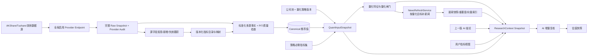
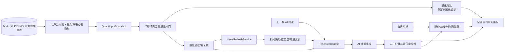
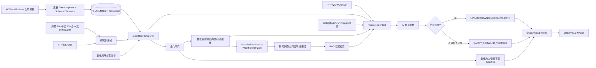
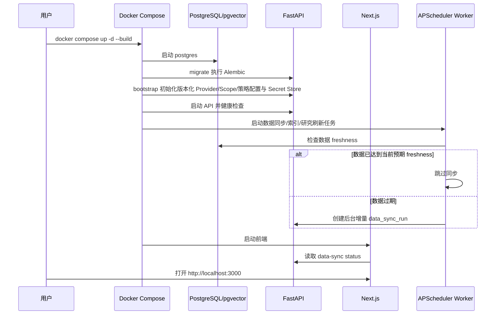
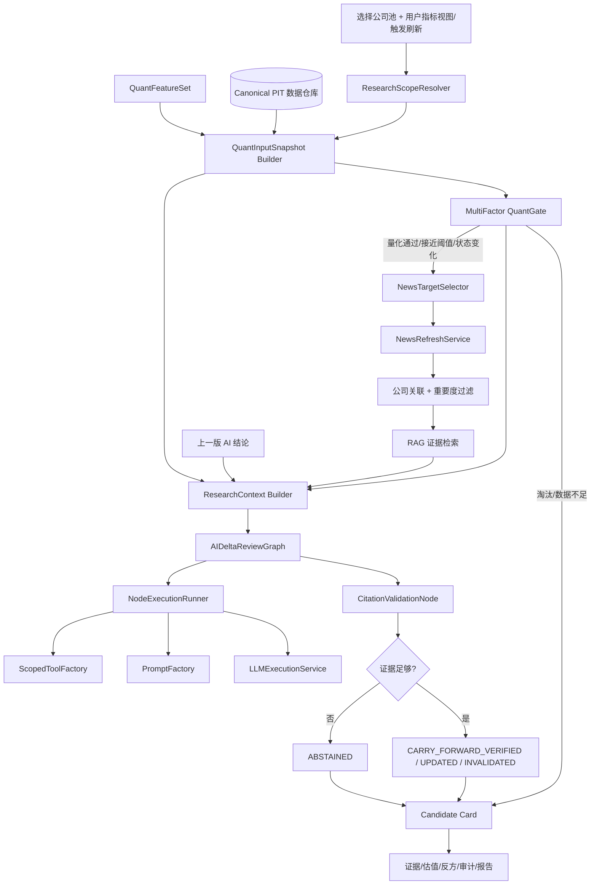

# Margin（安全边际）开源投资研究系统｜产品设计文档 v0.2

> 文档类型：产品设计文档
> 产品版本：v0.2
> 文档版本：v0.2
> 状态：active
> 当前实现：当前代码已实现 v0.2 估值发现主链路；本文件描述 v0.2 产品边界与验收目标
> 产品定位：本地优先、证据驱动、策略可配置、用户保留最终决策权的个人投资研究系统
> 合规声明：本系统只提供研究辅助，不构成投资建议，不承诺收益，不自动下单。

---

## 0. v0.2 增量设计

v0.2 不再把“输入一个证券代码并立即研究”作为主要入口，而是持续维护一个可选择公司池的内在价值研究账本。底层数据仓库尽可能完整采集 AKShare/Tushare 已接入接口可提供的全部 A 股数据；首期用户公司池支持沪深 300、中证 500 和全 A，后续公司池通过新增规则策略扩展。

### 0.1 产品目标

- 回答“这家公司基于当前可用证据本应该值多少”，不预测明日价格；
- 用户选定公司池内的全部公司进入量化层并全部展示，不隐藏被淘汰公司；
- 量化层先排除明显不符合策略、数据不足或价值陷阱风险过高的公司；
- 数据 Provider 按全局采集策略同步全部已启用接口、证券范围和返回字段，不因用户公司池或指标选择减少底层采集；
- AKShare/Tushare 的原始响应、多源标准事实和字段生命周期完整保留；Canonical 层只选择推荐值，不覆盖其他来源；
- PostgreSQL 中的时点数据仓库是量化和 AI 的唯一事实来源；
- 用户选择公司池控制研究证券范围；用户指标集只控制 Dashboard 和 AI 展示视图，不得裁剪量化策略必需输入；
- AI 只分析量化通过或发生实质信息变化的公司，避免无意义的每日全量调用；
- 无新信息时沿用上次 AI 内在价值判断，仅根据最新价格更新折价率和安全边际；
- v0.2 不做用户持仓分析、持仓监控、买入后告警或持仓复盘；
- 每次量化结果、AI 结论、估值区间和触发原因均保存为不可变快照。

### 0.2 更新机制

| 更新类型 | 处理 |
| --- | --- |
| 首次初始化 | 对全部已启用 Provider endpoint 执行配置化历史回填；默认覆盖全 A，优先回填可获得的完整财务/估值历史、至少 3 年行情、最近 1 年公告和最近 90 天新闻 |
| 启动 freshness 检查 | 系统启动时检查各数据域是否达到当前预期 freshness；已最新则跳过同步，过期则自动创建后台增量同步任务 |
| 每日同步 | Worker 自动同步所有启用接口的增量数据，并重抓配置化修订窗口；用户公司池和指标集不参与采集任务裁剪 |
| 仅价格变化 | 重算当前折价率、安全边际和低估状态；普通价格变化不搜索新闻、不调用 AI |
| 无实质量化/新闻变化 | 本轮数据与新闻检查完整时，`AIDeltaReviewGraph` 执行确定性变化检测和引用检查，零 LLM 调用写入 `CARRY_FORWARD_VERIFIED` |
| 新财报/业绩预告 | 重新计算量化指标并触发 AI 研究 |
| 量化后新闻补充 | 量化完成后，系统把当天进入研究目标集的全部公司传给 NewsRefreshService；默认包含全部 `PASS` 和策略允许的 `NEAR_THRESHOLD`，不按固定 top-N 截断 |
| 价格进入观察区间 | 可生成高优先级 NewsRefresh 目标；只有发现新增重要证据或复核到期才触发 AI，单纯价格越界仍只重算估值 |
| 重大公告/实质新闻 | 写入快照与向量库，经相关性/重要度过滤后进入当日 `ResearchContext`，触发 AI 增量复核 |
| 行业基本面变化 | 标记相关行业公司待更新，并按事件影响范围重新研究 |
| 定期复核到期 | 即使没有明显事件，也按策略设定周期重新验证关键假设 |
| 同步失败 | 系统仍可启动和浏览最近有效快照；公司和数据域标记 `STALE` / `PROVIDER_DEGRADED`，不得生成高置信新结论 |
| 手动兜底 | 前端暴露“同步数据/重试同步”按钮，用于 Provider 失败、网络恢复或用户需要立即刷新时触发后台同步 |

“当前预期 freshness”不能简单等同自然日。行情数据按交易日历和 Provider 可用时间判断，例如非交易日使用最近一个应可得交易日；公告、新闻可以按自然日或增量游标判断；财务披露按 `available_at` 和披露日判断。

### 0.3 数据事实来源模式

v0.2 的数据链路必须先全量入库再按作用域消费。量化层和 AI 不直接调用 AKShare、Tushare 或其他外部行情/财务接口，避免外部接口数据变动导致研究结果不可复现。



这个模式的产品含义：

- Provider 不判断公司是否低估，也不生成策略结论；
- 每次同步都有 `data_sync_run`、Provider 调用审计、完整 Raw Snapshot、Schema 指纹、输入哈希和质量状态；
- 新增源字段先登记为 `UNMAPPED_NEW`，映射后进入标准指标层；失效字段和被替代指标只关闭当前版本，不删除历史；
- 同一指标的 AKShare/Tushare 事实同时保留，Canonical 规则按质量、时点和冲突策略选择推荐值；
- 量化只读取公司池、量化策略必需指标集解析后的 canonical 行情、财务、估值和行业数据；用户隐藏某个指标不得改变量化结果；
- News/WebSearch 不做无边界全网采集，而是在量化完成后由 `NewsRefreshService` 按目标公司搜索、抓取、快照、关联和过滤；
- 新闻/公告先形成 raw snapshot、公司关联、重要度评分、分块与向量索引，再进入 `ResearchContext`；
- AI 只读取量化完成后构造的结构化 `ResearchContext`、上一版有效 AI 结论与 RAG 证据，不直接访问外部数据源；`ResearchContext` 必须引用本轮 `QuantInputSnapshot` 和量化结果；
- 用户看到的估值区间、低估置信度和研究周期都能回到具体数据快照。

### 0.4 两层研究



量化闸门第一版按单日截面多因子筛选实现，覆盖 Quality、Value、Growth、Momentum、Risk 五大因子组。默认权重为 35% / 25% / 15% / 15% / 10%，并在打分前执行可配置硬过滤。量化输出采用正交字段：`screening_status` 只取 `PASS`、`NEAR_THRESHOLD`、`WATCHLIST`、`REJECT`；`data_status` 表示 `OK`、`INSUFFICIENT` 或 `PIT_DEGRADED`；`risk_flags[]`、`review_required` 和 `research_guardrail` 分别表达风险、复核要求和研究限制。研究限制使用 `RESEARCH_ALLOWED`、`LIMITED_RESEARCH`、`RESEARCH_BLOCKED`、`OVERHEAT_CAUTION`、`CONFIDENCE_REDUCED`、`THESIS_RECHECK_REQUIRED`，避免使用 `BUY`、`SELL`、`CHASE` 等交易指令措辞。行业模型由系统管理，银行、保险、周期、消费/制造和成长行业不能使用同一套 PE 规则。

### 0.5 每家公司输出

| 字段 | 含义 |
| --- | --- |
| `intrinsic_value_range` | 内在价值区间，不是单点目标价 |
| `valuation_confidence_interval` | 估值模型不确定性范围 |
| `undervaluation_confidence` | 当前价格低于内在价值的综合置信度 |
| `quant_score` | 确定性量化层综合分 |
| `quality_score` | 盈利、现金流、资本回报与资产负债表质量 |
| `value_score` | 估值便宜程度，负 PE 或亏损导致的低 PE 不视为便宜 |
| `growth_score` | 收入、利润、现金流和盈利质量的改善趋势 |
| `momentum_score` | 中期市场认可度和相对收益，短期过热会扣分 |
| `risk_score` | 风险健康度，分数越高表示风险越低 |
| `screening_status` | PASS、NEAR_THRESHOLD、WATCHLIST 或 REJECT |
| `data_status` | OK、INSUFFICIENT 或 PIT_DEGRADED |
| `risk_flags` / `review_required` | 可同时存在的风险标记与复核要求 |
| `research_guardrail` | 研究允许、限制、阻断、过热谨慎、降置信或 thesis 重检，不是买卖指令 |
| `value_trap_risk` | 价值陷阱风险 |
| `evidence_confidence` | 财务、公告、新闻和引用证据完整度 |
| `watch_price_range` | 进入研究观察区间的价格范围，不构成买卖指令 |
| `investment_horizon` | 估值逻辑可能兑现或需要验证的研究周期，不是持仓建议 |
| `invalidation_conditions` | 估值逻辑和投资假设失效条件 |
| `research_status` | 量化淘汰、等待 AI、AI 已研究、信息变化待更新、数据不足 |
| `news_refresh_status` | 当天相关新闻补充状态，包括 refreshing、degraded、failed、available |
| `ai_delta_decision` | AI 增量复核结果，包括维持、更新、降置信、失效、拒绝判断 |
| `current_review_outcome` | 本轮复核结果，包括 CARRY_FORWARD_VERIFIED、UPDATED、DOWNGRADED、INVALIDATED、ABSTAINED、REVIEW_DEFERRED |
| `effective_assessment_id` | 当前仍生效的最近一次有效结论；本轮 ABSTAIN/DEFERRED 不得覆盖它 |
| `assessment_freshness` | FRESH、STALE 或 EXPIRED，并显示最近完成数据/新闻检查的时间 |

低估置信度不得由 LLM 凭感觉直接填写。系统应结合量化指标、数据完整度、行业模型稳定性、证据一致性、AI 风险审查和价值陷阱风险计算，并保存每个组成项。

### 0.6 用户可配置边界

前端开放五类配置：

1. Provider：数据、WebSearch、LLM、Embedding/Rerank 的选择、密钥和全局启停；密钥由前端只写提交到本地 Secret Store，加密保存且永不回显明文，数据 Provider 配置影响底层全局采集能力，不与某个研究作用域绑定；
2. 公司池：首期支持沪深 300、中证 500 和全 A；后续通过规则策略增加行业池、自定义指数池等；
3. 用户指标视图：支持 `ALL`、`INCLUDE`、`EXCLUDE` 三种模式，只决定 Dashboard 和 AI 展示指标，不决定底层采集，也不能移除量化策略版本声明的必需指标；
4. 量化闸门：系统默认阈值、用户调整、恢复默认、版本化；
5. AI 投资风格 Prompt：价值、成长、股息、逆向等投资理念和用户关注重点。

系统 Guardrail Prompt、证据引用要求、时点约束、结构化输出 Schema、行业估值公式、Canonical 选择规则、Agent 编排和工具权限不可由普通用户覆盖。公司池、指标集、量化阈值或 Prompt 修改必须生成新的研究作用域/策略版本。

### 0.7 v0.2 用户路径

v0.2 的默认用户路径应从“先想起某只股票”改成“先看系统发现了什么”：

1. 用户打开研究首页，选择沪深 300、中证 500或全 A 公司池，并选择“全部指标”或已保存指标集；
2. 系统展示全部公司，按“低估候选、接近观察价、信息变化待更新、AI 已研究、量化淘汰、数据不足”分组；
3. 用户先看量化层结果：估值分位、质量分、风险分、数据完整度和淘汰原因；
4. 用户进入公司详情，看内在价值区间、当前折价率、低估置信度、价值陷阱风险、研究周期和失效条件；
5. 用户可以查看数据 freshness、最近同步时间、过期数据域和同步失败原因；
6. 用户展开证据，查看财报、公告、新闻、WebSearch 原文快照和引用定位；
7. 数据同步失败或数据过期时，用户可点击“同步数据/重试同步”触发后台同步；
8. 用户可调整公司池、指标集、量化阈值或投资风格 Prompt，系统生成新的研究作用域版本并重新计算受影响公司；
9. 用户不直接从系统下单，系统只提供观察区间、研究结论和复核提醒。

首页必须避免“只展示几张 AI 精选卡片”的黑盒体验。被淘汰公司同样要显示，并说明为什么不值得继续消耗 AI。

Research Board Copilot 在 v0.2 只承担只读信息整合：理解“今天哪些公司值得继续看”“为什么结论没变”等意图，调用与当前页面和作用域绑定的查询、筛选、聚合和证据导航能力。它不启动另一套自主研究流程，不越过 `AIDeltaReviewGraph` 生成新估值，不调用实时 WebSearch，也不修改策略、密钥或运行状态。

### 0.8 v0.2 功能模块拆分边界

后续使用 Superpowers 拆临时 spec/plan 时，必须按功能模块拆分：

| 模块 | v0.2 设计边界 |
| --- | --- |
| 01 data_provider | Provider Endpoint、全范围增量同步、完整 raw snapshot、源字段发现、指标目录/映射、多源标准事实、Canonical、PIT/质量检查 |
| 03 filing_websearch | 统一 NewsRefreshService、量化目标公司新闻搜索、原文快照、事件重要度、来源合规、去重和 materiality 过滤 |
| 04 text_indexing | 新公告/新闻的解析、按内容 hash 幂等分块、Embedding、pgvector 索引 |
| 05 rag_evidence | 估值假设、风险、反方理由、新闻影响的证据定位和引用校验 |
| 06 multi_agent_research | 基于上一版 AI 结论、当前量化结果和新增重要新闻的 AI 增量复核 |
| 07 strategy_config | Provider、公司池、指标集、量化闸门、投资风格 Prompt 和研究作用域的版本化配置 |
| 08 research_candidate_dashboard | 全公司估值发现面板、公司详情、状态筛选、淘汰原因和估值视图 |
| 10 deployment_audit | 定时任务、失败重试、审计记录、指标和降级展示 |
| 11 valuation_discovery | 公司池快照、`valuation_discovery/quant` 多因子量化筛选、行业估值模型、置信度校准、刷新事件和估值快照 |

跨模块能力通过接口和事件串联，不能把 v0.2 写成一个大模块。
02 持仓与 09 持仓监控仅保留历史编号；v0.2 已删除其实现，不进入产品主线或验收。

## 1. 产品摘要

Margin 的目标不是替用户“预测明天涨跌”，而是把个人投资研究中最容易失控的部分结构化：

- 数据来源分散；
- 公告、新闻、财报难以长期追溯；
- AI 结论容易脱离原文；
- 策略和 Prompt 难以版本化；
- 公司池太大，用户很难系统性发现“当前可能被低估”的公司；
- 事后很难知道一次判断到底基于什么证据、什么策略版本和什么数据快照。

v0.1 已经形成一条可运行的研究闭环，v0.2 在此基础上把主线切换为公司池与估值发现：

1. 系统全局接入 AKShare/Tushare 已启用接口，尽可能完整保存全 A 行情、财务、估值、行业和指数成分数据；
2. 原始响应保存为不可变 Raw Snapshot，并跟踪源字段新增、失效、类型变化及标准指标映射；
3. 多 Provider 标准事实同时保留，通过版本化 Canonical 规则生成推荐值；
4. 系统维护沪深 300、中证 500 和全 A 公司池的双时态成员历史；
5. 用户选择公司池、用户指标视图、量化策略和 Prompt，系统生成版本化研究作用域；量化策略单独声明不可被用户视图裁剪的必需指标；
6. 系统先冻结 `QuantInputSnapshot`，量化闸门只通过 `QuantDataAdapter` 读取其中的 canonical PIT 数据，先做硬过滤，再计算质量、估值、成长、动量和风险因子分，并保留正交状态、研究限制和淘汰原因；
7. 对当天进入研究目标集的全部公司调用 `NewsRefreshService` 补充当天新闻，不设置固定 top-N；Provider 限流只影响批次和完成时间，不允许静默丢弃目标；
8. 新闻和公告原文保存为 raw snapshot，完成去重、合规、公司关联、重要度过滤、解析分块和向量化；
9. 系统在量化和新闻处理完成后构造 `ResearchContext`，引用 `QuantInputSnapshot`，包含上一版有效 AI 结论、当前量化结果、重要新闻证据和 RAG 召回证据；
10. `AIDeltaReviewGraph` 先执行确定性变化检测；检查完整且无实质变化时零 LLM 调用写 `CARRY_FORWARD_VERIFIED`，首次研究、实质变化或复核到期时才执行有限证据检索、并行分析和 delta decision；
11. 公司池估值发现面板展示研究状态、新闻复核状态、估值区间、低估置信度、淘汰原因、数据快照和审计记录。



## 2. 产品原则

| 原则 | v0.2 设计要求 | 当前实现 |
| --- | --- | --- |
| 本地优先 | 用户数据、策略、审计、快照默认保存在本地 | Docker Compose + PostgreSQL volume + 本地 audit/snapshot volume |
| 底层全量采集 | 用户作用域不裁剪采集任务；所有启用接口按全证券范围增量同步并回抓修订窗口 | v0.2 provider endpoint scheduler |
| 数据先入库 | Provider 采集结果必须先形成完整 raw snapshot、多源标准事实、质量结果和 canonical 选择，再被量化或 AI 消费 | v0.2 data warehouse |
| 逻辑作用域 | 公司池限制证券范围；用户指标视图只限制 Dashboard/AI 展示；量化必需指标由策略版本独立声明 | research_scope_versions + quant_feature_set_versions |
| 双时态可追溯 | 公司池成员、指标目录和字段映射保留业务有效期与系统认知有效期 | bitemporal history tables |
| 证据优先 | 研究结论必须绑定来源、时间、证据等级或降级原因 | EvidencePackage、ResearchContextSnapshot、CitationValidator、ABSTAINED |
| 用户决策 | 系统不替用户下单，只提供研究、估值、证据和复核入口 | 无券商接口、无自动交易能力 |
| 策略可配置 | 策略模板、Prompt、阈值、版本可追踪 | `strategy_profiles` / `strategy_versions` |
| 降级保守 | 数据缺失或 Provider 失败时不输出高置信信号 | DATA_INSUFFICIENT / ABSTAINED candidate |
| 可审计 | 运行、工具、研究、反馈、估值快照均有审计链路 | audit_records、research_snapshots、dashboard_*、valuation_snapshots |
| 全量可见 | 公司池内全部公司都有状态、原因和最近更新时间 | v0.2 全公司估值发现面板 |
| AI 节制 | AI 只在量化通过或信息变化时运行 | research_refresh_events |

## 3. 目标用户

### 3.1 核心用户

- 自主研究、手动交易的个人投资者；
- 关注 A 股、价值/质量/催化剂/风险复核；
- 愿意本地部署或使用 Docker Compose；
- 希望 AI 研究输出能回到证据，而不是只看聊天式总结；
- 希望系统性扫描公司池，发现当前可能被低估但证据仍需复核的公司。

### 3.2 开发者用户

- 希望扩展数据 Provider、Embedding、Rerank 或 WebSearch；
- 希望新增策略模板、估值视图、量化闸门或行业估值模型；
- 希望所有新增能力能通过版本设计、当前代码文档、测试和审计追溯。

### 3.3 非目标用户

v0.2 不面向高频交易、自动下单、融资融券、券商账户托管、投顾业务、多租户 SaaS，也不做用户持仓分析或持仓监控。

## 4. 产品边界

### 4.1 v0.2 包含

- 数据 Provider：AKShare、Tushare Endpoint、全范围增量同步、完整 Raw Snapshot、Provider 调用审计和源字段发现；
- 时点数据仓库：证券主数据、指标目录/映射、多源标准事实、Canonical 推荐值、质量报告和同步运行记录；
- 公司池：沪深 300、中证 500 和全 A，使用双时态成员拉链；后续公司池通过规则策略扩展；
- 指标集：`ALL`、`INCLUDE`、`EXCLUDE` 逻辑视图，新增和失效指标按确定生命周期规则处理；
- 量化闸门：估值、质量、风险、数据完整度、淘汰原因和状态快照；
- 行业估值：银行、保险、周期、消费/制造、成长等不同模型族；
- 文档处理：公告事件、原始快照、outbox、解析、分块、Embedding、检索；
- RAG 证据：claim/evidence、来源等级、locator、冲突校验、引用失败原因；
- 多 Agent 研究：LangGraph AI delta review、ScopedToolFactory、PromptFactory、Risk Review、CounterArgument、Citation Validator；
- 策略配置：模板、自定义策略、Prompt 合成、版本生命周期；
- 候选面板：全公司状态表、current-vs-effective 结论、证据 locator、估值/量化摘要、反方理由、反馈和 Provider 状态；
- 部署审计：Docker Compose、migrate、bootstrap、worker、Prometheus、Grafana、健康检查。

### 4.2 v0.2 不包含

- MCP Server / MCP Gateway；
- 用户自定义 HTTP 工具或任意第三方工具运行时；
- 自动买卖、券商 API 下单、券商密码保存；
- 用户持仓分析、持仓监控、买入后告警、持仓复盘；
- 多租户权限、团队协作、云端账号体系；
- 大规模历史行情 Parquet/DuckDB 分析层的完整生产化；
- 付费研报全文分发或绕过网站访问控制。

工具扩展统一采用内部工具定义目录、`ScopedToolFactory`、`ToolPolicyEngine`、`ToolExecutor`、类型化 Provider Adapter 和审计记录。

## 5. 用户主流程

### 5.1 本地启动流程



启动 freshness 检查不得阻塞 API 和 Web 启动。即使 Provider 不可达，系统也必须以最近有效快照启动，并在前端显示 stale / degraded 状态。

### 5.2 公司池估值发现流程

1. 用户进入研究面板并选择公司池和用户指标视图；
2. 系统加载双时态公司池成员、用户指标视图、量化策略必需指标集和研究作用域版本；
3. 系统确认量化必需的 canonical 行情、财务、估值、行业分类、公司行动数据已经入库并通过 PIT/质量检查，冻结 `QuantInputSnapshot`；
4. `QuantDataAdapter` 从 `QuantInputSnapshot` 读取作用域内全部公司，硬过滤引擎保留 ST/停牌、上市时间、流动性、亏损、负债、商誉、现金流和数据缺失原因；
5. 因子计算器输出 Quality、Value、Growth、Momentum、Risk 五组 0-100 分，经过行业内标准化、缺失惩罚和权重合成后生成 `screening_status`、`data_status`、`risk_flags`、`review_required`、`research_guardrail`、排名、置信度和可读 `reason_summary`；
6. 当天进入研究目标集的全部公司生成 `news_refresh_targets`；目标总数等于本轮实际目标公司数，不设置固定 top-N，按优先级分批执行直到全部成功或进入可重试/最终失败状态；
7. `NewsRefreshService` 按目标公司搜索、抓取、保存 raw snapshot，并生成公司关联和重要度评分；
8. 重要新闻和公告被解析、分块、向量化，低重要度内容也入库但默认不进入主 `ResearchContext`；
9. 系统为每家公司构造 `ResearchContext`，引用本轮 `QuantInputSnapshot`，包含上一版有效 AI 结论、当前量化结果、行业模型结果、重要新闻证据和 RAG 召回证据；
10. `AIDeltaReviewGraph` 根据 `FULL_REVIEW`、`DELTA_REVIEW`、`CARRY_FORWARD_FAST_PATH` 或 `ABSTAIN` 路由执行；关键 LLM 节点通过工具工厂获得节点专属工具，通过提示词工厂获得版本化 Prompt，并在输出后执行一次受控反思/修订；
11. 图内 `CitationValidationNode` 判断证据是否足够，并在最多一次修复后把引用失败或证据冲突降级为保守结果；外层不重复校验；
12. 结果进入 `dashboard_runs`、`dashboard_items`、`research_snapshots`、`valuation_snapshots` 和 `research_delta_reviews`；
13. 前端展示全部公司状态、新闻复核状态、估值区间、低估置信度、证据、报告和导出。



### 5.3 估值刷新流程

1. APScheduler、启动 freshness 检查或用户手动刷新只创建 `valuation_refresh_run`，不直接承载完整业务流程；
2. `ValuationDiscoveryOrchestrator` 领取待执行 run，并按 `valuation_refresh_steps` 推进数据同步、量化、NewsRefresh、索引、AI 增量复核和 Dashboard 刷新；
3. Worker 周期性执行全部启用 Provider endpoint，覆盖全 A 数据范围并按修订窗口回抓；
4. 系统启动时先执行 freshness 检查，已最新则跳过，过期则自动创建后台增量同步；
5. Provider 原始返回先写完整 raw snapshot、provider call audit 和字段 Schema，再进入标准化、PIT 校验和质量检查；
6. 多源标准事实写入 PostgreSQL，Canonical Resolver 选择推荐值但不覆盖其他 Provider 事实；
7. Provider 失败时记录失败，不阻断系统启动；前端显示 stale / degraded，并保留手动同步按钮；
8. 普通价格变化只重算折价率、安全边际和观察价格区间；价格进入观察区间可以触发 NewsRefresh，但不能单独触发 AI；
9. 新财报、重大公告、实质新闻、行业变化、策略复核到期生成 AI `research_refresh_events`；价格观察触发只有在新闻补充发现重要证据后才升级为 AI 刷新事件；
10. 每次量化 run 结束后，`NewsTargetSelector` 把需要新闻补充的公司写入 `news_refresh_targets`，并关联触发原因、研究作用域和量化结果；
11. `NewsRefreshService` 统一执行搜索、抓取、快照、去重、合规、公司关联、重要度评分、分块和向量化；
12. AI 研究前构造 `ResearchContext`，明确引用 `QuantInputSnapshot`、当前量化结果、上一版有效 AI 结论、用户指标视图和重要新闻/RAG 证据，不由 LLM 现场拉取外部行情/财务数据；
13. AI 增量复核由受控 LangGraph 内部图完成：无实质变化走零 LLM 快路径；需要复核时最多补证一次、引用修复一次，外层编排只记录 `AI_DELTA_REVIEW` step 结果；
14. AI 增量复核完成后写入不可变 `research_delta_reviews` 与估值快照；结论不变且检查完整时写 `CARRY_FORWARD_VERIFIED`，检查不完整时写 `REVIEW_DEFERRED`；
15. 公司详情页展示最新快照、历史快照差异、新闻复核状态、编排步骤状态和对应数据快照版本。

## 6. 页面与信息架构

当前前端使用 Next.js App Router，v0.2 页面主线聚焦公司池估值发现。组合/持仓页面已删除，不进入主导航和验收路径。

```mermaid
flowchart TB
    Home[/ / 首页摘要] --> Research[/research 公司池估值面板]
    Home --> Settings[/settings Provider/公司池/指标集/策略配置]
    Research --> ResearchItem[/research/items/:itemId 研究项详情]
    Research --> ResearchRun[/research/runs/:runId 估值发现运行进度]
    Research --> Universe[/research/universe 公司池与量化状态]

    Universe --> Quant[量化闸门/淘汰原因]
    ResearchItem --> Evidence[证据 locator]
    ResearchItem --> Valuation[量化/估值摘要]
    ResearchItem --> Audit[current vs effective]
    ResearchItem --> Feedback[用户反馈]
    Settings --> Provider[Provider 配置]
    Settings --> Scope[公司池/指标集]
    Settings --> Strategy[量化阈值/投资风格 Prompt]
```

### 6.1 首页

首页承担入口职责：

- 展示系统定位；
- 引导用户进入公司池估值面板；
- 展示 Provider 状态、数据 freshness、最近同步时间、同步失败原因和最近研究刷新状态；
- 提供“同步数据/重试同步”按钮，但默认路径不依赖用户手动点击；
- 对开源用户解释 v0.2 能力边界。

### 6.2 公司池估值面板

公司池估值面板展示：

- 公司池选择：沪深 300、中证 500 和全 A，默认沪深 300；
- 指标集选择：全部指标或用户保存的 `INCLUDE` / `EXCLUDE` 视图；
- 全部公司列表和状态分组；
- 低估候选、接近观察价、信息变化待更新、AI 已研究、量化淘汰、数据不足；
- 量化分、质量分、价值陷阱风险、数据完整度；
- 内在价值区间、当前折价率、低估置信度；
- 淘汰原因、最后更新时间、数据 freshness、研究作用域版本和 Canonical 冲突状态。

### 6.3 公司详情页

公司详情页展示：

- 公司基础信息、行业、估值模型族；
- 当前价格、内在价值区间、折价率、安全边际；
- 低估置信度、价值陷阱风险、研究周期和失效条件；
- 量化指标明细和淘汰/通过原因；
- AI 研究结论、风险、反方理由和未知项；
- 财报、公告、新闻、WebSearch 原文快照和引用定位；
- 本次 `ResearchContext` 使用的数据快照版本、质量状态和 Provider 降级情况；
- 历史估值快照和本次刷新触发原因。

### 6.4 研究运行详情页

研究运行详情页展示：

- 最新 research run；
- 输入公司池、指标集、研究作用域版本和刷新事件；
- 每家公司从量化到 AI 的状态；
- 失败、降级、跳过和复用上次 AI 结论的原因；
- Provider 调用、工具调用和审计 trace。

### 6.5 研究项详情页

研究项详情展示：

- 研究结论；
- 估值视图；
- 证据展开；
- claim 与 evidence；
- 来源定位；
- 审计元数据；
- 研究报告；
- JSON/Markdown 导出。

## 7. 策略配置产品设计

策略配置不只是 Prompt 文本，而是一个版本化对象。

| 能力 | 产品含义 | 当前实现 |
| --- | --- | --- |
| 策略模板 | 给新用户提供默认策略起点 | `GET /strategies/templates` |
| 自定义策略 | 高级用户配置策略 JSON | `POST /strategies/custom` |
| 版本管理 | 每次修改生成新版本 | `strategy_versions` |
| 生命周期 | validate → backtest → paper-trade → activate | strategy route + service |
| Prompt 合成 | 把策略和任务生成实际 LLM prompt | `GET /strategies/{id}/versions/{vid}/prompt` |

v0.2 的策略页面尚未完全产品化为前端配置中心，但后端能力已可供后续 UI 接入。

## 8. 证据与研究输出设计

### 8.1 Candidate Card 字段

| 字段 | 用户意义 |
| --- | --- |
| `symbol` | 研究对象 |
| `research_status` | 是否发布、拒绝、失效或降级 |
| `statement` | 简明研究结论 |
| `confidence` | 结论置信度，不等于收益概率 |
| `valuation_range` | 估值区间 |
| `value_trap_score` | 价值陷阱风险 |
| `counter_arguments` | 最强反方理由 |
| `evidence_summary` | 证据数量与来源等级 |
| `disclaimer` | 合规提示 |

### 8.2 证据不足时的产品表达

当行情 Provider、WebSearch、Embedding、LLM 或 Citation Validator 不满足要求：

- 不隐藏失败；
- 不补造结论；
- 在候选卡中显示 `ABSTAINED`；
- 在公司行或研究详情中显示 `DATA_INSUFFICIENT` / `PROVIDER_DEGRADED`；
- 在审计记录中保留失败原因和 trace。

当前实现补充：

- `GET /api/v1/provider-status` 会展示 `openai_llm`、`openai_embedding`、`tavily_websearch`、`http_rerank`。LLM 与 Embedding 有配置时执行真实远端请求；Tavily/Rerank 缺配置时显示 `degraded`。
- `RiskReviewAgent` 与 `ReflectCounterArgumentAgent` 在 v0.2 中返回结构化风险、反方理由和未知项，并记录 `model_version` / trace；它们不保证每条风险或反方理由都有独立证据引用。逐条证据约束、中文输出约束和更严格 evidence-grounded prompt 属于 v0.2。
- `ResearchSignalComposer` 正常路径优先调用 LLM 生成结构化 signal；行情退化、引用校验失败或 LLM 失败时，走规则型保守输出。

## 9. 刷新状态与复核提示设计

v0.2 不做持仓告警，也不接短信、邮件或 IM。系统只在公司池和公司详情内展示研究刷新状态，帮助用户判断某家公司是否需要重新阅读。

| 状态 | 语义 | 示例 |
| --- | --- | --- |
| `UNCHANGED` | 没有实质信息变化 | 仅价格更新，复用上次 AI 判断 |
| `PRICE_REPRICED` | 只刷新折价率和安全边际 | 股价进入观察区间 |
| `MATERIAL_UPDATE` | 需要重新研究 | 新财报、重大公告、实质新闻 |
| `REVIEW_DUE` | 策略要求定期复核 | 距上次研究超过策略周期 |
| `DATA_INSUFFICIENT` | 数据不足，不能给高置信结论 | 财务缺失、Provider 不可用 |
| `DATA_SYNCING` | 数据正在后台同步 | 启动发现数据过期后自动增量同步 |
| `DATA_STALE` | 使用最近有效快照 | Provider 暂时失败或当前同步未完成 |
| `DATA_SYNC_FAILED` | 最近一次同步失败 | 用户可点击“同步数据/重试同步” |
| `NEWS_REFRESHING` | 正在按量化目标补充新闻 | `NewsRefreshService` 正在搜索、抓取或向量化 |
| `NEWS_DEGRADED` | 新闻源或 WebSearch 降级 | Tavily 不可用、目标站点不可达、robots 限制 |
| `NEWS_SYNC_FAILED` | 新闻补充失败 | 搜索或抓取失败，本轮不得声称已确认“无实质变化” |
| `AI_CARRY_FORWARD_VERIFIED` | 已完成本轮数据和新闻检查，确认维持上一版判断 | 无实质变化时可由确定性快路径生成，不要求调用 LLM |
| `AI_UPDATED` | AI 复核后更新估值或理由 | 新闻、财报或量化结果改变了判断 |
| `AI_DOWNGRADED` | AI 复核后降低置信度 | 证据冲突、数据质量下降或风险上升 |
| `AI_INVALIDATED` | AI 复核后判定原结论失效 | 核心假设被新证据否定 |
| `AI_ABSTAINED` | 证据不足，拒绝高置信输出 | 引用失败、证据不足或上下文缺失 |
| `REVIEW_DEFERRED` | 本轮复核因外部依赖或预算未完成 | 保留上一版有效结论，但标记 stale，不生成新的有效判断 |

刷新状态进入 `research_refresh_events`、`news_refresh_runs`、`research_delta_reviews` 和估值快照审计链；用户的反馈进入 dashboard feedback，不写入持仓复盘表。
数据同步状态进入 `data_sync_runs` 和 data freshness 状态；手动同步按钮只创建后台任务，不在前端阻塞等待完成。
News/WebSearch 降级不得阻塞量化结果展示，但当前复核结果必须是 `REVIEW_DEFERRED` 或 `AI_ABSTAINED`；页面可继续展示 `effective_assessment_id` 指向的上一版有效结论，同时明确显示 stale 原因、最近成功新闻检查时间和当前复核失败状态。

## 10. 开源版本体验

开源用户应该能在没有商业数据授权的情况下体验主流程：

1. clone 仓库；
2. 首次启动通过前端 Provider 设置页录入密钥，或由运维通过环境变量预置本地密钥加密主密钥；
3. `docker compose up -d --build`；
4. 打开前端；
5. 查看示例公司池或沪深 300 公司池；
6. 发起或查看量化 run / research run；
7. 查看公司详情、证据、估值和研究刷新状态；
8. 通过测试确认本地环境没有破坏核心逻辑。

生产主流程要求所启用 Provider 配置完整并通过真实健康检查。Demo 模式可以使用明确标记的种子数据，但不得把 mock 或缺失 Provider 的结果标记为生产验证通过。

### 10.1 Provider 密钥配置体验

- 前端只提供“新建/替换/删除/测试连接”，永不返回或展示已经保存的密钥明文；
- 后端使用本地 Secret Store 加密保存，密文、nonce、key version 与审计元数据分离；加密主密钥只允许通过运行环境注入；
- 列表接口只返回 `configured`、`last_four`、`updated_at`、`last_test_status`，不返回 secret、密文或可逆摘要；
- 所有写操作要求本地管理员会话和 CSRF 防护，并写 append-only 审计；
- 日志、trace、异常、Provider request dump、前端状态和测试输出统一脱敏；
- Secret 轮换产生新版本，已启动的 run 继续绑定原 Provider 配置版本，新 run 使用新版本。

## 11. 产品验收标准

v0.2 的验收不是 51 项同时开始、同时完成，而是三个连续交付门：

| 层级 | 目标 | 主要模块 | 进入下一层条件 |
| --- | --- | --- | --- |
| P0 数据与量化底座 | 建立可审计的全量数据仓库、双时态公司池、QuantInputSnapshot、正交量化结果和 DB-backed 编排 | 01、07、10、11 | P0 项全部通过，真实 AKShare/Tushare smoke 和 PIT/迁移测试通过 |
| P1 新闻、证据与 AI 复核 | 完成无固定数量裁剪的 NewsRefresh、文本索引、证据链、ResearchContext、受控 LangGraph、工具/Prompt 工厂 | 03、04、05、06、11 | P1 项全部通过，真实 Tavily/LLM/Embedding/Rerank 与端到端增量复核 smoke 通过 |
| P2 产品化与生产验收 | 完成全公司 Dashboard、Provider 密钥配置、安全治理、容量/成本/恢复、全链路 E2E 和文档 | 07、08、10 及跨模块收口 | 全量 lint/test/build/migration/Compose/smoke 通过，设计、源码与 `docs/code` 一致 |

每个层级内部仍按功能模块逐个实现和验收；P0 未完成不得开始 P1 代码，P1 未完成不得开始 P2 代码。

| 编号 | v0.2 验收项 | 验证方式 |
| --- | --- | --- |
| P-01 | 能初始化沪深 300、中证 500 和全 A，并以双时态拉链查询任意业务日、任意系统认知时点的成员 | bitemporal universe DB/API test |
| P-02 | 所有启用 Provider endpoint 按全证券范围执行首次回填、增量同步和修订窗口回抓，不受用户公司池或指标集裁剪 | endpoint scheduler integration test |
| P-03 | Provider 同步必须产生完整 raw snapshot、provider call audit、Schema 指纹、多源标准事实和质量报告 | data sync integration test + DB/volume 校验 |
| P-04 | 新增、缺失、类型变化和废弃源字段能被登记；指标映射和替代关系保留双时态历史 | schema discovery + mapping lifecycle test |
| P-05 | AKShare/Tushare 同一指标事实同时保留，Canonical 选择可追溯到全部候选事实、规则版本和冲突原因 | canonical resolver contract test |
| P-06 | 启动时能检查 data freshness；已最新则跳过，过期则自动创建后台增量同步任务 | startup freshness test |
| P-07 | Provider 失败时 API/Web 仍能启动，前端显示 stale/degraded 状态和失败原因 | startup degradation E2E |
| P-08 | 前端“同步数据/重试同步”只触发全局后台 data_sync_run，不按当前页面作用域裁剪数据 | data sync UI/API test |
| P-09 | 用户可选择沪深 300、中证 500 或全 A，并配置 `ALL`、`INCLUDE`、`EXCLUDE` 用户指标视图；量化策略必需指标独立版本化且不能被视图裁剪 | scope/feature-set API + frontend test |
| P-10 | 量化层只能读取冻结 `QuantInputSnapshot` 中的 canonical PIT 数据，不直接调用 Provider、读取 Raw Snapshot 或依赖后置 `ResearchContext` | service boundary + snapshot contract test |
| P-11 | 所选公司池全部公司进入量化层并产出状态，不隐藏淘汰和数据不足公司 | quant run + dashboard E2E |
| P-12 | 量化淘汰必须给出结构化原因、关键指标、指标版本和数据质量状态 | quant result 字段校验 |
| P-13 | 普通价格变化只刷新折价率和安全边际；价格观察触发最多先执行 NewsRefresh，只有新增重要证据或复核到期才触发 AI | refresh policy 单测 + audit |
| P-14 | 新财报、重大公告、实质新闻、行业变化或复核到期能生成 AI 刷新事件 | refresh event 测试 |
| P-15 | AI 研究必须基于后置 `ResearchContext`，该快照显式引用本轮 `QuantInputSnapshot`、量化结果、NewsContextBundle、上一版有效结论、RAG 证据和受控工具结果 | workflow contract test |
| P-16 | AI 研究输出必须绑定 evidence_ids、locator、source level 和 available_at | citation validation 测试 |
| P-17 | 每家公司展示内在价值区间、低估置信度、价值陷阱风险、观察价区间、研究周期和失效条件 | company detail E2E |
| P-18 | Provider 缺失、数据不足、Canonical 冲突或证据冲突时保守降级，不输出高置信低估结论 | degradation tests |
| P-19 | `NewsTargetSelector` 为本轮全部研究目标生成 `news_refresh_targets`，目标总数等于实际入选公司数，不使用固定 top-N；Provider 限流通过优先级批次、重试和断点续跑处理 | target completeness + retry test |
| P-20 | `NewsRefreshService` 只接收目标公司列表执行搜索、抓取和快照，不允许 AI 在推理阶段临时全网搜索 | service boundary + workflow contract test |
| P-21 | 新闻/WebSearch 结果必须落 `news_refresh_runs`、`search_queries`、`search_results`、raw snapshot、公司关联和重要度评分 | news refresh integration test + DB 校验 |
| P-22 | 新闻与公告原文按内容 hash 幂等解析、分块、向量化，并且检索时只能返回 `available_at <= decision_at` 的证据 | indexing + PIT retrieval test |
| P-23 | 低重要度新闻仍可入库和向量化，但默认不得进入主 `ResearchContext` | materiality filter test |
| P-24 | 增量复核图读取上一版有效结论、当前量化结果、重要新闻证据和 RAG 证据，输出 `CARRY_FORWARD_VERIFIED`、`UPDATE_ASSESSMENT`、`DOWNGRADE_CONFIDENCE`、`INVALIDATE`、`ABSTAIN` 或 `REVIEW_DEFERRED` | delta review workflow test |
| P-25 | 只有本轮数据和新闻检查完成时才能写不可变 `CARRY_FORWARD_VERIFIED`；新闻失败必须 `REVIEW_DEFERRED/ABSTAIN`，并保留而不覆盖 `effective_assessment_id` | carry-forward/freshness audit test |
| P-26 | APScheduler、启动检查和手动刷新只能创建或唤醒 `valuation_refresh_run`，不能把端到端业务逻辑塞进单个定时任务 | scheduler boundary test |
| P-27 | `ValuationDiscoveryOrchestrator` 必须写入 `valuation_refresh_runs` 与 `valuation_refresh_steps`，前端能展示每个阶段状态、输出引用和失败原因 | orchestration DB/API/E2E test |
| P-28 | 每个编排步骤必须幂等；重复执行不得产生重复 raw snapshot、重复新闻 target、重复 AI 结论或重复 dashboard item | idempotency/retry integration test |
| P-29 | LangGraph 只用于 AI 内部 `AIDeltaReviewGraph`，不允许直接编排数据同步、NewsRefresh 或 Dashboard 发布 | service boundary test |
| P-30 | 开发过程 spec/plan 按功能模块拆分，完成后同步 `docs/code/` | `docs/superpowers/` ignore + code docs check |
| P-31 | Phase 1 量化模块位于 `src/margin/valuation_discovery/quant/`，通过 `QuantDataAdapter` 读取 data warehouse，不接入 AKShare/Tushare 或 Raw Snapshot | module boundary test |
| P-32 | 硬过滤必须配置化并保留结构化 `filter_reasons`；被过滤公司仍写入 `quant_screen_results` 并在 Dashboard 可见 | quant result DB/API/E2E |
| P-33 | 每个公司输出 Quality、Value、Growth、Momentum、Risk 五组 0-100 分和 `final_score`，默认权重为 35/25/15/15/10 | scoring unit tests |
| P-34 | 因子标准化使用 winsorize、行业内 percentile rank、方向统一和缺失置信度惩罚；关键字段缺失输出 `DATA_INSUFFICIENT` | normalization tests |
| P-35 | 量化输出拆为 `screening_status`、`data_status`、`risk_flags[]`、`review_required` 和 `research_guardrail`，不得把互相正交的条件塞入单一状态枚举 | classifier contract test |
| P-36 | 负 PE 或亏损公司不得因低 PE 获得高估值分；短期过热触发 `OVERHEAT_CAUTION`，不得输出交易指令型标签 | factor/risk rule tests |
| P-37 | 历史运行和回测必须使用 `available_at <= trade_date`；缺 `available_at` 时只能标记 `PIT_DEGRADED` 的降级结果 | PIT regression test |
| P-38 | `quant_screen_runs` 与 `quant_screen_results` 必须保存策略版本、数据版本、因子明细、缺失字段、风险标记、排名和可读原因摘要 | repository contract test |
| P-39 | `AIDeltaReviewGraph` 只能接收冻结的 `context_snapshot_id`，不得执行公司池解析、量化、实时 WebSearch、文档抓取、持仓约束或 Dashboard 发布 | graph boundary test |
| P-40 | ReviewMode 必须确定性区分 `CARRY_FORWARD_FAST_PATH`、`DELTA_REVIEW`、`FULL_REVIEW`、`REVIEW_DEFERRED` 和 `ABSTAIN`；只有模糊变化影响允许调用 ChangeImpactClassifier LLM | routing unit tests |
| P-41 | Fundamental、Valuation、Risk、CounterArgument 四个分析节点可并行执行，且每条关键输出绑定 evidence IDs 或显式标记证据缺口 | graph fan-out/fan-in contract test |
| P-42 | 图内最多执行一次定向补证和一次引用修复，超过 step/LLM/retrieval/repair 预算必须 `ABSTAIN`，不得无限循环 | graph budget tests |
| P-43 | 图内工具限定为冻结上下文、量化结果、财务快照、估值、RAG、已存 WebSearch 快照、受限计算和引用校验等只读工具 | scoped tool policy test |
| P-44 | `ai_graph_runs`、`ai_graph_node_runs` 和 PostgreSQL checkpoint 能恢复中断运行，并记录节点输入/输出哈希、模型/Prompt 版本、token、工具调用和错误 | checkpoint/recovery integration test |
| P-45 | `ScopedToolFactory` 必须按 graph node、冻结作用域、工具策略版本和预算生成节点专属 ToolManifest；模型不得看到全局工具目录 | tool factory/manifest tests |
| P-46 | 每次工具请求必须经过 capability、node grant、scope、PIT、预算和 Schema 校验；权限拒绝也落审计且不产生副作用 | tool policy integration tests |
| P-47 | `PromptFactory` 必须按系统护栏、节点任务、用户风格、最小上下文、ToolManifest、输出 Schema 和预算顺序生成不可变 PromptArtifact | prompt factory snapshot tests |
| P-48 | Draft/Reflection/Revision Prompt 分别版本化；用户投资风格不得覆盖系统 guardrail、PIT、引用或非交易边界 | prompt precedence/security tests |
| P-49 | Fundamental、Valuation、Risk、CounterArgument、TargetedReanalysis 和 DeltaDecision 节点执行确定性检查及最多一次 critic 反思和一次修订 | node reflection tests |
| P-50 | critic 只能输出 ACCEPT/REVISE/NEEDS_EVIDENCE/ABSTAIN，不得调用工具、补造事实、替换 evidence ID 或直接修改 Graph State | reflection guardrail tests |
| P-51 | 节点运行保存 `tool_manifest_hash`、Prompt 版本/hash、reflection decision/issues、draft/revised output hash；LLM 调用按完整版本键幂等复用 | node/LLM audit recovery tests |
| P-52 | 前端 Provider 设置支持密钥只写录入、替换、删除和真实连接测试；API 永不回显明文或密文，Secret Store 加密、轮换、脱敏、CSRF 和审计完整 | secret API/security/E2E tests |
| P-53 | 外部新闻和工具文本被标记为不可信数据并隔离，不能修改系统 Prompt、工具权限、作用域或引用规则 | prompt-injection adversarial tests |
| P-54 | 官方公告使用全局增量游标持续采集，WebSearch 使用量化目标定向搜索；当前量化未通过的公司仍不会漏掉已发布官方公告 | filing/news boundary integration test |
| P-55 | 行业分类采用带 valid/system time 的历史成员关系；历史量化按当日行业排名，行业样本不足时执行版本化降级规则 | industry PIT regression test |
| P-56 | 原始价格、公司行动和 as-of 复权序列可追溯，历史量化和回测不得使用未来分红、拆分或送转信息 | corporate-action PIT tests |
| P-57 | 全局并发、Provider RPM/TPM、LLM token/cost、目标批次和背压可配置并可观测；达到预算后任务进入明确等待/失败状态，不静默丢目标 | capacity/backpressure tests |
| P-58 | API 对长任务返回 `202 + run_id`，提供分页、筛选、幂等键、步骤进度和结构化错误；不得同步阻塞请求线程 | API contract/E2E tests |
| P-59 | 图、工具、Prompt、策略和 Secret 版本在 run 创建时冻结；运行恢复继续使用原版本，新激活版本只作用于新 run | version activation/recovery tests |
| P-60 | LangGraph checkpoint、节点/工具/LLM 审计和最终业务结果通过事务边界或 outbox 保持一致，崩溃重试不重复发布 | crash/recovery integration tests |

## 12. 当前限制与 v0.2 范围

### 12.1 当前限制

- WebSearch 需要用户自行提供 Tavily key；
- Tushare 需要用户自行提供 token；
- 真实行情源可能因网络、上游接口或频控不可达；
- 新闻/WebSearch 不追求全网全量覆盖，只保证对量化目标公司进行可审计、可重试、可降级的相关信息补充；
- v0.2 P2 必须完成 Provider、公司池、用户指标视图、量化阈值和投资风格 Prompt 的前端配置中心；
- Rerank 是可选 Provider；
- Provider 密钥前端配置属于 v0.2 P2；环境变量只用于 Secret Store 主密钥和无 UI 的运维预置；
- 风险与反方审查当前是结构化 LLM 输出，但不强制逐条证据引用；
- 量化回测、绩效归因和报告导出属于 Phase 2，不阻塞 v0.2 主链路的单日截面筛选；
- 大规模历史回测和 Parquet/DuckDB 分析层仍未作为 v0.2 生产主链路。

### 12.2 v0.2 已确认增量

- 沪深 300、中证 500 和全 A 公司池的双时态成员拉链与同步审计快照；
- Provider Endpoint 全范围采集、完整 Raw Snapshot、源字段生命周期、指标目录/映射和 PIT/质量检查；
- AKShare/Tushare 多源事实并存及可审计 Canonical 推荐值；
- `ALL`、`INCLUDE`、`EXCLUDE` 指标集与版本化研究作用域；
- 全公司 Phase 1 单日截面多因子量化筛选及可解释淘汰原因；
- `src/margin/valuation_discovery/quant/` 子包边界、`QuantDataAdapter`、硬过滤、因子标准化、状态分类和量化结果持久化；
- 行业专属估值模型和内在价值区间；
- 基于新财报、公告、新闻、行业变化和量化状态变化的 NewsRefresh 与 AI 增量复核；
- 基于量化目标公司的 `NewsRefreshService`，统一完成新闻搜索、抓取、快照、公司关联、重要度过滤和向量入库；
- 基于上一版 AI 结论、当前量化结果和当日重要新闻/RAG 证据的 AI 增量复核；
- 受控 `AIDeltaReviewGraph`：确定性 carry-forward 快路径、ReviewMode 路由、并行分析、一次补证、一次引用修复和 PostgreSQL checkpoint；
- 节点级 `ScopedToolFactory`、默认拒绝的 capability 权限、版本化 `PromptFactory` 和一次受控 critic 反思/修订；
- `research_delta_reviews`、`CARRY_FORWARD_VERIFIED` 与 `REVIEW_DEFERRED` 记录，支持每天增量接续而不是重复生成孤立结论；
- 全公司研究状态与低估置信度面板；
- Provider、公司池、指标集、量化阈值和投资风格 Prompt 配置；
- 风险/反方/未知项逐条绑定 evidence_ids、locator 和中文输出约束。

v0.2 设计评审通过后，使用 Superpowers 在被 Git 忽略的 `docs/superpowers/` 下按功能模块分别生成 spec 与详细 plan，禁止把整个版本合并成一份文档。v0.3 应从 `docs/design/v0.2` 复制后继续增量迭代。

## 13. 总结

Margin v0.1 已经形成可运行的本地研究闭环；v0.2 设计把它升级为持续维护公司内在价值的研究系统。当前 v0.2 尚处于设计阶段，不应把本文中的增量能力视为已实现。

产品默认保守：宁可拒绝高置信输出，也不在证据不足时编造确定性。这是 Margin 与普通聊天式投研工具的核心差异。
