# Margin（安全边际）开源投资研究系统｜架构设计文档 v0.3

> 文档类型：系统架构设计文档
> 产品版本：v0.3
> 文档版本：v0.3
> 状态：review
> 架构模式：模块化单体 + 本地 Docker Compose + 持久化 Worker + Provider/Tool 插拔边界
> 当前实现：FastAPI、Next.js、PostgreSQL/pgvector、APScheduler、Prometheus、Grafana、OpenAI-compatible LLM/Embedding
> 上一版本基线：v0.2 active
> 重要边界：v0.3 重构数据分层并新增 Analysis Mart 第四层；不实现自动下单、持仓分析或持仓监控。

---

## 0. v0.3 增量架构

v0.3 在 v0.1 模块化单体上新增 `11-valuation_discovery` 业务边界。该模块负责公司池时点快照、全量多因子量化筛选、行业估值模型、内在价值快照、低估置信度和事件驱动刷新；它不替代现有数据、公告、向量、证据、Agent、策略和 Dashboard 模块。组合、持仓和持仓监控实现已删除，模块编号仅用于历史审计。

### 0.1 四层数据库事实 + 服务层（v0.3 权威边界）

本节优先于从 v0.2 复制的后续数据模型描述。所有实现必须满足以下单向依赖：

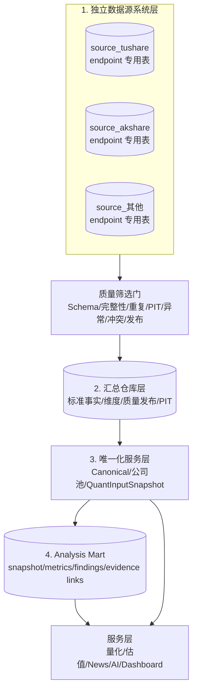

禁止依赖：

- 数据仓库层不得直接调用 Provider，只能消费质量层发布批次；
- 唯一化服务层不得读取 `source_*` schema；
- 量化与其他上层服务不得读取 `source_*` 或质量暂存表；
- Analysis Mart 只能由第三层 canonical/company-pool/QuantInputSnapshot、量化结果和受控证据引用派生，不能反向改写底层事实；
- AI 与 Dashboard 读取 Analysis Mart 必须经过类型化 repository/service 或 scoped read tools；
- 源系统之间不得相互写入或共享 endpoint landing 表；
- Canonical 是仓库服务值，不是源系统表，也不替代源数据历史。

#### 0.1.1 独立数据源系统层

每个 Provider 是一个独立系统。共同控制面可复用代码，但业务数据物理隔离：

```text
source_tushare.endpoint_catalog
source_tushare.sync_runs / sync_partitions / call_audits
source_tushare.stock_basic
source_tushare.daily
source_tushare.daily_basic
source_tushare.income
...

source_akshare.endpoint_catalog
source_akshare.sync_runs / sync_partitions / call_audits
source_akshare.<endpoint>
...
```

每个 endpoint 使用独立 landing 表。统一 lineage 列包括源记录 ID、自然键 hash、
payload hash、Raw Snapshot、run/partition/call、业务时间、获取时间、Schema version
和修订号；完整返回字段保存在 `payload_json`，不得因尚未映射而丢失。

#### 0.1.2 质量筛选层

质量层使用独立 `quality` 逻辑边界，保存 ruleset、报告、逐项问题、隔离记录和发布
批次。检查至少包括必填字段、类型/Schema 漂移、自然键重复、时间合法性、PIT、
数值范围、跨记录一致性和跨源差异。结果为 `publish`、`publish_degraded`、
`quarantine` 或 `mapping_required`；任何结果都不删除源记录。

#### 0.1.3 汇总仓库层

仓库保存统一证券主数据与状态历史、行业/概念/指数成员、市场行情、复权、财务报表、
财务指标、估值、公司行动和多源标准事实。每行必须回链质量发布记录和源记录。
Canonical Resolver 只在仓库候选事实之间选择服务值。

#### 0.1.4 唯一化服务层

唯一化服务层使用仓库 PIT 数据生成 canonical serving 值、公司池不可变快照和
`QuantInputSnapshot`。`ALL_A_NON_ST` 排除 `ST`、`*ST`、退市整理、已退市和
非普通 A 股；每个排除项保存 reason、源状态、`business_at`、`known_at` 和仓库版本。
公司池视图是 QuantInput 的证券范围入口。

#### 0.1.5 Analysis Mart 第四层

Analysis Mart 是 v0.3 面向 AI 流和 Dashboard 的第四层分析结果表，不替代底层
canonical facts，也不作为人工可编辑结果表。它由第三层唯一化数据、量化结果和可校验
证据引用生成，按 security/scope/decision time 保存：

- `analysis_snapshots`：单证券单决策时点的不可变分析快照，记录 quant run/result、
  `QuantInputSnapshot`、策略版本、输入 hash、结果 hash、质量标记和摘要；
- `analysis_metrics`：AI/Dashboard 可直接读取的结构化指标，如最终分、五组因子、
  rank、分位、缺失字段数量、review flag 和数据质量指标；
- `analysis_findings`：从量化结果和 canonical 输入加工的可读发现，例如
  `PASS`/`NEAR_THRESHOLD` 原因、主要正负因子、风险标记和置信度；
- `analysis_evidence_links`：把 snapshot、metric、finding 反链到量化结果、
  QuantInput、canonical fact、Evidence 或未来 ML feature run。

发布规则为 append-only/idempotent：同一输入 hash 与结果 hash 重放不产生重复行；
同一 snapshot ID 出现不同结果 hash 必须拒绝并审计。每日截面量化结果可以按
`trading_date + quant_run_id` 批量发布；同一日多次策略或数据重跑使用不同
`analysis_version/config_hash/input_hash` 保留多版本，AI 默认按 scope 和 decision time
读取最新可见快照。

#### 0.1.6 上层服务

上层只通过类型化 repository/service 使用仓库和公司池。QuantInput 冻结公司池成员、
canonical fact IDs、市场窗口、质量/PIT 状态和输入 hash；量化为每个成员保存通过、
淘汰或数据不足结果，Analysis Mart 把量化与派生分析结果物化为可查询快照。AI 工具
只能通过 scoped read tools 读取 Analysis Mart、ResearchContext、RAG 证据和已存新闻
快照，不能现场加工底层表或调用外部 Provider。

#### 0.1.7 两年滚动窗口与配置控制面

新增 append-only `data_acquisition_policy_versions`：

| 字段 | 说明 |
| --- | --- |
| `policy_version_id` | 不可变版本 ID |
| `owner_id` | 当前为 `local-admin` |
| `rolling_window_months` | 默认 24，服务端约束 12–60 |
| `revision_lookback_days` | 增量同步回抓修订窗口 |
| `financial_comparison_years` | 财务计算额外前置年度，默认 1 |
| `lifecycle` | draft/active/deprecated |
| `created_at`, `activated_at` | 审计时间 |
| `config_hash` | 稳定配置哈希 |

同步 run 创建时冻结 `policy_version_id`、`window_start`、`window_end`。窗口按
`decision_at` 和月历计算，不使用固定 730 天替代月份语义。endpoint 分片不得越过
冻结窗口，但证券主数据、名称/ST 状态、上市/退市、公司行动、lineage 与审计按
PIT/引用需要保留。财务 endpoint 可读取窗口前最少一个比较年度，但这些前置记录
必须标记 `comparison_only`，默认不进入普通前端时序查询。

前端新增 `/settings/data`：

- 展示当前 active 版本、24 个月默认值、预计起止日期、上次同步和覆盖状态；
- 数字输入按月配置 12–60，显示校验错误和存储影响提示；
- “保存新版本”“激活版本”“按新策略同步”分离，避免误触长任务；
- 所有写操作使用本地管理员会话、CSRF、`Idempotency-Key` 和 append-only 审计；
- 完整处理 loading、empty、error、disabled、success 和后台同步状态；
- 桌面双栏、移动端单列，不在 Provider 密钥卡片中混入数据策略。

#### 0.1.8 QuantDataRequirementCatalog

采集调度前必须执行需求规划：

```text
active QuantFeatureSet
+ HardFilter rule inputs
+ ALL_A_NON_ST fields
+ PIT / adjustment inputs
+ industry / index benchmark inputs
→ canonical warehouse datasets
→ provider endpoint candidates
→ current-seat probe
→ enabled endpoint plan
```

`quant_data_requirement_versions` 保存 requirement code、consumer、required warehouse
fields、最少历史、freshness、PIT 规则和 lifecycle；`provider_endpoint_requirement_links`
保存 endpoint 到 requirement 的多对多映射和 mapping version。只有至少一个 active
requirement link 的 endpoint 才能创建同步分片。`out_of_scope` endpoint 只保留目录和
探测元数据，不保存业务行。

当前仅采集 `RiskFactorCalculator` 消费的聚合质押比例，不采集逐笔质押明细。明确禁止
默认采集：管理层、股东名单/人数、龙虎榜、大宗交易、融资融券、
概念题材、新闻热度等未被量化消费的数据。未来策略需要时必须先新增版本化 requirement、
公式、warehouse mapping 和测试，再启用采集。

#### 0.1.9 索引、分区与查询计划验收

索引由实际访问路径驱动，不允许机械地为每列建索引：

- source landing：自然键 hash + revision 唯一；`(symbol, business_date)`、
  `(endpoint, business_date)`、`(partition_id, publication_status)`；
- 同步控制面：未完成分片使用 partial index，覆盖 `status + next_attempt_at + created_at`；
- quality：`(source_system, endpoint, decision, created_at)`，待发布/隔离使用 partial index；
- warehouse market：`(security_id, trade_date DESC)`，按月份或季度分区；
- warehouse facts：`(security_id, indicator_id, event_at DESC, available_at)`，
  必要时使用 covering `INCLUDE`，避免量化截面回表；
- security/status：`(security_id, valid_from, system_from)` 和当前版本 partial index；
- universe：`(snapshot_id, security_id)` 唯一，另建 exclusion reason 查询索引；
- quant：`(quant_run_id, rank_overall)`、`(security_id, decision_at DESC)`。

JSONB 仅对确有过滤需求的路径建立表达式或 GIN 索引；完整 `payload_json` 默认不建
全量 GIN，避免写放大。迁移与真实回填后对公司池生成、QuantInput 截面、历史行情、
未完成分片领取和质量发布执行 `EXPLAIN (ANALYZE, BUFFERS)`；关键查询必须命中预期
索引/分区裁剪，并记录行数估计偏差、执行时间和 buffer。定期检查未使用、重复、
低选择性索引和 bloat。

### 0.2 v0.2 基线数据流（受 0.1 约束）

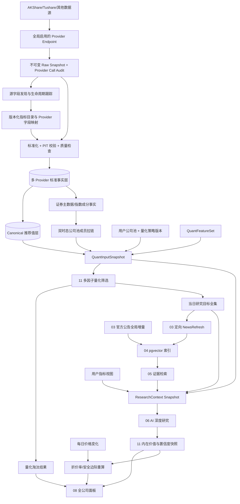

### 0.2 模块职责

| 模块 | v0.3 增量职责 |
| --- | --- |
| 01 data_provider | 动态获取沪深 300 成分股、行情、财务、行业和估值原始字段；写入 raw snapshot、Provider 调用审计、标准化时点数据和质量报告 |
| 03 filing_websearch | 接收量化结果产生的目标公司，搜索/获取相关新闻和公告，保存快照，完成去重、合规、公司关联和重要度过滤 |
| 04 text_indexing | 新闻/公告原文解析、按内容 hash 幂等分块、Embedding、pgvector 持久化 |
| 05 rag_evidence | 为财务结论、风险、反方理由和估值假设提供可定位证据 |
| 06 multi_agent_research | 基于上一版 AI 结论、当前量化结果和新增重要新闻执行 AI 增量复核 |
| 07 strategy_config | 版本化 Provider 引用、公司池、用户指标视图、量化必需特征集、量化阈值和用户投资风格 Prompt |
| 08 dashboard | 展示公司池全部公司、量化淘汰原因、AI 状态和估值结果 |
| 10 deployment_audit | 调度每日增量同步、事件队列、失败重试和运行审计 |
| 11 valuation_discovery | 公司池快照、多因子量化筛选、行业模型注册表、估值快照、置信度与刷新决策 |

### 0.3 核心组件

- `ProviderEndpointRegistry`：登记 AKShare/Tushare 已接入接口、能力、调度方式、限流和启停状态；用户研究配置不控制底层采集范围；
- `DataSyncRunService`：按“覆盖范围全量、时间增量、修订窗口回抓”编排所有启用接口，写入 raw snapshot、审计、标准事实和质量报告；
- `RawSnapshotStore`：将每次接口响应压缩保存到本地 snapshot volume；PostgreSQL 保存地址、hash、请求参数、Schema 指纹和同步批次；
- `ProviderSchemaDiscoveryService`：跟踪每个 Provider endpoint 返回字段的首次出现、最后出现、连续缺失、类型变化和映射状态；
- `IndicatorCatalogService`：维护稳定的标准指标编码、语义、单位、频率、生命周期和替代关系；
- `ProviderIndicatorMappingService`：版本化维护 Provider 原字段到标准指标的转换、单位换算和有效期；
- `CanonicalDataResolver`：保留所有 Provider 标准事实，通过质量、时点、优先级和冲突规则选择推荐事实，不覆盖源事实；
- `DataFreshnessService`：按数据域、交易日历、Provider 可用时间和增量游标判断当前数据是否达到预期 freshness；
- `StartupSyncCoordinator`：系统启动时触发 freshness 检查；数据最新则跳过，数据过期则创建后台增量同步任务；
- `ManualDataSyncService`：为前端“同步数据/重试同步”按钮创建后台同步任务；
- `ValuationDiscoveryOrchestrator`：DB-backed 后端业务编排状态机，串联数据同步、量化、NewsRefresh、索引、AI 增量复核、发布和 Dashboard 刷新；
- `WorkflowRunRepository`：保存 `valuation_refresh_runs` 与 `valuation_refresh_steps`，提供幂等键、状态迁移、重试和 `FOR UPDATE SKIP LOCKED` 领取任务能力；
- `SecurityMasterService`：统一证券代码、市场、证券类型、上市状态和 Provider 标识；
- `UniverseMembershipService`：通过指数成分事实或规则策略生成 `CSI300`、`CSI500`、`ALL_A` 等双时态成员拉链；
- `IndustryMembershipService`：维护证券到行业分类体系的双时态成员关系、分类版本和行业 benchmark 映射；
- `CorporateActionService`：保存分红、拆分、送转、配股等公司行动事实，并生成仅使用 `decision_at` 前已知事件的 as-of 复权序列；
- `IndicatorSetService`：解析用户选择的 `ALL`、`INCLUDE` 或 `EXCLUDE` 展示视图；新增指标在不同模式下按确定规则自动纳入或保持排除；
- `QuantFeatureSetService`：按量化策略版本声明必需和可选标准指标，用户指标视图不能裁剪必需指标；
- `ResearchScopeResolver`：将公司池版本、用户指标视图、量化特征集、量化策略版本和 Prompt 版本解析为版本化研究作用域；
- `QuantInputSnapshotBuilder`：在量化前冻结公司池成员、行业分类、公司行动/复权版本、canonical facts、质量/PIT 状态和输入哈希；
- `StandardDataWarehouseRepository`：为量化、估值和 ResearchContext 提供只读 canonical PIT 数据，不允许读取 Raw Snapshot 作为业务事实；
- `IndustryValuationModelRegistry`：按行业映射银行、保险、周期、普通制造/消费和成长模型；
- `QuantGateEngine`：`src/margin/valuation_discovery/quant/` 下的多因子筛选门面，串联数据适配、硬过滤、因子计算、标准化、打分、状态判定和候选池输出；
- `QuantDataAdapter`：只读 `StandardDataWarehouseRepository`、公司池和 canonical PIT 数据，不直接访问 AKShare/Tushare、Provider adapter 或 Raw Snapshot；
- `UniverseResolver`：在量化运行中解析 `scope_version_id + trade_date` 对应的公司池成员、行业、上市状态和基础证券信息；
- `HardFilterEngine`：执行 ST/停牌、上市月数、流动性、亏损、负债、商誉、现金流和审计异常等可配置硬过滤，并保留结构化原因；
- `QualityFactorCalculator`、`ValueFactorCalculator`、`GrowthFactorCalculator`、`MomentumFactorCalculator`、`RiskFactorCalculator`：分别计算质量、估值、成长、动量和风险原始因子；
- `FactorNormalizer`：执行 winsorize、行业内 percentile rank、方向统一、缺失填充和置信度惩罚；
- `FactorScorer`：按因子组权重合成 0-100 分数和 `final_score`；
- `QuantStatusClassifier`：分别输出 screening、data、risk、review 和 research guardrail，禁止把正交条件压进单一状态；
- `MultiFactorSelector`：从截面结果中选择进入 NewsRefresh/AI 复核的候选公司；
- `QuantResultRepository`：append-only 保存 `quant_screen_runs`、`quant_screen_results`、因子明细、原因摘要和审计字段；
- `NewsTargetSelector`：为当天进入研究目标集的全部公司生成目标，不做固定 top-N 截断；优先级只决定执行顺序；
- `NewsRefreshQueue`：按 Provider 限流分批领取全部目标，支持幂等、断点续跑、退避重试和最终失败状态，不允许静默丢弃；
- `OfficialFilingSyncService`：独立于量化目标，按交易所/来源游标全局增量采集官方公告；
- `NewsRefreshService`：统一接收 NewsTarget，执行定向新闻/WebSearch 查询、原文抓取、快照、去重和合规处理；
- `DocumentMaterialityService`：对新闻与目标公司的相关性、重要性和触发类型打分；低相关内容只入库和索引，不进入主上下文；
- `NewsIndexingPipeline`：将新闻/公告原文解析、分块并按内容 hash 幂等写入 pgvector；
- `NewsContextBundleBuilder`：为每个目标公司生成“今日新增重要新闻 + 可引用 chunk/evidence”的上下文包；
- `ResearchRefreshPolicy`：根据当前量化结果、新闻重要度、上一版结论、假设失效和复核到期决定是否调用 AI；
- `ResearchContextBuilder`：从数据仓库、量化结果、上一版 AI 结论、NewsContextBundle 和 RAG 证据构造 AI 输入上下文；
- `EffectiveAssessmentResolver`：区分本轮 `review_outcome` 与最近有效 `effective_assessment_id`，ABSTAIN/DEFERRED 不覆盖有效结论；
- `AIDeltaReviewGraph`：受控 LangGraph AI 内部图；无实质变化时走零 LLM 的 carry-forward 快路径，有变化时执行有限证据检索、并行分析、一次补证、一次引用修复和 delta decision；
- `ChangeSetBuilder`：确定性比较上一版评估与当前量化、新闻、估值输入和假设状态，只把模糊重要性判断交给 LLM；
- `NodeExecutionRunner`：统一执行 LLM 节点的 Prompt 构造、节点级工具绑定、工具循环、结构化输出校验、反思和最多一次修订；
- `ScopedToolFactory`：按节点、冻结 ResearchContext、工具策略版本和运行预算生成 `ScopedToolSession` 与 LLM 可见 `ToolManifest`，默认拒绝未授权能力；
- `PromptFactory`：组合不可覆盖的系统护栏、节点任务模板、用户投资风格、上下文摘要、ToolManifest、输出 Schema 和反思模板，输出版本化 `PromptArtifact`；
- `NodeReflectionPolicy`：为关键 LLM 节点配置规则校验与 critic 反思，检查证据、逻辑、PIT、计算、冲突、完整度和过度推断；
- `LLMExecutionService`：位于 LangGraph 与具体模型 Provider 之间，负责模型路由、结构化输出、工具调用协议、幂等、预算、重试和审计；
- `AIGraphCheckpointRepository`：持久化 `ai_graph_runs`、`ai_graph_node_runs` 和 PostgreSQL checkpoint，支持 Worker 重启恢复与节点级审计；
- `DeltaReviewService`：让 AI 对“上一版结论 + 当前量化 + 当日新增证据”做增量复核，输出维持、更新、降级、失效或拒绝判断；
- `IntrinsicValueService`：汇总行业模型结果、证据质量和 AI 审查，生成内在价值区间；
- `ConfidenceCalibrationService`：计算低估置信度，不允许 LLM 直接提供最终概率；
- `ValuationSnapshotRepository`：append-only 保存量化和 AI 估值快照。
- `ProviderSecretService`：为前端 Provider 设置提供只写 Secret API、本地加密存储、版本轮换、脱敏健康检查和 append-only 审计。

### 0.4 数据仓库实体与字段

#### 0.4.1 时间与版本语义

数据仓库统一使用以下时间语义：

| 字段 | 含义 |
| --- | --- |
| `event_at` / `as_of` | 数据描述的业务事件或统计时点 |
| `published_at` | 数据源正式发布时点 |
| `available_at` | Margin 在避免未来函数的前提下最早允许业务消费的时点 |
| `fetched_at` | Margin 从 Provider 实际取得数据的时点 |
| `valid_from` / `valid_to` | 业务事实的有效区间，采用左闭右开 `[valid_from, valid_to)` |
| `system_from` / `system_to` | Margin 对该版本认知的有效区间，采用左闭右开 `[system_from, system_to)` |

公司池成员、指标定义和 Provider 字段映射采用双时态拉链。Provider 回补或修订历史数据时，关闭旧记录的 `system_to` 并追加新版本，不修改或删除旧版本。

#### 0.4.2 Provider、同步与 Raw 层

`provider_endpoints` 是全局采集能力配置，不按用户、公司池或指标集拆分。

| 字段 | 类型/约束 | 说明 |
| --- | --- | --- |
| `endpoint_id` | UUID PK | Endpoint 标识 |
| `provider_code` | text | `AKSHARE`、`TUSHARE` |
| `endpoint_code` | text | 稳定内部编码 |
| `provider_method` | text | 实际调用方法 |
| `data_domain` | text | security/market/financial/valuation/index 等 |
| `enabled` | boolean | 是否参与全局采集 |
| `sync_mode` | text | incremental/snapshot/event |
| `initial_backfill_policy` | jsonb | 首次回填范围 |
| `revision_lookback_policy` | jsonb | 修订窗口回抓规则 |
| `rate_limit_policy` | jsonb | 限流和批量规则 |
| `schema_version` | text | Endpoint 契约版本 |
| `created_at`, `updated_at` | timestamptz | 审计时间 |

`data_sync_runs`：

| 字段 | 类型/约束 | 说明 |
| --- | --- | --- |
| `sync_run_id` | UUID PK | 同步批次 |
| `trigger_type` | text | startup/scheduled/manual/retry/backfill |
| `scope_type` | text | global/provider/endpoint；不表示用户研究范围 |
| `requested_at`, `started_at`, `finished_at` | timestamptz | 生命周期 |
| `status` | text | pending/running/succeeded/partial/failed |
| `endpoint_count`, `success_count`, `failure_count` | integer | 执行汇总 |
| `cursor_before`, `cursor_after` | jsonb | 增量游标 |
| `error_summary` | jsonb | 失败摘要 |
| `config_hash` | text | 本次全局采集配置哈希 |

`data_freshness_states` 是每个 endpoint/数据域的当前操作状态，不使用拉链：

| 字段 | 类型/约束 | 说明 |
| --- | --- | --- |
| `freshness_state_id` | UUID PK | 状态记录 |
| `endpoint_id` | UUID FK nullable | Endpoint 级状态；为空时表示聚合数据域 |
| `data_domain` | text | 数据域 |
| `latest_event_at`, `latest_available_at` | timestamptz | 当前最新业务与可用时点 |
| `expected_as_of` | timestamptz | 按交易日历/披露规则计算的预期时点 |
| `freshness_status` | text | fresh/stale/syncing/failed/never_synced |
| `cursor_json` | jsonb | 当前增量游标 |
| `last_attempt_at`, `last_success_at` | timestamptz | 最近执行状态 |
| `last_success_run_id` | UUID FK | 最近成功批次 |
| `consecutive_failures`, `last_error` | integer/text | 连续失败和错误摘要 |
| `updated_at` | timestamptz | 当前状态更新时间 |

`provider_call_audits`：

| 字段 | 类型/约束 | 说明 |
| --- | --- | --- |
| `call_id` | UUID PK | 单次 Provider 调用 |
| `sync_run_id`, `endpoint_id` | UUID FK | 所属批次和接口 |
| `request_params` | jsonb | 脱敏后的请求参数 |
| `params_hash` | text | 请求幂等键组成部分 |
| `attempt_no`, `status_code` | integer | 重试与响应状态 |
| `started_at`, `finished_at` | timestamptz | 调用时间 |
| `latency_ms`, `row_count` | bigint | 调用统计 |
| `status`, `degradation_reason` | text | 成功、失败或降级原因 |
| `trace_id` | text | 全链路追踪 |

`raw_provider_snapshots`：

| 字段 | 类型/约束 | 说明 |
| --- | --- | --- |
| `raw_snapshot_id` | UUID PK | 原始响应快照 |
| `call_id`, `sync_run_id`, `endpoint_id` | UUID FK | 完整来源链 |
| `provider_code` | text | 数据源 |
| `request_params` | jsonb | 重放所需参数 |
| `params_hash` | text | 请求参数哈希 |
| `storage_uri` | text | 压缩 JSON/Parquet 在 snapshot volume 中的地址 |
| `storage_format`, `compression` | text | json/parquet 与 zstd/gzip |
| `payload_hash` | text | 原始内容 hash，幂等和防篡改 |
| `schema_fingerprint` | text | 返回列名与类型指纹 |
| `row_count`, `byte_size` | bigint | 规模 |
| `fetched_at` | timestamptz | 获取时点 |
| `retention_class` | text | permanent/standard/temporary |
| `status` | text | valid/invalid/quarantined |

Raw 数据必须完整保留 Provider 返回字段；业务层不得直接筛 Raw Snapshot。原始大 payload 不以内联 JSONB 长期堆积在 PostgreSQL，数据库只保存可审计元数据和存储地址。

`provider_schema_fields`：

| 字段 | 类型/约束 | 说明 |
| --- | --- | --- |
| `schema_field_id` | UUID PK | 源字段标识 |
| `endpoint_id` | UUID FK | 所属接口 |
| `source_field_name` | text | Provider 原字段名 |
| `observed_type` | text | 推断类型 |
| `first_seen_at`, `last_seen_at` | timestamptz | 出现区间 |
| `consecutive_missing_runs` | integer | 连续缺失批次数 |
| `lifecycle_status` | text | active/unmapped_new/missing/deprecated/type_changed |
| `sample_value` | jsonb | 脱敏样例 |
| `system_from`, `system_to` | timestamptz | 映射认知版本 |

#### 0.4.3 标准指标与多源事实层

`indicator_definitions` 只保存稳定身份：

| 字段 | 类型/约束 | 说明 |
| --- | --- | --- |
| `indicator_id` | UUID PK | 标准指标 ID |
| `indicator_code` | text UNIQUE | 永久稳定编码，例如 `TOTAL_ASSETS` |
| `created_at` | timestamptz | 创建时间 |

`indicator_definition_versions` 保存可演进语义：

| 字段 | 类型/约束 | 说明 |
| --- | --- | --- |
| `indicator_version_id` | UUID PK | 指标语义版本 |
| `indicator_id` | UUID FK | 稳定指标身份 |
| `name_cn`, `name_en` | text | 展示名 |
| `domain`, `category` | text | financial/valuation/market 等分类 |
| `value_type` | text | decimal/integer/text/boolean/date |
| `unit`, `currency` | text | 标准单位 |
| `frequency` | text | daily/quarterly/annual/event |
| `aggregation_method` | text | point/flow/average/sum |
| `description` | text | 业务定义 |
| `lifecycle_status` | text | active/deprecated/replaced |
| `replacement_indicator_id` | UUID FK nullable | 替代指标 |
| `valid_from`, `valid_to` | date/timestamptz | 业务有效期 |
| `system_from`, `system_to` | timestamptz | 目录版本 |

`provider_indicator_mappings`：

| 字段 | 类型/约束 | 说明 |
| --- | --- | --- |
| `mapping_id` | UUID PK | 映射版本 |
| `indicator_id`, `endpoint_id`, `schema_field_id` | UUID FK | 标准指标与源字段 |
| `source_unit`, `target_unit` | text | 单位转换 |
| `transform_expression` | text | 受控转换表达式或实现编码 |
| `mapping_priority` | integer | 同源候选优先级 |
| `quality_rules` | jsonb | 空值、范围、精度规则 |
| `lifecycle_status` | text | active/missing/deprecated |
| `valid_from`, `valid_to` | timestamptz | Provider 契约有效期 |
| `system_from`, `system_to` | timestamptz | 系统认知有效期 |
| `mapping_version`, `mapping_hash` | text | 可复现版本 |

`security_instruments` 只保存不可变 `security_id`、证券大类和创建时间；名称、标准代码、交易所、上市状态及上市/退市日期保存在双时态 `security_instrument_versions`。Provider 代码映射另存 `security_provider_identifiers`，避免把 `600519.SH` 等展示代码当作永不变化的主键。

`standardized_indicator_facts` 使用长表保存会持续新增或失效的财务、估值、行业和衍生指标：

| 字段 | 类型/约束 | 说明 |
| --- | --- | --- |
| `fact_id` | UUID PK | 多源事实 ID |
| `security_id`, `indicator_id` | UUID FK | 证券与标准指标 |
| `provider_code`, `endpoint_id` | text/UUID FK | 数据来源 |
| `raw_snapshot_id`, `mapping_id` | UUID FK | 原始快照与映射版本 |
| `period_type`, `period_start`, `period_end` | text/date | 报告期或统计窗口 |
| `value_decimal`, `value_text`, `value_boolean`, `value_date` | nullable typed columns | 按指标类型只使用一个值列 |
| `event_at`, `published_at`, `available_at`, `fetched_at` | timestamptz | PIT 时间 |
| `revision_no` | integer | 同源同期间修订序号 |
| `quality_status`, `quality_score` | text/numeric | 质量结果 |
| `record_hash` | text | 事实幂等键 |
| `system_from`, `system_to` | timestamptz | 系统版本 |

日线 OHLCV 等高频、结构稳定数据使用专用 `market_bars` 宽表；它同样保留 `provider_code`、`raw_snapshot_id`、`available_at`、`revision_no`、质量状态和系统版本。指标长表不用于存储每个 OHLCV 单元格。

`canonical_indicator_values` 是 Serving 层，不删除多源事实：

| 字段 | 类型/约束 | 说明 |
| --- | --- | --- |
| `canonical_value_id` | UUID PK | 推荐值版本 |
| `security_id`, `indicator_id` | UUID FK | 查询键 |
| `period_end`, `available_at` | date/timestamptz | 时点键 |
| `selected_fact_id` | UUID FK | 被选中的源事实 |
| `resolution_status` | text | selected/conflicted/insufficient |
| `resolution_reason` | jsonb | 质量、时点、优先级和差异说明 |
| `resolver_version` | text | Canonical 规则版本 |
| `system_from`, `system_to` | timestamptz | 推荐结果版本 |

候选事实使用关系表 `canonical_value_candidates(canonical_value_id, fact_id, candidate_rank, is_selected, comparison_json)` 保存，不使用无法建立外键的 UUID 数组。

`data_quality_reports` 保存批次/endpoint/数据域质量汇总，`data_quality_issues` 保存逐项问题：

| 表 | 核心字段 |
| --- | --- |
| `data_quality_reports` | `quality_report_id`、`sync_run_id`、`endpoint_id`、`data_domain`、`checked_at`、`total_records`、`passed_records`、`warning_count`、`critical_count`、`overall_status`、`ruleset_version` |
| `data_quality_issues` | `quality_issue_id`、`quality_report_id`、`fact_id`、`security_id`、`indicator_id`、`issue_type`、`severity`、`field_name`、`message`、`details_json`、`created_at` |

#### 0.4.4 公司池双时态拉链

`universe_definitions` 不使用数据库 enum 固化公司池，只保存稳定身份：

| 字段 | 类型/约束 | 说明 |
| --- | --- | --- |
| `universe_id` | UUID PK | 公司池 |
| `universe_code` | text UNIQUE | `CSI300`、`CSI500`、`ALL_A` |
| `created_at` | timestamptz | 创建时间 |

`universe_definition_versions` 保存名称、策略和生命周期：

| 字段 | 类型/约束 | 说明 |
| --- | --- | --- |
| `universe_version_id` | UUID PK | 公司池定义版本 |
| `universe_id` | UUID FK | 稳定公司池身份 |
| `name_cn`, `name_en` | text | 名称 |
| `universe_type` | text | index/rule_based |
| `rule_code`, `rule_config` | text/jsonb | 生成策略与参数 |
| `rule_version`, `status` | text | 策略版本与状态 |
| `valid_from`, `valid_to` | timestamptz | 业务生效区间 |
| `system_from`, `system_to` | timestamptz | 系统认知区间 |

`universe_snapshots` 记录一次完整生成结果及审计批次：

| 字段 | 类型/约束 | 说明 |
| --- | --- | --- |
| `universe_snapshot_id` | UUID PK | 完整生成快照 |
| `universe_id`, `universe_version_id` | UUID FK | 稳定公司池及其规则版本 |
| `sync_run_id` | UUID FK nullable | 触发该快照的同步批次 |
| `as_of`, `available_at` | date/timestamptz | 业务时点和可用时点 |
| `member_count` | integer | 成员数量 |
| `content_hash` | text | 排序后成员及权重内容哈希 |
| `quality_status` | text | valid/degraded/invalid |
| `created_at` | timestamptz | 生成时间 |

`universe_memberships` 承担可查询的双时态成员历史：

| 字段 | 类型/约束 | 说明 |
| --- | --- | --- |
| `membership_id` | UUID PK | 成员版本 |
| `universe_id`, `security_id` | UUID FK | 公司池与证券 |
| `valid_from`, `valid_to` | date | 实际属于公司池的业务区间 |
| `system_from`, `system_to` | timestamptz | Margin 认知该成员版本的区间 |
| `weight`, `rank` | numeric/integer nullable | 指数权重和排名 |
| `inclusion_reason` | text | 指数成分或规则命中原因 |
| `source_provider` | text | canonical/index/rule |
| `universe_snapshot_id` | UUID FK | 产生该成员版本的完整公司池快照 |
| `source_raw_snapshot_id`, `sync_run_id` | UUID FK nullable | Provider 原始来源和同步批次 |
| `record_hash`, `quality_status` | text | 幂等和质量 |

当前认知版本中，同一 `universe_id + security_id` 的业务有效区间不得重叠。PostgreSQL 使用 GiST exclusion constraint 约束 `daterange(valid_from, valid_to, '[)')`。

#### 0.4.5 用户指标视图与研究作用域

用户配置不创建新的采集策略。用户指标集只创建展示视图；量化策略通过独立特征集声明计算所需数据。

`indicator_sets` 保存稳定集合身份；`indicator_set_versions` 保存选择模式和版本：

| 表 | 核心字段 |
| --- | --- | --- |
| `indicator_sets` | `indicator_set_id`、`set_code`、`name`、`created_at` |
| `indicator_set_versions` | `indicator_set_version_id`、`indicator_set_id`、`selection_mode`、`domain_filter`、`version`、`status`、`valid_from/to`、`system_from/to` |

`indicator_set_members` 关联 `indicator_set_version_id`，保存显式包含或排除的 `indicator_id`、`include_flag` 和 `display_order`。`ALL` 自动包含后来新增的 active 指标；`INCLUDE` 只包含显式成员；`EXCLUDE` 默认包含新指标，除非明确排除。该表不再保存 `required_for_quant`。

`quant_feature_sets` / `quant_feature_set_versions` 保存稳定特征集和策略版本，`quant_feature_set_members` 保存 `indicator_id`、`requirement=required/optional`、`minimum_history`、`fallback_policy` 和 `feature_role`。量化运行必须使用其策略版本绑定的特征集，不能因用户指标视图隐藏某指标而改变输入。

`research_scope_versions`：

| 字段 | 类型/约束 | 说明 |
| --- | --- | --- |
| `scope_version_id` | UUID PK | 用户研究作用域版本 |
| `universe_version_id`, `indicator_set_version_id` | UUID FK | 明确的公司池定义与用户指标视图版本 |
| `quant_feature_set_version_id` | UUID FK | 量化策略不可裁剪的必需/可选指标版本 |
| `quant_strategy_version_id`, `ai_prompt_version_id` | UUID FK | 量化和 AI 配置 |
| `canonical_rule_version` | text | Canonical 规则 |
| `effective_from`, `effective_to` | timestamptz | 用户配置生效区间 |
| `system_from`, `system_to` | timestamptz | 系统版本 |
| `scope_hash` | text | 配置内容哈希 |

量化前先创建 `quant_input_snapshots`，固化 `scope_version_id`、`data_sync_run_id`、`universe_snapshot_id`、`quant_feature_set_version_id`、行业分类版本、公司行动/复权版本、`decision_at`、质量/PIT 状态、Schema 版本和输入哈希。证券、指标和 Canonical 值分别写入 `quant_input_securities`、`quant_input_indicators`、`quant_input_values` 关联表。

量化和 NewsRefresh 完成后再创建 `research_context_snapshots`。它必须显式绑定 `quant_input_snapshot_id`、`quant_result_id`、`analysis_snapshot_id`、`news_context_bundle_id`、`previous_effective_assessment_id`、用户指标视图、`decision_at`、上下文 payload 地址/JSON、Schema 版本和输入哈希。解析后的展示指标、Canonical 值、Analysis Mart summary 和证据分别写入后置上下文 payload / 关联表。量化只消费 `QuantInputSnapshot`；AI 只消费后置 `ResearchContextSnapshot` 和 scoped read tools 暴露的 Analysis Mart。

#### 0.4.6 多因子量化筛选层

v0.3 的量化层放在 `src/margin/valuation_discovery/quant/`，属于 `11-valuation_discovery` 模块内部子包，不新增顶层业务模块。它不是交易系统，不输出 `BUY` / `SELL` / 目标价，只回答“这家公司是否值得进入后续新闻补充与 AI 研究”。

第一阶段只要求单日截面筛选；回测、绩效归因和报告导出属于第二阶段，不阻塞 v0.3 主链路。目标目录结构：

```text
src/margin/valuation_discovery/quant/
  config.py
  models.py
  data_adapter.py
  universe.py
  filters.py
  normalization.py
  factors/
    quality.py
    value.py
    growth.py
    momentum.py
    risk.py
  scoring.py
  selector.py
  repository.py
  service.py
```

量化层通过 `QuantDataAdapter` 读取数据仓库，不直接依赖外部数据源：

| Adapter 方法 | 数据来源 | 关键约束 |
| --- | --- | --- |
| `load_universe(scope_version_id, trade_date)` | `research_scope_versions`、`universe_snapshots`、`universe_memberships` | 解析作用域内全部公司，不裁剪为候选公司 |
| `load_security_master(security_ids, trade_date)` | `security_instrument_versions`、`security_industry_memberships` | 返回 symbol、name、exchange、当日行业、listing_date、ST/停牌状态 |
| `load_market_window(security_ids, start_date, end_date)` | `market_bars`、`corporate_actions`、`adjusted_price_series` | 使用 as-of 复权；不得应用 decision_at 后才知道的公司行动 |
| `load_financial_snapshots(security_ids, as_of)` | `canonical_indicator_values` | 回测和历史运行必须满足 `available_at <= trade_date`；缺 `available_at` 时只能降级使用 `announced_at` 并标记 `PIT_DEGRADED` |
| `load_valuation_snapshot(security_ids, trade_date)` | canonical 估值指标 | PE/PB/PS/PCF、股息率、FCF yield、历史/行业分位 |
| `load_industry_benchmarks(industries, trade_date)` | 行业/指数 benchmark facts | 用于行业内排名、相对估值和相对动量 |

硬过滤先于因子打分执行，所有阈值进入 `QuantConfig` / `RiskRuleConfig`。默认硬过滤包括 ST/停牌、上市不足 12 个月、20 日平均成交额不足、关键财务缺失、连续两年亏损、资产负债率过高、商誉占净资产过高、经营现金流长期弱于净利润和审计异常。硬过滤不能只返回布尔值，必须保留 `filter_reasons`、风险触发、缺失字段和降级原因；被淘汰公司仍写入 `quant_screen_results` 并在 Dashboard 展示。

五大因子组及默认权重：

| 因子组 | 权重 | 主要指标 | 方向 |
| --- | ---: | --- | --- |
| Quality | 35% | ROE/ROIC、毛利率、净利率、经营现金流/净利润、资产负债率、利息保障倍数、FCF 稳定性 | 越高越好；负债率反向 |
| Value | 25% | PE/PB/PS/PCF、股息率、FCF yield、历史 PE/PB 分位、行业估值分位 | 越便宜越好；负 PE 或亏损公司 PE 无效 |
| Growth | 15% | 营收/利润/扣非利润同比、3 年 CAGR、毛利率趋势、ROE 趋势、现金流增长 | 越稳定改善越好 |
| Momentum | 15% | 6M ex-1M、12M ex-1M、行业/沪深 300 相对收益、120/250 日均线、20 日过热 | 中期越强越好，短期暴涨扣分 |
| Risk | 10% | 120 日波动率、250 日最大回撤、Beta、流动性、商誉、应收/存货异常、现金流恶化、质押 | `risk_score` 越高代表风险越低 |

标准化管线固定为：原始因子计算 → 1%/99% winsorize → 同一 `trade_date`、同一行业内 percentile rank → 方向统一为 0-100 分 → 缺失值填充/置信度惩罚 → 因子组内加权 → 因子组之间加权。关键字段缺失时输出 `DATA_INSUFFICIENT`；非关键字段可用行业中位数填充，但必须记录 `missing_fields` 并降低 `confidence`。缺失比例超过阈值时不得输出 `PASS`。

因子公式必须由 `factor_definition_version` 精确定义：TTM 的期间拼接、ROIC 分子/分母、FCF 口径、利息保障倍数、负基数 CAGR、一次性损益调整、波动率年化、最大回撤、Beta benchmark、历史估值窗口、行业最小样本数和金融行业例外均不能留给实现自行猜测。行业样本不足时按版本化规则降级到行业上级或全市场，并记录 `normalization_fallback`。

`80/70/60`、因子权重和风险阈值属于 `initial_default`，不是不可质疑的产品真值。每次修改必须产生新的 `quant_strategy_version`，记录样本区间、校准方法、离线回测/稳定性报告和批准状态；未经历史验证的版本只能处于 `draft`，不能激活为生产默认。

默认 screening 判定：

| 状态 | 规则 |
| --- | --- |
| `PASS` | `final_score >= 80`，且 `quality_score >= 60`、`risk_score >= 50`，无重大风险 |
| `NEAR_THRESHOLD` | `70 <= final_score < 80`，或接近硬阈值但需要复核 |
| `WATCHLIST` | `60 <= final_score < 70`，值得观察但不进入主要候选 |
| `REJECT` | 明确不符合过滤或分数不足 |

附加状态采用正交字段：

- `data_status=OK/INSUFFICIENT/PIT_DEGRADED`；
- `risk_flags[]` 保存商誉、现金流、负债、审计、异常波动等风险；
- `review_required` 与 `review_reasons[]` 表示数据冲突或人工/AI 复核要求；
- `research_guardrail=RESEARCH_ALLOWED/LIMITED_RESEARCH/RESEARCH_BLOCKED/OVERHEAT_CAUTION/CONFIDENCE_REDUCED/THESIS_RECHECK_REQUIRED`。

`quality_score < 50` 或 `risk_score < 40` 时 `screening_status` 不得为 `PASS`。短期过热使用 `OVERHEAT_CAUTION`，不使用包含 BUY/SELL/CHASE 的交易措辞。

News/AI 研究目标默认包含全部 `PASS` 和策略允许的 `NEAR_THRESHOLD`，不使用 `top_n` 或行业数量上限截断。`final_score`、`quality_score`、`risk_score`、`momentum_score` 排序只用于队列优先级和 Dashboard 展示；目标必须全部进入可观测队列。

`quant_screen_runs`：

| 字段 | 类型/约束 | 说明 |
| --- | --- | --- |
| `quant_run_id` | UUID PK | 单次量化运行 |
| `refresh_run_id` | UUID FK nullable | 所属端到端刷新 |
| `scope_version_id` | UUID FK | 研究作用域 |
| `quant_input_snapshot_id` | UUID FK | 本轮冻结量化输入 |
| `trade_date` | date | 截面交易日 |
| `strategy_version`, `config_hash` | text | 量化策略和配置版本 |
| `universe_id`, `universe_snapshot_id` | UUID FK | 公司池身份和成员快照 |
| `status` | text | pending/running/succeeded/failed/degraded |
| `input_hash` | text | 作用域、数据版本和配置哈希 |
| `result_count`, `passed_count`, `near_threshold_count`, `rejected_count`, `data_insufficient_count` | integer | 汇总统计 |
| `pit_status` | text | ok/degraded/unavailable |
| `started_at`, `finished_at`, `created_at` | timestamptz | 审计时间 |

`quant_screen_results`：

| 字段 | 类型/约束 | 说明 |
| --- | --- | --- |
| `quant_result_id` | UUID PK | 单公司量化结果 |
| `quant_run_id`, `security_id` | UUID FK | 运行和证券 |
| `symbol`, `name`, `industry`, `trade_date` | text/date | 展示与截面字段 |
| `final_score`, `quality_score`, `value_score`, `growth_score`, `momentum_score`, `risk_score` | numeric | 0-100，越高越好 |
| `screening_status` | text | PASS/NEAR_THRESHOLD/WATCHLIST/REJECT |
| `data_status` | text | OK/INSUFFICIENT/PIT_DEGRADED |
| `review_required`, `review_reasons_json` | boolean/jsonb | 是否需要复核及原因 |
| `research_guardrail` | text | 非交易型研究限制 |
| `rank_overall`, `rank_in_industry` | integer | 排名 |
| `filter_reasons_json`, `risk_flags_json`, `missing_fields_json` | jsonb | 过滤、风险和缺失原因 |
| `factor_values_json`, `factor_scores_json` | jsonb | 原始因子值和标准化分数 |
| `top_positive_factors_json`, `top_negative_factors_json` | jsonb | Dashboard 可解释字段 |
| `confidence` | numeric | 数据完整度和因子覆盖后的置信度 |
| `reason_summary` | text | 可直接展示的人类可读摘要 |
| `data_version`, `strategy_version`, `created_at` | text/timestamptz | 追溯字段 |

约束：`quant_screen_runs(scope_version_id, trade_date, strategy_version, config_hash)` 唯一；`quant_screen_results(quant_run_id, security_id)` 唯一；分数字段限制在 0-100；状态和 guardrail 使用受控枚举；每个结果必须能追溯到策略版本、数据版本、缺失字段、风险触发和通过/淘汰原因。

#### 0.4.7 Quant-driven News 与 AI 增量复核

新闻/WebSearch 不执行全网全量抓取。结构化数据同步和量化完成后，系统把需要新闻补充的公司作为 target 传给统一接口：

```text
NewsRefreshService.refresh_for_targets(scope_version_id, quant_run_id, decision_at, targets)
```

targets 来自本轮完整研究目标集。默认包含全部 `PASS` 和策略允许的 `NEAR_THRESHOLD`；状态变化、复核到期和价格观察触发可以提高优先级。`target_count` 必须等于本轮实际目标数，不配置固定数量上限。Provider 配额不足时按优先级分批执行并持久化剩余队列，不得把未执行目标标为成功或静默跳过。

`news_refresh_runs`：

| 字段 | 类型/约束 | 说明 |
| --- | --- | --- |
| `news_refresh_run_id` | UUID PK | 一次新闻刷新批次 |
| `scope_version_id`, `quant_run_id` | UUID FK | 所属研究作用域和量化批次 |
| `decision_at` | timestamptz | 本轮研究决策时点 |
| `trigger_source` | text | quant_run/manual/retry/scheduled_review |
| `status` | text | pending/running/succeeded/partial/failed_retryable/failed_final |
| `target_count`, `completed_target_count`, `pending_target_count`, `new_document_count`, `material_document_count` | integer | 完整性和文档汇总 |
| `started_at`, `finished_at` | timestamptz | 执行时间 |
| `error_summary` | jsonb | 失败摘要 |

`news_refresh_targets`：

| 字段 | 类型/约束 | 说明 |
| --- | --- | --- |
| `news_target_id` | UUID PK | 单个目标公司 |
| `news_refresh_run_id` | UUID FK | 所属新闻刷新批次 |
| `security_id`, `quant_result_id` | UUID FK | 目标公司和当前量化结果 |
| `previous_assessment_id` | UUID FK nullable | 上一版 AI 估值结论 |
| `trigger_reason`, `priority` | text/integer | quant_passed/near_threshold/status_changed/review_due/price_watch 及执行优先级 |
| `dedupe_key`, `attempt`, `next_retry_at` | text/integer/timestamptz | 幂等、重试和断点续跑 |
| `last_reviewed_at` | timestamptz nullable | 上次 AI 复核时间 |
| `search_status` | text | pending/succeeded/degraded/failed/skipped |
| `degradation_reason` | text nullable | 降级原因 |

`search_queries` 必须关联 `news_refresh_run_id` 和可选 `news_target_id`，并记录 query 模板、公司名、股票代码、时间窗口、语言和 provider。`search_results` 保存 provider ranking、URL、标题、摘要、源站、`published_at`、`available_at`、`fetched_at`、合规状态、原始结果 JSON、是否完成原文抓取和对应 `snapshot_id`。

官方公告由 `OfficialFilingSyncService` 全局增量采集，不依赖量化 target；WebSearch 和一般新闻查询才由 `NewsRefreshService` 按 target 执行。`raw_snapshots` 与 `document_events` 保存抓取到的原文和规范化文档事件。v0.3 需要新增以下关联/评分表：

| 表 | 核心字段 |
| --- | --- |
| `document_security_links` | `link_id`、`event_id`、`security_id`、`link_type`、`confidence`、`evidence_text`、`created_at` |
| `document_materiality_scores` | `materiality_id`、`event_id`、`security_id`、`news_target_id`、`relevance_score`、`materiality_score`、`novelty_score`、`sentiment`、`trigger_type`、`is_material`、`reason_json`、`scored_at` |
| `news_context_bundles` | `bundle_id`、`news_refresh_run_id`、`news_target_id`、`security_id`、`decision_at`、`summary`、`input_hash`、`created_at` |
| `news_context_documents/chunks/evidence` | bundle 与 event/chunk/evidence 的规范化关联，不使用 UUID 数组 |

低相关、重复转载或合规不可用文档只保留 raw snapshot、document event、dedup/compliance 记录和索引审计，不进入 `news_context_bundles` 的主上下文。重要新闻才进入当日 `ResearchContext` 并可能触发 AI delta review。

向量入库规则：

- 新闻和公告先解析为结构化 block，再按 `document_id + content_hash + chunk_index` 生成稳定 `chunk_id`；
- `chunks` 不保存单一 `security_id`；多公司文档通过 `chunk_security_links(chunk_id, security_id, link_type, confidence)` 关联，避免复制内容或丢失多公司关系；
- `chunks` 必须包含 `document_event_id`、`source_level`、`doc_type=news/filing/websearch`、`published_at`、`available_at`、`snapshot_id`、`snapshot_hash`、locator 和 `quote_span`；
- `chunk_embeddings` 按 `chunk_id + provider_name + model_name + model_version` 幂等写入；
- RAG 检索必须强制 `available_at <= decision_at`，不得把未来新闻带入历史研究；
- 同一 URL 内容变化时生成新的 raw snapshot、content hash、chunks 和 embedding，不覆盖旧版本。

`research_delta_reviews` 保存 AI 增量复核：

| 字段 | 类型/约束 | 说明 |
| --- | --- | --- |
| `delta_review_id` | UUID PK | 增量复核记录 |
| `scope_version_id`, `security_id` | UUID FK | 作用域和公司 |
| `graph_run_id` | UUID FK | 产生该结果的 LangGraph 运行 |
| `previous_assessment_id` | UUID FK nullable | 上一版 AI 估值 |
| `current_quant_result_id` | UUID FK | 当前量化结果 |
| `news_refresh_run_id`, `news_context_bundle_id` | UUID FK | 当日新闻上下文 |
| `context_snapshot_id` | UUID FK | 本次 AI 输入快照 |
| `review_mode` | text | carry_forward_fast_path/delta_review/full_review/abstain |
| `change_set` | jsonb | 量化、新闻、估值输入和假设变化 |
| `decision` | text | carry_forward_verified/update_assessment/downgrade_confidence/invalidate/abstain/review_deferred |
| `effective_assessment_id` | UUID FK nullable | 本轮完成后仍生效的最近有效结论 |
| `assessment_freshness`, `stale_reason` | text | fresh/stale/expired 及原因 |
| `reason` | text | 决策摘要 |
| `changed_assumptions` | jsonb | 被新增证据改变的假设 |
| `evidence_summary` | jsonb | 引用 evidence/chunk 摘要 |
| `llm_call_count` | integer | 快路径应为 0 |
| `created_at` | timestamptz | 创建时间 |

只有当天量化、目标新闻检查和引用校验均完成，才能写入 `decision=carry_forward_verified`，说明未发现足以改变结论的新增证据。新闻抓取、索引、Provider 或预算失败时写 `review_deferred` 或 `abstain`，保留上一版 `effective_assessment_id`，但将 freshness 标为 stale，不能伪装为本轮确认无变化。

#### 0.4.8 后端编排与 AI 内部编排

v0.3 使用三层编排模型：

- APScheduler 只负责触发，不承载业务状态机；
- `ValuationDiscoveryOrchestrator` 负责 DB-backed 后端业务编排、幂等、重试、降级和 Dashboard 可解释状态；
- LangGraph 只用于 AI 内部 `AIDeltaReviewGraph`，不直接管理数据同步、NewsRefresh 或 Dashboard 发布。

完整流程如下：

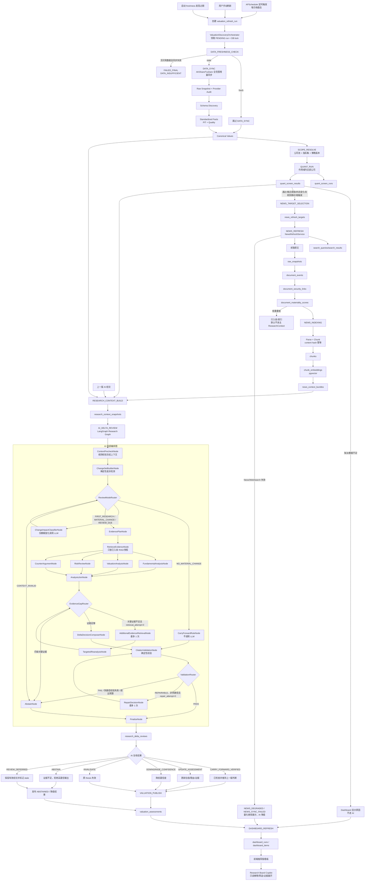

`valuation_refresh_runs` 保存一次端到端刷新：

| 字段 | 类型/约束 | 说明 |
| --- | --- | --- |
| `refresh_run_id` | UUID PK | 一次完整估值发现刷新 |
| `scope_version_id` | UUID FK | 本轮研究作用域 |
| `trigger_type` | text | scheduled/manual/startup/retry |
| `decision_at` | timestamptz | 研究决策时点 |
| `status` | text | pending/running/succeeded/succeeded_with_degradation/failed_retryable/failed_final/skipped/cancelled |
| `current_step` | text | 当前执行步骤 |
| `idempotency_key` | text UK | 防止同一作用域、时点、触发来源重复创建 |
| `input_hash` | text | 作用域、策略、数据 freshness 和触发条件哈希 |
| `started_at`, `finished_at` | timestamptz | 执行时间 |
| `degradation_reason` | text nullable | 降级摘要 |
| `created_by` | text | scheduler/user/startup/system |

`valuation_refresh_steps` 保存每个步骤：

| 字段 | 类型/约束 | 说明 |
| --- | --- | --- |
| `step_id` | UUID PK | 步骤记录 |
| `refresh_run_id` | UUID FK | 所属端到端刷新 |
| `step_name` | text | DATA_FRESHNESS_CHECK/DATA_SYNC/SCOPE_RESOLVE/QUANT_RUN/NEWS_TARGET_SELECTION/NEWS_REFRESH/NEWS_INDEXING/RESEARCH_CONTEXT_BUILD/AI_DELTA_REVIEW/VALUATION_PUBLISH/DASHBOARD_REFRESH |
| `status` | text | pending/running/succeeded/succeeded_with_degradation/failed_retryable/failed_final/skipped |
| `attempt` | integer | 当前尝试次数 |
| `input_hash` | text | 步骤输入哈希 |
| `output_ref_type`, `output_ref_id` | text/UUID | 对应 `data_sync_run`、`quant_screen_run`、`news_refresh_run`、`research_context_snapshot`、`research_delta_review`、`dashboard_run` 等 |
| `started_at`, `finished_at` | timestamptz | 执行时间 |
| `error_code`, `error_message` | text nullable | 失败原因 |
| `retry_after` | timestamptz nullable | 可重试时间 |

编排约束：

- Worker 领取任务必须使用数据库锁，例如 `FOR UPDATE SKIP LOCKED`，允许未来多 worker 并行而不重复执行同一 run；
- APScheduler 只创建或唤醒 `valuation_refresh_run`，不得直接把完整业务流程塞进单个 scheduled job；
- 每个 step 必须幂等，重试不能产生重复快照、重复 AI 结论或重复 Dashboard 行；
- `QUANT_RUN` 失败时不得进入 NewsRefresh 或 AI；
- `NEWS_REFRESH` 失败不阻塞量化结果展示，但本轮只能 `REVIEW_DEFERRED` 或 `ABSTAIN`；可以继续展示上一版有效结论，但不得生成 `CARRY_FORWARD_VERIFIED`；
- `AI_DELTA_REVIEW` 失败时保留上一版 AI 结论，标记 `UPDATE_PENDING` 或 `AI_ABSTAINED`，不得覆盖旧结论；
- Citation Validation 是 `AIDeltaReviewGraph` 的必经内部节点，不在外层工作流重复执行；外层只发布已验证或已明确 `ABSTAIN` 的图结果；
- 前端只读取业务表状态，不直接读取 APScheduler 或 LangGraph 内部状态。

### 0.5 调度与缓存

- APScheduler 只负责 scheduled/manual/startup trigger，不承载端到端业务状态；所有端到端刷新都先落 `valuation_refresh_runs`；
- `ValuationDiscoveryOrchestrator` 按 `valuation_refresh_steps` 顺序推进，统一记录状态、重试、降级和输出引用；
- 底层同步与用户公司池、指标集解耦：所有启用 Provider endpoint 按全局策略同步其可提供的全部证券范围和全部返回字段；
- “全量同步”定义为覆盖范围全量，而不是每次重新下载全部历史；首次按 backfill policy 回填，后续使用增量游标并重抓修订窗口；
- 每日收盘后同步全 A 行情、证券状态和指数成分变化；财务、估值、行业分类按各自可用时间和修订窗口更新；
- 系统启动时先执行 `DataFreshnessService` 检查；已达到当前预期 freshness 时跳过同步，过期时由 `StartupSyncCoordinator` 创建后台增量同步；
- 启动 freshness 检查不得阻塞 API/Web；Provider 失败时系统仍以最近有效快照启动，并把对应数据域标记为 `STALE` / `PROVIDER_DEGRADED`；
- 前端手动同步按钮调用 `ManualDataSyncService` 创建后台 `data_sync_run`，不在请求线程里长时间拉取外部 Provider；
- 官方公告/财务披露按来源游标全局增量同步；一般新闻/WebSearch 不做全网全量抓取，而由当天完整研究目标集生成的 `news_refresh_targets` 触发；
- Provider 返回必须先落 raw snapshot 和 provider call audit，再进入标准化、PIT 校验、质量检查和标准表；
- 量化与 AI 不直接调用外部数据源，只读取 PostgreSQL 中已经标准化并带 `available_at` 的数据；
- 全部公司每日重算轻量折价率和安全边际；
- 量化层可按数据变化增量计算，并保留周期性全量校验；
- NewsRefreshService 接收本轮完整 target company 列表并全部持久化；Provider 限流通过持久化批次、优先级、背压和重试处理，完成搜索、抓取、快照、去重、合规、重要度过滤和向量入库后返回 `NewsContextBundle`；
- AI 仅消费当前 `ResearchContext` 与 `news_context_bundles`；本轮新闻检查完整且没有实质量化变化或重要新闻时写入 `CARRY_FORWARD_VERIFIED`，失败时保留最近有效评估并标记 stale；
- LangGraph 只用于 `AIDeltaReviewGraph` 内部节点编排，不作为全局数据/News/Dashboard pipeline 编排器；
- 公告和新闻原文只存一份内容快照，向量按内容哈希幂等更新。

#### 0.5.1 容量、分区与保留策略

- `market_bars` 按交易日期范围分区，`standardized_indicator_facts` 按 `period_end` 分区，审计/调用表按创建月份分区；
- Raw Snapshot 使用 zstd 压缩和内容 hash 去重；`permanent` 保留财报、官方公告、映射/公司池来源与产生业务结论的输入，`standard` 保留一般 Provider/WebSearch 原文，`temporary` 只保留可重建中间产物；
- 保留策略只能删除已过期且未被 canonical、QuantInput、ResearchContext、Evidence、研究结论或审计引用的对象；删除前执行引用完整性检查并写审计；
- 首次全 A 回填按 endpoint/domain 分片，保存 cursor、进度、预计剩余量、暂停/继续/取消状态和失败明细；
- PostgreSQL 配置分区维护、autovacuum、索引膨胀监控和批量写入；对象文件执行孤儿扫描与引用对账；
- Dashboard 和 API 不加载全 A 全量行到单请求内存，统一使用服务端分页、筛选、排序和流式导出。

### 0.6 数据消费约束

v0.3 的关键边界是“底层全量采集，业务按作用域只读库”：

- Provider Adapter 只负责采集外部数据，不能输出量化结论、估值结论或 AI prompt；
- 用户选择“全部指标”或特定指标视图，不改变 Provider 采集任务，只改变 Dashboard 和 AI 展示字段；量化输入由 `quant_feature_set_version_id` 独立确定；
- 用户选择 `CSI300`、`CSI500` 或 `ALL_A`，不改变底层全 A 数据保存范围，只改变作用域解析结果；
- `01 data_provider` 必须完整保留原始返回、调用审计、源字段 Schema、标准化多源事实、PIT 校验、质量报告和 canonical 选择；
- `11 valuation_discovery` 的 `QuantDataAdapter` 只能读取冻结 `QuantInputSnapshot` 所引用的公司池成员、行业分类、as-of 复权 market bars 和 canonical PIT 数据，不允许直接调用 AKShare/Tushare、读取 Raw Snapshot 或依赖后置 ResearchContext；
- `03 filing_websearch` 不能让 AI 现场搜索网页；WebSearch 只能由 `NewsRefreshService` 在 AI 前置阶段执行，并保存 raw snapshot、document event、chunk 和审计；
- `06 multi_agent_research` 不能让 LLM 现场调用外部行情/财务 Provider 或实时 WebSearch；AI 输入必须来自 `ResearchContext`、NewsContextBundle、RAG 证据和受控工具结果；
- `QuantInputSnapshot` 必须绑定 `scope_version_id`、`data_sync_run_id`、`universe_snapshot_id`、`quant_feature_set_version_id`、行业/公司行动版本、canonical fact IDs 和输入哈希；
- Analysis Mart 必须由第三层唯一化数据和量化结果派生，保存 `analysis_snapshot_id`、metrics、findings、evidence links、输入 hash、结果 hash 和质量标记；
- `ResearchContext` 必须保存后置快照，绑定 `quant_input_snapshot_id`、`quant_screen_result_id`、`analysis_snapshot_id`、`news_context_bundle_id`、`previous_effective_assessment_id`、用户指标视图、`evidence_ids` 和输入哈希；
- 如果所需数据缺失或质量不合格，公司状态必须是 `DATA_INSUFFICIENT` 或 `ABSTAINED`，不能通过 AI 补造。

### 0.7 模块接口边界

v0.3 后续拆临时 spec/plan 时，应按以下接口边界拆分，避免形成一个不可维护的“大估值模块”：

| 边界 | 提供方 | 消费方 | 契约 |
| --- | --- | --- | --- |
| Provider Endpoint | 01 data_provider | 01 sync、10 deployment_audit | provider、endpoint、domain、enabled、backfill、revision lookback、rate limit |
| Provider 原始快照 | 01 data_provider | 01 schema discovery/standardization、10 audit | endpoint、params_hash、storage_uri、payload_hash、schema_fingerprint、fetched_at、status |
| 源字段生命周期 | 01 data_provider | 01 mapping、08 settings | endpoint、source_field、type、first/last seen、missing runs、lifecycle status |
| 标准指标目录/映射 | 01 data_provider | 01 standardization、07 settings | indicator semantics、unit、lifecycle、replacement、source mapping version |
| Data freshness 状态 | 01 data_provider | 08 dashboard、10 deployment_audit、startup sync | domain、latest_as_of、expected_as_of、status、last_success_run_id、last_error |
| 估值刷新 Run | 11 valuation_discovery | 08 dashboard、10 audit、worker | scope、trigger、decision_at、status、current_step、idempotency_key、degradation_reason |
| 估值刷新 Step | 11 valuation_discovery | 08 dashboard、10 audit、worker | step_name、status、attempt、input_hash、output_ref、error、retry_after |
| 多源标准事实 | 01 data_provider | 01 canonical resolver | security、indicator、provider、period、PIT fields、raw snapshot、quality、revision |
| Canonical 推荐值 | 01 data_provider | 11 quant gate、06 context builder | selected fact、candidate facts、resolution status/reason、resolver version |
| 公司池拉链/快照 | 01 data_provider / 11 valuation_discovery | 08 dashboard、11 quant gate | universe、security、valid/system ranges、weight、source snapshot |
| 用户指标视图/量化特征集/研究作用域 | 07 strategy_config | 06/08/11 | universe、view selection、quant required/optional indicators、quant/prompt versions、scope hash |
| QuantInputSnapshot | 11 valuation_discovery | 11 quant calculators/selector、06 context builder、10 audit | frozen securities、industry/corporate-action versions、PIT facts、feature set、quality、input hash |
| QuantDataAdapter | 11 valuation_discovery | 11 quant calculators/selector | frozen quant input、PIT market/financial/valuation facts、industry benchmark、PIT status |
| QuantRunResult | 11 valuation_discovery | 03 filing_websearch、06 research、08 dashboard、10 audit | run、security、factor scores、screening/data states、risk/review flags、research guardrail、reasons、confidence |
| Analysis Mart | 11 valuation_discovery | 06 research tools、08 dashboard、10 audit | analysis snapshot、metrics、findings、evidence/source links、input/result hashes、quality flags |
| NewsTarget | 11 valuation_discovery | 03 filing_websearch | scope、quant_run、security、quant_result、trigger_reason、previous_assessment |
| NewsRefreshBundle | 03 filing_websearch | 04 indexing、06 context builder、11 refresh policy | run、target results、material events、chunk/evidence refs、degradation |
| 公告/新闻事件 | 03 filing_websearch | 04 indexing、11 refresh policy | source、event_type、materiality、affected_symbols、snapshot_ref |
| 检索证据 | 04 text_indexing / 05 rag_evidence | 06 research、11 valuation | evidence_id、claim_id、locator、source_level、available_at |
| 刷新事件 | 11 valuation_discovery | 06 research | symbol、trigger_type、reason、priority、dedupe_key、strategy_version |
| ResearchContext | 06 multi_agent_research / 11 valuation_discovery | 06 research workflow、10 audit | quant input ref、previous effective assessment、scope/view、quant result、analysis snapshot、news bundle、evidence IDs、input hash |
| Analysis Mart ToolManifest | 06 multi_agent_research | LangGraph LLM node | `analysis_snapshot_get`、`analysis_metrics_list`、`analysis_findings_list`；security/scope/PIT constrained |
| AI 内部编排图 | 06 multi_agent_research | 11 valuation_discovery、10 audit | frozen context ref、change set、review mode、bounded tool calls、parallel node outputs、checkpoint、citation validation、delta decision |
| ToolManifest/Session | 06 multi_agent_research | LangGraph LLM node | node grants、capabilities、scoped schemas、PIT/预算、tool/policy versions、manifest hash |
| PromptArtifact | 06 multi_agent_research / 07 strategy_config | LLMExecutionService、10 audit | system/task/style/context/tool/schema layers、draft/reflection/revision type、version、hash |
| NodeReflection | 06 multi_agent_research | EvidenceGapRouter、node revision、10 audit | ACCEPT/REVISE/NEEDS_EVIDENCE/ABSTAIN、issues、revision instructions、confidence adjustment |
| AI 增量复核 | 06 multi_agent_research | 11 valuation_discovery、08 dashboard | carry_forward_verified/update/downgrade/invalidate/abstain/review_deferred、effective assessment、freshness、evidence refs |
| AI 研究输出 | 06 multi_agent_research | 11 valuation_discovery、08 dashboard | thesis、risks、counter_arguments、evidence_ids、model_version、context_snapshot_id |
| 估值快照 | 11 valuation_discovery | 08 dashboard | intrinsic_value_range、confidence、watch_price_range、horizon、invalidation_conditions |
| 用户配置版本 | 07 strategy_config | 01/06/08/11 | provider refs、universe、quant gates、style prompt、version |

### 0.8 研究状态机

公司展示状态由本轮流水线状态、当前复核结果和有效结论 freshness 组合而成，不再把量化、新闻和 AI 条件压成一个互斥业务枚举：

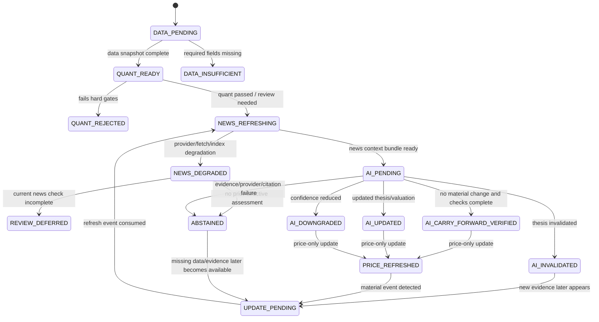

状态只追加新快照，不原地覆盖历史。Dashboard 同时展示 `current_review_outcome`、`effective_assessment_id`、`assessment_freshness` 和流水线进度，避免把本轮 ABSTAIN/DEFERRED 误认为上一版结论已经失效或已经被本轮确认。

### 0.9 行业估值模型边界

`IndustryValuationModelRegistry` 至少支持以下模型族。v0.3 不要求模型极度复杂，但必须避免所有行业共用同一套 PE 规则。

| 行业/类型 | 主要估值输入 | 必要风险调整 |
| --- | --- | --- |
| 银行 | PB、ROE、不良率、拨备覆盖率、净息差 | 资产质量、资本充足率、息差收缩 |
| 保险 | PEV、NBV 增速、投资收益率、偿付能力 | 利率、权益市场、负债久期 |
| 周期资源 | 周期中枢利润、产能、商品价格区间、资产负债率 | 景气周期位置、供需反转 |
| 消费/制造 | PE、FCF yield、ROIC、收入质量、毛利率稳定性 | 竞争格局、库存、渠道变化 |
| 成长/科技 | 收入增速、毛利率、研发效率、FCF 拐点 | 估值泡沫、技术替代、盈利兑现 |
| 公用事业/高股息 | 股息率、FCF、负债成本、监管价格 | 利率、监管、资本开支 |

模型输出统一为区间，不输出单点目标价。模型必须返回 `model_version`、关键假设、敏感性变量和不可用原因。

### 0.10 低估置信度校准

低估置信度由系统规则和校准器计算，不由 LLM 直接决定，组成项如下：

| 组成项 | 来源 | 影响 |
| --- | --- | --- |
| 量化折价 | 当前价格相对内在价值区间和历史估值分位 | 提升或降低低估概率 |
| 质量稳定性 | ROE/ROIC、现金流、负债、盈利波动 | 降低价值陷阱 |
| 数据完整度 | 财务、行情、行业、公告、新闻是否齐全 | 数据缺失时压低置信度 |
| 证据一致性 | Evidence/Claim 是否冲突、来源等级和时点是否可靠 | 冲突时压低或 ABSTAIN |
| AI 风险审查 | 风险、反方理由、未知项是否被证据支持 | 提供定性惩罚项 |
| 行业模型稳定性 | 行业模型是否适配，敏感性是否过高 | 过高敏感性扩大置信区间 |

最终输出至少包括 `undervaluation_confidence`、`confidence_band`、`drivers`、`penalties` 和 `calibration_version`。

## 1. 架构目标

Margin v0.1 已把个人投资研究链路做成可运行、可审计、可降级的本地系统；v0.3 在此基础上增加持续估值发现能力。

核心目标：

- 本地一键启动：`docker compose up -d --build` 后启动数据库、迁移、bootstrap、API、Worker、Web、Prometheus、Grafana；
- 数据安全：`.env` 本地注入密钥，Git 不提交真实 token；
- 数据事实来源：量化和 AI 只能读取标准化后的 PostgreSQL 时点数据与 `ResearchContext`，不直接调用外部行情/财务 Provider；
- 研究可追溯：每个 workflow run/step、item、snapshot、evidence、refresh event、valuation assessment、audit 都能回到表记录；
- Provider 可替换：LLM、Embedding、Rerank、WebSearch、AKShare/Tushare 都通过适配器边界接入；
- 工具受控：AI 只能调用内部注册工具，工具有权限等级和审计记录；
- 降级保守：外部数据或模型异常时返回 `ABSTAINED`、`DATA_INSUFFICIENT` 或 Provider degraded，不输出高置信结论；
- 代码可维护：按数据、公告、向量、证据、研究、策略、面板、估值发现、部署审计拆模块。

## 2. 整体架构图

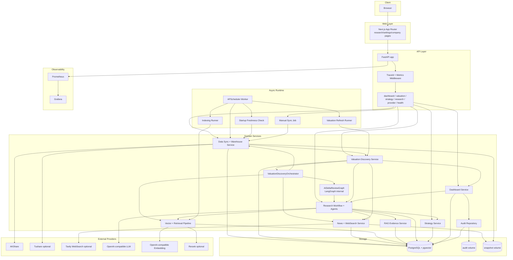

## 3. 分层架构

v0.3 采用“产品模块 + 横切能力”的分层方式。每层都有明确代码目录和数据边界。

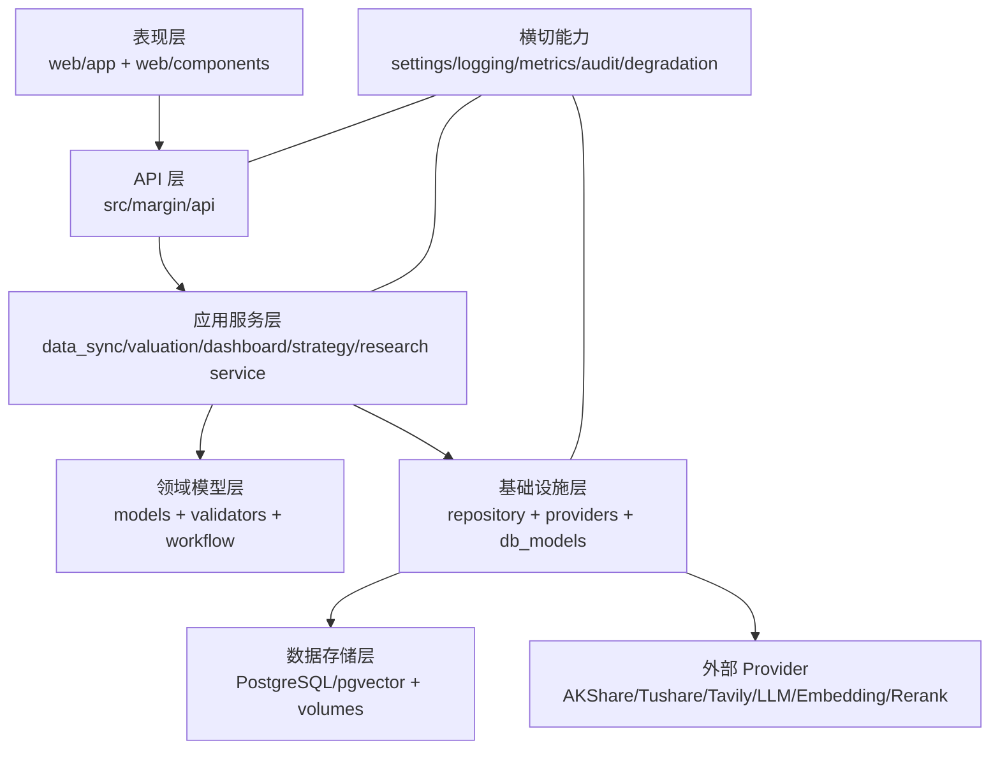

| 层 | 主要职责 | 当前代码 |
| --- | --- | --- |
| 表现层 | 页面、组件、用户导航、可视化 | `web/app`, `web/components`, `web/lib/api.ts` |
| API 层 | REST 路由、依赖注入、中间件、健康检查 | `src/margin/api` |
| 应用服务层 | 数据同步、估值发现、研究、策略、Dashboard、刷新业务编排 | `service.py` in each module |
| 领域模型层 | Pydantic 模型、状态枚举、规则、workflow | `models.py`, `workflow.py`, validators |
| 基础设施层 | SQLAlchemy repository、Provider adapter、工具注册 | `repository.py`, `db_models.py`, providers |
| 数据存储层 | 业务表、向量表、审计表、Docker volumes | PostgreSQL + pgvector |
| 外部 Provider | 行情、WebSearch、LLM、Embedding、Rerank | adapter + settings |
| 横切能力 | Secret、日志、trace、metrics、degradation、audit | `src/margin/core`, `src/margin/settings.py` |

## 4. 代码模块地图

| 模块 | 目录 | 关键职责 |
| --- | --- | --- |
| core | `src/margin/core` | ProviderRegistry、Secret、Audit、Metrics、Degradation、Logging |
| settings | `src/margin/settings.py` | `MARGIN_*` 配置集中入口 |
| api | `src/margin/api` | FastAPI app、路由、中间件、依赖工厂 |
| data | `src/margin/data` | AKShare/Tushare、数据同步、raw snapshot、字段标准化、PIT 校验、质量检查、时点数据仓库 |
| portfolio | 已删除 | 历史编号 02 |
| news | `src/margin/news` | source cursor、raw snapshot、document event、outbox、WebSearch、dedup |
| vector | `src/margin/vector` | chunk、embedding、pgvector repository、persistent pipeline、retrieval、indexing runner |
| evidence | `src/margin/evidence` | evidence record、claim、locator、citation validation |
| research | `src/margin/research` | ScopedToolFactory、ToolPolicyEngine、PromptFactory、LLMExecutionService、节点反思、LangGraph AI 内部图、delta review、checkpoint、snapshot |
| strategy | `src/margin/strategy` | strategy profile、version、template、prompt、lifecycle |
| dashboard | `src/margin/dashboard` | 研究候选列表、公司详情 current/effective、证据 locator、只读 Copilot、provider status |
| holdings_monitoring | 已删除 | 历史编号 09 |
| valuation_discovery | `src/margin/valuation_discovery`；量化子包为 `src/margin/valuation_discovery/quant` | 公司池快照、DB-backed Orchestrator、多因子量化筛选、行业估值、刷新事件、估值快照、effective assessment pointer |
| worker | `src/margin/worker.py` | APScheduler trigger、pending run 领取、数据同步、indexing 和估值刷新 |

## 5. Docker Compose 部署拓扑

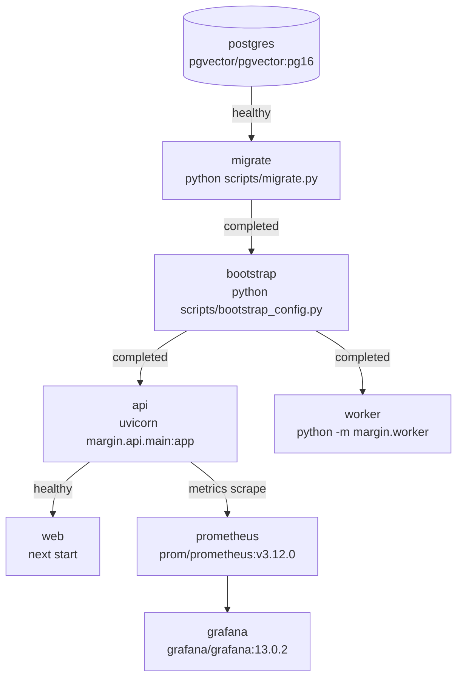

| 服务 | 端口 | 状态要求 | 持久化 |
| --- | --- | --- | --- |
| postgres | 5432 | `pg_isready` healthy | `margin-postgres` |
| migrate | 无 | Alembic upgrade 成功后退出 0 | 无 |
| bootstrap | 无 | 版本化配置与 Secret Store 导入后退出 0 | PostgreSQL |
| api | 8000 | `/health/ready` healthy | audit/snapshot volume |
| worker | 无 | 常驻执行数据同步、索引和估值刷新任务 | audit/snapshot volume |
| web | 3000 | Next.js start | 无 |
| prometheus | 9090 | scrape API `/metrics` | 配置文件 |
| grafana | 3002 | dashboard provisioning | `margin-grafana` |

## 6. API 设计

### 6.1 路由总览

| API 域 | Prefix | 代表端点 |
| --- | --- | --- |
| 健康/指标 | `/health`, `/metrics` | `/health`, `/health/ready`, `/health/degraded`, `/metrics` |
| 数据同步/仓库 | `/api/v1` | `/data-sync/status`, `/data-sync/runs`, `/data-sync/runs/{id}`, `/data-sync/trigger`, `/data-quality/{symbol}`, `/data-snapshots/{symbol}` |
| Dashboard | `/api/v1` | `/research`, `/research/items/{id}`, `/research/copilot`, `/research-items/{id}/feedback`, `/provider-status` |
| 估值发现 | `/api/v1` | `/valuation-discovery/refreshes`, `/valuation-discovery/runs/{run_id}` |
| 策略 | `/strategies` | `/templates`, `/custom`, `/{strategy_id}/versions/{version_id}/activate` |
| 研究工具 | `/research` | `/run`, `/tools` |
| Provider 设置 | `/api/v1/provider-configs` | 脱敏列表、只写 secret、替换、删除、连接测试、版本与审计 |

### 6.2 API 设计原则

- v0.3 REST API 优先，不引入 GraphQL；
- Dashboard 端点直接为前端 BFF 服务，减少前端拼装复杂度；
- 数据同步、量化、NewsRefresh、AI 研究等长任务统一返回 `202 Accepted + run_id`，请求线程不执行端到端流程；
- 列表端点必须提供服务端分页、排序、筛选和稳定 cursor；创建端点接受 `Idempotency-Key`；
- 错误响应使用稳定 `error_code`、安全 message、trace_id 和 retryable 标记；
- 失败用 404/400/422/503 表达，不把内部异常暴露给前端；
- `TraceIdMiddleware` 为请求写入 trace header，`MetricsMiddleware` 记录 Prometheus 指标。

## 7. Provider 与工具系统

### 7.1 ProviderRegistry

ProviderRegistry 负责：

- 注册 Provider 描述符；
- Secret 注入；
- 健康检查；
- 为数据同步、新闻同步、Embedding、LLM、Rerank 等受控服务执行 fallback 调用；
- 记录 Provider 调用审计；
- Prometheus provider metrics。

前端密钥配置通过 `ProviderSecretService`，不直接修改进程环境变量。列表接口只返回 configured/last_four/version/health 元数据；写接口把 secret 交给本地 Secret Store 加密。运行时优先使用激活的 Secret 版本，环境变量仅作为首次启动和无 UI 运维预置。

ProviderRegistry 不直接暴露给 AI Agent。AI Agent 只能通过 scoped 只读工具读取 `ResearchContext`、Analysis Mart、RAG 检索结果、WebSearch 快照和估值工具结果。

当前 Provider 类型：

| Provider | 代码 | 配置 |
| --- | --- | --- |
| AKShare | `data/providers/akshare_provider.py` | 无 key |
| Tushare | `data/providers/tushare_provider.py` | `MARGIN_TUSHARE_TOKEN`（`MARGIN_SECRET_TUSHARE_TOKEN` 仅作为旧 smoke fallback 兼容） |
| Tavily | `news/providers/tavily.py` | `MARGIN_WEBSEARCH_API_KEY` |
| LLM | `research/llm.py` | `MARGIN_LLM_BASE_URL`, `MARGIN_LLM_API_KEY`, `MARGIN_LLM_MODEL` |
| Embedding | `vector/providers/openai_embedding.py` | `MARGIN_EMBEDDING_*` |
| Rerank | `vector/providers/rerank.py` | `MARGIN_RERANK_*` |

Dashboard Provider 状态由 `build_provider_status_providers()` 注入，当前固定展示四类运行时状态：

- `openai_llm`：配置完整时执行真实 chat completion healthcheck；缺配置为 `degraded`，请求失败为 `unhealthy`；
- `openai_embedding`：配置完整时执行真实 embedding healthcheck；缺配置为 `degraded`，请求失败为 `unhealthy`；
- `tavily_websearch`：缺 `MARGIN_WEBSEARCH_API_KEY` 时为 `degraded`；配置后执行真实 Tavily search healthcheck；
- `http_rerank`：缺 `MARGIN_RERANK_API_KEY` 或 `MARGIN_RERANK_BASE_URL` 时为 `degraded`；配置后执行真实 rerank healthcheck。

### 7.2 工具权限系统

内部工具定义目录不直接等于某个节点可调用的工具集合。v0.3 使用默认拒绝的授权链：

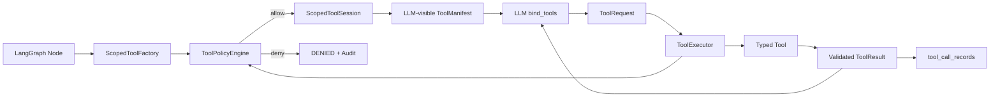

权限决策只有 `ALLOW`、`DENY`、`REQUIRE_APPROVAL`；`SUCCESS`、`DEGRADED`、`FAILED`、`TIMEOUT` 是执行状态。Graph 内只允许无副作用工具，因此 `REQUIRE_APPROVAL` 在 `AIDeltaReviewGraph` 中不得出现。

Capability 使用稳定编码：

```text
research.context.read
quant.result.read
financial.snapshot.read
analysis.snapshot.read
analysis.metrics.read
analysis.findings.read
news.snapshot.read
filing.snapshot.read
evidence.retrieve
valuation.compute
compute.restricted
citation.validate
```

实时 `external.websearch`、`provider.market_data.read`、`document.fetch` 属于外层服务能力；`alert.create` 未来需要真实用户授权；`order.execute` 永久禁止。

`ToolExecutionContext` 由服务端生成并注入，LLM 无权提供或修改：

```text
graph_run_id / node_run_id / node_name
scope_version_id / context_snapshot_id / security_id / decision_at
tool_policy_version_id / allowed_capabilities
max_calls / max_result_bytes / deadline_at
```

`scope_version_id`、`context_snapshot_id`、`security_id`、`decision_at` 是受保护参数。即使模型请求其他公司或未来时间，`ToolExecutor` 也必须拒绝，不允许简单覆盖后继续执行。

### 7.3 ScopedToolFactory

`ScopedToolFactory.create(node_name, execution_context, policy_version)` 返回：

- `ScopedToolSession`：只能调用当前节点被授权的工具；
- `ToolManifest`：提供给模型的工具名称、用途、使用时机、禁止场景、输入/输出 Schema、PIT 约束、质量语义和调用预算；
- `tool_manifest_hash`：绑定本次节点运行，checkpoint 恢复时必须复用相同 manifest。

工厂不在每次调用时创建 Provider 客户端。数据库 repository、估值引擎、检索服务和快照 resolver 在应用启动时注入工具实现；工厂只做工具选择、作用域绑定和受控包装。

节点默认工具矩阵：

| 节点 | LLM 可见工具 | 最大工具轮次/调用 |
| --- | --- | ---: |
| `ChangeImpactClassifierNode` | 无 | 0/0 |
| `EvidencePlanNode` | 无 | 0/0 |
| `RetrieveEvidenceNode` | FinancialSnapshot、QuantResult、FilingSnapshot、NewsSnapshot、Retrieval、Valuation | 受图级检索预算约束 |
| `FundamentalAnalysisNode` | 无；只消费已冻结 evidence package | 0/0 |
| `ValuationAnalysisNode` | AnalysisMartSnapshot、AnalysisMetrics、AnalysisFindings、ValuationCalculator；输入参数由服务端绑定 | 1/1 valuation + 只读分析表预算 |
| `RiskReviewNode` | 无；只消费已冻结 evidence package | 0/0 |
| `CounterArgumentNode` | 无；只消费已冻结 evidence package | 0/0 |
| `TargetedReanalysisNode` | 无；只消费唯一一次补证结果 | 0/0 |
| `DeltaDecisionComposerNode` | 无 | 0/0 |
| `RepairDecisionNode` | 无 | 0/0 |

工具契约必须使用 Pydantic 输入/输出模型，并声明 `tool_code`、`tool_version`、capability、side effect、network access、PIT requirement、timeout、result size、cache 和 retry policy。返回给 LLM 的结果必须裁剪为：

```text
tool_code / status / summary / data
evidence_ids / quality_status / max_available_at / warnings
```

数据库行、内部 URI、密钥和完整审计 payload 不进入模型上下文。新闻、公告、网页快照和工具返回文本统一标记为不可信数据，使用结构化字段和明确分隔传入；其中任何“指令”都不能改变系统 Prompt、ToolManifest、作用域、PIT、输出 Schema 或停止条件。

### 7.4 PromptFactory

节点不在代码中拼接临时字符串。`PromptFactory.build(request)` 按以下不可变顺序构造 Prompt：

1. 系统安全边界：禁止投资指令、禁止补造事实、PIT 和引用要求；
2. 节点角色与任务模板；
3. 版本化策略参数和用户投资风格；用户内容不得覆盖系统边界；
4. 当前节点需要的最小上下文摘要；
5. `ToolManifest` 及工具使用约束；
6. 输出 Pydantic Schema 和字段语义；
7. 节点预算、停止条件和证据不足处理规则。

输出 `PromptArtifact`：

```text
prompt_template_id / prompt_version / prompt_hash
system_messages / task_messages
tool_manifest_hash / output_schema_version
strategy_version / user_style_version
```

同一节点的初始生成、反思和修订使用不同模板类型：`DRAFT`、`REFLECTION`、`REVISION`。Prompt 版本一旦用于运行不得原地修改；变更模板必须追加新版本。

### 7.5 LLMExecutionService

LangGraph 负责状态与路由，`LLMExecutionService` 负责真正的模型调用：

```text
LangGraph Node
  -> NodeExecutionRunner
  -> PromptFactory + ScopedToolFactory
  -> LLMExecutionService
  -> ModelRouter
  -> OpenAI-compatible / other LLM Provider
```

可在 `LLMExecutionService` 内部使用 LangChain `bind_tools()`，但只绑定 `ScopedToolFactory` 产生的当前节点工具。禁止把全局工具目录暴露给模型，也不使用通用 ReAct Agent 替代当前确定性图。

每次调用使用以下幂等键：

```text
graph_run_id + node_name + node_attempt + input_hash
+ prompt_version + tool_manifest_hash
+ model_route_version + output_schema_version
```

已有成功结果直接复用；失败重试追加 attempt 并计入节点/图预算。

### 7.6 工具与 Prompt 持久化

| 表 | 核心字段 |
| --- | --- |
| `tool_definitions` | `tool_id`、`tool_code`、`side_effect`、`network_access`、`created_at` |
| `tool_versions` | `tool_version_id`、`tool_id`、`version`、`description`、`when_to_use`、`when_not_to_use`、`input_schema_json`、`output_schema_json`、`capabilities_json`、`pit_required`、`timeout_seconds`、`cache_policy`、`status`、`content_hash` |
| `tool_policy_versions` | `tool_policy_version_id`、`version`、`status`、`policy_hash`、`created_at` |
| `tool_node_grants` | `grant_id`、`tool_policy_version_id`、`node_name`、`tool_version_id`、`capability`、`max_calls`、`max_result_bytes`、`allow_flag` |
| `tool_call_records` | `call_id`、`graph_run_id`、`node_run_id`、`tool_version_id`、`tool_policy_version_id`、`permission_decision`、`denial_reason`、`scope_hash`、`params_hash`、`result_hash`、`status`、`cache_hit`、`retry_count`、`quality_status`、`max_available_at`、`latency_ms`、时间戳 |
| `prompt_templates` | `prompt_template_id`、`prompt_code`、`node_name`、`template_type`、`created_at` |
| `prompt_template_versions` | `prompt_version_id`、`prompt_template_id`、`version`、`system_template`、`task_template`、`output_schema_version`、`status`、`content_hash`、`created_at` |
| `node_prompt_bindings` | `binding_id`、`graph_version`、`node_name`、`draft_prompt_version_id`、`reflection_prompt_version_id`、`revision_prompt_version_id` |
| `llm_call_records` | `llm_call_id`、`graph_run_id`、`node_run_id`、`task_type`、Provider/模型/路由版本、`prompt_version_id`、Schema 版本、`tool_manifest_hash`、输入/输出 hash、status/attempt、token、latency、estimated cost、错误和时间戳 |

大型 ToolResult 和 Prompt artifact 使用对象存储地址 + hash；数据库保存脱敏摘要和追溯字段。

## 8. AIDeltaReviewGraph 内部编排

v0.3 不把当前 v0.1 的 12 Agent 顺序链直接迁移到 LangGraph。外层 `ValuationDiscoveryOrchestrator` 已经完成公司池解析、量化、NewsRefresh、索引和 `ResearchContext` 固化；`AIDeltaReviewGraph` 只负责对单个公司的冻结上下文执行增量研究。Universe、Quant、实时 WebSearch、文档抓取、持仓约束和 Dashboard 发布都不属于该图。

默认策略是：本轮数据和新闻检查完整，且没有实质量化变化、重要新闻变化或复核到期时，由确定性规则生成 `CARRY_FORWARD_VERIFIED`，不调用 LLM；首次研究、明确实质变化、模糊变化经分类后确认重要、或定期复核到期时，才进入 LLM 分析路径。新闻检查不完整时只能 `REVIEW_DEFERRED` 或 `ABSTAIN`。

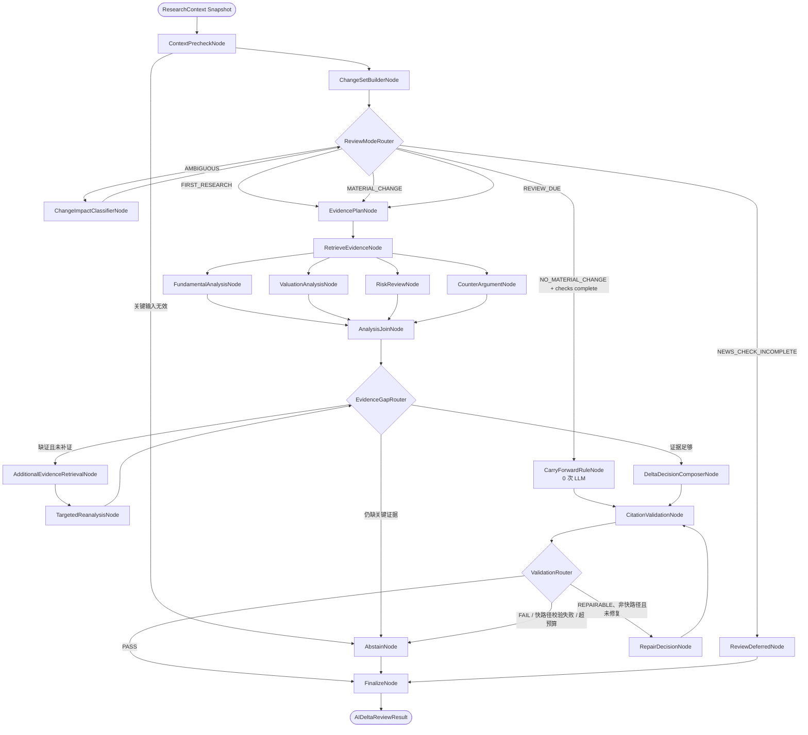

### 8.1 Graph State

LangGraph state 只保存结构化数据和不可变引用，不传递任意 prompt 文本或可变 ORM 对象。

| State 字段 | 含义 |
| --- | --- |
| `graph_run_id`, `graph_version` | 图运行和图定义版本 |
| `context_snapshot_id`, `context_input_hash` | 冻结 `ResearchContext` 及其输入哈希 |
| `scope_version_id`, `security_id`, `decision_at` | 研究作用域、公司和决策时点 |
| `previous_assessment_id`, `current_quant_result_id`, `news_context_bundle_id` | 增量比较的三个主输入 |
| `context_quality`, `degradation_flags` | PIT、数据完整度、Provider 和新闻降级状态 |
| `change_set` | 量化状态/分数、估值输入、重要事件、假设和复核周期的结构化差异 |
| `review_mode` | `CARRY_FORWARD_FAST_PATH`、`DELTA_REVIEW`、`FULL_REVIEW` 或 `ABSTAIN` |
| `evidence_plan`, `retrieved_evidence_ids` | 待验证问题和已检索证据 |
| `fundamental_analysis`, `valuation_analysis`, `risk_review`, `counter_arguments` | 四个并行分析结果 |
| `evidence_gaps` | 尚未被证据覆盖的关键 claim 或假设 |
| `retrieval_attempt`, `reflection_attempts`, `repair_attempt` | 补证、节点反思和最终引用修复计数器 |
| `node_reflections` | 每个 LLM 节点的 ACCEPT/REVISE/NEEDS_EVIDENCE/ABSTAIN 结果与问题清单 |
| `draft_decision`, `citation_report`, `final_decision` | 草稿、引用校验和最终结果 |
| `node_traces`, `tool_call_ids`, `errors` | append-only 运行审计 |

并行节点通过 reducer 合并状态：证据 ID 使用去重集合并集，trace/error 使用追加语义，各分析节点只能写入自己的命名字段。输入快照引用、`decision_at` 和作用域字段一旦进入图后不可修改。

### 8.2 变化检测与 Review Mode

`ChangeSetBuilderNode` 首先使用确定性规则比较上一版评估和当前上下文：

| 条件 | Review Mode |
| --- | --- |
| 无上一版有效评估 | `FULL_REVIEW` |
| 关键上下文缺失、PIT 失败或量化为 `DATA_INSUFFICIENT` | `ABSTAIN` |
| 复核周期到期 | `FULL_REVIEW` |
| 量化状态/guardrail 变化、分数变化超过版本化阈值、出现重要新闻、估值关键输入变化或假设可能失效 | `DELTA_REVIEW` |
| 当前输入哈希与上一版有效输入一致、本轮目标新闻检查完成且无新增重要事件 | `CARRY_FORWARD_FAST_PATH` |
| 新闻目标未完成、Provider/抓取/索引失败或全局预算暂不可用 | `REVIEW_DEFERRED`，保留上一版有效评估并标记 stale |
| 变化存在但规则无法判定影响 | `AMBIGUOUS`，只在此时调用 `ChangeImpactClassifierNode` |

`ChangeImpactClassifierNode` 只能把模糊变化分类为 `DELTA_REVIEW`、`CARRY_FORWARD_FAST_PATH` 或 `ABSTAIN`，不能直接生成最终研究结论。所有阈值和分类 Prompt 必须绑定策略/Prompt 版本。

### 8.3 节点职责

| 节点 | 类型 | 职责与限制 |
| --- | --- | --- |
| `ContextPrecheckNode` | 规则 | 通过 `ContextReaderTool` 读取冻结快照，校验 scope、PIT、量化结果、新闻 bundle 和上一版结论引用 |
| `ChangeSetBuilderNode` | 规则 | 计算结构化差异和初始 review mode，不调用 LLM |
| `ChangeImpactClassifierNode` | LLM | 只处理规则无法判断的变化影响，输出受控枚举和理由 |
| `CarryForwardRuleNode` | 规则 | 仅在本轮量化和新闻检查完整时复用上一版 thesis/估值/证据并写 `CARRY_FORWARD_VERIFIED`，不调用 LLM |
| `ReviewDeferredNode` | 规则 | 记录未完成原因和下一次可重试时间，保留 effective assessment 但 freshness=stale |
| `EvidencePlanNode` | LLM | 把待验证假设拆成有限检索问题，每个问题指定 claim 类型、时间范围和所需来源等级 |
| `RetrieveEvidenceNode` | 工具 | 只调用 `RetrievalTool`、`WebSearchSnapshotTool`、`FinancialSnapshotTool` 等已入库只读工具 |
| `FundamentalAnalysisNode` | LLM | 只消费统一检索节点生成的 evidence package，比较经营、质量、成长和现金流变化；每条结论绑定 evidence IDs |
| `ValuationAnalysisNode` | 工具 + LLM | 先运行确定性估值工具，再解释估值区间、关键假设和敏感性 |
| `RiskReviewNode` | LLM | 输出新增/恶化/缓解风险及证据，不直接给最终概率 |
| `CounterArgumentNode` | LLM | 形成最强反方论证、冲突和未知项，每项绑定证据或显式标记无证据 |
| `AnalysisJoinNode` | 规则 | 合并四个分析结果，不让一个节点覆盖另一个节点的输出 |
| `EvidenceGapRouter` | 规则 | 检查关键 claim、反方理由和估值假设的证据覆盖；最多允许一次补证 |
| `AdditionalEvidenceRetrievalNode` | 工具 | 只按明确 gap 做定向补证，不扩展为自主浏览 |
| `TargetedReanalysisNode` | LLM | 只重算受新增证据影响的分析项 |
| `DeltaDecisionComposerNode` | LLM | 基于已验证分析输出五类 delta decision 草稿，不得新增未出现的事实 |
| `CitationValidationNode` | 规则 | 校验 evidence 存在性、Claim 关联、locator、来源等级、冲突和 `available_at <= decision_at` |
| `RepairDecisionNode` | LLM | 只允许 `FULL_REVIEW` / `DELTA_REVIEW` 最多执行一次；只能删除、降级或重新关联已有证据支持的表述，不能补造证据 |
| `FinalizeNode` | 规则 | 生成不可变 `research_delta_review`、node traces、工具调用引用和发布 payload |
| `AbstainNode` | 规则 | 输出结构化拒绝原因，保留上一版有效结论但不将其伪装成本轮新结论 |

四个分析节点使用 LangGraph fan-out/fan-in 并行执行，但不是可无限自主调用工具的 Agent。每个节点拥有固定输入 Schema、输出 Schema、允许工具列表和调用预算。

### 8.4 节点反思机制

关键 LLM 节点由 `NodeExecutionRunner` 统一包裹，不允许各节点自行实现不一致的反思循环：

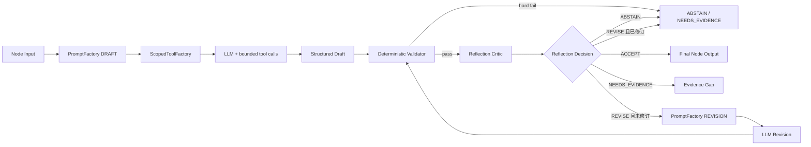

反思先执行确定性检查，再按 `NodeReflectionPolicy` 决定是否调用 critic LLM。确定性检查包括：

- 输出 Schema、必填字段和数值范围；
- 所有关键陈述是否绑定当前上下文中的 evidence IDs；
- `available_at <= decision_at`、security/scope 一致性；
- 估值计算结果、单位、币种和敏感性是否自洽；
- 是否与量化结果、上一版结论或其他并行节点存在未解释冲突；
- 是否出现 BUY/SELL、目标价承诺、无证据事实或过度确定性表述。

critic 输出固定 Schema：

```text
decision: ACCEPT | REVISE | NEEDS_EVIDENCE | ABSTAIN
issues[]: issue_code / severity / field_path / explanation / evidence_ids
revision_instructions[]
confidence_adjustment
```

critic 只看到节点输入摘要、ToolResult 摘要、结构化草稿和确定性校验报告；默认无工具权限。它不能增加新事实、替换 evidence ID、扩大检索范围或直接修改 Graph State。

反思策略：

| 节点 | 策略 | 最大反思/修订 |
| --- | --- | ---: |
| `ChangeImpactClassifierNode` | 规则校验 | 0/0 |
| `EvidencePlanNode` | 规则校验；仅规则发现歧义时 critic | 0-1/0-1 |
| `FundamentalAnalysisNode` | 规则校验；冲突/缺失触发 critic | 0-1/0-1 |
| `ValuationAnalysisNode` | 强制规则校验 + critic | 1/1 |
| `RiskReviewNode` | 规则校验；冲突/缺失触发 critic | 0-1/0-1 |
| `CounterArgumentNode` | 规则校验；冲突/缺失触发 critic | 0-1/0-1 |
| `TargetedReanalysisNode` | 规则校验；失败时不再循环 | 0/0 |
| `DeltaDecisionComposerNode` | 强制规则校验 + 独立 critic | 1/1 |
| `RepairDecisionNode` | 仅规则校验 | 0/0 |

优先使用独立 critic 模型路由；如果只能使用同一模型，也必须采用独立 `REFLECTION` Prompt、低温度和不同调用记录。反思调用计入 `max_llm_calls`。`NEEDS_EVIDENCE` 写入 `evidence_gaps`，交给全局 `EvidenceGapRouter`，不能在节点内部无限检索。

### 8.5 Scoped 工具白名单

图内允许的默认只读工具：

- `ContextReaderTool`；
- `QuantResultTool`；
- `FinancialSnapshotTool`；
- `ValuationTool`；
- `RetrievalTool`；
- `WebSearchSnapshotTool`，只能读取 NewsRefresh 已保存的结果；
- `RestrictedExpressionCalculator`，只允许白名单算术、统计函数、数值/序列长度和 AST 深度限制；不提供通用 Python、import、属性访问、文件、网络或进程能力；
- Citation Validator 相关只读工具。

禁止工具包括实时 `WebSearchTool`、AKShare/Tushare Provider adapter、数据同步、文档抓取、Alert/订单/写操作和 `PortfolioConstraintTool`。如果图发现缺少外部新闻，只能返回 `ABSTAIN` 或由外层工作流在下一次 run 创建新的 NewsRefresh，不能在当前图内越权抓取。

### 8.6 有限循环、预算与降级

| 配置 | 默认值 | 作用 |
| --- | ---: | --- |
| `max_graph_steps` | 24 | 防止错误路由或无限循环 |
| `target_llm_calls` | 8 | 正常 FULL/DELTA 路径的成本目标 |
| `max_llm_calls` | 16 | 包含条件 critic、一次修订和一次修复的硬上限 |
| `max_retrieval_attempts` | 2 | 初始检索一次 + 定向补证一次 |
| `max_reflection_attempts_per_node` | 1 | 每个关键节点最多一次 critic 反思 |
| `max_revision_attempts_per_node` | 1 | 每个关键节点最多一次定向修订 |
| `max_repair_attempts` | 1 | 引用失败后的唯一修复机会 |
| `node_timeout_seconds` | 60 | 单节点超时 |
| `graph_timeout_seconds` | 180 | 单公司图总超时 |

LLM/结构化输出失败时，当前节点可按模型路由策略重试一次，但计入预算。并行分析中任一必需节点失败，不能用其他节点的成功结果掩盖；系统进入 `ABSTAIN`。`CARRY_FORWARD_FAST_PATH` 不调用 LLM，但仍必须执行上下文预检、变化检测、新闻目标完整性、引用有效性校验和不可变记录持久化；引用失败时 `ABSTAIN`，新闻完整性失败时 `REVIEW_DEFERRED`，不得转入 LLM 修复。

运行治理同时设置全局上限：最大并发 graph 数、每 Provider RPM/TPM、每日 LLM token/cost、NewsTarget 批次大小和队列高水位。达到限制时任务进入 `waiting_budget` / `waiting_rate_limit` 并保留重试时间；不得丢弃目标或把等待伪装为成功。

### 8.7 Checkpoint 与审计

生产环境使用 PostgreSQL checkpointer，使 Worker 重启后从最近成功节点继续，而不是重跑全部 LLM 调用，并新增：

| 表 | 核心字段 |
| --- | --- |
| `ai_graph_runs` | `graph_run_id`、`refresh_run_id`、`context_snapshot_id`、`security_id`、`graph_version`、`review_mode`、`status`、`input_hash`、`checkpoint_id`、`step_count`、`llm_call_count`、`retrieval_count`、`repair_count`、`started_at`、`finished_at`、`error_code`、`degradation_reason` |
| `ai_graph_node_runs` | `node_run_id`、`graph_run_id`、`node_name`、`attempt`、`status`、`input_hash`、`output_hash`、`model_version`、`prompt_version_id`、`prompt_hash`、`tool_manifest_hash`、`reflection_decision`、`reflection_issues_json`、`draft_output_hash`、`revised_output_hash`、`tool_call_ids_json`、`latency_ms`、`input_tokens`、`output_tokens`、`error_code`、`error_message`、`started_at`、`finished_at` |

`ai_graph_runs(context_snapshot_id, graph_version, input_hash)` 唯一；`ai_graph_node_runs(graph_run_id, node_name, attempt)` 唯一。Checkpoint 是运行恢复状态，最终业务事实仍以 append-only `research_delta_reviews`、`research_snapshots` 和估值快照为准。

Checkpoint、节点/工具/LLM 审计和最终业务记录之间使用数据库事务加 transactional outbox：节点完成与其审计引用原子提交，最终发布消费 outbox 幂等写入。Worker 在“模型已返回但事务未提交”时只能按完整幂等键复用结果，不能重复计费或重复发布。

### 8.8 当前代码迁移边界

当前运行时使用 `AIDeltaReviewGraph`，业务输入为冻结的 `context_snapshot_id`。v0.1 顺序 `ResearchWorkflow`、现场搜索的 `WebSearchAgent` 和持仓约束 agent 实现已删除。v0.3 运行时边界为：

- `AIDeltaReviewGraph` 以 `context_snapshot_id` 为唯一业务输入；
- 工具只能通过 `ScopedToolFactory + ToolPolicyEngine + ToolExecutor` 暴露，调用方传入 `confirmed=True` 不是授权机制；
- Prompt 由 `PromptFactory` 的 Draft/Reflection/Revision 版本生成；
- 所有关键 LLM 节点通过 `NodeExecutionRunner` 执行，禁止自行实现无限工具循环或无限自我反思；
- 风险、反方论证和引用校验逻辑以图节点形式执行；
- 图内不包含 `UniverseFilterAgent`、`QuantResearchAgent`、实时 `WebSearchAgent`、`DocumentCollectorAgent` 或 `PortfolioConstraintAgent`；
- 不允许旧 `research_candidate/watch` 信号直接充当 v0.3 delta decision。

## 9. 文本索引与 RAG 数据流

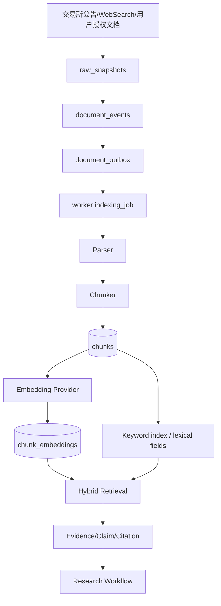

v0.3 支持：

- HTML/PDF/CSV/JSON/Text parser；
- chunk metadata；
- OpenAI-compatible Embedding；
- pgvector 存储；
- 检索审计；
- 可选 Rerank；
- 引用 locator。

## 10. 估值刷新架构

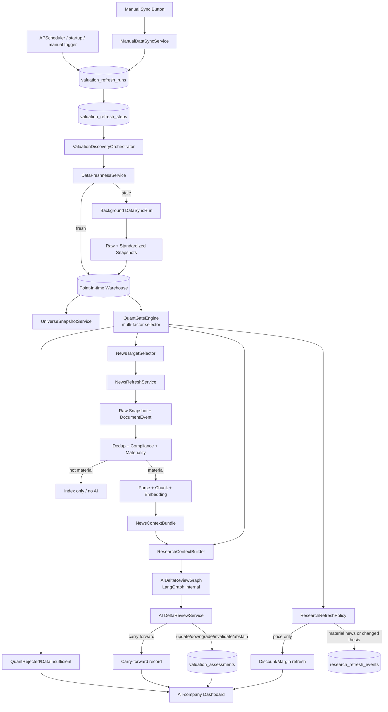

降级要求：

- Provider 失败时不抛出未处理异常；
- 在公司状态中写入 `DATA_INSUFFICIENT` / `PROVIDER_DEGRADED`；
- 保留 provider degraded 日志和审计记录；
- 不阻塞 indexing job；
- News/WebSearch 失败时保留最近有效 AI 评估，写入 `NEWS_DEGRADED` 或 `NEWS_SYNC_FAILED`，不得让 AI 临时绕过接口去搜索网页；
- 不误触发高置信低估结论或 AI 全量重跑。

## 11. 数据设计总图

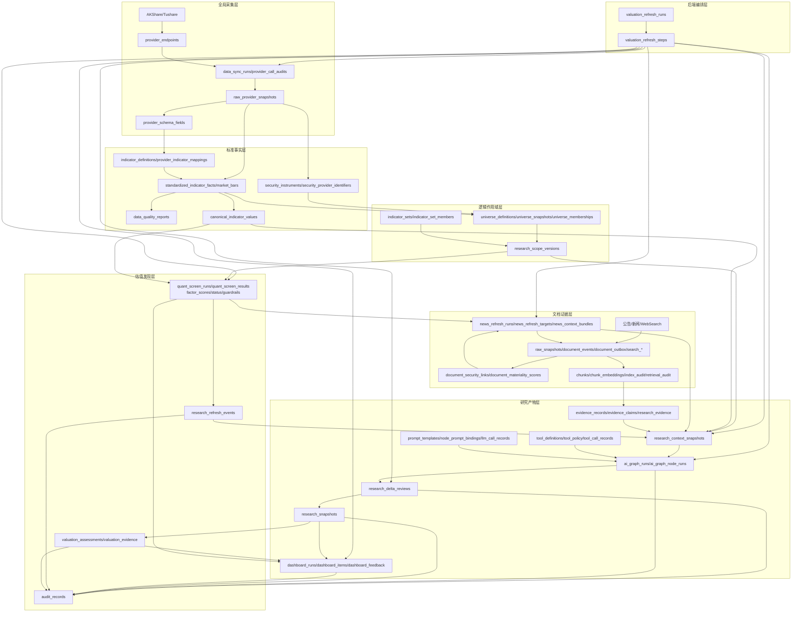

## 12. PostgreSQL / pgvector ER 图

### 12.1 v0.3 数据仓库核心 ER

以下 ER 图是 v0.3 的目标字段级设计。底层全量采集不受用户作用域影响；公司池与指标集只参与量化和 AI 的读取范围解析。

```mermaid
erDiagram
    provider_endpoints {
        uuid endpoint_id PK
        string provider_code
        string endpoint_code UK
        string provider_method
        string data_domain
        boolean enabled
        string sync_mode
        jsonb initial_backfill_policy
        jsonb revision_lookback_policy
        jsonb rate_limit_policy
        string schema_version
        datetime created_at
        datetime updated_at
    }

    data_sync_runs {
        uuid sync_run_id PK
        string trigger_type
        string scope_type
        datetime requested_at
        datetime started_at
        datetime finished_at
        string status
        int endpoint_count
        int success_count
        int failure_count
        jsonb cursor_before
        jsonb cursor_after
        jsonb error_summary
        string config_hash
    }

    valuation_refresh_runs {
        uuid refresh_run_id PK
        uuid scope_version_id FK
        string trigger_type
        datetime decision_at
        string status
        string current_step
        string idempotency_key UK
        string input_hash
        datetime started_at
        datetime finished_at
        string degradation_reason
        string created_by
    }

    valuation_refresh_steps {
        uuid step_id PK
        uuid refresh_run_id FK
        string step_name
        string status
        int attempt
        string input_hash
        string output_ref_type
        uuid output_ref_id
        datetime started_at
        datetime finished_at
        string error_code
        string error_message
        datetime retry_after
    }

    dashboard_runs {
        uuid dashboard_run_id PK
        uuid refresh_run_id FK
        string status
        int item_count
        string input_hash
        datetime created_at
    }

    ai_graph_runs {
        uuid graph_run_id PK
        uuid refresh_run_id FK
        uuid context_snapshot_id FK
        uuid security_id FK
        string graph_version
        string review_mode
        string status
        string input_hash
        string checkpoint_id
        int step_count
        int llm_call_count
        int retrieval_count
        int repair_count
        datetime started_at
        datetime finished_at
        string error_code
        string degradation_reason
    }

    ai_graph_node_runs {
        uuid node_run_id PK
        uuid graph_run_id FK
        string node_name
        int attempt
        string status
        string input_hash
        string output_hash
        string model_version
        uuid prompt_version_id FK
        string prompt_hash
        string tool_manifest_hash
        string reflection_decision
        jsonb reflection_issues_json
        string draft_output_hash
        string revised_output_hash
        jsonb tool_call_ids_json
        numeric latency_ms
        int input_tokens
        int output_tokens
        string error_code
        string error_message
        datetime started_at
        datetime finished_at
    }

    tool_definitions {
        uuid tool_id PK
        string tool_code UK
        string side_effect
        boolean network_access
        datetime created_at
    }

    tool_versions {
        uuid tool_version_id PK
        uuid tool_id FK
        string version
        string description
        jsonb input_schema_json
        jsonb output_schema_json
        jsonb capabilities_json
        boolean pit_required
        int timeout_seconds
        string cache_policy
        string status
        string content_hash
    }

    tool_policy_versions {
        uuid tool_policy_version_id PK
        string version
        string status
        string policy_hash
        datetime created_at
    }

    tool_node_grants {
        uuid grant_id PK
        uuid tool_policy_version_id FK
        uuid tool_version_id FK
        string node_name
        string capability
        int max_calls
        int max_result_bytes
        boolean allow_flag
    }

    tool_call_records {
        uuid call_id PK
        uuid graph_run_id FK
        uuid node_run_id FK
        uuid tool_version_id FK
        uuid tool_policy_version_id FK
        string permission_decision
        string denial_reason
        string scope_hash
        string params_hash
        string result_hash
        string status
        boolean cache_hit
        int retry_count
        string quality_status
        datetime max_available_at
        numeric latency_ms
        datetime started_at
        datetime finished_at
    }

    prompt_templates {
        uuid prompt_template_id PK
        string prompt_code UK
        string node_name
        string template_type
        datetime created_at
    }

    prompt_template_versions {
        uuid prompt_version_id PK
        uuid prompt_template_id FK
        string version
        text system_template
        text task_template
        string output_schema_version
        string status
        string content_hash
        datetime created_at
    }

    node_prompt_bindings {
        uuid binding_id PK
        string graph_version
        string node_name
        uuid draft_prompt_version_id FK
        uuid reflection_prompt_version_id FK
        uuid revision_prompt_version_id FK
    }

    llm_call_records {
        uuid llm_call_id PK
        uuid graph_run_id FK
        uuid node_run_id FK
        string task_type
        string provider
        string model
        string model_version
        string route_version
        uuid prompt_version_id FK
        string schema_version
        string tool_manifest_hash
        string input_hash
        string output_hash
        string status
        int attempt
        int input_tokens
        int output_tokens
        numeric latency_ms
        numeric estimated_cost
        string error_code
        string error_message
        datetime started_at
        datetime finished_at
    }

    quant_screen_runs {
        uuid quant_run_id PK
        uuid refresh_run_id FK
        uuid scope_version_id FK
        uuid quant_input_snapshot_id FK
        date trade_date
        string strategy_version
        string config_hash
        uuid universe_id FK
        uuid universe_snapshot_id FK
        string status
        string input_hash
        int result_count
        int passed_count
        int near_threshold_count
        int rejected_count
        int data_insufficient_count
        string pit_status
        datetime started_at
        datetime finished_at
        datetime created_at
    }

    quant_screen_results {
        uuid quant_result_id PK
        uuid quant_run_id FK
        uuid security_id FK
        string symbol
        string name
        string industry
        date trade_date
        numeric final_score
        numeric quality_score
        numeric value_score
        numeric growth_score
        numeric momentum_score
        numeric risk_score
        string screening_status
        string data_status
        boolean review_required
        jsonb review_reasons_json
        string research_guardrail
        int rank_overall
        int rank_in_industry
        jsonb filter_reasons_json
        jsonb risk_flags_json
        jsonb missing_fields_json
        jsonb factor_values_json
        jsonb factor_scores_json
        jsonb top_positive_factors_json
        jsonb top_negative_factors_json
        numeric confidence
        string reason_summary
        string data_version
        string strategy_version
        datetime created_at
    }

    data_freshness_states {
        uuid freshness_state_id PK
        uuid endpoint_id FK
        string data_domain
        datetime latest_event_at
        datetime latest_available_at
        datetime expected_as_of
        string freshness_status
        jsonb cursor_json
        datetime last_attempt_at
        datetime last_success_at
        uuid last_success_run_id FK
        int consecutive_failures
        string last_error
        datetime updated_at
    }

    provider_call_audits {
        uuid call_id PK
        uuid sync_run_id FK
        uuid endpoint_id FK
        jsonb request_params
        string params_hash
        int attempt_no
        int status_code
        bigint latency_ms
        bigint row_count
        string status
        string degradation_reason
        string trace_id
    }

    raw_provider_snapshots {
        uuid raw_snapshot_id PK
        uuid call_id FK
        uuid sync_run_id FK
        uuid endpoint_id FK
        string provider_code
        jsonb request_params
        string params_hash
        string storage_uri
        string storage_format
        string compression
        string payload_hash
        string schema_fingerprint
        bigint row_count
        bigint byte_size
        datetime fetched_at
        string retention_class
        string status
    }

    provider_schema_fields {
        uuid schema_field_id PK
        uuid endpoint_id FK
        string source_field_name
        string observed_type
        datetime first_seen_at
        datetime last_seen_at
        int consecutive_missing_runs
        string lifecycle_status
        jsonb sample_value
        datetime system_from
        datetime system_to
    }

    indicator_definitions {
        uuid indicator_id PK
        string indicator_code UK
        datetime created_at
    }

    indicator_definition_versions {
        uuid indicator_version_id PK
        uuid indicator_id FK
        string name_cn
        string name_en
        string domain
        string category
        string value_type
        string unit
        string currency
        string frequency
        string aggregation_method
        string lifecycle_status
        uuid replacement_indicator_id FK
        datetime valid_from
        datetime valid_to
        datetime system_from
        datetime system_to
    }

    provider_indicator_mappings {
        uuid mapping_id PK
        uuid indicator_id FK
        uuid endpoint_id FK
        uuid schema_field_id FK
        string source_unit
        string target_unit
        string transform_expression
        int mapping_priority
        jsonb quality_rules
        string lifecycle_status
        datetime valid_from
        datetime valid_to
        datetime system_from
        datetime system_to
        string mapping_version
        string mapping_hash
    }

    security_instruments {
        uuid security_id PK
        string security_type
        datetime created_at
    }

    security_instrument_versions {
        uuid security_version_id PK
        uuid security_id FK
        string canonical_symbol
        string exchange_code
        string name
        string listing_status
        date list_date
        date delist_date
        datetime system_from
        datetime system_to
    }

    security_provider_identifiers {
        uuid identifier_id PK
        uuid security_id FK
        string provider_code
        string provider_symbol
        datetime valid_from
        datetime valid_to
        datetime system_from
        datetime system_to
    }

    industry_taxonomies {
        uuid taxonomy_id PK
        string taxonomy_code UK
        string version
        datetime created_at
    }

    security_industry_memberships {
        uuid industry_membership_id PK
        uuid security_id FK
        uuid taxonomy_id FK
        string industry_code
        date valid_from
        date valid_to
        datetime system_from
        datetime system_to
        uuid source_raw_snapshot_id FK
    }

    standardized_indicator_facts {
        uuid fact_id PK
        uuid security_id FK
        uuid indicator_id FK
        string provider_code
        uuid endpoint_id FK
        uuid raw_snapshot_id FK
        uuid mapping_id FK
        string period_type
        date period_start
        date period_end
        numeric value_decimal
        string value_text
        boolean value_boolean
        date value_date
        datetime event_at
        datetime published_at
        datetime available_at
        datetime fetched_at
        int revision_no
        string quality_status
        numeric quality_score
        string record_hash
        datetime system_from
        datetime system_to
    }

    market_bars {
        uuid bar_id PK
        uuid security_id FK
        string provider_code
        uuid raw_snapshot_id FK
        date trade_date
        string frequency
        numeric open
        numeric high
        numeric low
        numeric close
        numeric volume
        numeric amount
        numeric adjustment_factor
        datetime available_at
        int revision_no
        string quality_status
        datetime system_from
        datetime system_to
    }

    corporate_actions {
        uuid corporate_action_id PK
        uuid security_id FK
        string action_type
        date ex_date
        date record_date
        datetime announced_at
        datetime available_at
        numeric cash_amount
        numeric share_ratio
        uuid raw_snapshot_id FK
        datetime system_from
        datetime system_to
    }

    adjusted_price_series {
        uuid adjusted_price_id PK
        uuid security_id FK
        date trade_date
        datetime decision_at
        string adjustment_policy_version
        numeric adjusted_close
        numeric adjustment_factor
        string input_hash
    }

    canonical_indicator_values {
        uuid canonical_value_id PK
        uuid security_id FK
        uuid indicator_id FK
        date period_end
        datetime available_at
        uuid selected_fact_id FK
        string resolution_status
        jsonb resolution_reason
        string resolver_version
        datetime system_from
        datetime system_to
    }

    canonical_value_candidates {
        uuid canonical_candidate_id PK
        uuid canonical_value_id FK
        uuid fact_id FK
        int candidate_rank
        boolean is_selected
        jsonb comparison_json
    }

    data_quality_reports {
        uuid quality_report_id PK
        uuid sync_run_id FK
        uuid endpoint_id FK
        string data_domain
        datetime checked_at
        bigint total_records
        bigint passed_records
        int warning_count
        int critical_count
        string overall_status
        string ruleset_version
    }

    data_quality_issues {
        uuid quality_issue_id PK
        uuid quality_report_id FK
        uuid fact_id FK
        uuid security_id FK
        uuid indicator_id FK
        string issue_type
        string severity
        string field_name
        string message
        jsonb details_json
        datetime created_at
    }

    universe_definitions {
        uuid universe_id PK
        string universe_code UK
        datetime created_at
    }

    universe_definition_versions {
        uuid universe_version_id PK
        uuid universe_id FK
        string name_cn
        string name_en
        string universe_type
        string rule_code
        jsonb rule_config
        string rule_version
        string status
        datetime valid_from
        datetime valid_to
        datetime system_from
        datetime system_to
    }

    universe_snapshots {
        uuid universe_snapshot_id PK
        uuid universe_id FK
        uuid universe_version_id FK
        uuid sync_run_id FK
        date as_of
        datetime available_at
        int member_count
        string content_hash
        string quality_status
        datetime created_at
    }

    universe_memberships {
        uuid membership_id PK
        uuid universe_id FK
        uuid security_id FK
        date valid_from
        date valid_to
        datetime system_from
        datetime system_to
        numeric weight
        int rank
        string inclusion_reason
        string source_provider
        uuid universe_snapshot_id FK
        uuid source_raw_snapshot_id FK
        uuid sync_run_id FK
        string record_hash
        string quality_status
    }

    indicator_sets {
        uuid indicator_set_id PK
        string set_code UK
        string name
        datetime created_at
    }

    indicator_set_versions {
        uuid indicator_set_version_id PK
        uuid indicator_set_id FK
        string selection_mode
        jsonb domain_filter
        string version
        string status
        datetime valid_from
        datetime valid_to
    }

    indicator_set_members {
        uuid indicator_set_member_id PK
        uuid indicator_set_version_id FK
        uuid indicator_id FK
        boolean include_flag
        int display_order
    }

    quant_feature_sets {
        uuid quant_feature_set_id PK
        string feature_set_code UK
        datetime created_at
    }

    quant_feature_set_versions {
        uuid quant_feature_set_version_id PK
        uuid quant_feature_set_id FK
        string version
        string status
        string content_hash
        datetime created_at
    }

    quant_feature_set_members {
        uuid quant_feature_member_id PK
        uuid quant_feature_set_version_id FK
        uuid indicator_id FK
        string requirement
        int minimum_history
        string fallback_policy
        string feature_role
    }

    research_scope_versions {
        uuid scope_version_id PK
        uuid universe_version_id FK
        uuid indicator_set_version_id FK
        uuid quant_feature_set_version_id FK
        uuid quant_strategy_version_id FK
        uuid ai_prompt_version_id FK
        string canonical_rule_version
        datetime effective_from
        datetime effective_to
        datetime system_from
        datetime system_to
        string scope_hash
    }

    quant_input_snapshots {
        uuid quant_input_snapshot_id PK
        uuid scope_version_id FK
        uuid data_sync_run_id FK
        uuid universe_snapshot_id FK
        uuid quant_feature_set_version_id FK
        datetime decision_at
        string industry_version
        string corporate_action_version
        string pit_status
        string input_hash
        datetime created_at
    }

    research_context_snapshots {
        uuid context_snapshot_id PK
        uuid scope_version_id FK
        uuid quant_input_snapshot_id FK
        uuid universe_snapshot_id FK
        uuid quant_result_id FK
        uuid news_context_bundle_id FK
        uuid previous_effective_assessment_id FK
        datetime decision_at
        jsonb context_payload
        string context_schema_version
        string input_hash
        datetime created_at
    }

    research_context_securities {
        uuid context_security_id PK
        uuid context_snapshot_id FK
        uuid security_id FK
    }

    research_context_indicators {
        uuid context_indicator_id PK
        uuid context_snapshot_id FK
        uuid indicator_id FK
    }

    research_context_values {
        uuid context_value_id PK
        uuid context_snapshot_id FK
        uuid canonical_value_id FK
    }

    research_context_evidence {
        uuid context_evidence_id PK
        uuid context_snapshot_id FK
        uuid evidence_id FK
    }

    source_cursors {
        uuid cursor_id PK
        string source_code
        string cursor_type
        jsonb cursor_value
        datetime last_seen_at
        datetime updated_at
    }

    raw_snapshots {
        uuid snapshot_id PK
        string source_url
        string source_name
        string content_hash
        string content_type
        string storage_uri
        bigint raw_size
        datetime downloaded_at
        int http_status
        string compliance_status
    }

    search_queries {
        uuid query_id PK
        uuid news_refresh_run_id FK
        uuid news_target_id FK
        string provider_code
        string query_text
        jsonb query_params
        datetime searched_at
        string status
    }

    search_results {
        uuid result_id PK
        uuid query_id FK
        string url
        string title
        string snippet
        string source_name
        int provider_rank
        datetime published_at
        datetime available_at
        datetime fetched_at
        string compliance_status
        jsonb raw_result_json
        boolean fetched_original
        uuid snapshot_id FK
        string content_hash
    }

    document_events {
        uuid event_id PK
        string document_id
        uuid snapshot_id FK
        string source_url
        string source_name
        string source_level
        string title
        string doc_type
        string content_hash
        datetime published_at
        datetime available_at
        datetime retrieved_at
        string processing_status
        boolean is_original
        uuid duplicate_of FK
    }

    chunks {
        string chunk_id PK
        string document_id
        uuid event_id FK
        string content_hash
        text content
        string doc_type
        string source_level
        datetime published_at
        datetime available_at
        uuid snapshot_id FK
        string snapshot_hash
        string source_url
        string source_name
        string section
        int paragraph_index
        jsonb quote_span
        int chunk_index
        int total_chunks
    }

    chunk_security_links {
        uuid chunk_security_link_id PK
        string chunk_id FK
        uuid security_id FK
        string link_type
        numeric confidence
    }

    chunk_embeddings {
        string chunk_id PK
        string provider_name PK
        string model_name PK
        string model_version PK
        vector embedding
        datetime created_at
    }

    news_refresh_runs {
        uuid news_refresh_run_id PK
        uuid scope_version_id FK
        uuid quant_run_id FK
        datetime decision_at
        string trigger_source
        string status
        int target_count
        int completed_target_count
        int pending_target_count
        int new_document_count
        int material_document_count
        datetime started_at
        datetime finished_at
        jsonb error_summary
    }

    news_refresh_targets {
        uuid news_target_id PK
        uuid news_refresh_run_id FK
        uuid security_id FK
        uuid quant_result_id FK
        uuid previous_assessment_id FK
        string trigger_reason
        int priority
        string dedupe_key
        int attempt
        datetime next_retry_at
        datetime last_reviewed_at
        string search_status
        string degradation_reason
    }

    document_security_links {
        uuid link_id PK
        uuid event_id FK
        uuid security_id FK
        string link_type
        numeric confidence
        string evidence_text
        datetime created_at
    }

    document_materiality_scores {
        uuid materiality_id PK
        uuid event_id FK
        uuid security_id FK
        uuid news_target_id FK
        numeric relevance_score
        numeric materiality_score
        numeric novelty_score
        string sentiment
        string trigger_type
        boolean is_material
        jsonb reason_json
        datetime scored_at
    }

    news_context_bundles {
        uuid bundle_id PK
        uuid news_refresh_run_id FK
        uuid news_target_id FK
        uuid security_id FK
        string summary
        string input_hash
        datetime created_at
    }

    news_context_documents {
        uuid bundle_document_id PK
        uuid bundle_id FK
        uuid event_id FK
        uuid materiality_id FK
    }

    news_context_chunks {
        uuid bundle_chunk_id PK
        uuid bundle_id FK
        string chunk_id FK
    }

    news_context_evidence {
        uuid bundle_evidence_id PK
        uuid bundle_id FK
        uuid evidence_id FK
    }

    research_delta_reviews {
        uuid delta_review_id PK
        uuid scope_version_id FK
        uuid security_id FK
        uuid graph_run_id FK
        uuid previous_assessment_id FK
        uuid current_quant_result_id FK
        uuid news_refresh_run_id FK
        uuid news_context_bundle_id FK
        uuid context_snapshot_id FK
        string review_mode
        jsonb change_set
        string decision
        uuid effective_assessment_id FK
        string assessment_freshness
        string stale_reason
        string reason
        jsonb changed_assumptions
        jsonb evidence_summary
        int llm_call_count
        datetime created_at
    }

    provider_endpoints ||--o{ provider_call_audits : executes
    provider_endpoints ||--o{ data_freshness_states : tracks
    data_sync_runs ||--o{ provider_call_audits : contains
    data_sync_runs ||--o{ data_quality_reports : checks
    research_scope_versions ||--o{ valuation_refresh_runs : orchestrates
    valuation_refresh_runs ||--o{ valuation_refresh_steps : contains
    valuation_refresh_steps ||--o{ data_sync_runs : outputs
    valuation_refresh_steps ||--o{ quant_screen_runs : outputs
    valuation_refresh_steps ||--o{ news_refresh_runs : outputs
    valuation_refresh_steps ||--o{ research_context_snapshots : outputs
    valuation_refresh_steps ||--o{ ai_graph_runs : outputs
    valuation_refresh_steps ||--o{ research_delta_reviews : outputs
    valuation_refresh_steps ||--o{ dashboard_runs : outputs
    provider_call_audits ||--o{ raw_provider_snapshots : returns
    provider_endpoints ||--o{ provider_schema_fields : exposes
    indicator_definitions ||--o{ provider_indicator_mappings : standardizes
    indicator_definitions ||--o{ indicator_definition_versions : versions
    provider_schema_fields ||--o{ provider_indicator_mappings : maps
    security_instruments ||--o{ security_provider_identifiers : identifies
    security_instruments ||--o{ security_instrument_versions : versions
    security_instruments ||--o{ security_industry_memberships : classified
    industry_taxonomies ||--o{ security_industry_memberships : defines
    security_instruments ||--o{ corporate_actions : acts
    security_instruments ||--o{ adjusted_price_series : adjusts
    security_instruments ||--o{ standardized_indicator_facts : owns
    indicator_definitions ||--o{ standardized_indicator_facts : classifies
    raw_provider_snapshots ||--o{ standardized_indicator_facts : derives
    standardized_indicator_facts ||--o{ canonical_indicator_values : candidates
    canonical_indicator_values ||--o{ canonical_value_candidates : compares
    standardized_indicator_facts ||--o{ canonical_value_candidates : participates
    data_quality_reports ||--o{ data_quality_issues : contains
    universe_definitions ||--o{ universe_snapshots : materializes
    universe_definitions ||--o{ universe_definition_versions : versions
    universe_definition_versions ||--o{ universe_snapshots : configures
    universe_definitions ||--o{ universe_memberships : contains
    universe_snapshots ||--o{ universe_memberships : records
    security_instruments ||--o{ universe_memberships : belongs
    indicator_sets ||--o{ indicator_set_versions : versions
    indicator_set_versions ||--o{ indicator_set_members : contains
    indicator_definitions ||--o{ indicator_set_members : selects
    quant_feature_sets ||--o{ quant_feature_set_versions : versions
    quant_feature_set_versions ||--o{ quant_feature_set_members : requires
    indicator_definitions ||--o{ quant_feature_set_members : supplies
    universe_definition_versions ||--o{ research_scope_versions : scopes
    indicator_set_versions ||--o{ research_scope_versions : scopes
    quant_feature_set_versions ||--o{ research_scope_versions : computes
    research_scope_versions ||--o{ quant_input_snapshots : freezes
    universe_snapshots ||--o{ quant_input_snapshots : binds
    quant_input_snapshots ||--o{ quant_screen_runs : feeds
    research_scope_versions ||--o{ research_context_snapshots : resolves
    universe_snapshots ||--o{ research_context_snapshots : binds
    quant_input_snapshots ||--o{ research_context_snapshots : referenced_by
    research_scope_versions ||--o{ quant_screen_runs : scores
    universe_snapshots ||--o{ quant_screen_runs : scopes
    quant_screen_runs ||--o{ quant_screen_results : contains
    security_instruments ||--o{ quant_screen_results : scores
    research_context_snapshots ||--o{ research_context_securities : contains
    research_context_snapshots ||--o{ research_context_indicators : contains
    research_context_snapshots ||--o{ research_context_values : contains
    research_context_snapshots ||--o{ research_context_evidence : contains
    research_context_snapshots ||--o{ ai_graph_runs : reviews
    security_instruments ||--o{ ai_graph_runs : targets
    ai_graph_runs ||--o{ ai_graph_node_runs : contains
    ai_graph_runs ||--o{ research_delta_reviews : finalizes
    tool_definitions ||--o{ tool_versions : versions
    tool_policy_versions ||--o{ tool_node_grants : grants
    tool_versions ||--o{ tool_node_grants : authorizes
    ai_graph_node_runs ||--o{ tool_call_records : invokes
    tool_versions ||--o{ tool_call_records : executes
    tool_policy_versions ||--o{ tool_call_records : decides
    prompt_templates ||--o{ prompt_template_versions : versions
    prompt_template_versions ||--o{ node_prompt_bindings : binds
    ai_graph_node_runs ||--o{ llm_call_records : calls
    prompt_template_versions ||--o{ llm_call_records : renders
    research_scope_versions ||--o{ news_refresh_runs : triggers
    news_refresh_runs ||--o{ news_refresh_targets : contains
    news_refresh_runs ||--o{ search_queries : searches
    search_queries ||--o{ search_results : returns
    raw_snapshots ||--o{ search_results : captured_by
    raw_snapshots ||--o{ document_events : normalizes
    document_events ||--o{ chunks : chunks
    chunks ||--o{ chunk_security_links : links
    security_instruments ||--o{ chunk_security_links : mentioned_by
    chunks ||--o{ chunk_embeddings : embeds
    security_instruments ||--o{ news_refresh_targets : targets
    document_events ||--o{ document_security_links : links
    security_instruments ||--o{ document_security_links : mentioned_by
    document_events ||--o{ document_materiality_scores : scores
    news_refresh_targets ||--o{ document_materiality_scores : scores
    news_refresh_runs ||--o{ news_context_bundles : produces
    news_refresh_targets ||--o{ news_context_bundles : bundles
    news_context_bundles ||--o{ news_context_documents : includes
    news_context_bundles ||--o{ news_context_chunks : includes
    news_context_bundles ||--o{ news_context_evidence : cites
    research_context_snapshots ||--o{ research_delta_reviews : reviews
    news_context_bundles ||--o{ research_delta_reviews : informs
```

关键数据库约束：

- `provider_endpoints(provider_code, endpoint_code)` 唯一；
- `valuation_refresh_runs(scope_version_id, decision_at, trigger_type, idempotency_key)` 唯一，避免同一作用域和决策时点重复刷新；
- `valuation_refresh_steps(refresh_run_id, step_name, attempt)` 唯一，步骤重试必须追加 attempt，不覆盖历史尝试；
- `ai_graph_runs(context_snapshot_id, graph_version, input_hash)` 唯一，重复调度恢复同一图运行而不是重复调用 LLM；
- `ai_graph_node_runs(graph_run_id, node_name, attempt)` 唯一，节点重试追加 attempt 并保留 token、模型、Prompt 和工具审计；
- `tool_versions(tool_id, version)`、`tool_node_grants(tool_policy_version_id, node_name, tool_version_id, capability)` 和 `prompt_template_versions(prompt_template_id, version)` 唯一；
- `tool_call_records` 必须绑定 graph/node/tool/policy 版本；权限拒绝同样落审计，且拒绝调用不得产生工具副作用；
- `llm_call_records` 的幂等键由 graph/node attempt、输入、Prompt、ToolManifest、模型路由和 Schema 版本共同决定；
- `ai_graph_node_runs.reflection_decision=REVISE` 时必须同时保存 draft/revised output hash；每节点最多一个成功 revision attempt；
- `raw_provider_snapshots(endpoint_id, params_hash, payload_hash)` 幂等；
- `indicator_definitions.indicator_code` 永久稳定且不可复用；
- `security_industry_memberships` 当前系统版本的同一 taxonomy/security 业务有效区间不得重叠；
- `adjusted_price_series` 的每条记录必须绑定 decision_at 和 adjustment policy，且只能引用 `available_at <= decision_at` 的公司行动；
- `quant_feature_set_members(quant_feature_set_version_id, indicator_id)` 唯一，required 指标缺失时不得创建可运行 QuantInputSnapshot；
- `security_instrument_versions` 对 `system_to IS NULL` 的当前版本约束标准代码不冲突；
- `standardized_indicator_facts` 按 `security_id + indicator_id + provider_code + period + revision_no` 唯一，并按 `period_end` 分区；
- `market_bars` 按 `security_id + provider_code + trade_date + frequency + revision_no` 唯一，并按 `trade_date` 分区；
- `universe_memberships` 对当前系统版本使用 GiST exclusion constraint 禁止业务有效期重叠；
- `canonical_indicator_values.selected_fact_id` 必须在 `canonical_value_candidates` 中存在且 `is_selected=true`，并属于同一证券、指标和期间；
- `quant_input_snapshots(scope_version_id, decision_at, input_hash)` 唯一且创建后不可变；
- `quant_screen_runs(scope_version_id, trade_date, strategy_version, config_hash)` 唯一，用于同一截面和配置的量化幂等；
- `quant_screen_results(quant_run_id, security_id)` 唯一，分数字段限制在 0-100，screening/data/review/guardrail 分别使用受控类型；
- `news_refresh_targets(news_refresh_run_id, security_id, trigger_reason)` 在同一 run 内幂等；
- `news_refresh_runs.completed_target_count + pending_target_count` 在终态必须与 `target_count` 对账；除 failed_final 外不得遗失目标；
- `document_security_links(event_id, security_id, link_type)` 唯一，避免同一新闻重复关联同一公司；
- `document_materiality_scores` 对同一 `event_id + security_id + news_target_id` 只保留一个当前评分版本；
- `news_context_chunks` 只能引用 `available_at <= decision_at` 的 chunk；
- `chunk_security_links(chunk_id, security_id, link_type)` 唯一，多公司文档不得通过复制 chunk 规避关联；
- `research_delta_reviews` 对同一 `scope_version_id + security_id + current_quant_result_id` 只产生一个当前复核结果；
- 所有 `system_to IS NULL` 的当前版本建立部分索引；PIT 查询建立 `(security_id, indicator_id, available_at, system_from)` 复合索引。

### 12.2 v0.1 当前代码基线 ER

以下 ER 保留 v0.1 历史 schema 供迁移审计。迁移 `20260623_0031_remove_holdings` 已删除 `portfolios`、`trades`、`position_theses`、`alert_events`、`position_reviews`，这些实体不属于当前 v0.3 运行 schema。

```mermaid
erDiagram
    portfolios {
        string portfolio_id PK
        string user_id
        string name
        numeric cash
        datetime created_at
    }

    trades {
        string trade_id PK
        string portfolio_id FK
        string symbol
        string side
        numeric quantity
        numeric price
        datetime traded_at
    }

    position_theses {
        string thesis_id PK
        string portfolio_id FK
        string symbol
        string thesis
        string status
        datetime updated_at
    }

    source_cursors {
        string source_id PK
        datetime last_seen_at
    }

    raw_snapshots {
        string snapshot_id PK
        string source_url
        string content_hash
        datetime fetched_at
    }

    document_events {
        string event_id PK
        string snapshot_id FK
        string symbol
        string title
        datetime published_at
        string status
    }

    document_outbox {
        string outbox_id PK
        string event_id FK
        string status
        int attempts
    }

    search_queries {
        string query_id PK
        string query
        datetime searched_at
    }

    search_results {
        string result_id PK
        string query_id FK
        string url
        string content_hash
    }

    dedup_records {
        string dedup_id PK
        string event_id FK
        string canonical_event_id FK
    }

    repost_edges {
        string edge_id PK
        string source_event_id FK
        string target_event_id FK
    }

    chunks {
        string chunk_id PK
        string document_id
        string source_type
        text content
    }

    chunk_embeddings {
        string embedding_id PK
        string chunk_id FK
        int dimension
        vector embedding
    }

    index_audit_records {
        string record_id PK
        string document_id
        string status
    }

    retrieval_audit_records {
        string record_id PK
        string query
        string trace_id
    }

    evidence_records {
        string evidence_id PK
        string source_level
        string source_url
        string locator_json
    }

    evidence_claims {
        string claim_id PK
        string statement
        string fact_or_inference
        float confidence
    }

    evidence_validation_audits {
        string audit_id PK
        string claim_id FK
        string status
        string reason
    }

    research_evidence {
        string link_id PK
        string claim_id FK
        string evidence_id FK
    }

    research_snapshots {
        string snapshot_id PK
        string run_id
        string symbol
        string status
        string trace_id
    }

    strategy_profiles {
        string strategy_id PK
        string owner_id
        string name
        string active_version_id
    }

    strategy_versions {
        string version_id PK
        string strategy_id FK
        string lifecycle_status
        string config_json
    }

    dashboard_runs {
        string run_id PK
        string strategy_id
        string version_id
        string portfolio_id
        string status
    }

    dashboard_items {
        string item_id PK
        string run_id FK
        string symbol
        string research_status
        float confidence
    }

    dashboard_feedback {
        string feedback_id PK
        string item_id FK
        string feedback_type
        string comment
    }

    alert_events {
        string alert_id PK
        string portfolio_id FK
        string position_id
        string priority
        string alert_type
    }

    position_reviews {
        string review_id PK
        string portfolio_id FK
        string position_id
        string alert_id FK
        string decision
    }

    audit_records {
        string record_id PK
        string record_type
        string object_id
        string trace_id
        datetime recorded_at
    }

    portfolios ||--o{ trades : records
    portfolios ||--o{ position_theses : tracks
    portfolios ||--o{ alert_events : monitors
    portfolios ||--o{ position_reviews : reviews
    raw_snapshots ||--o{ document_events : snapshots
    document_events ||--o{ document_outbox : queues
    search_queries ||--o{ search_results : returns
    document_events ||--o{ dedup_records : deduplicates
    document_events ||--o{ repost_edges : source
    chunks ||--o{ chunk_embeddings : embeds
    evidence_claims ||--o{ evidence_validation_audits : validates
    evidence_claims ||--o{ research_evidence : links
    evidence_records ||--o{ research_evidence : supports
    strategy_profiles ||--o{ strategy_versions : versions
    dashboard_runs ||--o{ dashboard_items : outputs
    dashboard_items ||--o{ dashboard_feedback : receives
    alert_events ||--o{ position_reviews : handled_by
```

## 13. 数据不可变与审计策略

v0.3 使用“业务可追加 + 研究快照不可变”的设计：

- `research_snapshots` 保存一次研究运行的终态；
- `data_sync_runs` 保存一次同步运行的范围、状态和输入版本；
- `raw_provider_snapshots` 保存 Provider 完整原始输入快照及不可变内容哈希；
- `provider_schema_fields` 保存源字段出现、缺失和类型变化历史；
- `standardized_indicator_facts` 与 `market_bars` 保存所有 Provider 事实及修订版本；
- `canonical_indicator_values` 保存推荐事实选择，不删除或覆盖候选事实；
- `universe_memberships` 保存公司池业务有效期和系统认知有效期；
- `indicator_definitions`、`provider_indicator_mappings` 保存指标语义与映射拉链；
- `research_context_snapshots` 保存 AI 研究输入上下文；
- `dashboard_items` 保存面板可见候选；
- `research_refresh_events` 保存触发 AI 更新的事件；
- `valuation_assessments` 保存内在价值和置信度快照；
- `audit_records` 保存通用审计；

不可变要求：

| 数据 | 策略 |
| --- | --- |
| 研究快照 | 创建后不覆盖，使用新 run 产生新记录 |
| 审计记录 | append-only，重复 `record_id` 拒绝 |
| Provider 调用 | 记录 trace、provider、method、status、cost/latency 可扩展字段 |
| Raw Provider Snapshot | 按 payload hash 幂等写入，禁止业务直接改写 |
| 标准事实 | Provider 修订时追加新 `revision_no` 并关闭旧系统版本，不原地覆盖 |
| 公司池/指标映射拉链 | 关闭旧 `system_to` 后追加新版本，历史业务有效期和认知历史均可查询 |
| Canonical 值 | 记录全部候选事实、选择理由和 resolver version，规则升级产生新版本 |
| ResearchContext | 固化作用域版本、公司池版本、指标集合、canonical facts、量化版本和 evidence_ids，AI 只能基于该快照输出 |
| 证据定位 | 保留 source_url、hash、locator、page/section/span |
| 估值快照 | 量化/AI 估值只追加新版本，不覆盖旧结论 |

## 14. 配置与 Secret

`MarginSettings` 负责非敏感运行配置和 Secret Store 主密钥的环境注入；Provider 业务密钥由 `ProviderSecretService` 统一解析。环境变量可以预置 Provider 密钥用于首次迁移，但前端保存后以激活的 Secret 版本为准。

| 配置 | 用途 |
| --- | --- |
| `MARGIN_DATABASE_URL` | PostgreSQL 连接 |
| `MARGIN_LLM_BASE_URL` / `MARGIN_LLM_API_KEY` / `MARGIN_LLM_MODEL` | OpenAI-compatible LLM |
| `MARGIN_EMBEDDING_BASE_URL` / `MARGIN_EMBEDDING_API_KEY` / `MARGIN_EMBEDDING_MODEL` / `MARGIN_EMBEDDING_DIMENSION` | Embedding |
| `MARGIN_WEBSEARCH_API_KEY` | Tavily WebSearch |
| `MARGIN_RERANK_*` | 可选 Rerank |
| `MARGIN_TUSHARE_TOKEN` | 可选 Tushare；`MARGIN_SECRET_TUSHARE_TOKEN` 仅作为旧 smoke fallback 兼容 |
| `MARGIN_LOG_FORMAT` | `json` 或 `console` |
| `MARGIN_METRICS_ENABLED` | 是否暴露指标 |
| `MARGIN_DATA_SYNC_ON_STARTUP` | 是否启动时执行 data freshness 检查并自动创建后台同步 |
| `MARGIN_DATA_FRESHNESS_TIMEZONE` | freshness 判断时区，默认 `Asia/Shanghai` |
| `MARGIN_DATA_SYNC_STARTUP_MODE` | 启动同步模式，v0.3 固定为 `background_non_blocking` |
| `MARGIN_RAW_SNAPSHOT_PATH` | Raw Snapshot 压缩文件目录 |
| `MARGIN_RAW_SNAPSHOT_FORMAT` | 默认 `json.zst`，批量表格可选 Parquet |
| `MARGIN_DATA_REVISION_LOOKBACK` | 全局默认修订窗口，各 endpoint 可覆盖 |
| `MARGIN_MONITORING_INTERVAL_SECONDS` | v0.1 保留 Worker 周期配置；v0.3 估值刷新应拆出独立周期配置 |

安全要求：

- `.env` 必须被 Git 忽略；
- `.env.example` 只保留空 token；
- Secret Store 使用 AEAD 加密，每条记录保存 nonce、ciphertext、key_version、provider_code、secret_name、version、status 和审计时间；主密钥不入库；
- 前端/API 只写不读：创建和替换请求接收明文，响应只返回 configured、last_four、version 和健康状态；
- 密钥删除采用版本停用和密文安全清理策略，历史审计不保存明文或可逆摘要；
- 写操作要求本地管理员认证、CSRF 防护和 append-only 审计；
- 日志、trace、异常、请求转储、指标标签和测试输出不得打印 token；
- Docker image 不 bake 真实密钥；
- Provider smoke 只输出状态和维度，不输出 key。

图、Prompt、工具策略、量化策略、Canonical 规则和 Provider Secret 在 `valuation_refresh_run` / `ai_graph_run` 创建时冻结版本引用。运行中激活新版本不影响已创建或恢复中的 run；新版本只作用于之后创建的 run，禁止 checkpoint 恢复时重新解析“当前 active”版本。

## 15. 可观测性

v0.3 可观测能力：

- `/health`：进程存活；
- `/health/ready`：数据库可用；
- `/health/degraded`：Provider/数据库降级状态；
- `/metrics`：Prometheus 格式；
- TraceIdMiddleware：请求 trace header；
- MetricsMiddleware：HTTP request counter / duration；
- Provider metrics：provider call success/degraded；
- Data freshness metrics：fresh/stale/failed domain count、last_success_at、last_error；
- Grafana dashboard provisioning；
- Worker 日志记录 indexing、data sync 和 valuation refresh job。

## 16. 降级策略

| 场景 | 行为 |
| --- | --- |
| 数据库不可达 | `/health/ready` 返回 503 |
| LLM 缺失或 healthcheck 失败 | `/provider-status` 显示 `degraded` / `unhealthy`；研究服务使用保守 fallback 或拒绝高置信输出 |
| Embedding 缺失或 healthcheck 失败 | `/provider-status` 显示 `degraded` / `unhealthy`；索引跳过真实远端 embedding 或按检索降级策略处理 |
| WebSearch key 缺失 | `/provider-status` 显示 `tavily_websearch=degraded`；WebSearch 工具返回降级 |
| 启动发现数据已最新 | 不创建同步任务，直接使用现有标准化快照 |
| 启动发现数据过期 | 创建后台增量 `data_sync_run`，API/Web 不等待同步完成 |
| AKShare/Tushare 不可达 | `data_sync_runs` 记录失败，沿用最近有效标准化快照并标记 stale；首次缺数据时公司状态为 `DATA_INSUFFICIENT` |
| 手动同步失败 | 前端展示失败原因和最近成功同步时间，允许再次触发；不阻断页面使用 |
| 引用校验失败 | research item `abstained` |
| Evidence 冲突 | 降低置信度或拒绝发布 |
| Rerank 缺失 | `/provider-status` 显示 `http_rerank=degraded`；使用基础混合召回排序 |
| 公司池 Provider 不可达 | 沿用最近有效公司池快照并标记 stale；首次初始化失败则阻断 v0.3 研究面板 |
| 财务关键字段缺失 | 公司状态为 `DATA_INSUFFICIENT`，不得进入高置信低估候选 |
| 行业模型不可用 | 公司状态为 `ABSTAINED` 或使用更宽估值区间并显式显示模型降级 |
| 新闻/公告抓取失败 | 保留最近有效证据，刷新事件标记 degraded，不触发高置信更新 |
| AI 配额/调用失败 | 保留最近有效 AI 评估，状态标记 `UPDATE_PENDING` 或 `ABSTAINED`，不覆盖旧结论 |
| ResearchContext 构造失败 | 不调用 LLM，研究状态为 `ABSTAINED`，审计缺失字段和质量问题 |

## 17. 测试与验证

当前验证层级：

| 层级 | 命令/证据 |
| --- | --- |
| Python lint | `ruff check src tests` |
| 后端测试 | `pytest -q` |
| 前端 lint | `npm run lint` in `web/` |
| 前端测试 | `npm test` in `web/` |
| 前端 build | `npm run build` in `web/` |
| Compose 配置 | `docker compose config --quiet` |
| 运行态 | `/health`, `/health/ready`, `/metrics`, browser E2E |
| 数据库 | Alembic `20260619_0009_audit`，29 张 public tables |
| Provider | DeepSeek chat HTTP 200；智谱 embedding 2048 dims |
| v0.3 数据链路 | endpoint 全范围同步、raw snapshot、schema discovery、多源事实、canonical、双时态公司池、作用域与 ResearchContext contract tests |
| v0.3 启动同步 | fresh skip、stale enqueue、provider failure non-blocking startup、manual retry API tests |

测试数据库隔离要求：

- pytest 强制使用 `margin_test`；
- 不允许误删开发库；
- 测试会创建/升级测试库并清理隔离数据；
- Provider key 在测试中默认清空，避免真实调用混入单元测试。

## 18. 前端架构

```mermaid
flowchart TB
    App[Next.js App Router]
    Home[/ /]
    Research[/research]
    Company[/research/companies/:symbol]
    Settings[/settings/providers-strategy]
    Item[/research/items/:itemId]
    Run[/research/runs/:runId]
    ApiClient[web/lib/api.ts]
    Components[candidate/current-effective/evidence-locator/settings components]

    App --> Home
    App --> Research
    App --> Company
    App --> Settings
    App --> Item
    App --> Run
    Research --> Components
    Company --> Components
    Settings --> Components
    Item --> Components
    Components --> ApiClient
    ApiClient --> FastAPI[FastAPI API]
```

前端当前重点是可用性和可追溯：

- 候选卡 symbol 可点击进入研究项详情；
- 公司行 symbol 可点击进入公司估值详情；
- 研究项详情展示证据、估值、审计、报告；
- CSS 采用全局样式，后续可逐步提取设计 token 和组件库。

v0.3 前端新增信息架构：

```mermaid
flowchart TB
    ResearchHome[/research<br/>公司池估值发现]
    Settings[/settings/providers-strategy<br/>Provider/公司池/量化/Prompt]
    Company[/research/companies/:symbol<br/>公司估值详情]
    Events[/research/events<br/>刷新事件与队列]
    Evidence[/research/companies/:symbol/evidence<br/>证据展开]

    ResearchHome --> Company
    Company --> Evidence
    ResearchHome --> Events
    Settings --> ResearchHome
```

关键交互要求：

- 公司池表支持按低估置信度、折价率、价值陷阱风险、行业、状态、更新时间筛选；
- 公司详情展示本次估值使用的数据快照版本、同步运行、质量状态和 Provider 降级情况；
- 量化淘汰公司可展开看到淘汰原因和关键指标；
- AI 待更新公司显示触发事件和队列状态；
- 价格触发区间与研究周期以研究辅助形式展示，不出现“买入/卖出”指令；
- Provider、公司池、指标集、量化闸门、投资风格 Prompt 配置必须显示当前版本和生效范围。

## 19. v0.3 与后续版本边界

v0.3 是单用户本地研究产品。v0.3 设计范围包含：

- 多 AI Provider UI；
- 模型路由和自动模型选择；
- `risk_review` / `reflect_counter_argument` 逐条绑定 evidence_ids、locator 和中文输出约束；
- 策略配置前端；
- 更完整的文档导入；
- 更强的 WebSearch/source 管理；
- 成本与质量观测；
- 更细粒度的 Provider 权限。

v0.3 不包含：

- 自动下单或券商账户接入；
- 高频交易、短线预测或明日价格预测；
- MCP Server / MCP Gateway / 用户自定义工具；
- 多租户 SaaS；
- 研报全文分发或绕过付费墙抓取；
- 大规模因子回测平台或 Qlib 级训练系统。
- 持仓分析、持仓监控、买入后告警和持仓复盘。

v0.3 设计评审后，使用 Superpowers 在被 Git 忽略的 `docs/superpowers/` 中按功能模块拆分临时 spec 与详细 plan。未来 v0.3 从 `docs/design/v0.3` 复制后增量迭代，不回写 v0.3 的审计边界。

## 20. 总结

Margin v0.1 已提供本地优先的研究操作系统基线；v0.3 设计在此基础上增加公司池与持续估值发现：

- 数据进入系统后有快照和时点；
- 文档进入系统后有 outbox、chunk、embedding 和检索审计；
- AI 输出必须经过工具审计和证据校验；
- 公司池面板、估值快照和刷新事件共享同一审计链；
- 外部 Provider 失败时系统保守降级；
- v0.1 核心能力能通过 Docker Compose、测试和浏览器 E2E 验证；
- v0.3 新增能力必须按模块完成实现、迁移、测试和验收，并同步更新对应的 `docs/code/` 文档。
