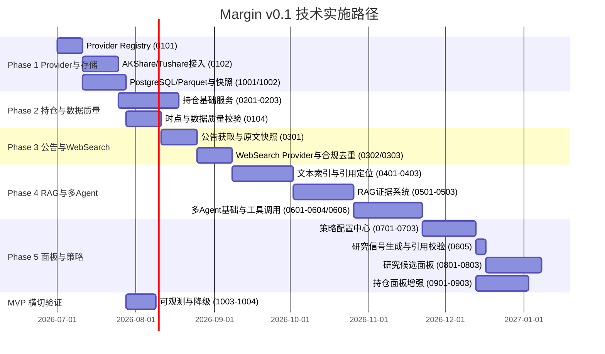

# Margin 实施计划 v0.1 — plan 总索引

本目录存放 Margin v0.1 的 35 个子任务实施计划（plan）。子任务编号取自架构设计 §26「实施顺序」Gantt 中的任务项，保证可追溯到设计稿。编号规则见仓库根 `AGENTS.md`。

## 里程碑 Gantt（基于架构 §26，并补充 MVP 横切任务）

架构 §26 Phase 6 的「回测与模型治理」「Provider 与内置工具扩展」属于设计稿后续验证与生态方向，当前 35 个 v0.1 子任务不拆分实现；`1002-1004` 是为 MVP 闭环补充的横切存储、审计、可观测与降级任务，不替代架构 Phase 6。

表格中的 `depends_on` 为准；上方 Gantt 是里程碑视图，跨模块双前置任务（如 `0605` 同时依赖 `0604`、`0703`、`1002`）以子任务清单为审计依据。

## 子任务清单

### 01-data_provider（4）
| 编号 | 子任务 | 工期 | 前置 |
|------|--------|------|------|
| 0101 | provider_registry | 10d | — |
| 0102 | akshare_tushare_access | 14d | 0101 |
| 0103 | field_standardization | 7d | 0102 |
| 0104 | point_in_time_and_quality | 14d | 0103, 1002 |

### 02-holdings（3）
| 编号 | 子任务 | 工期 | 前置 |
|------|--------|------|------|
| 0201 | manual_csv_import | 7d | 0102 |
| 0202 | cost_and_position | 7d | 0201 |
| 0203 | basic_dashboard | 10d | 0202 |

### 03-filing_websearch（3）
| 编号 | 子任务 | 工期 | 前置 |
|------|--------|------|------|
| 0301 | filing_acquisition | 14d | 0104 |
| 0302 | websearch_provider | 7d | 0301 |
| 0303 | dedup_and_compliance | 7d | 0302 |

### 04-text_indexing（3）
| 编号 | 子任务 | 工期 | 前置 |
|------|--------|------|------|
| 0401 | parse_and_chunk | 10d | 0303 |
| 0402 | embedding_pipeline | 7d | 0401 |
| 0403 | hybrid_recall | 7d | 0402 |

### 05-rag_evidence（3）
| 编号 | 子任务 | 工期 | 前置 |
|------|--------|------|------|
| 0501 | evidence_tiering | 10d | 0403 |
| 0502 | citation_locator | 7d | 0501 |
| 0503 | claim_validation | 7d | 0502 |

### 06-multi_agent_research（6）
| 编号 | 子任务 | 工期 | 前置 |
|------|--------|------|------|
| 0601 | provider_and_tools | 7d | 0503 |
| 0602 | websearch_agent | 5d | 0606 |
| 0603 | summary_agent | 5d | 0602 |
| 0604 | reflect_agent | 5d | 0603 |
| 0605 | citation_validator | 4d | 0604, 0703, 1002 |
| 0606 | universe_quant_agent | 5d | 0601 |

### 07-strategy_config（3）
| 编号 | 子任务 | 工期 | 前置 |
|------|--------|------|------|
| 0701 | strategy_template | 7d | 0601 |
| 0702 | custom_prompt | 7d | 0701 |
| 0703 | version_management | 7d | 0702 |

### 08-research_candidate_dashboard（3）
| 编号 | 子任务 | 工期 | 前置 |
|------|--------|------|------|
| 0801 | candidate_card | 10d | 0605, 0703 |
| 0802 | evidence_expansion | 7d | 0801 |
| 0803 | rejection_reason | 5d | 0802 |

### 09-holdings_monitoring（3）
| 编号 | 子任务 | 工期 | 前置 |
|------|--------|------|------|
| 0901 | thesis_state | 7d | 0703 |
| 0902 | alerts | 7d | 0901 |
| 0903 | review_record | 7d | 0902 |

### 10-deployment_audit（4）
| 编号 | 子任务 | 工期 | 前置 |
|------|--------|------|------|
| 1001 | docker_compose | 10d | 0101 |
| 1002 | storage_snapshot | 7d | 1001 |
| 1003 | logging_observability | 7d | 1001 |
| 1004 | failure_degradation | 5d | 1003 |

## 工时汇总

| 模块 | 子任务数 | 合计工期 |
|------|----------|----------|
| 01-data_provider | 4 | 45d |
| 02-holdings | 3 | 24d |
| 03-filing_websearch | 3 | 28d |
| 04-text_indexing | 3 | 24d |
| 05-rag_evidence | 3 | 24d |
| 06-multi_agent_research | 6 | 31d |
| 07-strategy_config | 3 | 21d |
| 08-research_candidate_dashboard | 3 | 22d |
| 09-holdings_monitoring | 3 | 21d |
| 10-deployment_audit | 4 | 29d |
| **合计** | **35** | **269d**（关键路径约 180 天，并行后） |

## 状态

- plan `status` 以各子任务 frontmatter 为准；未实现子任务保持 `draft`，完成实现与验证后转为 `active`。
- 修改已 `active` 的 plan 应新建版本目录（见 `AGENTS.md` §8）。
- 每个子任务的 `source_refs` 指向架构 §26 对应 Phase 任务，`审计追溯` 章节指向关联 spec 模块。
- 2026-06-19 范围修订：删除 MCP 相关工作项；现有任务只实现内部工具权限、类型化 Provider Adapter 与可审计调用，不开发 MCP Server、MCP Gateway 或自定义 HTTP 工具。
- 2026-06-19 实现状态：35 个 v0.1 子任务均已完成实现与本地验收，plan 已转为 `active`。
